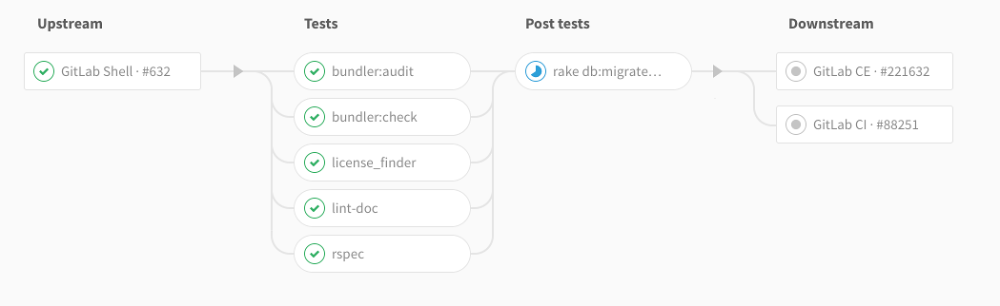
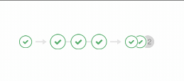

# Multi-project pipelines **(FREE)**

> [Moved](https://gitlab.com/gitlab-org/gitlab/-/issues/199224) to GitLab Free in 12.8.

You can set up [GitLab CI/CD](../index.md) across multiple projects, so that a pipeline
in one project can trigger a pipeline in another project. You can visualize the entire pipeline
in one place, including all cross-project interdependencies.

For example, you might deploy your web application from three different projects in GitLab.
Each project has its own build, test, and deploy process. With multi-project pipelines you can
visualize the entire pipeline, including all build and test stages for all three projects.

<i class="fa fa-youtube-play youtube" aria-hidden="true"></i>
For an overview, see the [Multi-project pipelines demo](https://www.youtube.com/watch?v=g_PIwBM1J84).

Multi-project pipelines are also useful for larger products that require cross-project interdependencies, like those
with a [microservices architecture](https://about.gitlab.com/blog/2016/08/16/trends-in-version-control-land-microservices/).
Learn more in the [Cross-project Pipeline Triggering and Visualization demo](https://about.gitlab.com/learn/)
at GitLab@learn, in the Continuous Integration section.

If you trigger a pipeline in a downstream private project, on the upstream project's pipelines page,
you can view:

- The name of the project.
- The status of the pipeline.

If you have a public project that can trigger downstream pipelines in a private project,
make sure there are no confidentiality problems.

## Create multi-project pipelines

To create multi-project pipelines, you can:

- [Define them in your `.gitlab-ci.yml` file](#define-multi-project-pipelines-in-your-gitlab-ciyml-file).
- [Use the API](#create-multi-project-pipelines-by-using-the-api).

### Define multi-project pipelines in your `.gitlab-ci.yml` file

> [Moved](https://gitlab.com/gitlab-org/gitlab/-/issues/199224) to GitLab Free in 12.8.

When you create a multi-project pipeline in your `.gitlab-ci.yml` file,
you create what is called a *trigger job*. For example:

```yaml
rspec:
  stage: test
  script: bundle exec rspec

staging:
  variables:
    ENVIRONMENT: staging
  stage: deploy
  trigger: my/deployment
```

In this example, after the `rspec` job succeeds in the `test` stage,
the `staging` trigger job starts. The initial status of this
job is `pending`.

GitLab then creates a downstream pipeline in the
`my/deployment` project and, as soon as the pipeline is created, the
`staging` job succeeds. The full path to the project is `my/deployment`.

You can view the status for the pipeline, or you can display
[the downstream pipeline's status instead](#mirror-status-of-a-triggered-pipeline-in-the-trigger-job).

The user that creates the upstream pipeline must be able to create pipelines in the
downstream project (`my/deployment`) too. If the downstream project is not found,
or the user does not have [permission](../../user/permissions.md) to create a pipeline there,
the `staging` job is marked as _failed_.

#### Trigger job configuration keywords

Trigger jobs can use only a limited set of the GitLab CI/CD [configuration keywords](../yaml/index.md).
The keywords available for use in trigger jobs are:

- [`trigger`](../yaml/index.md#trigger)
- [`stage`](../yaml/index.md#stage)
- [`allow_failure`](../yaml/index.md#allow_failure)
- [`rules`](../yaml/index.md#rules)
- [`only` and `except`](../yaml/index.md#only--except)
- [`when`](../yaml/index.md#when) (only with a value of `on_success`, `on_failure`, or `always`)
- [`extends`](../yaml/index.md#extends)
- [`needs`](../yaml/index.md#needs)

#### Specify a downstream pipeline branch

You can specify a branch name for the downstream pipeline to use.
GitLab uses the commit on the head of the branch to
create the downstream pipeline.

```yaml
rspec:
  stage: test
  script: bundle exec rspec

staging:
  stage: deploy
  trigger:
    project: my/deployment
    branch: stable-11-2
```

Use:

- The `project` keyword to specify the full path to a downstream project.
- The `branch` keyword to specify the name of a branch in the project specified by `project`.
  [In GitLab 12.4](https://gitlab.com/gitlab-org/gitlab/-/issues/10126) and later, variable expansion is
  supported.

Pipelines triggered on a protected branch in a downstream project use the [role](../../user/permissions.md)
of the user that ran the trigger job in the upstream project. If the user does not
have permission to run CI/CD pipelines against the protected branch, the pipeline fails. See
[pipeline security for protected branches](index.md#pipeline-security-on-protected-branches).

#### Pass CI/CD variables to a downstream pipeline by using the `variables` keyword

Sometimes you might want to pass CI/CD variables to a downstream pipeline.
You can do that by using the `variables` keyword, just like you would for any other job.

```yaml
rspec:
  stage: test
  script: bundle exec rspec

staging:
  variables:
    ENVIRONMENT: staging
  stage: deploy
  trigger: my/deployment
```

The `ENVIRONMENT` variable is passed to every job defined in a downstream
pipeline. It is available as a variable when GitLab Runner picks a job.

In the following configuration, the `MY_VARIABLE` variable is passed to the downstream pipeline
that is created when the `trigger-downstream` job is queued. This is because `trigger-downstream`
job inherits variables declared in global variables blocks, and then we pass these variables to a downstream pipeline.

```yaml
variables:
  MY_VARIABLE: my-value

trigger-downstream:
  variables:
    ENVIRONMENT: something
  trigger: my/project
```

You can stop global variables from reaching the downstream pipeline by using the [`inherit` keyword](../yaml/index.md#inherit).
In this example, the `MY_GLOBAL_VAR` variable is not available in the triggered pipeline:

```yaml
variables:
  MY_GLOBAL_VAR: value

trigger-downstream:
  inherit:
    variables: false
  variables:
    MY_LOCAL_VAR: value
  trigger: my/project
```

You might want to pass some information about the upstream pipeline using, for
example, predefined variables. In order to do that, you can use interpolation
to pass any variable. For example:

```yaml
downstream-job:
  variables:
    UPSTREAM_BRANCH: $CI_COMMIT_REF_NAME
  trigger: my/project
```

In this scenario, the `UPSTREAM_BRANCH` variable with a value related to the
upstream pipeline is passed to the `downstream-job` job. It is available
in the context of all downstream builds.

Upstream pipelines take precedence over downstream ones. If there are two
variables with the same name defined in both upstream and downstream projects,
the ones defined in the upstream project take precedence.

#### Pass CI/CD variables to a downstream pipeline by using variable inheritance

You can pass variables to a downstream pipeline with [`dotenv` variable inheritance](../variables/index.md#pass-an-environment-variable-to-another-job) and [cross project artifact downloads](../yaml/index.md#cross-project-artifact-downloads-with-needs).

In the upstream pipeline:

1. Save the variables in a `.env` file.
1. Save the `.env` file as a `dotenv` report.
1. Trigger the downstream pipeline.

   ```yaml
   build_vars:
     stage: build
     script:
       - echo "BUILD_VERSION=hello" >> build.env
     artifacts:
       reports:
         dotenv: build.env

   deploy:
     stage: deploy
     trigger: my/downstream_project
   ```

1. Set the `test` job in the downstream pipeline to inherit the variables from the `build_vars`
   job in the upstream project with `needs:`. The `test` job inherits the variables in the
   `dotenv` report and it can access `BUILD_VERSION` in the script:

   ```yaml
   test:
     stage: test
     script:
       - echo $BUILD_VERSION
     needs:
       - project: my/upstream_project
         job: build_vars
         ref: master
         artifacts: true
   ```

#### Use `rules` or `only`/`except` with multi-project pipelines

You can use CI/CD variables or the [`rules`](../yaml/index.md#rulesif) keyword to
[control job behavior](../jobs/job_control.md) for multi-project pipelines. When a
downstream pipeline is triggered with the [`trigger`](../yaml/index.md#trigger) keyword,
the value of the [`$CI_PIPELINE_SOURCE` predefined variable](../variables/predefined_variables.md)
is `pipeline` for all its jobs.

If you use [`only/except`](../yaml/index.md#only--except) to control job behavior, use the
[`pipelines`](../yaml/index.md#onlyrefs--exceptrefs) keyword.

#### Mirror status of a triggered pipeline in the trigger job

> - [Introduced](https://gitlab.com/gitlab-org/gitlab/-/issues/11238) in GitLab Premium 12.3.
> - [Moved](https://gitlab.com/gitlab-org/gitlab/-/issues/199224) to GitLab Free in 12.8.

You can mirror the pipeline status from the triggered pipeline to the source
trigger job by using `strategy: depend`. For example:

```yaml
trigger_job:
  trigger:
    project: my/project
    strategy: depend
```

#### Mirror status from upstream pipeline

You can mirror the pipeline status from an upstream pipeline to a bridge job by
using the `needs:pipeline` keyword. The latest pipeline status from the default branch is
replicated to the bridge job.

For example:

```yaml
upstream_bridge:
  stage: test
  needs:
    pipeline: other/project
```

### Create multi-project pipelines by using the API

> [Moved](https://gitlab.com/gitlab-org/gitlab/-/issues/31573) to GitLab Free in 12.4.

When you use the [`CI_JOB_TOKEN` to trigger pipelines](../triggers/index.md#ci-job-token),
GitLab recognizes the source of the job token. The pipelines become related,
so you can visualize their relationships on pipeline graphs.

These relationships are displayed in the pipeline graph by showing inbound and
outbound connections for upstream and downstream pipeline dependencies.

When using:

- CI/CD variables or [`rules`](../yaml/index.md#rulesif) to control job behavior, the value of
  the [`$CI_PIPELINE_SOURCE` predefined variable](../variables/predefined_variables.md) is
  `pipeline` for multi-project pipeline triggered through the API with `CI_JOB_TOKEN`.
- [`only/except`](../yaml/index.md#only--except) to control job behavior, use the
  `pipelines` keyword.

## Trigger a pipeline when an upstream project is rebuilt **(PREMIUM)**

> [Introduced](https://gitlab.com/gitlab-org/gitlab/-/issues/9045) in GitLab Premium 12.8.

You can trigger a pipeline in your project whenever a pipeline finishes for a new
tag in a different project.

Prerequisites:

- The upstream project must be [public](../../public_access/public_access.md).
- The user must have the [Developer role](../../user/permissions.md#project-members-permissions)
  in the upstream project.

To trigger the pipeline when the upstream project is rebuilt:

1. On the top bar, select **Menu > Projects** and find your project.
1. On the left sidebar, select **Settings > CI/CD** page.
1. Expand the **Pipeline subscriptions** section.
1. Enter the project you want to subscribe to, in the format `<namespace>/<project>`.
   For example, if the project is `https://gitlab.com/gitlab-org/gitlab`, use `gitlab-org/gitlab`.
1. Select **Subscribe**.

Any pipelines that complete successfully for new tags in the subscribed project
now trigger a pipeline on the current project's default branch. The maximum
number of upstream pipeline subscriptions is 2 by default, for both the upstream and
downstream projects. On self-managed instances, an administrator can change this
[limit](../../administration/instance_limits.md#number-of-cicd-subscriptions-to-a-project).

## Multi-project pipeline visualization **(PREMIUM)**

When you configure GitLab CI/CD for your project, you can visualize the stages of your
[jobs](index.md#configure-a-pipeline) on a [pipeline graph](index.md#visualize-pipelines).



In the merge request, on the **Pipelines** tab, multi-project pipeline mini-graphs are displayed.
They expand and are shown adjacent to each other when hovering (or tapping on touchscreen devices).


