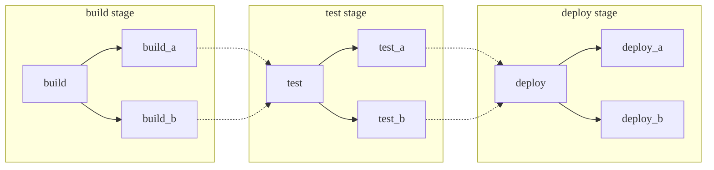
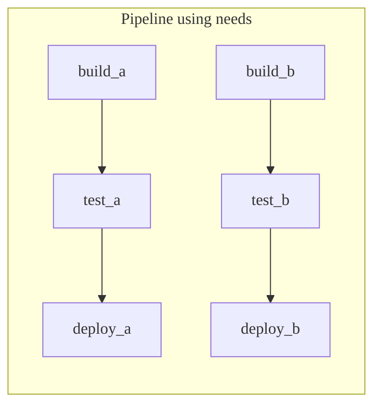
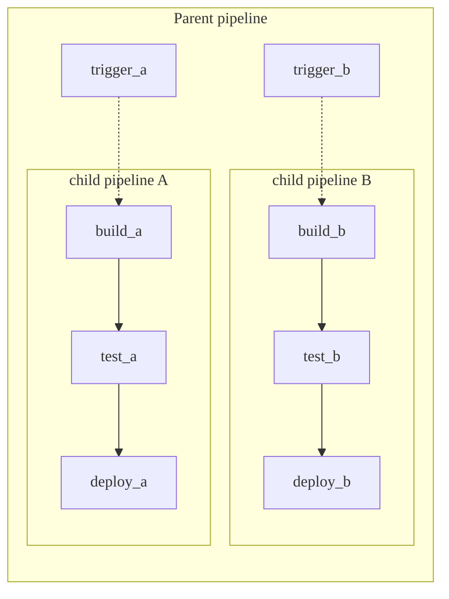

DETAILS:
**Tier:** Free, Premium, Ultimate
**Offering:** GitLab.com, GitLab Self-Managed, GitLab Dedicated

Pipelines are the fundamental building blocks for CI/CD in GitLab. This page documents
some of the important concepts related to them.

You can structure your pipelines with different methods, each with their
own advantages. These methods can be mixed and matched if needed:

- [Basic](#basic-pipelines): Good for straightforward projects where all the configuration is in one place.
- [Pipelines with the `needs` keyword](#pipelines-with-the-needs-keyword): Good for large, complex projects that need efficient execution.
- [Parent-child pipelines](#parent-child-pipelines): Good for monorepos and projects with lots of independently defined components.

  <i class="fa fa-youtube-play youtube" aria-hidden="true"></i>
  For an overview, see the [Parent-Child Pipelines feature demo](https://youtu.be/n8KpBSqZNbk).

- [Multi-project pipelines](downstream_pipelines.md#multi-project-pipelines): Good for larger products that require cross-project interdependencies,
  like those with a [microservices architecture](https://about.gitlab.com/blog/2016/08/16/trends-in-version-control-land-microservices/).

  For example, you might deploy your web application from three different GitLab projects.
  With multi-project pipelines you can trigger a pipeline in each project, where each
  has its own build, test, and deploy process. You can visualize the connected pipelines
  in one place, including all cross-project interdependencies.

  <i class="fa fa-youtube-play youtube" aria-hidden="true"></i>
  For an overview, see the [Multi-project pipelines demo](https://www.youtube.com/watch?v=g_PIwBM1J84).

## Basic pipelines

Basic pipelines are the simplest pipelines in GitLab. It runs everything in the build stage concurrently,
and once all of those finish, it runs everything in the test and subsequent stages the same way.
It's not the most efficient, and if you have lots of steps it can grow quite complex, but it's
easier to maintain:



Example basic `/.gitlab-ci.yml` pipeline configuration matching the diagram:

```yaml
stages:
  - build
  - test
  - deploy

default:
  image: alpine

build_a:
  stage: build
  script:
    - echo "This job builds something."

build_b:
  stage: build
  script:
    - echo "This job builds something else."

test_a:
  stage: test
  script:
    - echo "This job tests something. It will only run when all jobs in the"
    - echo "build stage are complete."

test_b:
  stage: test
  script:
    - echo "This job tests something else. It will only run when all jobs in the"
    - echo "build stage are complete too. It will start at about the same time as test_a."

deploy_a:
  stage: deploy
  script:
    - echo "This job deploys something. It will only run when all jobs in the"
    - echo "test stage complete."
  environment: production

deploy_b:
  stage: deploy
  script:
    - echo "This job deploys something else. It will only run when all jobs in the"
    - echo "test stage complete. It will start at about the same time as deploy_a."
  environment: production
```

## Pipelines with the `needs` keyword

If efficiency is important and you want everything to run as quickly as possible,
you can use the [`needs` keyword](../yaml/needs.md) to define dependencies
between your jobs. When GitLab knows the dependencies between your jobs,
jobs can run as fast as possible, even starting earlier than other jobs in the same stage.

In the example below, if `build_a` and `test_a` are much faster than `build_b` and
`test_b`, GitLab starts `deploy_a` even if `build_b` is still running.



Example `/.gitlab-ci.yml` configuration matching the diagram:

```yaml
stages:
  - build
  - test
  - deploy

default:
  image: alpine

build_a:
  stage: build
  script:
    - echo "This job builds something quickly."

build_b:
  stage: build
  script:
    - echo "This job builds something else slowly."

test_a:
  stage: test
  needs: [build_a]
  script:
    - echo "This test job will start as soon as build_a finishes."
    - echo "It will not wait for build_b, or other jobs in the build stage, to finish."

test_b:
  stage: test
  needs: [build_b]
  script:
    - echo "This test job will start as soon as build_b finishes."
    - echo "It will not wait for other jobs in the build stage to finish."

deploy_a:
  stage: deploy
  needs: [test_a]
  script:
    - echo "Since build_a and test_a run quickly, this deploy job can run much earlier."
    - echo "It does not need to wait for build_b or test_b."
  environment: production

deploy_b:
  stage: deploy
  needs: [test_b]
  script:
    - echo "Since build_b and test_b run slowly, this deploy job will run much later."
  environment: production
```

## Parent-child pipelines

As pipelines grow more complex, a few related problems start to emerge:

- The staged structure, where all steps in a stage must complete before the first
  job in next stage begins, causes waits that slow things down.
- Configuration for the single global pipeline becomes
  hard to manage.
- Imports with [`include`](../yaml/_index.md#include) increase the complexity of the configuration, and can cause
  namespace collisions where jobs are unintentionally duplicated.
- Pipeline UX has too many jobs and stages to work with.

Additionally, sometimes the behavior of a pipeline needs to be more dynamic. The ability
to choose to start sub-pipelines (or not) is a powerful ability, especially if the
YAML is dynamically generated.

In the [basic pipeline](#basic-pipelines) and [`needs` pipeline](#pipelines-with-the-needs-keyword)
examples above, there are two packages that could be built independently.
These cases are ideal for using [parent-child pipelines](downstream_pipelines.md#parent-child-pipelines).
It separates out the configuration into multiple files, keeping things simpler.
You can combine parent-child pipelines with:

- The [`rules` keyword](../yaml/_index.md#rules): For example, have the child pipelines triggered only
  when there are changes to that area.
- The [`include` keyword](../yaml/_index.md#include): Bring in common behaviors, ensuring
  you are not repeating yourself.
- The [`needs` keyword](#pipelines-with-the-needs-keyword) inside of child pipelines, achieving the benefits of both.



Example `/.gitlab-ci.yml` configuration for the parent pipeline matching the diagram:

```yaml
stages:
  - triggers

trigger_a:
  stage: triggers
  trigger:
    include: a/.gitlab-ci.yml
  rules:
    - changes:
        - a/*

trigger_b:
  stage: triggers
  trigger:
    include: b/.gitlab-ci.yml
  rules:
    - changes:
        - b/*
```

Example child `a` pipeline configuration, located in `/a/.gitlab-ci.yml`, making
use of the `needs` keyword:

```yaml
stages:
  - build
  - test
  - deploy

default:
  image: alpine

build_a:
  stage: build
  script:
    - echo "This job builds something."

test_a:
  stage: test
  needs: [build_a]
  script:
    - echo "This job tests something."

deploy_a:
  stage: deploy
  needs: [test_a]
  script:
    - echo "This job deploys something."
  environment: production
```

Example child `b` pipeline configuration, located in `/b/.gitlab-ci.yml`, making
use of the `needs` keyword:

```yaml
stages:
  - build
  - test
  - deploy

default:
  image: alpine

build_b:
  stage: build
  script:
    - echo "This job builds something else."

test_b:
  stage: test
  needs: [build_b]
  script:
    - echo "This job tests something else."

deploy_b:
  stage: deploy
  needs: [test_b]
  script:
    - echo "This job deploys something else."
  environment: production
```

Jobs can be set to run before or after triggering child pipelines in GitLab, allowing common setup steps or unified deployment.
