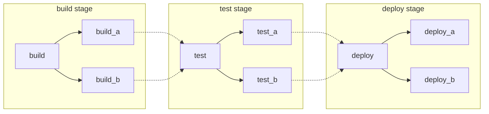
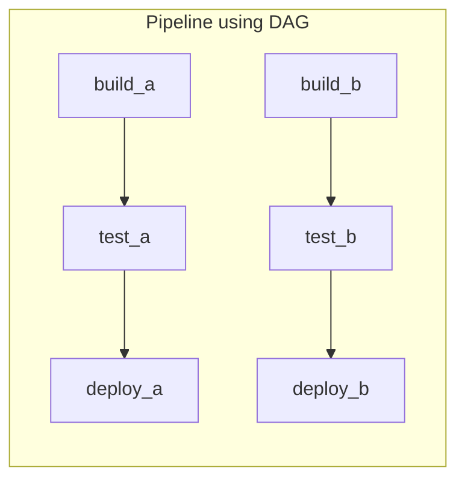
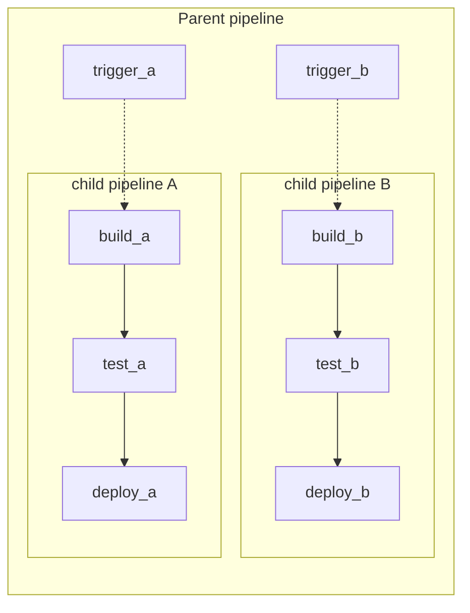

# Pipeline architecture **(FREE)**

Pipelines are the fundamental building blocks for CI/CD in GitLab. This page documents
some of the important concepts related to them.

There are three main ways to structure your pipelines, each with their
own advantages. These methods can be mixed and matched if needed:

- [Basic](#basic-pipelines): Good for straightforward projects where all the configuration is in one easy to find place.
- [Directed Acyclic Graph](#directed-acyclic-graph-pipelines): Good for large, complex projects that need efficient execution.
- [Child/Parent Pipelines](#child--parent-pipelines): Good for monorepos and projects with lots of independently defined components.

For more details about
any of the keywords used below, check out our [CI YAML reference](../yaml/index.md) for details.

## Basic Pipelines

This is the simplest pipeline in GitLab. It runs everything in the build stage concurrently,
and once all of those finish, it runs everything in the test stage the same way, and so on.
It's not the most efficient, and if you have lots of steps it can grow quite complex, but it's
easier to maintain:



Example basic `/.gitlab-ci.yml` pipeline configuration matching the diagram:

```yaml
stages:
  - build
  - test
  - deploy

image: alpine

build_a:
  stage: build
  script:
    - echo "This job builds something."

build_b:
  stage: build
  script:
    - echo "This job builds something else."

test_a:
  stage: test
  script:
    - echo "This job tests something. It will only run when all jobs in the"
    - echo "build stage are complete."

test_b:
  stage: test
  script:
    - echo "This job tests something else. It will only run when all jobs in the"
    - echo "build stage are complete too. It will start at about the same time as test_a."

deploy_a:
  stage: deploy
  script:
    - echo "This job deploys something. It will only run when all jobs in the"
    - echo "test stage complete."

deploy_b:
  stage: deploy
  script:
    - echo "This job deploys something else. It will only run when all jobs in the"
    - echo "test stage complete. It will start at about the same time as deploy_a."
```

## Directed Acyclic Graph Pipelines

If efficiency is important to you and you want everything to run as quickly as possible,
you can use [Directed Acyclic Graphs (DAG)](../directed_acyclic_graph/index.md). Use the
[`needs` keyword](../yaml/index.md#needs) to define dependency relationships between
your jobs. When GitLab knows the relationships between your jobs, it can run everything
as fast as possible, and even skips into subsequent stages when possible.

In the example below, if `build_a` and `test_a` are much faster than `build_b` and
`test_b`, GitLab starts `deploy_a` even if `build_b` is still running.



Example DAG `/.gitlab-ci.yml` configuration matching the diagram:

```yaml
stages:
  - build
  - test
  - deploy

image: alpine

build_a:
  stage: build
  script:
    - echo "This job builds something quickly."

build_b:
  stage: build
  script:
    - echo "This job builds something else slowly."

test_a:
  stage: test
  needs: [build_a]
  script:
    - echo "This test job will start as soon as build_a finishes."
    - echo "It will not wait for build_b, or other jobs in the build stage, to finish."

test_b:
  stage: test
  needs: [build_b]
  script:
    - echo "This test job will start as soon as build_b finishes."
    - echo "It will not wait for other jobs in the build stage to finish."

deploy_a:
  stage: deploy
  needs: [test_a]
  script:
    - echo "Since build_a and test_a run quickly, this deploy job can run much earlier."
    - echo "It does not need to wait for build_b or test_b."

deploy_b:
  stage: deploy
  needs: [test_b]
  script:
    - echo "Since build_b and test_b run slowly, this deploy job will run much later."
```

## Child / Parent Pipelines

In the examples above, it's clear we've got two types of things that could be built independently.
This is an ideal case for using [Child / Parent Pipelines](parent_child_pipelines.md)) via
the [`trigger` keyword](../yaml/index.md#trigger). It separates out the configuration
into multiple files, keeping things very simple. You can also combine this with:

- The [`rules` keyword](../yaml/index.md#rules): For example, have the child pipelines triggered only
  when there are changes to that area.
- The [`include` keyword](../yaml/index.md#include): Bring in common behaviors, ensuring
  you are not repeating yourself.
- [DAG pipelines](#directed-acyclic-graph-pipelines) inside of child pipelines, achieving the benefits of both.



Example `/.gitlab-ci.yml` configuration for the parent pipeline matching the diagram:

```yaml
stages:
  - triggers

trigger_a:
  stage: triggers
  trigger:
    include: a/.gitlab-ci.yml
  rules:
    - changes:
        - a/*

trigger_b:
  stage: triggers
  trigger:
    include: b/.gitlab-ci.yml
  rules:
    - changes:
        - b/*
```

Example child `a` pipeline configuration, located in `/a/.gitlab-ci.yml`, making
use of the DAG `needs:` keyword:

```yaml
stages:
  - build
  - test
  - deploy

image: alpine

build_a:
  stage: build
  script:
    - echo "This job builds something."

test_a:
  stage: test
  needs: [build_a]
  script:
    - echo "This job tests something."

deploy_a:
  stage: deploy
  needs: [test_a]
  script:
    - echo "This job deploys something."
```

Example child `b` pipeline configuration, located in `/b/.gitlab-ci.yml`, making
use of the DAG `needs:` keyword:

```yaml
stages:
  - build
  - test
  - deploy

image: alpine

build_b:
  stage: build
  script:
    - echo "This job builds something else."

test_b:
  stage: test
  needs: [build_b]
  script:
    - echo "This job tests something else."

deploy_b:
  stage: deploy
  needs: [test_b]
  script:
    - echo "This job deploys something else."
```

It's also possible to set jobs to run before or after triggering child pipelines,
for example if you have common setup steps or a unified deployment at the end.
