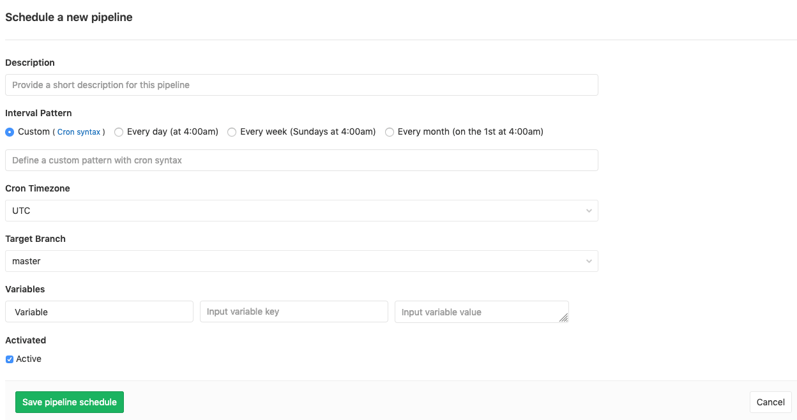
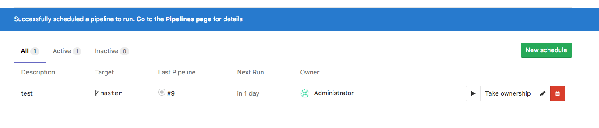
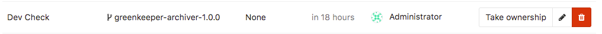

# Pipeline schedules **(FREE)**

Pipelines are normally run based on certain conditions being met. For example, when a branch is pushed to repository.

Pipeline schedules can be used to also run [pipelines](index.md) at specific intervals. For example:

- Every month on the 22nd for a certain branch.
- Once every day.

In addition to using the GitLab UI, pipeline schedules can be maintained using the
[Pipeline schedules API](../../api/pipeline_schedules.md).

Schedule timing is configured with cron notation, parsed by [Fugit](https://github.com/floraison/fugit).

## Prerequisites

In order for a scheduled pipeline to be created successfully:

- The schedule owner must have [permissions](../../user/permissions.md) to merge into the target branch.
- The pipeline configuration must be valid.

Otherwise the pipeline is not created.

## Configuring pipeline schedules

To schedule a pipeline for project:

1. Navigate to the project's **CI/CD > Schedules** page.
1. Click the **New schedule** button.
1. Fill in the **Schedule a new pipeline** form.
1. Click the **Save pipeline schedule** button.



NOTE:
Pipelines execution [timing is dependent](#advanced-configuration) on Sidekiq's own schedule.

In the **Schedules** index page you can see a list of the pipelines that are
scheduled to run. The next run is automatically calculated by the server GitLab
is installed on.


### Using variables

You can pass any number of arbitrary variables. They are available in
GitLab CI/CD so that they can be used in your [`.gitlab-ci.yml` file](../../ci/yaml/index.md).


### Using `rules`

To configure a job to be executed only when the pipeline has been
scheduled, use the [`rules`](../yaml/index.md#rules) keyword.

In this example, `make world` runs in scheduled pipelines, and `make build`
runs in branch and tag pipelines:

```yaml
job:on-schedule:
  rules:
    - if: $CI_PIPELINE_SOURCE == "schedule"
  script:
    - make world

job:
  rules:
    - if: $CI_PIPELINE_SOURCE = "push"
  script:
    - make build
```

### Advanced configuration **(FREE SELF)**

The pipelines are not executed exactly on schedule because schedules are handled by
Sidekiq, which runs according to its interval.

For example, only two pipelines are created per day if:

- You set a schedule to create a pipeline every minute (`* * * * *`).
- The Sidekiq worker runs on 00:00 and 12:00 every day (`0 */12 * * *`).

To change the Sidekiq worker's frequency:

1. Edit the `gitlab_rails['pipeline_schedule_worker_cron']` value in your instance's `gitlab.rb` file.
1. [Reconfigure GitLab](../../administration/restart_gitlab.md#omnibus-gitlab-reconfigure) for the changes to take effect.

For GitLab.com, refer to the [dedicated settings page](../../user/gitlab_com/index.md#gitlab-cicd).

## Working with scheduled pipelines

After configuration, GitLab supports many functions for working with scheduled pipelines.

### Running manually

> [Introduced](https://gitlab.com/gitlab-org/gitlab-foss/-/merge_requests/15700) in GitLab 10.4.

To trigger a pipeline schedule manually, click the "Play" button:



This schedules a background job to run the pipeline schedule. A flash
message provides a link to the CI/CD Pipeline index page.

NOTE:
To help avoid abuse, users are rate limited to triggering a pipeline once per
minute.

### Taking ownership

Pipelines are executed as a user, who owns a schedule. This influences what projects and other resources the pipeline has access to.

If a user does not own a pipeline, you can take ownership by clicking the **Take ownership** button.
The next time a pipeline is scheduled, your credentials are used.



If the owner of a pipeline schedule cannot create
pipelines on the target branch, the schedule stops creating new
pipelines.

This can happen if, for example:

- The owner is blocked or removed from the project.
- The target branch or tag is protected.

In this case, someone with sufficient privileges must take ownership of the
schedule.

<!-- ## Troubleshooting

Include any troubleshooting steps that you can foresee. If you know beforehand what issues
one might have when setting this up, or when something is changed, or on upgrading, it's
important to describe those, too. Think of things that may go wrong and include them here.
This is important to minimize requests for support, and to avoid doc comments with
questions that you know someone might ask.

Each scenario can be a third-level heading, e.g. `### Getting error message X`.
If you have none to add when creating a doc, leave this section in place
but commented out to help encourage others to add to it in the future. -->
