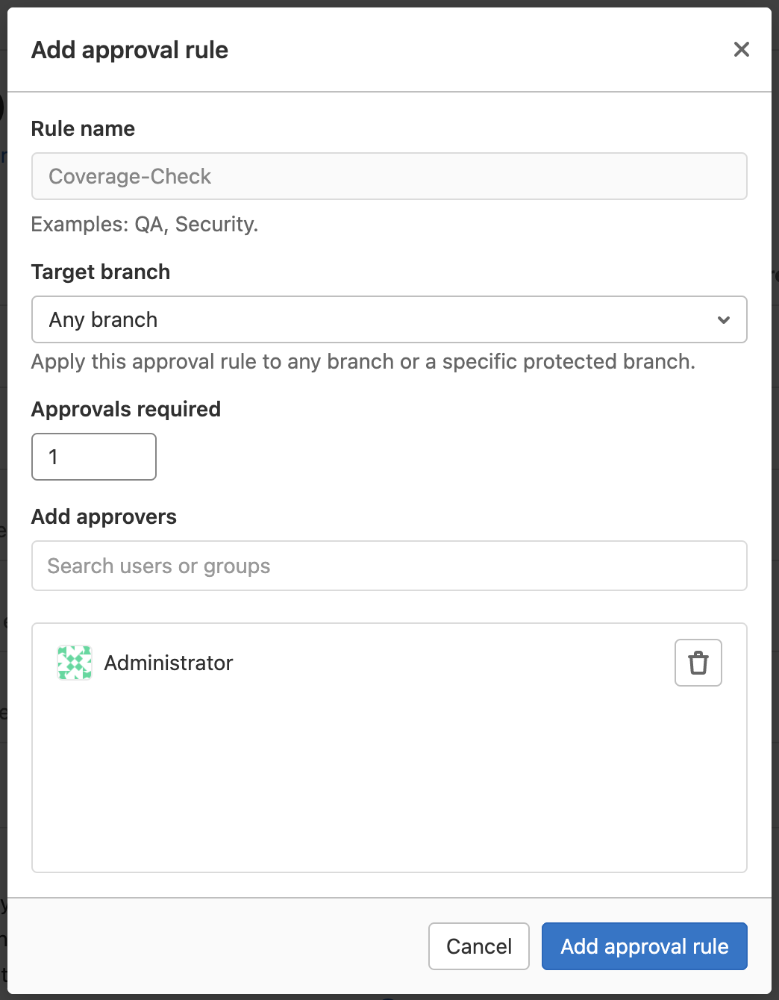

# Customize pipeline configuration **(FREE)**

You can customize how pipelines run for your project.

<i class="fa fa-youtube-play youtube" aria-hidden="true"></i>
For an overview of pipelines, watch the video [GitLab CI Pipeline, Artifacts, and Environments](https://www.youtube.com/watch?v=PCKDICEe10s).
Watch also [GitLab CI pipeline tutorial for beginners](https://www.youtube.com/watch?v=Jav4vbUrqII).

## Change which users can view your pipelines

For public and internal projects, you can change who can see your:

- Pipelines
- Job output logs
- Job artifacts
- [Pipeline security dashboard](../../user/application_security/vulnerability_report/pipeline.md#view-vulnerabilities-in-a-pipeline)

To change the visibility of your pipelines and related features:

1. On the top bar, select **Main menu > Projects** and find your project.
1. On the left sidebar, select **Settings > CI/CD**.
1. Expand **General pipelines**.
1. Select or clear the **Public pipelines** checkbox.
   When it is selected, pipelines and related features are visible:

   - For [**Public**](../../user/public_access.md) projects, to everyone.
   - For **Internal** projects, to all authenticated users except [external users](../../user/admin_area/external_users.md).
   - For **Private** projects, to all project members (Guest or higher).

   When it is cleared:

   - For **Public** projects, job logs, job artifacts, the pipeline security dashboard,
     and the **CI/CD** menu items are visible only to project members (Reporter or higher).
     Other users, including guest users, can only view the status of pipelines and jobs, and only
     when viewing merge requests or commits.
   - For **Internal** projects, pipelines are visible to all authenticated users except [external users](../../user/admin_area/external_users.md).
     Related features are visible only to project members (Reporter or higher).
   - For **Private** projects, pipelines and related features are visible to project members (Reporter or higher) only.

### Change pipeline visibility for non-project members in public projects

You can control the visibility of pipelines for non-project members in [public projects](../../user/public_access.md).

This setting has no effect when:

- Project visibility is set to [**Internal** or **Private**](../../user/public_access.md),
  because non-project members cannot access internal or private projects.
- The [**Public pipelines**](#change-which-users-can-view-your-pipelines) setting is disabled.

To change the pipeline visibility for non-project members:

1. On the top bar, select **Main menu > Projects** and find your project.
1. On the left sidebar, select **Settings > General**.
1. Expand **Visibility, project features, permissions**.
1. For **CI/CD**, choose:
   - **Only project members**: Only project members can view pipelines.
   - **Everyone With Access**: Non-project members can also view pipelines.
1. Select **Save changes**.

The [CI/CD permissions table](../../user/permissions.md#gitlab-cicd-permissions)
lists the pipeline features non-project members can access when **Everyone With Access**
is selected.

## Auto-cancel redundant pipelines

You can set pending or running pipelines to cancel automatically when a new pipeline runs on the same branch. You can enable this in the project settings:

1. On the top bar, select **Main menu > Projects** and find your project.
1. On the left sidebar, select **Settings > CI/CD**.
1. Expand **General Pipelines**.
1. Select the **Auto-cancel redundant pipelines** checkbox.
1. Select **Save changes**.

Use the [`interruptible`](../yaml/index.md#interruptible) keyword to indicate if a
running job can be cancelled before it completes.

## Prevent outdated deployment jobs

> - [Introduced](https://gitlab.com/gitlab-org/gitlab/-/issues/25276) in GitLab 12.9.
> - In GitLab 15.5, the behavior was [changed](https://gitlab.com/gitlab-org/gitlab/-/issues/363328) to prevent outdated job runs.

Your project may have multiple concurrent deployment jobs that are
scheduled to run in the same time frame.

This can lead to a situation where an older deployment job runs after a
newer one, which may not be what you want.

To avoid this scenario:

1. On the top bar, select **Main menu > Projects** and find your project.
1. On the left sidebar, select **Settings > CI/CD**.
1. Expand **General pipelines**.
1. Select the **Prevent outdated deployment jobs** checkbox.
1. Select **Save changes**.

For more information, see [Deployment safety](../environments/deployment_safety.md#prevent-outdated-deployment-jobs).

## Specify a custom CI/CD configuration file

> Support for external `.gitlab-ci.yml` locations [introduced](https://gitlab.com/gitlab-org/gitlab/-/issues/14376) in GitLab 12.6.

GitLab expects to find the CI/CD configuration file (`.gitlab-ci.yml`) in the project's root
directory. However, you can specify an alternate filename path, including locations outside the project.

To customize the path:

1. On the top bar, select **Main menu > Projects** and find your project.
1. On the left sidebar, select **Settings > CI/CD**.
1. Expand **General pipelines**.
1. In the **CI/CD configuration file** field, enter the filename. If the file:
   - Is not in the root directory, include the path.
   - Is in a different project, include the group and project name.
   - Is on an external site, enter the full URL.
1. Select **Save changes**.

NOTE:
You cannot use your project's [pipeline editor](../pipeline_editor/index.md) to
edit CI/CD configuration files in other projects or on an external site.

### Custom CI/CD configuration file examples

If the CI/CD configuration file is not in the root directory, the path must be relative to it.
For example:

- `my/path/.gitlab-ci.yml`
- `my/path/.my-custom-file.yml`

If the CI/CD configuration file is on an external site, the URL must end with `.yml`:

- `http://example.com/generate/ci/config.yml`

If the CI/CD configuration file is in a different project:

- The file must exist on its default branch, or specify the branch as refname.
- The path must be relative to the root directory in the other project.
- The path must be followed by an `@` symbol and the full group and project path.

For example:

- `.gitlab-ci.yml@namespace/another-project`
- `my/path/.my-custom-file.yml@namespace/sub-group/another-project`
- `my/path/.my-custom-file.yml@namespace/sub-group1/sub-group2/another-project:refname`

If the configuration file is in a separate project, you can set more granular permissions. For example:

- Create a public project to host the configuration file.
- Give write permissions on the project only to users who are allowed to edit the file.

Then other users and projects can access the configuration file without being
able to edit it.

## Choose the default Git strategy

You can choose how your repository is fetched from GitLab when a job runs.

1. On the top bar, select **Main menu > Projects** and find your project.
1. On the left sidebar, select **Settings > CI/CD**.
1. Expand **General pipelines**.
1. Under **Git strategy**, select an option:
   - `git clone` is slower because it clones the repository from scratch
     for every job. However, the local working copy is always pristine.
   - `git fetch` is faster because it re-uses the local working copy (and falls
     back to clone if it doesn't exist). This is recommended, especially for
     [large repositories](../large_repositories/index.md#git-strategy).

The configured Git strategy can be overridden by the [`GIT_STRATEGY` variable](../runners/configure_runners.md#git-strategy)
in the `.gitlab-ci.yml` file.

## Limit the number of changes fetched during clone

> - [Introduced](https://gitlab.com/gitlab-org/gitlab-foss/-/merge_requests/28919) in GitLab 12.0.
> - [Changed](https://gitlab.com/gitlab-org/gitlab/-/merge_requests/77576) `git depth` value in GitLab 14.7.

You can limit the number of changes that GitLab CI/CD fetches when it clones
a repository.

1. On the top bar, select **Main menu > Projects** and find your project.
1. On the left sidebar, select **Settings > CI/CD**.
1. Expand **General pipelines**.
1. Under **Git strategy**, under **Git shallow clone**, enter a value.
   The maximum value is `1000`. To disable shallow clone and make GitLab CI/CD
   fetch all branches and tags each time, keep the value empty or set to `0`.

In GitLab versions 14.7 and later, newly created projects have a default `git depth`
value of `20`. GitLab versions 14.6 and earlier have a default `git depth` value of `50`.

This value can be overridden by the [`GIT_DEPTH` variable](../large_repositories/index.md#shallow-cloning)
in the `.gitlab-ci.yml` file.

## Set a limit for how long jobs can run

You can define how long a job can run before it times out.

1. On the top bar, select **Main menu > Projects** and find your project.
1. On the left sidebar, select **Settings > CI/CD**.
1. Expand **General pipelines**.
1. In the **Timeout** field, enter the number of minutes, or a human-readable value like `2 hours`.
   Must be 10 minutes or more, and less than one month. Default is 60 minutes.

Jobs that exceed the timeout are marked as failed.

You can override this value [for individual runners](../runners/configure_runners.md#set-maximum-job-timeout-for-a-runner).

## Merge request test coverage results

If you use test coverage in your code, you can use a regular expression to
find coverage results in the job log. You can then include these results
in the merge request in GitLab.

If the pipeline succeeds, the coverage is shown in the merge request widget and
in the jobs table. If multiple jobs in the pipeline have coverage reports, they are
averaged.


### Add test coverage results using `coverage` keyword

To add test coverage results to a merge request using the project's `.gitlab-ci.yml` file, provide a regular expression
using the [`coverage`](../yaml/index.md#coverage) keyword.

### Test coverage examples

Use this regex for commonly used test tools.

<!-- vale gitlab.Spelling = NO -->

- Simplecov (Ruby). Example: `/\(\d+.\d+\%\) covered/`.
- pytest-cov (Python). Example: `/(?i)total.*? (100(?:\.0+)?\%|[1-9]?\d(?:\.\d+)?\%)$/`.
- Scoverage (Scala). Example: `/Statement coverage[A-Za-z\.*]\s*:\s*([^%]+)/`.
- `pest --coverage --colors=never` (PHP). Example: `/^\s*Cov:\s*\d+\.\d+?%$/`.
- `phpunit --coverage-text --colors=never` (PHP). Example: `/^\s*Lines:\s*\d+.\d+\%/`.
- gcovr (C/C++). Example: `/^TOTAL.*\s+(\d+\%)$/`.
- `tap --coverage-report=text-summary` (NodeJS). Example: `/^Statements\s*:\s*([^%]+)/`.
- `nyc npm test` (NodeJS). Example: `/All files[^|]*\|[^|]*\s+([\d\.]+)/`.
- `jest --ci --coverage` (NodeJS). Example: `/All files[^|]*\|[^|]*\s+([\d\.]+)/`.
- excoveralls (Elixir). Example: `/\[TOTAL\]\s+(\d+\.\d+)%/`.
- `mix test --cover` (Elixir). Example: `/\d+.\d+\%\s+\|\s+Total/`.
- JaCoCo (Java/Kotlin). Example: `/Total.*?([0-9]{1,3})%/`.
- `go test -cover` (Go). Example: `/coverage: \d+.\d+% of statements/`.
- .NET (OpenCover). Example: `/(Visited Points).*\((.*)\)/`.
- .NET (`dotnet test` line coverage). Example: `/Total\s*\|\s*(\d+(?:\.\d+)?)/`.
- tarpaulin (Rust). Example: `/^\d+.\d+% coverage/`.
- Pester (PowerShell). Example: `/Covered (\d+\.\d+%)/`.

<!-- vale gitlab.Spelling = YES -->

### View code coverage history

> - [Introduced](https://gitlab.com/gitlab-org/gitlab/-/issues/209121) the ability to download a `.csv` in GitLab 12.10.
> - Graph [introduced](https://gitlab.com/gitlab-org/gitlab/-/issues/33743) in GitLab 13.1.

To see the evolution of your project code coverage over time,
you can view a graph or download a CSV file with this data.

1. On the top bar, select **Main menu > Projects** and find your project.
1. On the left sidebar, select **Analytics > Repository**.

The historic data for each job is listed in the dropdown list above the graph.

To view a CSV file of the data, select **Download raw data (`.csv`)**.


Code coverage data is also [available at the group level](../../user/group/repositories_analytics/index.md).

### Coverage check approval rule **(PREMIUM)**

> - [Introduced](https://gitlab.com/gitlab-org/gitlab/-/issues/15765) in GitLab 14.0.
> - [Made configurable in Project Settings](https://gitlab.com/gitlab-org/gitlab/-/issues/331001) in GitLab 14.1.

You can implement merge request approvals to require approval by selected users or a group
when merging a merge request would cause the project's test coverage to decline.

Follow these steps to enable the `Coverage-Check` MR approval rule:

1. Set up a [`coverage`](../yaml/index.md#coverage) regular expression for all jobs you want to include in the overall coverage value.
1. Go to your project and select **Settings > Merge requests**.
1. Under **Merge request approvals**, select **Enable** next to the `Coverage-Check` approval rule.
1. Select the **Target branch**.
1. Set the number of **Approvals required** to greater than zero.
1. Select the users or groups to provide approval.
1. Select **Add approval rule**.



### Remove color codes from code coverage

Some test coverage tools output with ANSI color codes that aren't
parsed correctly by the regular expression. This causes coverage
parsing to fail.

Some coverage tools don't provide an option to disable color
codes in the output. If so, pipe the output of the coverage tool through a
small one line script that strips the color codes off.

For example:

```shell
lein cloverage | perl -pe 's/\e\[?.*?[\@-~]//g'
```

## Pipeline badges

Pipeline badges indicate the pipeline status and a test coverage value
for your project. These badges are determined by the latest successful pipeline.

## Latest release badge

> [Introduced](https://gitlab.com/gitlab-org/gitlab/-/issues/33368) in GitLab 14.8.

A latest release badge indicates the latest release tag name for your project.
By default, the badge fetches the release sorted using the [`released_at`](../../api/releases/index.md#create-a-release) time.
Support for [`semver`](https://semver.org/) sorting is tracked [in this issue](https://gitlab.com/gitlab-org/gitlab/-/issues/352945).

### View the code for the pipeline status, coverage reports, and latest release badges

You can view the exact link for your badges. Then you can embed the badge in your HTML
or Markdown pages.

1. On the top bar, select **Main menu > Projects** and find your project.
1. On the left sidebar, select **Settings > CI/CD**.
1. Expand **General pipelines**.
1. In the **Pipeline status**, **Coverage report**, or **Latest release** sections, view the URLs for the images.


### Pipeline status badge

Depending on the status of your pipeline, a badge can have the following values:

- `pending`
- `running`
- `passed`
- `failed`
- `skipped`
- `canceled`
- `unknown`

You can access a pipeline status badge image by using the following link:

```plaintext
https://gitlab.example.com/<namespace>/<project>/badges/<branch>/pipeline.svg
```

#### Display only non-skipped status

To make the pipeline status badge display only the last non-skipped status, use the `?ignore_skipped=true` query parameter:

```plaintext
https://gitlab.example.com/<namespace>/<project>/badges/<branch>/pipeline.svg?ignore_skipped=true
```

### Test coverage report badge

You can define the regular expression for the [coverage report](#merge-request-test-coverage-results) that each job log
is matched against. This means that each job in the pipeline can have the test coverage percentage value defined.

To access the test coverage badge, use the following link:

```plaintext
https://gitlab.example.com/<namespace>/<project>/badges/<branch>/coverage.svg
```

To get the coverage report from a specific job, add
the `job=coverage_job_name` parameter to the URL. For example, you can use code
similar to the following to add the test coverage report badge of the `coverage` job
to a Markdown file:

```markdown

```

#### Test coverage report badge colors and limits

The default colors and limits for the badge are as follows:

- 95 up to and including 100% - good (`#4c1`)
- 90 up to 95% - acceptable (`#a3c51c`)
- 75 up to 90% - medium (`#dfb317`)
- 0 up to 75% - low (`#e05d44`)
- no coverage - unknown (`#9f9f9f`)

NOTE:
*Up to* means up to, but not including, the upper bound.

You can overwrite the limits by using the following additional parameters ([Introduced](https://gitlab.com/gitlab-org/gitlab/-/issues/28317) in GitLab 14.4):

- `min_good` (default 95, can use any value between 3 and 100)
- `min_acceptable` (default 90, can use any value between 2 and min_good-1)
- `min_medium` (default 75, can use any value between 1 and min_acceptable-1)

If an invalid boundary is set, GitLab automatically adjusts it to be valid. For example,
if `min_good` is set `80`, and `min_acceptable` is set to `85` (too high), GitLab automatically
sets `min_acceptable` to `79` (`min_good` - `1`).

### Latest release badge

When a release exists in your project, it shows the latest release tag name. If there is no release,
it shows `none`.

You can access a latest release badge image by using the following link:

```plaintext
https://gitlab.example.com/<namespace>/<project>/-/badges/release.svg
```

#### Sorting preferences

By default, the latest release badge fetches the release using `release_at` time. The use of the query parameter `?order_by=release_at` is optional, and support for `?order_by=semver` is tracked [in this issue](https://gitlab.com/gitlab-org/gitlab/-/issues/352945):

```plaintext
https://gitlab.example.com/<namespace>/<project>/-/badges/release.svg?order_by=release_at
```

### Badge styles

Pipeline badges can be rendered in different styles by adding the `style=style_name` parameter to the URL. Two styles are available:

- Flat (default):

  ```plaintext
  https://gitlab.example.com/<namespace>/<project>/badges/<branch>/coverage.svg?style=flat
  ```

  

- Flat square ([Introduced](https://gitlab.com/gitlab-org/gitlab-foss/-/issues/30120) in GitLab 11.8):

  ```plaintext
  https://gitlab.example.com/<namespace>/<project>/badges/<branch>/coverage.svg?style=flat-square
  ```

  

### Custom badge text

> [Introduced](https://gitlab.com/gitlab-org/gitlab/-/issues/17555) in GitLab 13.1.

The text for a badge can be customized to differentiate between multiple coverage jobs that run in the same pipeline. Customize the badge text and width by adding the `key_text=custom_text` and `key_width=custom_key_width` parameters to the URL:

```plaintext
https://gitlab.com/gitlab-org/gitlab/badges/main/coverage.svg?job=karma&key_text=Frontend+Coverage&key_width=130
```


<!-- ## Troubleshooting

Include any troubleshooting steps that you can foresee. If you know beforehand what issues
one might have when setting this up, or when something is changed, or on upgrading, it's
important to describe those, too. Think of things that may go wrong and include them here.
This is important to minimize requests for support, and to avoid doc comments with
questions that you know someone might ask.

Each scenario can be a third-level heading, for example `### Getting error message X`.
If you have none to add when creating a doc, leave this section in place
but commented out to help encourage others to add to it in the future. -->
