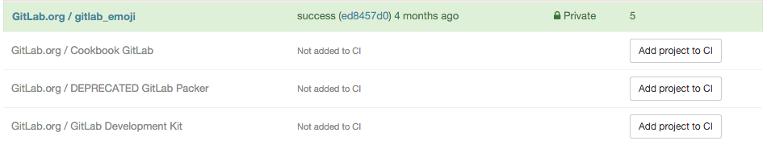
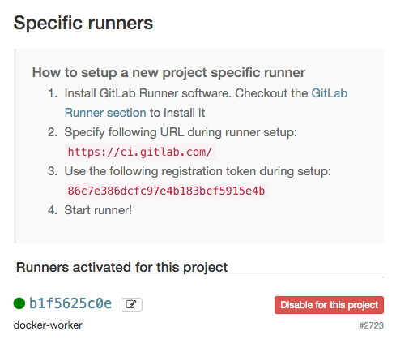
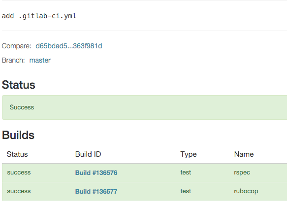

# Quick Start

To start building projects with GitLab CI a few steps needs to be done.

## 1. Install GitLab and CI

First you need to have a working GitLab and GitLab CI instance.

You can omit this step if you use [GitLab.com](https://GitLab.com/).

## 2. Create repository on GitLab

Once you login on your GitLab add a new repository where you will store your source code.
Push your application to that repository.

## 3. Add project to CI

The next part is to login to GitLab CI.
Point your browser to the URL you have set GitLab or use [gitlab.com/ci](https://gitlab.com/ci/).

On the first screen you will see a list of GitLab's projects that you have access to:



Click **Add Project to CI**.
This will create project in CI and authorize GitLab CI to fetch sources from GitLab.

> GitLab CI creates unique token that is used to configure GitLab CI service in GitLab.
> This token allows to access GitLab's repository and configures GitLab to trigger GitLab CI webhook on **Push events** and **Tag push events**.
> You can see that token by going to Project's Settings > Services > GitLab CI.
> You will see there token, the same token is assigned in GitLab CI settings of project.

## 4. Create project's configuration - .gitlab-ci.yml

The next: You have to define how your project will be built.
GitLab CI uses [YAML](https://en.wikipedia.org/wiki/YAML) file to store build configuration.
You need to create `.gitlab-ci.yml` in root directory of your repository:

```yaml
before_script:
  - bundle install

rspec:
  script:
    - bundle exec rspec

rubocop:
  script:
    - bundle exec rubocop
```

This is the simplest possible build configuration that will work for most Ruby applications:
1. Define two jobs `rspec` and `rubocop` with two different commands to be executed.
1. Before every job execute commands defined by `before_script`.

The `.gitlab-ci.yml` defines set of jobs with constrains how and when they should be run.
The jobs are defined as top-level elements with name and always have to contain the `script`.
Jobs are used to create builds, which are then picked by [runners](../runners/README.md) and executed within environment of the runner.
What is important that each job is run independently from each other. 

For more information and complete `.gitlab-ci.yml` syntax, please check the [Configuring project (.gitlab-ci.yml)](../yaml/README.md).

## 5. Add file and push .gitlab-ci.yml to repository

Once you created `.gitlab-ci.yml` you should add it to git repository and push it to GitLab.

```bash
git add .gitlab-ci.yml
git commit
git push origin master
```

If you refresh the project's page on GitLab CI you will notice a one new commit:


However the commit has status **pending** which means that commit was not yet picked by runner.

## 6. Configure runner

In GitLab CI, Runners run your builds.
A runner is a machine (can be virtual, bare-metal or VPS) that picks up builds through the coordinator API of GitLab CI.

A runner can be specific to a certain project or serve any project in GitLab CI.
A runner that serves all projects is called a shared runner.
More information about different runner types can be found in [Configuring runner](../runners/README.md).

To check if you have runners assigned to your project go to **Runners**. You will find there information how to setup project specific runner:

1. Install GitLab Runner software. Checkout the [GitLab Runner](https://about.gitlab.com/gitlab-ci/#gitlab-runner) section to install it.
1. Specify following URL during runner setup: https://gitlab.com/ci/
1. Use the following registration token during setup: TOKEN

If you do it correctly your runner should be shown under **Runners activated for this project**:



### Shared runners

If you use [gitlab.com/ci](https://gitlab.com/ci/) you can use **Shared runners** provided by GitLab Inc.
These are special virtual machines that are run on GitLab's infrastructure that can build any project.
To enable **Shared runners** you have to go to **Runners** and click **Enable shared runners** for this project.

## 7. Check status of commit

If everything went OK and you go to commit, the status of the commit should change from **pending** to either **running**, **success** or **failed**.



You can click **Build ID** to view build log for specific job.

## 8. Congratulations!

You managed to build your first project using GitLab CI.
You may need to tune your `.gitlab-ci.yml` file to implement build plan for your project.
A few examples how it can be done you can find on [Examples](../examples/README.md) page.

GitLab CI also offers **the Lint** tool to verify validity of your `.gitlab-ci.yml` which can be useful to troubleshoot potential problems.
The Lint is available from project's settings or by adding `/lint` to GitLab CI url.
