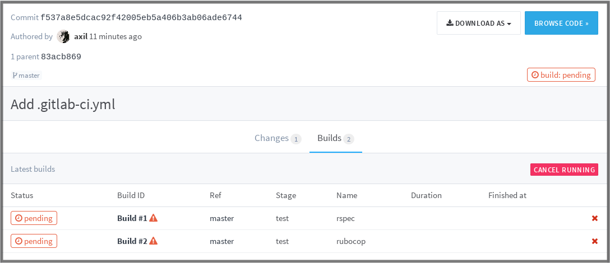
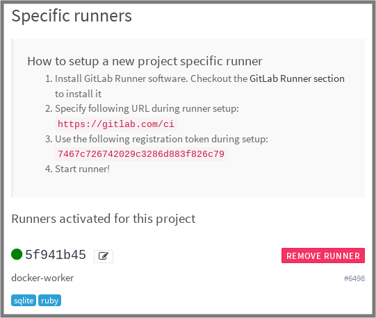
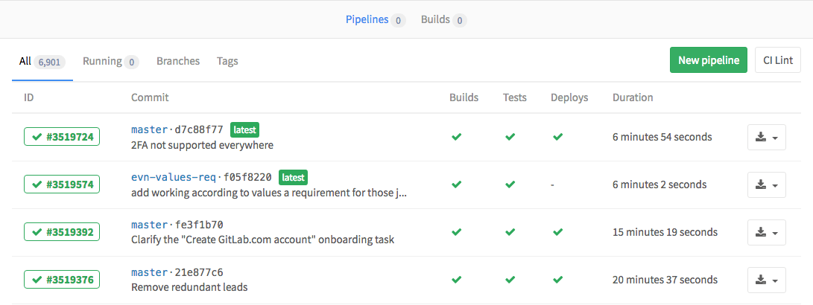
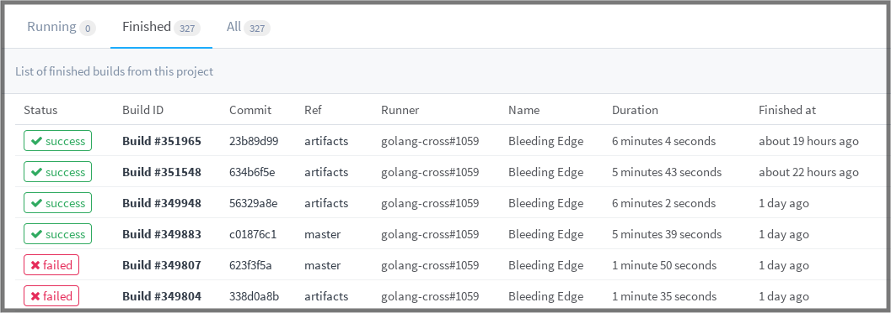
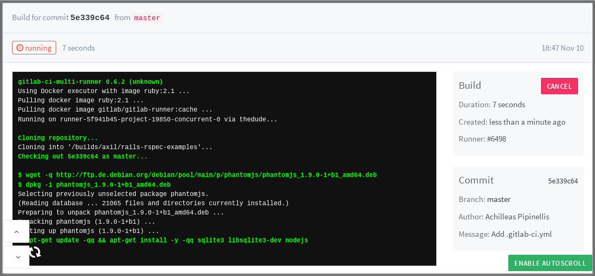

# Getting started with GitLab CI/CD

>**Note:** Starting from version 8.0, GitLab [Continuous Integration][ci] (CI)
is fully integrated into GitLab itself and is [enabled] by default on all
projects.

GitLab offers a [continuous integration][ci] service. If you
[add a `.gitlab-ci.yml` file][yaml] to the root directory of your repository,
and configure your GitLab project to use a [Runner], then each commit or
push, triggers your CI [pipeline].

The `.gitlab-ci.yml` file tells the GitLab runner what to do. By default it runs
a pipeline with three [stages]: `build`, `test`, and `deploy`. You don't need to
use all three stages; stages with no jobs are simply ignored.

If everything runs OK (no non-zero return values), you'll get a nice green
checkmark associated with the commit. This makes it
easy to see whether a commit caused any of the tests to fail before
you even look at the code.

Most projects use GitLab's CI service to run the test suite so that
developers get immediate feedback if they broke something.

There's a growing trend to use continuous delivery and continuous deployment to
automatically deploy tested code to staging and production environments.

So in brief, the steps needed to have a working CI can be summed up to:

1. Add `.gitlab-ci.yml` to the root directory of your repository
1. Configure a Runner

From there on, on every push to your Git repository, the Runner will
automagically start the pipeline and the pipeline will appear under the
project's **Pipelines** page.

---

This guide assumes that you:

- have a working GitLab instance of version 8.0+r or are using
  [GitLab.com](https://gitlab.com)
- have a project in GitLab that you would like to use CI for

Let's break it down to pieces and work on solving the GitLab CI puzzle.

## Creating a `.gitlab-ci.yml` file

Before you create `.gitlab-ci.yml` let's first explain in brief what this is
all about.

### What is `.gitlab-ci.yml`

The `.gitlab-ci.yml` file is where you configure what CI does with your project.
It lives in the root of your repository.

On any push to your repository, GitLab will look for the `.gitlab-ci.yml`
file and start jobs on _Runners_ according to the contents of the file,
for that commit.

Because `.gitlab-ci.yml` is in the repository and is version controlled, old
versions still build successfully, forks can easily make use of CI, branches can
have different pipelines and jobs, and you have a single source of truth for CI.
You can read more about the reasons why we are using `.gitlab-ci.yml` [in our
blog about it][blog-ci].

### Creating a simple `.gitlab-ci.yml` file

>**Note:**
`.gitlab-ci.yml` is a [YAML](https://en.wikipedia.org/wiki/YAML) file
so you have to pay extra attention to indentation. Always use spaces, not tabs.

You need to create a file named `.gitlab-ci.yml` in the root directory of your
repository. Below is an example for a Ruby on Rails project.

```yaml
before_script:
  - apt-get update -qq && apt-get install -y -qq sqlite3 libsqlite3-dev nodejs
  - ruby -v
  - which ruby
  - gem install bundler --no-ri --no-rdoc
  - bundle install --jobs $(nproc)  "${FLAGS[@]}"

rspec:
  script:
    - bundle exec rspec

rubocop:
  script:
    - bundle exec rubocop
```

This is the simplest possible configuration that will work for most Ruby
applications:

1. Define two jobs `rspec` and `rubocop` (the names are arbitrary) with
   different commands to be executed.
1. Before every job, the commands defined by `before_script` are executed.

The `.gitlab-ci.yml` file defines sets of jobs with constraints of how and when
they should be run. The jobs are defined as top-level elements with a name (in
our case `rspec` and `rubocop`) and always have to contain the `script` keyword.
Jobs are used to create jobs, which are then picked by
[Runners](../runners/README.md) and executed within the environment of the Runner.

What is important is that each job is run independently from each other.

If you want to check whether your `.gitlab-ci.yml` file is valid, there is a
Lint tool under the page `/ci/lint` of your GitLab instance. You can also find
a "CI Lint" button to go to this page under **CI/CD ➔ Pipelines** and
**Pipelines ➔ Jobs** in your project.

For more information and a complete `.gitlab-ci.yml` syntax, please read
[the reference documentation on .gitlab-ci.yml](../yaml/README.md).

### Push `.gitlab-ci.yml` to GitLab

Once you've created `.gitlab-ci.yml`, you should add it to your Git repository
and push it to GitLab.

```bash
git add .gitlab-ci.yml
git commit -m "Add .gitlab-ci.yml"
git push origin master
```

Now if you go to the **Pipelines** page you will see that the pipeline is
pending.

You can also go to the **Commits** page and notice the little pause icon next
to the commit SHA.


Clicking on it you will be directed to the jobs page for that specific commit.



Notice that there is a pending job which is named after what we wrote in
`.gitlab-ci.yml`. "stuck" indicates that there is no Runner configured
yet for this job.

The next step is to configure a Runner so that it picks the pending jobs.

## Configuring a Runner

In GitLab, Runners run the jobs that you define in `.gitlab-ci.yml`. A Runner
can be a virtual machine, a VPS, a bare-metal machine, a docker container or
even a cluster of containers. GitLab and the Runners communicate through an API,
so the only requirement is that the Runner's machine has [Internet] access.

A Runner can be specific to a certain project or serve multiple projects in
GitLab. If it serves all projects it's called a _Shared Runner_.

Find more information about different Runners in the
[Runners](../runners/README.md) documentation.

You can find whether any Runners are assigned to your project by going to
**Settings ➔ CI/CD**. Setting up a Runner is easy and straightforward. The
official Runner supported by GitLab is written in Go and its documentation
can be found at <https://docs.gitlab.com/runner/>.

In order to have a functional Runner you need to follow two steps:

1. [Install it][runner-install]
2. [Configure it](../runners/README.md#registering-a-specific-runner)

Follow the links above to set up your own Runner or use a Shared Runner as
described in the next section.

Once the Runner has been set up, you should see it on the Runners page of your
project, following **Settings ➔ CI/CD**.



### Shared Runners

If you use [GitLab.com](https://gitlab.com/) you can use the **Shared Runners**
provided by GitLab Inc.

These are special virtual machines that run on GitLab's infrastructure and can
build any project.

To enable the **Shared Runners** you have to go to your project's
**Settings ➔ CI/CD** and click **Enable shared runners**.

[Read more on Shared Runners](../runners/README.md).

## Seeing the status of your pipeline and jobs

After configuring the Runner successfully, you should see the status of your
last commit change from _pending_ to either _running_, _success_ or _failed_.

You can view all pipelines by going to the **Pipelines** page in your project.



Or you can view all jobs, by going to the **Pipelines ➔ Jobs** page.



By clicking on a job's status, you will be able to see the log of that job.
This is important to diagnose why a job failed or acted differently than
you expected.



You are also able to view the status of any commit in the various pages in
GitLab, such as **Commits** and **Merge requests**.

## Examples

Visit the [examples README][examples] to see a list of examples using GitLab
CI with various languages.

[runner-install]: https://docs.gitlab.com/runner/install/
[blog-ci]: https://about.gitlab.com/2015/05/06/why-were-replacing-gitlab-ci-jobs-with-gitlab-ci-dot-yml/
[examples]: ../examples/README.md
[ci]: https://about.gitlab.com/gitlab-ci/
[yaml]: ../yaml/README.md
[runner]: ../runners/README.md
[enabled]: ../enable_or_disable_ci.md
[stages]: ../yaml/README.md#stages
[pipeline]: ../pipelines.md
[internet]: https://about.gitlab.com/images/theinternet.png
