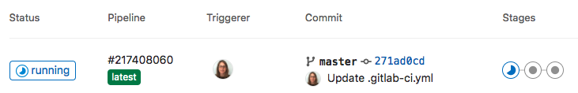
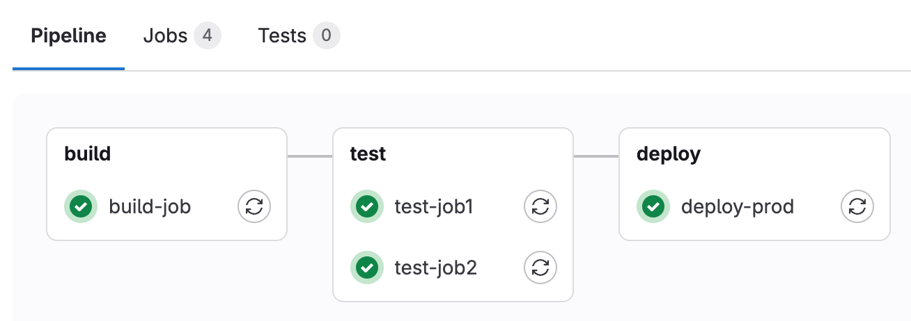

DETAILS:
**Tier:** Free, Premium, Ultimate
**Offering:** GitLab.com, GitLab Self-Managed, GitLab Dedicated

This tutorial shows you how to configure and run your first CI/CD pipeline in GitLab.

If you are already familiar with [basic CI/CD concepts](../_index.md), you can learn about
common keywords in [Tutorial: Create a complex pipeline](tutorial.md).

## Prerequisites

Before you start, make sure you have:

- A project in GitLab that you would like to use CI/CD for.
- The Maintainer or Owner role for the project.

If you don't have a project, you can create a public project for free on <https://gitlab.com>.

## Steps

To create and run your first pipeline:

1. [Ensure you have runners available](#ensure-you-have-runners-available) to run your jobs.

   If you're using GitLab.com, you can skip this step. GitLab.com provides instance runners for you.

1. [Create a `.gitlab-ci.yml` file](#create-a-gitlab-ciyml-file)
   at the root of your repository. This file is where you define the CI/CD jobs.

When you commit the file to your repository, the runner runs your jobs.
The job results [are displayed in a pipeline](#view-the-status-of-your-pipeline-and-jobs).

## Ensure you have runners available

In GitLab, runners are agents that run your CI/CD jobs.

To view available runners:

1. On the left sidebar, select **Search or go to** and find your project.
1. Select **Settings > CI/CD**.
1. Expand **Runners**.

As long as you have at least one runner that's active, with a green circle next to it,
you have a runner available to process your jobs.

### If you don't have a runner

If you don't have a runner:

1. [Install GitLab Runner](https://docs.gitlab.com/runner/install/) on your local machine.
1. [Register the runner](https://docs.gitlab.com/runner/register/) for your project.
   Choose the `shell` executor.

When your CI/CD jobs run, in a later step, they will run on your local machine.

## Create a `.gitlab-ci.yml` file

Now create a `.gitlab-ci.yml` file. It is a [YAML](https://en.wikipedia.org/wiki/YAML) file where
you specify instructions for GitLab CI/CD.

In this file, you define:

- The structure and order of jobs that the runner should execute.
- The decisions the runner should make when specific conditions are encountered.

To create a `.gitlab-ci.yml` file in your project:

1. On the left sidebar, select **Search or go to** and find your project.
1. Select **Code > Repository**.
1. Above the file list, select the branch you want to commit to.
   If you're not sure, leave `master` or `main`.
   Then select the plus icon (**{plus}**) and **New file**:

   

1. For the **Filename**, type `.gitlab-ci.yml` and in the larger window,
   paste this sample code:

   ```yaml
   build-job:
     stage: build
     script:
       - echo "Hello, $GITLAB_USER_LOGIN!"

   test-job1:
     stage: test
     script:
       - echo "This job tests something"

   test-job2:
     stage: test
     script:
       - echo "This job tests something, but takes more time than test-job1."
       - echo "After the echo commands complete, it runs the sleep command for 20 seconds"
       - echo "which simulates a test that runs 20 seconds longer than test-job1"
       - sleep 20

   deploy-prod:
     stage: deploy
     script:
       - echo "This job deploys something from the $CI_COMMIT_BRANCH branch."
     environment: production
   ```

   This example shows four jobs: `build-job`, `test-job1`, `test-job2`, and `deploy-prod`.
   The comments listed in the `echo` commands are displayed in the UI when you view the jobs.
   The values for the [predefined variables](../variables/predefined_variables.md)
   `$GITLAB_USER_LOGIN` and `$CI_COMMIT_BRANCH` are populated when the jobs run.

1. Select **Commit changes**.

The pipeline starts and runs the jobs you defined in the `.gitlab-ci.yml` file.

## View the status of your pipeline and jobs

Now take a look at your pipeline and the jobs within.

1. Go to **Build > Pipelines**. A pipeline with three stages should be displayed:

   

1. View a visual representation of your pipeline by selecting the pipeline ID:

   

1. View details of a job by selecting the job name. For example, `deploy-prod`:

   

You have successfully created your first CI/CD pipeline in GitLab. Congratulations!

Now you can get started customizing your `.gitlab-ci.yml` and defining more advanced jobs.

## `.gitlab-ci.yml` tips

Here are some tips to get started working with the `.gitlab-ci.yml` file.

For the complete `.gitlab-ci.yml` syntax, see the full [CI/CD YAML syntax reference](../yaml/_index.md).

- Use the [pipeline editor](../pipeline_editor/_index.md) to edit your `.gitlab-ci.yml` file.
- Each job contains a script section and belongs to a stage:
  - [`stage`](../yaml/_index.md#stage) describes the sequential execution of jobs.
    If there are runners available, jobs in a single stage run in parallel.
  - Use the [`needs` keyword](../yaml/_index.md#needs) to [run jobs out of stage order](../yaml/needs.md),
    to increase pipeline speed and efficiency.
- You can set additional configuration to customize how your jobs and stages perform:
  - Use the [`rules`](../yaml/_index.md#rules) keyword to specify when to run or skip jobs.
    The `only` and `except` legacy keywords are still supported, but can't be used
    with `rules` in the same job.
  - Keep information across jobs and stages persistent in a pipeline with [`cache`](../yaml/_index.md#cache)
    and [`artifacts`](../yaml/_index.md#artifacts). These keywords are ways to store
    dependencies and job output, even when using ephemeral runners for each job.
  - Use the [`default`](../yaml/_index.md#default) keyword to specify additional
    configurations that are applied to all jobs. This keyword is often used to define
    [`before_script`](../yaml/_index.md#before_script) and [`after_script`](../yaml/_index.md#after_script)
    sections that should run on every job.

## Related topics

Migrate from:

- [Bamboo](../migration/bamboo.md)
- [CircleCI](../migration/circleci.md)
- [GitHub Actions](../migration/github_actions.md)
- [Jenkins](../migration/jenkins.md)
- [TeamCity](../migration/teamcity.md)

Watch:

- <i class="fa fa-youtube-play youtube" aria-hidden="true"></i>&nbsp;[First time GitLab & CI/CD](https://www.youtube.com/watch?v=kTNfi5z6Uvk&t=553s).
  This includes a quick introduction to GitLab, the first steps with CI/CD, building a Go project,
  running tests, using the CI/CD pipeline editor, detecting secrets and security vulnerabilities
  and offers more exercises for asynchronous practice.
- <i class="fa fa-youtube-play youtube" aria-hidden="true"></i>&nbsp;[Intro to GitLab CI](https://www.youtube.com/watch?v=l5705U8s_nQ&t=358s).
  This workshop uses the Web IDE to quickly get going with building source code using CI/CD,
  and run unit tests.
