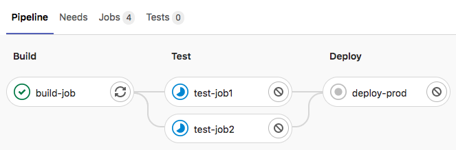

# Get started with GitLab CI/CD **(FREE)**

Use this document to get started with
GitLab [continuous integration](https://about.gitlab.com/stages-devops-lifecycle/continuous-integration/).

Before you start, make sure you have:

- A project in GitLab that you would like to use CI/CD for.
- The [Maintainer or Owner role](../../user/permissions.md) for the project.

If you are migrating from another CI/CD tool, view this documentation:

- [Migrate from CircleCI](../migration/circleci.md).
- [Migrate from Jenkins](../migration/jenkins.md).

> - <i class="fa fa-youtube-play youtube" aria-hidden="true"></i>&nbsp;Watch [First time GitLab & CI/CD](https://www.youtube.com/watch?v=kTNfi5z6Uvk&t=553s). This includes a quick introduction to GitLab, the first steps with CI/CD, building a Go project, running tests, using the CI/CD pipeline editor, detecting secrets and security vulnerabilities and offers more exercises for async practice.
> - <i class="fa fa-youtube-play youtube" aria-hidden="true"></i>&nbsp;Watch [Intro to GitLab CI](https://www.youtube.com/watch?v=l5705U8s_nQ&t=358s). This workshop uses the Web IDE to quickly get going with building source code using CI/CD, and run unit tests.

## CI/CD process overview

To use GitLab CI/CD:

1. [Ensure you have runners available](#ensure-you-have-runners-available) to run your jobs.
   If you don't have a runner, [install GitLab Runner](https://docs.gitlab.com/runner/install/)
   and [register a runner](https://docs.gitlab.com/runner/register/) for your instance, project, or group.
1. [Create a `.gitlab-ci.yml` file](#create-a-gitlab-ciyml-file)
   at the root of your repository. This file is where you define your CI/CD jobs.

When you commit the file to your repository, the runner runs your jobs.
The job results [are displayed in a pipeline](#view-the-status-of-your-pipeline-and-jobs).

### Ensure you have runners available

In GitLab, runners are agents that run your CI/CD jobs.

You might already have runners available for your project, including
[shared runners](../runners/runners_scope.md), which are
available to all projects in your GitLab instance.

To view available runners:

- Go to **Settings > CI/CD** and expand **Runners**.

As long as you have at least one runner that's active, with a green circle next to it,
you have a runner available to process your jobs.

If no runners are listed on the **Runners** page in the UI, you or an administrator
must [install GitLab Runner](https://docs.gitlab.com/runner/install/) and
[register](https://docs.gitlab.com/runner/register/) at least one runner.

If you are testing CI/CD, you can install GitLab Runner and register runners on your local machine.
When your CI/CD jobs run, they run on your local machine.

### Create a `.gitlab-ci.yml` file

The `.gitlab-ci.yml` file is a [YAML](https://en.wikipedia.org/wiki/YAML) file where
you configure specific instructions for GitLab CI/CD.

In this file, you define:

- The structure and order of jobs that the runner should execute.
- The decisions the runner should make when specific conditions are encountered.

For example, you might want to run a suite of tests when you commit to
any branch except the default branch. When you commit to the default branch, you want
to run the same suite, but also publish your application.

All of this is defined in the `.gitlab-ci.yml` file.

To create a `.gitlab-ci.yml` file:

1. On the left sidebar, select **Project information > Details**.
1. Above the file list, select the branch you want to commit to,
   click the plus icon, then select **New file**:

   

1. For the **Filename**, type `.gitlab-ci.yml` and in the larger window,
   paste this sample code:

   ```yaml
   build-job:
     stage: build
     script:
       - echo "Hello, $GITLAB_USER_LOGIN!"

   test-job1:
     stage: test
     script:
       - echo "This job tests something"

   test-job2:
     stage: test
     script:
       - echo "This job tests something, but takes more time than test-job1."
       - echo "After the echo commands complete, it runs the sleep command for 20 seconds"
       - echo "which simulates a test that runs 20 seconds longer than test-job1"
       - sleep 20

   deploy-prod:
     stage: deploy
     script:
       - echo "This job deploys something from the $CI_COMMIT_BRANCH branch."
   ```

   `$GITLAB_USER_LOGIN` and `$CI_COMMIT_BRANCH` are
   [predefined variables](../variables/predefined_variables.md)
   that populate when the job runs.

1. Click **Commit changes**.

The pipeline starts when the commit is committed.

#### `.gitlab-ci.yml` tips

- If you want the runner to [use a Docker container to run the jobs](../docker/using_docker_images.md),
  edit the `.gitlab-ci.yml` file
  to include an image name:

  ```yaml
  default:
    image: ruby:2.7.2
  ```

  This command tells the runner to use a Ruby image from Docker Hub
  and to run the jobs in a container that's generated from the image.

  This process is different than
  [building an application as a Docker container](../docker/using_docker_build.md).
  Your application does not need to be built as a Docker container to
  run CI/CD jobs in Docker containers.

- To validate your `.gitlab-ci.yml` file, use the
  [CI Lint tool](../lint.md), which is available in every project.
- You can also use [CI/CD configuration visualization](../pipeline_editor/index.md#visualize-ci-configuration) to
  view a graphical representation of your `.gitlab-ci.yml` file.
- For the complete `.gitlab-ci.yml` syntax, see
  [the `.gitlab-ci.yml` reference topic](../yaml/index.md).

### View the status of your pipeline and jobs

When you committed your changes, a pipeline started.

To view your pipeline:

- Go to **CI/CD > Pipelines**.

  A pipeline with three stages should be displayed:

  

- To view a visual representation of your pipeline, click the pipeline ID.

  

- To view details of a job, click the job name, for example, `deploy-prod`.

  

If the job status is `stuck`, check to ensure a runner is properly configured for the project.

> To learn more about GitLab CI/CD, check out these video walkthroughs:
>
> - <i class="fa fa-youtube-play youtube" aria-hidden="true"></i>&nbsp;Watch [First time GitLab & CI/CD](https://www.youtube.com/watch?v=kTNfi5z6Uvk&t=150s).
> - <i class="fa fa-youtube-play youtube" aria-hidden="true"></i>&nbsp;Watch [Intro to GitLab CI](https://www.youtube.com/watch?v=l5705U8s_nQ&t=358s).
