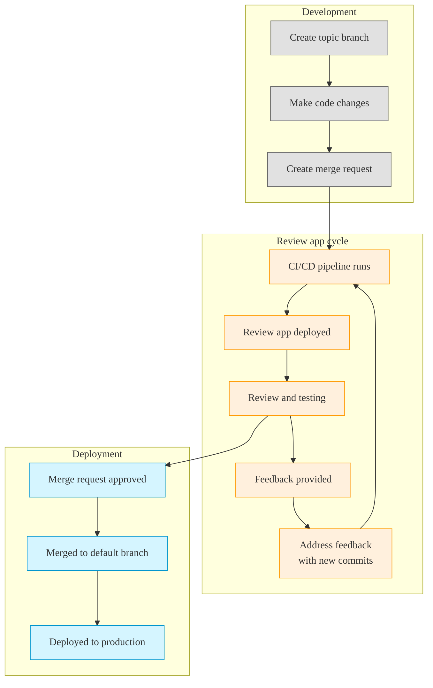
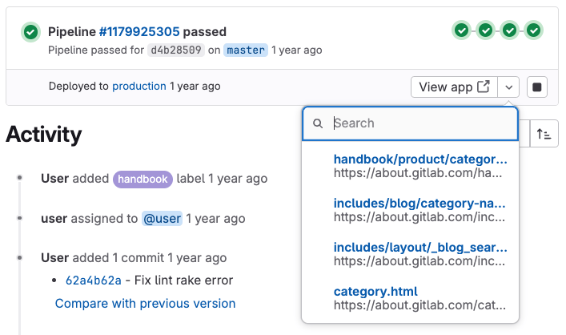



- Tier: Free, Premium, Ultimate
- Offering: GitLab.com, GitLab Self-Managed, GitLab Dedicated



Review apps are temporary testing environments that are created automatically for each branch or merge request.
You can preview and validate changes without needing to set up a local development environment.

Built on [dynamic environments](../environments/_index.md#create-a-dynamic-environment),
review apps provide a unique environment for each branch or merge request.


These environments help streamline the development workflow by:

- Eliminating the need for local setup to test changes.
- Providing consistent environments for all team members.
- Enabling stakeholders to preview changes with a URL.
- Facilitating faster feedback cycles before changes reach production.



If you have a Kubernetes cluster, you can set up review apps automatically using [Auto DevOps](../../topics/autodevops/_index.md).



## Review app workflow

A review app workflow could be similar to:



## Configure review apps

Configure review apps when you want to provide a preview environment of your application for each branch or merge request.

Prerequisites:

- You must have at least the Developer role for the project.
- You must have CI/CD pipelines available in the project.
- You must set up the infrastructure to host and deploy the review apps.

To configure review apps in your project:

1. On the left sidebar, select **Search or go to** and find your project.
1. Select **Build > Pipeline editor**.
1. In your `.gitlab-ci.yml` file, add a job that creates a [dynamic environment](../environments/_index.md#create-a-dynamic-environment).
   You can use a [predefined CI/CD variable](../variables/predefined_variables.md) to differentiate
   each environment. For example, using the `CI_COMMIT_REF_SLUG` predefined variable:

   ```yaml
   review_app:
     stage: deploy
     script:
       - echo "Deploy to review app environment"
       # Add your deployment commands here
     environment:
       name: review/$CI_COMMIT_REF_SLUG
       url: https://$CI_COMMIT_REF_SLUG.example.com
     rules:
       - if: $CI_COMMIT_BRANCH && $CI_COMMIT_BRANCH != $CI_DEFAULT_BRANCH
   ```

1. Optional. Add `when: manual` to the job to only deploy review apps manually.
1. Optional. Add a job to [stop the review app](#stop-review-apps) when it's no longer needed.
1. Enter a commit message and select **Commit changes**.

### Use the review apps template

GitLab provides a built-in template that's configured for merge request pipelines by default.

To use and customize this template:

1. On the left sidebar, select **Search or go to** and find your project.
1. Select **Operate > Environments**.
1. Select **Enable review apps**.
1. From the **Enable Review Apps** dialog that appears, copy the YAML template:

   ```yaml
   deploy_review:
     stage: deploy
     script:
       - echo "Add script here that deploys the code to your infrastructure"
     environment:
       name: review/$CI_COMMIT_REF_NAME
       url: https://$CI_ENVIRONMENT_SLUG.example.com
     rules:
       - if: $CI_PIPELINE_SOURCE == "merge_request_event"
   ```

1. Select **Build > Pipeline editor**.
1. Paste the template into your `.gitlab-ci.yml` file.
1. Customize the template based on your deployment needs:

   - Modify the deployment script and environment URL to work with your infrastructure.
   - Adjust [the rules section](../jobs/job_rules.md) if you want to trigger review apps
     for branches even without merge requests.

   For example, for a deployment to Heroku:

   ```yaml
   deploy_review:
     stage: deploy
     image: ruby:latest
     script:
       - apt-get update -qy
       - apt-get install -y ruby-dev
       - gem install dpl
       - dpl --provider=heroku --app=$HEROKU_APP_NAME --api-key=$HEROKU_API_KEY
     environment:
       name: review/$CI_COMMIT_REF_NAME
       url: https://$HEROKU_APP_NAME.herokuapp.com
       on_stop: stop_review_app
     rules:
       - if: $CI_PIPELINE_SOURCE == "merge_request_event"
   ```

   This configuration sets up an automated deployment to Heroku whenever a pipeline runs for a merge request.
   It uses Ruby's `dpl` deployment tool to handle the process, and creates a dynamic review environment that can be accessed through the specified URL.

1. Enter a commit message and select **Commit changes**.

### Stop review apps

You can configure your review apps to be stopped either manually or automatically to conserve resources.

For more information about stopping environments for review apps, see [Stopping an environment](../environments/_index.md#stopping-an-environment).

#### Auto-stop review apps on merge

To configure review apps to automatically stop when the associated merge request is merged
or the branch is deleted:

1. Add the [`on_stop`](../yaml/_index.md#environmenton_stop) keyword to your deployment job.
1. Create a stop job with the [`environment:action: stop`](../yaml/_index.md#environmentaction).
1. Optional. Add [`when: manual`](../yaml/_index.md#when) to the stop job to make it possible to
   manually stop the review app at any time.

For example:

```yaml
# In your .gitlab-ci.yml file
deploy_review:
  # Other configuration...
  environment:
    name: review/${CI_COMMIT_REF_NAME}
    url: https://${CI_ENVIRONMENT_SLUG}.example.com
    on_stop: stop_review_app  # References the stop job below

stop_review_app:
  stage: deploy
  script:
    - echo "Stop review app"
    # Add your cleanup commands here
  environment:
    name: review/${CI_COMMIT_REF_NAME}
    action: stop
  when: manual  # Makes this job manually triggerable
  rules:
    - if: $CI_PIPELINE_SOURCE == "merge_request_event"
```

#### Time-based automatic stop

To configure review apps to stop automatically after a period of time,
add the [`auto_stop_in`](../yaml/_index.md#environmentauto_stop_in) keyword to your deployment job:

```yaml
# In your .gitlab-ci.yml file
review_app:
  script: deploy-review-app
  environment:
    name: review/$CI_COMMIT_REF_SLUG
    auto_stop_in: 1 week  # Stops after one week of inactivity
  rules:
    - if: $CI_MERGE_REQUEST_ID
```

## View review apps

To deploy and access review apps:

1. Go to your merge request.
1. Optional. If the review app job is manual, select **Run** () to trigger the deployment.
1. When the pipeline finishes, select **View app** to open the review app in your browser.

## Example implementations

These projects demonstrate different review app implementations:

| Project                                                                                 | Configuration file |
| --------------------------------------------------------------------------------------- | ------------------ |
| [NGINX](https://gitlab.com/gitlab-examples/review-apps-nginx)                           | [`.gitlab-ci.yml`](https://gitlab.com/gitlab-examples/review-apps-nginx/-/blob/b9c1f6a8a7a0dfd9c8784cbf233c0a7b6a28ff27/.gitlab-ci.yml#L20) |
| [OpenShift](https://gitlab.com/gitlab-examples/review-apps-openshift)                   | [`.gitlab-ci.yml`](https://gitlab.com/gitlab-examples/review-apps-openshift/-/blob/82ebd572334793deef2d5ddc379f38942f3488be/.gitlab-ci.yml#L42) |
| [HashiCorp Nomad](https://gitlab.com/gitlab-examples/review-apps-nomad)                 | [`.gitlab-ci.yml`](https://gitlab.com/gitlab-examples/review-apps-nomad/-/blob/ca372c778be7aaed5e82d3be24e98c3f10a465af/.gitlab-ci.yml#L110) |
| [GitLab Documentation](https://gitlab.com/gitlab-org/technical-writing/docs-gitlab-com) | [`build.gitlab-ci.yml`](https://gitlab.com/gitlab-org/technical-writing/docs-gitlab-com/-/blob/bdbf11814428a06e82d7b712c72b5cb53c750f29/.gitlab/ci/build.gitlab-ci.yml#L73-76) |
| [`https://about.gitlab.com/`](https://gitlab.com/gitlab-com/www-gitlab-com/)            | [`.gitlab-ci.yml`](https://gitlab.com/gitlab-com/www-gitlab-com/-/blob/6ffcdc3cb9af2abed490cbe5b7417df3e83cd76c/.gitlab-ci.yml#L332) |
| [GitLab Insights](https://gitlab.com/gitlab-org/gitlab-insights/)                       | [`.gitlab-ci.yml`](https://gitlab.com/gitlab-org/gitlab-insights/-/blob/9e63f44ac2a5a4defc965d0d61d411a768e20546/.gitlab-ci.yml#L234) |

Other examples of review apps:

- <i class="fa-youtube-play" aria-hidden="true"></i>
  [Cloud Native Development with GitLab](https://www.youtube.com/watch?v=jfIyQEwrocw).
- [Review apps for Android](https://about.gitlab.com/blog/2020/05/06/how-to-create-review-apps-for-android-with-gitlab-fastlane-and-appetize-dot-io/).

## Route maps

Route maps let you navigate directly from source files to their corresponding public pages in the review app environment.
This feature makes it easier to preview specific changes in your merge requests.

When configured, route maps enhance the review app experience by adding links to review app versions
of the changed files in:

- The merge request widget.
- Commit and file views.

### Configure route maps

To set up route maps:

1. Create a file in your repository at `.gitlab/route-map.yml`.
1. Define mappings between source paths (in your repository) and public paths (on your review app infrastructure or website).

The route map is a YAML array where each entry maps a `source` path to a `public` path.

Each mapping in the route map follows this format:

```yaml
- source: 'path/to/source/file'  # Source file in repository
  public: 'path/to/public/page'  # Public page on the website
```

You can use two types of mapping:

- **Exact match**: String literals enclosed in single quotes
- **Pattern match**: Regular expressions enclosed in forward slashes

For pattern matching with regular expressions:

- The regex must match the entire source path (`^` and `$` anchors are implied).
- You can use capture groups `()` that can be referenced in the `public` path.
- Reference capture groups using `\N` expressions in order of occurrence (`\1`, `\2`, etc.).
- Escape slashes (`/`) as `\/` and periods (`.`) as `\.`.

GitLab evaluates mappings in order of definition. The first `source` expression that matches determines the `public` path.

### Example route map

The following example shows a route map for [Middleman](https://middlemanapp.com), a static site generator used for the [GitLab website](https://about.gitlab.com):

```yaml
# Team data
- source: 'data/team.yml'  # data/team.yml
  public: 'team/'  # team/

# Blogposts
- source: /source\/posts\/([0-9]{4})-([0-9]{2})-([0-9]{2})-(.+?)\..*/  # source/posts/2017-01-30-around-the-world-in-6-releases.html.md.erb
  public: '\1/\2/\3/\4/'  # 2017/01/30/around-the-world-in-6-releases/

# HTML files
- source: /source\/(.+?\.html).*/  # source/index.html.haml
  public: '\1'  # index.html

# Other files
- source: /source\/(.*)/  # source/images/blogimages/around-the-world-in-6-releases-cover.png
  public: '\1'  # images/blogimages/around-the-world-in-6-releases-cover.png
```

In this example:

- The mappings are evaluated in order.
- The third mapping ensures that `source/index.html.haml` matches `/source\/(.+?\.html).*/` instead of the catch-all `/source\/(.*)/`.
  This produces a public path of `index.html` instead of `index.html.haml`.

### View mapped pages

After you configure route maps, you can find links to the mapped pages after the next
review app deployment.

To view mapped pages:

- In the merge request widget, select **View app** to go to the environment URL set in the
  `.gitlab-ci.yml` file. The list shows up to 5 matched items from the route map (with
  filtering if more are available).

  

For files in your route map:

1. In the **Changes** tab of your merge request, select **View file @ [commit]** next to a file.
1. On the file's page, look for **View on [deployment-URL]** () in the upper-right corner.

For merge requests using merged results pipelines:

1. Go to the **Pipelines** tab in your merge request.
1. Select the commit for the latest pipeline.
1. Select **View file @ [commit]** next to a file.
1. On the file's page, select **View on [deployment-URL]** () in the upper-right corner.
