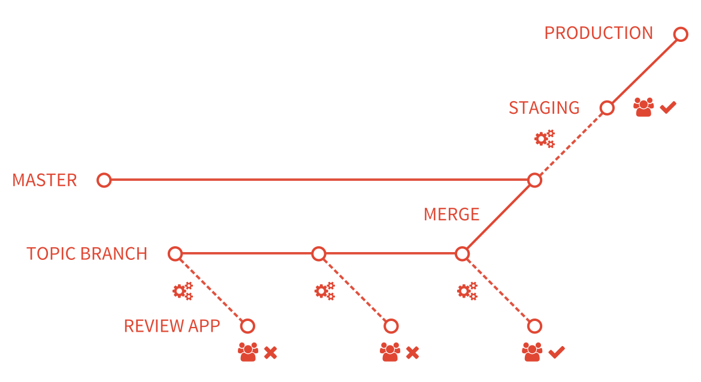
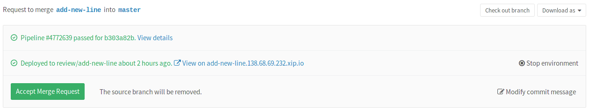
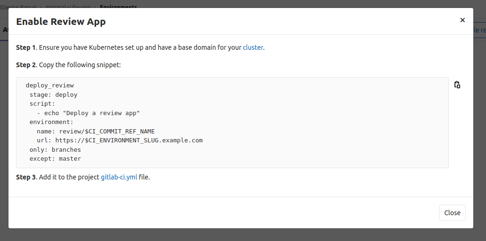
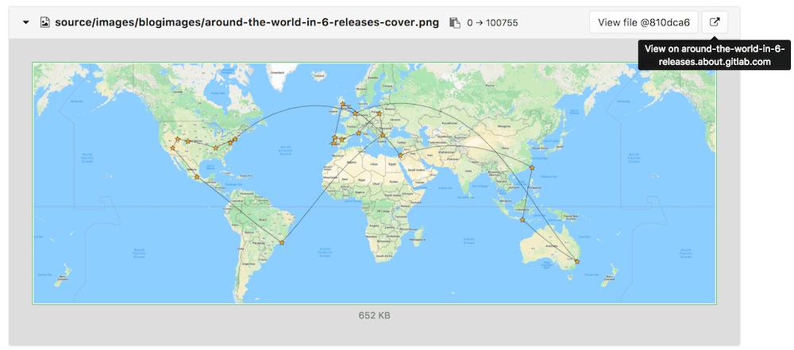
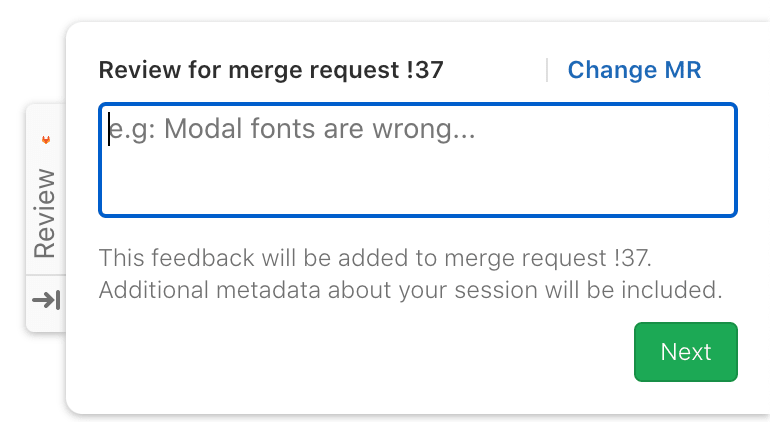
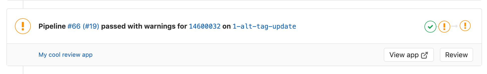

# Review Apps

> - [Introduced](https://gitlab.com/gitlab-org/gitlab-foss/-/issues/21971) in GitLab 8.12. Further additions were made in GitLab 8.13 and 8.14.
> - Inspired by [Heroku's Review Apps](https://devcenter.heroku.com/articles/github-integration-review-apps), which itself was inspired by [Fourchette](https://github.com/rainforestapp/fourchette).

Review Apps is a collaboration tool that takes the hard work out of providing an environment to showcase product changes.

NOTE:
If you have a Kubernetes cluster, you can automate this feature in your applications
by using [Auto DevOps](../../topics/autodevops/index.md).

## Introduction

Review Apps:

- Provide an automatic live preview of changes made in a feature branch by spinning up a dynamic environment for your merge requests.
- Allow designers and product managers to see your changes without needing to check out your branch and run your changes in a sandbox environment.
- Are fully integrated with the [GitLab DevOps LifeCycle](../../index.md#the-entire-devops-lifecycle).
- Allow you to deploy your changes wherever you want.



In the above example:

- A Review App is built every time a commit is pushed to `topic branch`.
- The reviewer fails two reviews before passing the third review.
- After the review passes, `topic branch` is merged into the default branch, where it's deployed to staging.
- After its approval in staging, the changes that were merged into the default branch are deployed to production.

## How Review Apps work

A Review App is a mapping of a branch with an [environment](../environments/index.md).
Access to the Review App is made available as a link on the [merge request](../../user/project/merge_requests/index.md) relevant to the branch.

The following is an example of a merge request with an environment set dynamically.



In this example, a branch was:

- Successfully built.
- Deployed under a dynamic environment that can be reached by clicking on the **View app** button.

After adding Review Apps to your workflow, you follow the branched Git flow. That is:

1. Push a branch and let the runner deploy the Review App based on the `script` definition of the dynamic environment job.
1. Wait for the runner to build and deploy your web application.
1. Click on the link provided in the merge request related to the branch to see the changes live.

## Configuring Review Apps

Review Apps are built on [dynamic environments](../environments/index.md#create-a-dynamic-environment), which allow you to dynamically create a new environment for each branch.

The process of configuring Review Apps is as follows:

1. Set up the infrastructure to host and deploy the Review Apps (check the [examples](#review-apps-examples) below).
1. [Install](https://docs.gitlab.com/runner/install/) and [configure](https://docs.gitlab.com/runner/commands/) a runner to do deployment.
1. Set up a job in `.gitlab-ci.yml` that uses the [predefined CI/CD variable](../variables/index.md) `${CI_COMMIT_REF_NAME}`
   to create dynamic environments and restrict it to run only on branches.
   Alternatively, you can get a YML template for this job by [enabling review apps](#enable-review-apps-button) for your project.
1. Optionally, set a job that [manually stops](../environments/index.md#stopping-an-environment) the Review Apps.

### Enable Review Apps button

> [Introduced](https://gitlab.com/gitlab-org/gitlab/-/issues/118844) in GitLab 12.8.

When configuring Review Apps for a project, you need to add a new job to `.gitlab-ci.yml`,
as mentioned above. To facilitate this and if you are using Kubernetes, you can click
the **Enable Review Apps** button and GitLab prompts you with a template code block that
you can copy and paste into `.gitlab-ci.yml` as a starting point. To do so:

1. Go to the project your want to create a Review App job for.
1. From the left nav, go to **Deployments > Environments**.
1. Click on the **Enable Review Apps** button. It is available to you
   if you have Developer or higher [permissions](../../user/permissions.md) to that project.
1. Copy the provided code snippet and paste it into your
   `.gitlab-ci.yml` file:

   

1. Feel free to tune this template to your own needs.

## Review Apps auto-stop

See how to [configure Review Apps environments to expire and auto-stop](../environments/index.md#stop-an-environment-after-a-certain-time-period)
after a given period of time.

## Review Apps examples

The following are example projects that demonstrate Review App configuration:

- [NGINX](https://gitlab.com/gitlab-examples/review-apps-nginx).
- [OpenShift](https://gitlab.com/gitlab-examples/review-apps-openshift).

Other examples of Review Apps:

- <i class="fa fa-youtube-play youtube" aria-hidden="true"></i>
[Cloud Native Development with GitLab](https://www.youtube.com/watch?v=jfIyQEwrocw).
- [Review Apps for Android](https://about.gitlab.com/blog/2020/05/06/how-to-create-review-apps-for-android-with-gitlab-fastlane-and-appetize-dot-io/).

## Route Maps

> Introduced in GitLab 8.17. In GitLab 11.5, the file links are available in the merge request widget.

Route Maps allows you to go directly from source files
to public pages on the [environment](../environments/index.md) defined for
Review Apps.

Once set up, the review app link in the merge request
widget can take you directly to the pages changed, making it easier
and faster to preview proposed modifications.

Configuring Route Maps involves telling GitLab how the paths of files
in your repository map to paths of pages on your website using a Route Map.
Once set, GitLab displays **View on ...** buttons, which take you
to the pages changed directly from merge requests.

To set up a route map, add a file inside the repository at `.gitlab/route-map.yml`,
which contains a YAML array that maps `source` paths (in the repository) to `public`
paths (on the website).

### Route Maps example

The following is an example of a route map for [Middleman](https://middlemanapp.com),
a static site generator (SSG) used to build the [GitLab website](https://about.gitlab.com),
deployed from its [project on GitLab.com](https://gitlab.com/gitlab-com/www-gitlab-com):

```yaml
# Team data
- source: 'data/team.yml'  # data/team.yml
  public: 'team/'  # team/

# Blogposts
- source: /source\/posts\/([0-9]{4})-([0-9]{2})-([0-9]{2})-(.+?)\..*/  # source/posts/2017-01-30-around-the-world-in-6-releases.html.md.erb
  public: '\1/\2/\3/\4/'  # 2017/01/30/around-the-world-in-6-releases/

# HTML files
- source: /source\/(.+?\.html).*/  # source/index.html.haml
  public: '\1'  # index.html

# Other files
- source: /source\/(.*)/  # source/images/blogimages/around-the-world-in-6-releases-cover.png
  public: '\1'  # images/blogimages/around-the-world-in-6-releases-cover.png
```

Mappings are defined as entries in the root YAML array, and are identified by a `-` prefix. Within an entry, there is a hash map with two keys:

- `source`
  - A string, starting and ending with `'`, for an exact match.
  - A regular expression, starting and ending with `/`, for a pattern match:
    - The regular expression needs to match the entire source path - `^` and `$` anchors are implied.
    - Can include capture groups denoted by `()` that can be referred to in the `public` path.
    - Slashes (`/`) can, but don't have to, be escaped as `\/`.
    - Literal periods (`.`) should be escaped as `\.`.
- `public`, a string starting and ending with `'`.
  - Can include `\N` expressions to refer to capture groups in the `source` regular expression in order of their occurrence, starting with `\1`.

The public path for a source path is determined by finding the first
`source` expression that matches it, and returning the corresponding
`public` path, replacing the `\N` expressions with the values of the
`()` capture groups if appropriate.

In the example above, the fact that mappings are evaluated in order
of their definition is used to ensure that `source/index.html.haml`
matches `/source\/(.+?\.html).*/` instead of `/source\/(.*)/`,
and results in a public path of `index.html`, instead of
`index.html.haml`.

After you have the route mapping set up, it takes effect in the following locations:

- In the merge request widget. The:
  - **View app** button takes you to the environment URL set in `.gitlab-ci.yml`.
  - Dropdown lists the first 5 matched items from the route map, but you can filter them if more
    than 5 are available.

    

- In the diff for a merge request, comparison, or commit.

  

- In the blob file view.

  

## Visual Reviews **(PREMIUM)**

> - [Introduced](https://gitlab.com/gitlab-org/gitlab/-/issues/10761) in GitLab 12.0.
> - [Moved](https://about.gitlab.com/blog/2021/01/26/new-gitlab-product-subscription-model/) to GitLab Premium in 13.9.
> - It's [deployed behind a feature flag](../../user/feature_flags.md), enabled by default.
> - It's enabled on GitLab.com.
> - For GitLab self-managed instances, GitLab administrators can opt to [disable it](#enable-or-disable-visual-reviews). **(PREMIUM SELF)**

With Visual Reviews, members of any team (Product, Design, Quality, and so on) can provide feedback comments through a form in your review apps. The comments are added to the merge request that triggered the review app.

### Using Visual Reviews

After Visual Reviews has been [configured](#configure-review-apps-for-visual-reviews) for the
Review App, the Visual Reviews feedback form is overlaid on the right side of every page.



To use the feedback form to make a comment in the merge request:

1. Click the **Review** tab on the right side of a page.
1. Make a comment on the visual review. You can make use of all the
   [Markdown annotations](../../user/markdown.md) that are also available in
   merge request comments.
1. Enter your personal information:
   - If [`data-require-auth`](#authentication-for-visual-reviews) is `true`, you must enter your [personal access token](../../user/profile/personal_access_tokens.md).
   - Otherwise, enter your name, and optionally your email.
1. Click **Send feedback**.

<i class="fa fa-youtube-play youtube" aria-hidden="true"></i>
To see Visual reviews in action, see the [Visual Reviews Walk through](https://youtu.be/1_tvWTlPfM4).

### Configure Review Apps for Visual Reviews

The feedback form is served through a script you add to pages in your Review App.
If you have [Developer permissions](../../user/permissions.md) to the project,
you can access it by clicking the **Review** button in the **Pipeline** section
of the merge request. The form modal also shows a dropdown for changed pages
if [route maps](#route-maps) are configured in the project.



The provided script should be added to the `<head>` of your application and
consists of some project and merge request specific values. Here's how it
looks for a project with code hosted in a project on GitLab.com:

```html
<script
  data-project-id='11790219'
  data-merge-request-id='1'
  data-mr-url='https://gitlab.com'
  data-project-path='sarah/review-app-tester'
  data-require-auth='true'
  id='review-app-toolbar-script'
  src='https://gitlab.com/assets/webpack/visual_review_toolbar.js'>
</script>
```

Ideally, you should use [CI/CD variables](../variables/predefined_variables.md)
to replace those values at runtime when each review app is created:

- `data-project-id` is the project ID, which can be found by the `CI_PROJECT_ID`
  variable.
- `data-merge-request-id` is the merge request ID, which can be found by the
  `CI_MERGE_REQUEST_IID` variable. `CI_MERGE_REQUEST_IID` is available only if
  [`only: [merge_requests]`](../pipelines/merge_request_pipelines.md)
  is used and the merge request is created.
- `data-mr-url` is the URL of the GitLab instance and is the same for all
  review apps.
- `data-project-path` is the project's path, which can be found by `CI_PROJECT_PATH`.
- `data-require-auth` is optional for public projects but required for [private and internal ones](#authentication-for-visual-reviews). If this is set to `true`, the user is required to enter their [personal access token](../../user/profile/personal_access_tokens.md) instead of their name and email.
- `id` is always `review-app-toolbar-script`, you don't need to change that.
- `src` is the source of the review toolbar script, which resides in the
  respective GitLab instance and is the same for all review apps.

For example, in a Ruby application with code hosted on in a project GitLab.com, you would need to have this script:

```html
<script
  data-project-id="ENV['CI_PROJECT_ID']"
  data-merge-request-id="ENV['CI_MERGE_REQUEST_IID']"
  data-mr-url='https://gitlab.com'
  data-project-path="ENV['CI_PROJECT_PATH']"
  id='review-app-toolbar-script'
  src='https://gitlab.com/assets/webpack/visual_review_toolbar.js'>
</script>
```

Then, when your app is deployed via GitLab CI/CD, those variables should get
replaced with their real values.

### Determining merge request ID

The visual review tools retrieve the merge request ID from the `data-merge-request-id`
data attribute included in the `script` HTML tag used to add the visual review tools
to your review app.

After determining the ID for the merge request to link to a visual review app, you
can supply the ID by either:

- Hard-coding it in the script tag via the data attribute `data-merge-request-id` of the app.
- Dynamically adding the `data-merge-request-id` value during the build of the app.
- Supplying it manually through the visual review form in the app.

### Enable or disable Visual Reviews **(PREMIUM SELF)**

Visual Reviews is deployed behind a feature flag that is **enabled by default**.
[GitLab administrators with access to the GitLab Rails console](../../administration/feature_flags.md)
can opt to disable it.

To disable it:

```ruby
Feature.disable(:anonymous_visual_review_feedback)
```

To enable it:

```ruby
Feature.enable(:anonymous_visual_review_feedback)
```

### Authentication for Visual Reviews

> [Introduced](https://gitlab.com/gitlab-org/gitlab/-/issues/42750#note_317271120) in GitLab 12.10.

To enable visual reviews for private and internal projects, set the
[`data-require-auth` variable](#enable-or-disable-visual-reviews) to `true`. When enabled,
the user must enter a [personal access token](../../user/profile/personal_access_tokens.md)
with `api` scope before submitting feedback.

This same method can be used to require authentication for any public projects.
