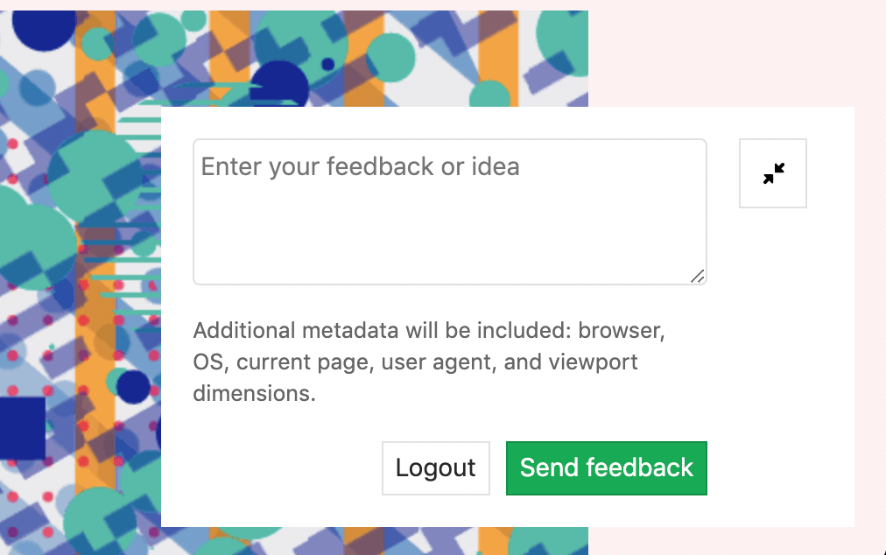

# Review Apps

> - [Introduced](https://gitlab.com/gitlab-org/gitlab-foss/issues/21971) in GitLab 8.12. Further additions were made in GitLab 8.13 and 8.14.
> - Inspired by [Heroku's Review Apps](https://devcenter.heroku.com/articles/github-integration-review-apps), which itself was inspired by [Fourchette](https://github.com/rainforestapp/fourchette).

Review Apps is a collaboration tool that takes the hard work out of providing an environment to showcase product changes.

## Introduction

Review Apps:

- Provide an automatic live preview of changes made in a feature branch by spinning up a dynamic environment for your merge requests.
- Allow designers and product managers to see your changes without needing to check out your branch and run your changes in a sandbox environment.
- Are fully integrated with the [GitLab DevOps LifeCycle](../../README.md#the-entire-devops-lifecycle).
- Allow you to deploy your changes wherever you want.


In the above example:

- A Review App is built every time a commit is pushed to `topic branch`.
- The reviewer fails two reviews before passing the third review.
- Once the review has passed, `topic branch` is merged into `master` where it is deployed to staging.
- After having been approved in staging, the changes that were merged into `master` are deployed in to production.

## How Review Apps work

A Review App is a mapping of a branch with an [environment](../environments.md).
Access to the Review App is made available as a link on the [merge request](../../user/project/merge_requests.md) relevant to the branch.

The following is an example of a merge request with an environment set dynamically.


In this example, a branch was:

- Successfully built.
- Deployed under a dynamic environment that can be reached by clicking on the **View app** button.

After adding Review Apps to your workflow, you follow the branched Git flow. That is:

1. Push a branch and let the Runner deploy the Review App based on the `script` definition of the dynamic environment job.
1. Wait for the Runner to build and deploy your web application.
1. Click on the link provided in the merge request related to the branch to see the changes live.

## Configuring Review Apps

Review Apps are built on [dynamic environments](../environments.md#configuring-dynamic-environments), which allow you to dynamically create a new environment for each branch.

The process of configuring Review Apps is as follows:

1. Set up the infrastructure to host and deploy the Review Apps (check the [examples](#review-apps-examples) below).
1. [Install](https://docs.gitlab.com/runner/install/) and [configure](https://docs.gitlab.com/runner/commands/) a Runner to do deployment.
1. Set up a job in `.gitlab-ci.yml` that uses the [predefined CI environment variable](../variables/README.md) `${CI_COMMIT_REF_NAME}` to create dynamic environments and restrict it to run only on branches.
1. Optionally, set a job that [manually stops](../environments.md#stopping-an-environment) the Review Apps.

## Review Apps examples

The following are example projects that demonstrate Review App configuration:

- [NGINX](https://gitlab.com/gitlab-examples/review-apps-nginx).
- [OpenShift](https://gitlab.com/gitlab-examples/review-apps-openshift).

<i class="fa fa-youtube-play youtube" aria-hidden="true"></i>
See also the video [Demo: Cloud Native Development with GitLab](https://www.youtube.com/watch?v=jfIyQEwrocw), which includes a Review Apps example.

## Route Maps

> Introduced in GitLab 8.17. In GitLab 11.5, the file links are available in the merge request widget.

Route Maps allows you to go directly from source files
to public pages on the [environment](../environments.md) defined for
Review Apps.

Once set up, the review app link in the merge request
widget can take you directly to the pages changed, making it easier
and faster to preview proposed modifications.

Configuring Route Maps involves telling GitLab how the paths of files
in your repository map to paths of pages on your website using a Route Map.
Once set, GitLab will display **View on ...** buttons, which will take you
to the pages changed directly from merge requests.

To set up a route map, add a file inside the repository at `.gitlab/route-map.yml`,
which contains a YAML array that maps `source` paths (in the repository) to `public`
paths (on the website).

### Route Maps example

The following is an example of a route map for [Middleman](https://middlemanapp.com),
a static site generator (SSG) used to build [GitLab's website](https://about.gitlab.com),
deployed from its [project on GitLab.com](https://gitlab.com/gitlab-com/www-gitlab-com):

```yaml
# Team data
- source: 'data/team.yml' # data/team.yml
  public: 'team/' # team/

# Blogposts
- source: /source\/posts\/([0-9]{4})-([0-9]{2})-([0-9]{2})-(.+?)\..*/ # source/posts/2017-01-30-around-the-world-in-6-releases.html.md.erb
  public: '\1/\2/\3/\4/' # 2017/01/30/around-the-world-in-6-releases/

# HTML files
- source: /source\/(.+?\.html).*/ # source/index.html.haml
  public: '\1' # index.html

# Other files
- source: /source\/(.*)/ # source/images/blogimages/around-the-world-in-6-releases-cover.png
  public: '\1' # images/blogimages/around-the-world-in-6-releases-cover.png
```

Mappings are defined as entries in the root YAML array, and are identified by a `-` prefix. Within an entry, there is a hash map with two keys:

- `source`
  - A string, starting and ending with `'`, for an exact match.
  - A regular expression, starting and ending with `/`, for a pattern match:
    - The regular expression needs to match the entire source path - `^` and `$` anchors are implied.
    - Can include capture groups denoted by `()` that can be referred to in the `public` path.
    - Slashes (`/`) can, but don't have to, be escaped as `\/`.
    - Literal periods (`.`) should be escaped as `\.`.
- `public`, a string starting and ending with `'`.
  - Can include `\N` expressions to refer to capture groups in the `source` regular expression in order of their occurrence, starting with `\1`.

The public path for a source path is determined by finding the first
`source` expression that matches it, and returning the corresponding
`public` path, replacing the `\N` expressions with the values of the
`()` capture groups if appropriate.

In the example above, the fact that mappings are evaluated in order
of their definition is used to ensure that `source/index.html.haml`
will match `/source\/(.+?\.html).*/` instead of `/source\/(.*)/`,
and will result in a public path of `index.html`, instead of
`index.html.haml`.

Once you have the route mapping set up, it will take effect in the following locations:

- In the merge request widget. The:
  - **View app** button will take you to the environment URL set in `.gitlab-ci.yml`.
  - Dropdown will list the first 5 matched items from the route map, but you can filter them if more
    than 5 are available.

    

- In the diff for a merge request, comparison, or commit.

  

- In the blob file view.

  

## Visual Reviews **(STARTER)**

> [Introduced](https://gitlab.com/gitlab-org/gitlab/issues/10761) in GitLab Starter 12.0.

With Visual Reviews, you can provide a feedback form to your Review Apps so
that reviewers can post comments directly from the app back to the merge request
that spawned the Review App.

### Configuring Visual Reviews

Ensure that the `anonymous_visual_review_feedback` feature flag is enabled.
Administrators can enable with a Rails console as follows:

```ruby
Feature.enable(:anonymous_visual_review_feedback)
```

The feedback form is served through a script you add to pages in your Review App.
If you have [Developer permissions](../../user/permissions.md) to the project,
you can access it by clicking the **Review** button in the **Pipeline** section
of the merge request.


The provided script should be added to the `<head>` of you application and
consists of some project and merge request specific values. Here's what it
looks like:

```html
<script
  data-project-id='11790219'
  data-merge-request-id='1'
  data-mr-url='https://gitlab.example.com'
  data-project-path='sarah/review-app-tester'
  id='review-app-toolbar-script'
  src='https://gitlab.example.com/assets/webpack/visual_review_toolbar.js'>
</script>
```

Ideally, you should use [environment variables](../variables/predefined_variables.md)
to replace those values at runtime when each review app is created:

- `data-project-id` is the project ID, which can be found by the `CI_PROJECT_ID`
  variable.
- `data-merge-request-id` is the merge request ID, which can be found by the
  `CI_MERGE_REQUEST_IID` variable. `CI_MERGE_REQUEST_IID` is available only if
  [`only: [merge_requests]`](../merge_request_pipelines/index.md)
  is used and the merge request is created.
- `data-mr-url` is the URL of the GitLab instance and will be the same for all
  review apps.
- `data-project-path` is the project's path, which can be found by `CI_PROJECT_PATH`.
- `id` is always `review-app-toolbar-script`, you don't need to change that.
- `src` is the source of the review toolbar script, which resides in the
  respective GitLab instance and will be the same for all review apps.

For example, in a Ruby application, you would need to have this script:

```html
<script
  data-project-id="ENV['CI_PROJECT_ID']"
  data-merge-request-id="ENV['CI_MERGE_REQUEST_IID']"
  data-mr-url='https://gitlab.example.com'
  data-project-path="ENV['CI_PROJECT_PATH']"
  id='review-app-toolbar-script'
  src='https://gitlab.example.com/assets/webpack/visual_review_toolbar.js'>
</script>
```

Then, when your app is deployed via GitLab CI/CD, those variables should get
replaced with their real values.

NOTE: **Note:**
Future enhancements [are planned](https://gitlab.com/gitlab-org/gitlab/issues/11322)
to make this process even easier.

### Determining merge request ID

The visual review tools retrieve the merge request ID from the `data-merge-request-id`
data attribute included in the `script` HTML tag used to add the visual review tools
to your review app.

​After determining the ID for the merge request to link to a visual review app, you
can supply the ID by either:​​

- Hardcoding it in the script tag via the data attribute `data-merge-request-id` of the app.
- Dynamically adding the `data-merge-request-id` value during the build of the app.
- Supplying it manually through the visual review form in the app.

### Using Visual Reviews

After Visual Reviews has been [enabled](#configuring-visual-reviews) for the
Review App, the Visual Reviews feedback form is overlaid on the app's pages at
the bottom-right corner.



To use the feedback form:

1. Make a comment on the visual review. You can make use of all the
   [Markdown annotations](../../user/markdown.md) that are also available in
   merge request comments.
1. Submit your feedback anonymously or add your name.
1. Finally, click **Send feedback**.

After you make and submit a comment in the visual review box, it will appear
automatically in the respective merge request.

## Limitations

Review App limitations are the same as [environments limitations](../environments.md#limitations).
