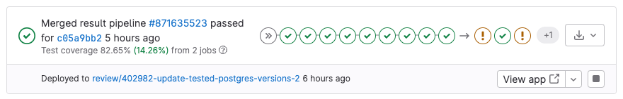

DETAILS:
**Tier:** Free, Premium, Ultimate
**Offering:** GitLab.com, GitLab Self-Managed, GitLab Dedicated

Review apps are a collaboration tool that provide an environment to showcase product changes.

NOTE:
If you have a Kubernetes cluster, you can automate this feature in your applications
by using [Auto DevOps](../../topics/autodevops/_index.md).

Review apps:

- Provide an automatic live preview of changes made in a feature branch by spinning up a dynamic environment for your merge requests.
- Allow designers and product managers to see your changes without needing to check out your branch and run your changes in a sandbox environment.
- Are fully integrated with the [GitLab DevOps LifeCycle](https://about.gitlab.com/stages-devops-lifecycle/).
- Allow you to deploy your changes wherever you want.


In the previous example:

- A review app is built every time a commit is pushed to `topic branch`.
- The reviewer fails two reviews before passing the third review.
- After the review passes, `topic branch` is merged into the default branch, where it's deployed to staging.
- After its approval in staging, the changes that were merged into the default branch are deployed to production.

## How review apps work

A review app is a mapping of a branch with an [environment](../environments/_index.md).
Access to the review app is made available as a link on the [merge request](../../user/project/merge_requests/_index.md) relevant to the branch.

The following is an example of a merge request with an environment set dynamically.



In this example, a branch was:

- Successfully built.
- Deployed under a dynamic environment that can be reached by selecting **View app**.

After adding review apps to your workflow, you follow the branched Git flow. That is:

1. Push a branch and let the runner deploy the review app based on the `script` definition of the dynamic environment job.
1. Wait for the runner to build and deploy your web application.
1. To view the changes live, select the link in the merge request related to the branch.

## Configuring review apps

Review apps are built on [dynamic environments](../environments/_index.md#create-a-dynamic-environment), which allow you to dynamically create a new environment for each branch.

The process of configuring review apps is as follows:

1. Set up the infrastructure to host and deploy the review apps (check the [examples](#review-apps-examples) below).
1. [Install](https://docs.gitlab.com/runner/install/) and [configure](https://docs.gitlab.com/runner/commands/) a runner to do deployment.
1. Set up a job in `.gitlab-ci.yml` that uses the [predefined CI/CD variable](../variables/_index.md) `${CI_COMMIT_REF_SLUG}`
   to create dynamic environments and restrict it to run only on branches.
   Alternatively, you can get a YAML template for this job by [enabling review apps](#enable-review-apps-button) for your project.
1. Optionally, set a job that [manually stops](../environments/_index.md#stopping-an-environment) the review apps.

### Enable review apps button

When configuring review apps for a project, you add a new job to the `.gitlab-ci.yml` file,
as mentioned above. To facilitate this, and if you are using Kubernetes, you can select
**Enable review apps** and GitLab prompts you with a template code block that
you can copy and paste into `.gitlab-ci.yml` as a starting point.

Prerequisites:

- You need at least the Developer role for the project.

To use the review apps template:

1. On the left sidebar, select **Search or go to** and
   find the project you want to create a review app job for.
1. Select **Operate > Environments**.
1. Select **Enable review apps**.
1. Follow the instructions in the dialog.
   You can edit the provided `.gitlab-ci.yml` template as needed.

## Review apps auto-stop

See how to [configure review apps environments to expire and auto-stop](../environments/_index.md#stop-an-environment-after-a-certain-time-period)
after a given period of time.

## Review apps examples

The following are example projects that demonstrate review app configuration:

| Project                                                                 | Configuration file |
|-------------------------------------------------------------------------|--------------------|
| [NGINX](https://gitlab.com/gitlab-examples/review-apps-nginx)           | [`.gitlab-ci.yml`](https://gitlab.com/gitlab-examples/review-apps-nginx/-/blob/b9c1f6a8a7a0dfd9c8784cbf233c0a7b6a28ff27/.gitlab-ci.yml#L20) |
| [OpenShift](https://gitlab.com/gitlab-examples/review-apps-openshift)   | [`.gitlab-ci.yml`](https://gitlab.com/gitlab-examples/review-apps-openshift/-/blob/82ebd572334793deef2d5ddc379f38942f3488be/.gitlab-ci.yml#L42) |
| [HashiCorp Nomad](https://gitlab.com/gitlab-examples/review-apps-nomad) | [`.gitlab-ci.yml`](https://gitlab.com/gitlab-examples/review-apps-nomad/-/blob/ca372c778be7aaed5e82d3be24e98c3f10a465af/.gitlab-ci.yml#L110) |
| [GitLab Documentation](https://gitlab.com/gitlab-org/gitlab-docs/)      | [`build-and-deploy.gitlab-ci.yml`](https://gitlab.com/gitlab-org/gitlab-docs/-/blob/a715625496303cbd90ff89f3d3658ea8d36ce0f3/.gitlab/ci/build-and-deploy.gitlab-ci.yml#L59) |
| [`https://about.gitlab.com/`](https://gitlab.com/gitlab-com/www-gitlab-com/)       | [`.gitlab-ci.yml`](https://gitlab.com/gitlab-com/www-gitlab-com/-/blob/6ffcdc3cb9af2abed490cbe5b7417df3e83cd76c/.gitlab-ci.yml#L332) |
| [GitLab Insights](https://gitlab.com/gitlab-org/gitlab-insights/)       | [`.gitlab-ci.yml`](https://gitlab.com/gitlab-org/gitlab-insights/-/blob/9e63f44ac2a5a4defc965d0d61d411a768e20546/.gitlab-ci.yml#L234) |

Other examples of review apps:

- <i class="fa fa-youtube-play youtube" aria-hidden="true"></i>
  [Cloud Native Development with GitLab](https://www.youtube.com/watch?v=jfIyQEwrocw).
- [Review apps for Android](https://about.gitlab.com/blog/2020/05/06/how-to-create-review-apps-for-android-with-gitlab-fastlane-and-appetize-dot-io/).

## Route Maps

Route Maps allows you to go directly from source files
to public pages on the [environment](../environments/_index.md) defined for
review apps.

Once set up, the review app link in the merge request
widget can take you directly to the pages changed, making it easier
and faster to preview proposed modifications.

Configuring Route Maps involves telling GitLab how the paths of files
in your repository map to paths of pages on your website using a Route Map.
When you configure Route Maps, **View on** buttons are displayed.
Select these buttons to go to the pages changed directly from merge requests.

To set up a route map, add a file inside the repository at `.gitlab/route-map.yml`,
which contains a YAML array that maps `source` paths (in the repository) to `public`
paths (on the website).

### Route Maps example

The following is an example of a route map for [Middleman](https://middlemanapp.com),
a static site generator (SSG) used to build the [GitLab website](https://about.gitlab.com),
deployed from its [project on GitLab.com](https://gitlab.com/gitlab-com/www-gitlab-com):

```yaml
# Team data
- source: 'data/team.yml'  # data/team.yml
  public: 'team/'  # team/

# Blogposts
- source: /source\/posts\/([0-9]{4})-([0-9]{2})-([0-9]{2})-(.+?)\..*/  # source/posts/2017-01-30-around-the-world-in-6-releases.html.md.erb
  public: '\1/\2/\3/\4/'  # 2017/01/30/around-the-world-in-6-releases/

# HTML files
- source: /source\/(.+?\.html).*/  # source/index.html.haml
  public: '\1'  # index.html

# Other files
- source: /source\/(.*)/  # source/images/blogimages/around-the-world-in-6-releases-cover.png
  public: '\1'  # images/blogimages/around-the-world-in-6-releases-cover.png
```

Mappings are defined as entries in the root YAML array, and are identified by a `-` prefix. Within an entry, there is a hash map with two keys:

- `source`
  - A string, starting and ending with `'`, for an exact match.
  - A regular expression, starting and ending with `/`, for a pattern match:
    - The regular expression needs to match the entire source path - `^` and `$` anchors are implied.
    - Can include capture groups denoted by `()` that can be referred to in the `public` path.
    - Slashes (`/`) can, but don't have to, be escaped as `\/`.
    - Literal periods (`.`) should be escaped as `\.`.
- `public`, a string starting and ending with `'`.
  - Can include `\N` expressions to refer to capture groups in the `source` regular expression in order of their occurrence, starting with `\1`.

The public path for a source path is determined by finding the first
`source` expression that matches it, and returning the corresponding
`public` path, replacing the `\N` expressions with the values of the
`()` capture groups if appropriate.

In the example above, the fact that mappings are evaluated in order
of their definition is used to ensure that `source/index.html.haml`
matches `/source\/(.+?\.html).*/` instead of `/source\/(.*)/`,
and results in a public path of `index.html`, instead of
`index.html.haml`.

After you have the route mapping set up, it takes effect in the following locations:

- In the merge request widget:
  - The **View app** button takes you to the environment URL set in the `.gitlab-ci.yml` file.
  - The list shows the first 5 matched items from the route map, but you can filter them if more
    than 5 are available.

    

- In the diff for a comparison or commit, by selecting **View** (**{external-link}**) next to the file.

- In the blob file view, by selecting **View** (**{external-link}**) next to the file.
