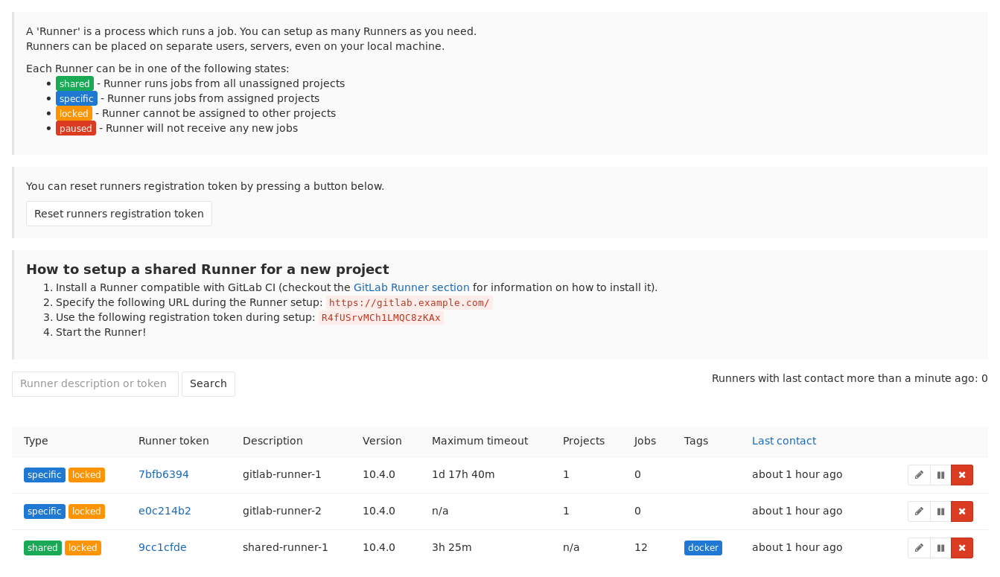
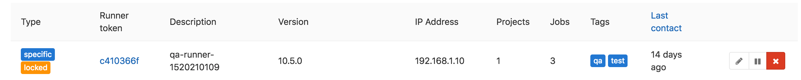
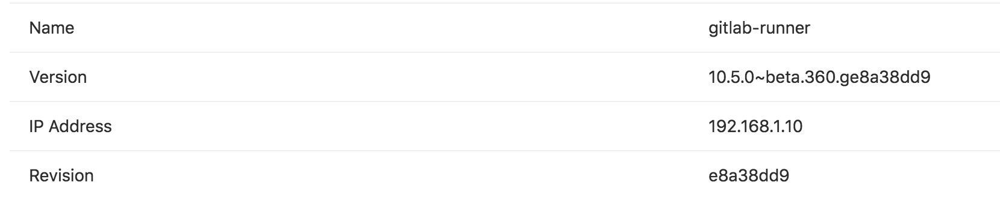

# Configuring GitLab Runners

In GitLab CI, Runners run the code defined in [`.gitlab-ci.yml`](../yaml/README.md).
They are isolated (virtual) machines that pick up jobs through the coordinator
API of GitLab CI.

A Runner can be specific to a certain project or serve any project
in GitLab CI. A Runner that serves all projects is called a shared Runner.

Ideally, the GitLab Runner should not be installed on the same machine as GitLab.
Read the [requirements documentation](../../install/requirements.md#gitlab-runner)
for more information.

## Shared vs specific Runners

After [installing the Runner][install], you can either register it as shared or
specific. You can only register a shared Runner if you have admin access to
the GitLab instance. The main differences between a shared and a specific Runner
are:

- **Shared Runners** are useful for jobs that have similar requirements,
  between multiple projects. Rather than having multiple Runners idling for
  many projects, you can have a single or a small number of Runners that handle
  multiple projects. This makes it easier to maintain and update them.
  Shared Runners process jobs using a [fair usage queue](#how-shared-runners-pick-jobs).
  In contrast to specific Runners that use a FIFO queue, this prevents
  cases where projects create hundreds of jobs which can lead to eating all
  available shared Runners resources.
- **Specific Runners** are useful for jobs that have special requirements or for
  projects with a specific demand. If a job has certain requirements, you can set
  up the specific Runner with this in mind, while not having to do this for all
  Runners. For example, if you want to deploy a certain project, you can setup
  a specific Runner to have the right credentials for this. The [usage of tags](#using-tags)
  may be useful in this case. Specific Runners process jobs using a [FIFO] queue.

A Runner that is specific only runs for the specified project(s). A shared Runner
can run jobs for every project that has enabled the option **Allow shared Runners**
under **Settings ➔ CI/CD**.

Projects with high demand of CI activity can also benefit from using specific
Runners. By having dedicated Runners you are guaranteed that the Runner is not
being held up by another project's jobs.

You can set up a specific Runner to be used by multiple projects. The difference
with a shared Runner is that you have to enable each project explicitly for
the Runner to be able to run its jobs.

Specific Runners do not get shared with forked projects automatically.
A fork does copy the CI settings (jobs, allow shared, etc) of the cloned
repository.

## Registering a shared Runner

You can only register a shared Runner if you are an admin of the GitLab instance.

1. Grab the shared-Runner token on the `admin/runners` page

    

1. [Register the Runner][register]

Shared Runners are enabled by default as of GitLab 8.2, but can be disabled
with the **Disable shared Runners** button which is present under each project's
**Settings ➔ CI/CD** page. Previous versions of GitLab defaulted shared
Runners to disabled.

## Registering a specific Runner

Registering a specific can be done in two ways:

1. Creating a Runner with the project registration token
1. Converting a shared Runner into a specific Runner (one-way, admin only)

### Registering a specific Runner with a project registration token

To create a specific Runner without having admin rights to the GitLab instance,
visit the project you want to make the Runner work for in GitLab:

1. Go to **Settings ➔ CI/CD** to obtain the token
1. [Register the Runner][register]

### Making an existing shared Runner specific

If you are an admin on your GitLab instance, you can turn any shared Runner into
a specific one, but not the other way around. Keep in mind that this is a one
way transition.

1. Go to the Runners in the admin area **Overview ➔ Runners** (`/admin/runners`)
   and find your Runner
1. Enable any projects under **Restrict projects for this Runner** to be used
   with the Runner

From now on, the shared Runner will be specific to those projects.

## Locking a specific Runner from being enabled for other projects

You can configure a Runner to assign it exclusively to a project. When a
Runner is locked this way, it can no longer be enabled for other projects.
This setting can be enabled the first time you [register a Runner][register] and
can be changed afterwards under each Runner's settings.

To lock/unlock a Runner:

1. Visit your project's **Settings ➔ CI/CD**
1. Find the Runner you wish to lock/unlock and make sure it's enabled
1. Click the pencil button
1. Check the **Lock to current projects** option
1. Click **Save changes** for the changes to take effect

## Assigning a Runner to another project

If you are Master on a project where a specific Runner is assigned to, and the
Runner is not [locked only to that project](#locking-a-specific-runner-from-being-enabled-for-other-projects),
you can enable the Runner also on any other project where you have Master permissions.

To enable/disable a Runner in your project:

1. Visit your project's **Settings ➔ CI/CD**
1. Find the Runner you wish to enable/disable
1. Click **Enable for this project** or **Disable for this project**

> **Note**:
Consider that if you don't lock your specific Runner to a specific project, any
user with Master role in you project can assign your runner to another arbitrary
project without requiring your authorization, so use it with caution.

## Protected Runners

>
[Introduced](https://gitlab.com/gitlab-org/gitlab-ce/merge_requests/13194)
in GitLab 10.0.

You can protect Runners from revealing sensitive information.
Whenever a Runner is protected, the Runner picks only jobs created on
[protected branches] or [protected tags], and ignores other jobs.

To protect/unprotect Runners:

1. Visit your project's **Settings ➔ CI/CD**
1. Find a Runner you want to protect/unprotect and make sure it's enabled
1. Click the pencil button besides the Runner name
1. Check the **Protected** option
1. Click **Save changes** for the changes to take effect

## Manually clearing the Runners cache

Read [clearing the cache](../caching/index.md#clearing-the-cache).

## How shared Runners pick jobs

Shared Runners abide to a process queue we call fair usage. The fair usage
algorithm tries to assign jobs to shared Runners from projects that have the
lowest number of jobs currently running on shared Runners.

**Example 1**

We have following jobs in queue:

- Job 1 for Project 1
- Job 2 for Project 1
- Job 3 for Project 1
- Job 4 for Project 2
- Job 5 for Project 2
- Job 6 for Project 3

With the fair usage algorithm jobs are assigned in following order:

1. Job 1 is chosen first, because it has the lowest job number from projects with no running jobs (i.e. all projects)
1. Job 4 is next, because 4 is now the lowest job number from projects with no running jobs (Project 1 has a job running)
1. Job 6 is next, because 6 is now the lowest job number from projects with no running jobs (Projects 1 and 2 have jobs running)
1. Job 2 is next, because, of projects with the lowest number of jobs running (each has 1), it is the lowest job number
1. Job 5 is next, because Project 1 now has 2 jobs running, and between Projects 2 and 3, Job 5 is the lowest remaining job number
1. Lastly we choose Job 3... because it's the only job left

---

**Example 2**

We have following jobs in queue:

- Job 1 for project 1
- Job 2 for project 1
- Job 3 for project 1
- Job 4 for project 2
- Job 5 for project 2
- Job 6 for project 3

With the fair usage algorithm jobs are assigned in following order:

1. Job 1 is chosen first, because it has the lowest job number from projects with no running jobs (i.e. all projects)
1. We finish job 1
1. Job 2 is next, because, having finished Job 1, all projects have 0 jobs running again, and 2 is the lowest available job number
1. Job 4 is next, because with Project 1 running a job, 4 is the lowest number from projects running no jobs (Projects 2 and 3)
1. We finish job 4
1. Job 5 is next, because having finished Job 4, Project 2 has no jobs running again
1. Job 6 is next, because Project 3 is the only project left with no running jobs
1. Lastly we choose Job 3... because, again, it's the only job left (who says 1 is the loneliest number?)

## Using shared Runners effectively

If you are planning to use shared Runners, there are several things you
should keep in mind.

### Using tags

You must setup a Runner to be able to run all the different types of jobs
that it may encounter on the projects it's shared over. This would be
problematic for large amounts of projects, if it wasn't for tags.

By tagging a Runner for the types of jobs it can handle, you can make sure
shared Runners will [only run the jobs they are equipped to run](../yaml/README.md#tags).

For instance, at GitLab we have Runners tagged with "rails" if they contain
the appropriate dependencies to run Rails test suites.

### Preventing Runners with tags from picking jobs without tags

You can configure a Runner to prevent it from picking
[jobs with tags](../yaml/README.md#tags) when the Runner does not have tags
assigned. This setting can be enabled the first
time you [register a Runner][register] and can be changed afterwards under
each Runner's settings.

To make a Runner pick tagged/untagged jobs:

1. Visit your project's **Settings ➔ CI/CD**
1. Find the Runner you wish and make sure it's enabled
1. Click the pencil button
1. Check the **Run untagged jobs** option
1. Click **Save changes** for the changes to take effect

### Setting maximum job timeout for a Runner

For each Runner you can specify a _maximum job timeout_. Such timeout,
if smaller than [project defined timeout], will take the precedence. This
feature can be used to prevent Shared Runner from being appropriated
by a project by setting a ridiculous big timeout (e.g. one week).

When not configured, Runner will not override project timeout.

How this feature will work:

**Example 1 - Runner timeout bigger than project timeout**

1. You set the _maximum job timeout_ for a Runner to 24 hours
1. You set the _CI/CD Timeout_ for a project to **2 hours**
1. You start a job
1. The job, if running longer, will be timeouted after **2 hours**

**Example 2 - Runner timeout not configured**

1. You remove the _maximum job timeout_ configuration from a Runner
1. You set the _CI/CD Timeout_ for a project to **2 hours**
1. You start a job
1. The job, if running longer, will be timeouted after **2 hours**

**Example 3 - Runner timeout smaller than project timeout**

1. You set the _maximum job timeout_ for a Runner to **30 minutes**
1. You set the _CI/CD Timeout_ for a project to 2 hours
1. You start a job
1. The job, if running longer, will be timeouted after **30 minutes**

### Be careful with sensitive information

With some [Runner Executors](https://docs.gitlab.com/runner/executors/README.html),
if you can run a job on the Runner, you can get access to any code it runs
and get the token of the Runner. With shared Runners, this means that anyone
that runs jobs on the Runner, can access anyone else's code that runs on the
Runner.

In addition, because you can get access to the Runner token, it is possible
to create a clone of a Runner and submit false jobs, for example.

The above is easily avoided by restricting the usage of shared Runners
on large public GitLab instances, controlling access to your GitLab instance,
and using more secure [Runner Executors](https://docs.gitlab.com/runner/executors/README.html).

### Forks

Whenever a project is forked, it copies the settings of the jobs that relate
to it. This means that if you have shared Runners setup for a project and
someone forks that project, the shared Runners will also serve jobs of this
project.

## Attack vectors in Runners

Mentioned briefly earlier, but the following things of Runners can be exploited.
We're always looking for contributions that can mitigate these
[Security Considerations](https://docs.gitlab.com/runner/security/).

## Determining the IP address of a Runner

> [Introduced](https://gitlab.com/gitlab-org/gitlab-ce/merge_requests/17286) in GitLab 10.6.

It may be useful to know the IP address of a Runner so you can troubleshoot
issues with that Runner. GitLab stores and displays the IP address by viewing
the source of the HTTP requests it makes to GitLab when polling for jobs. The
IP address is always kept up to date so if the Runner IP changes it will be
automatically updated in GitLab.

The IP address for shared Runners and specific Runners can be found in
different places.

### Shared Runners

To view the IP address of a shared Runner you must have admin access to
the GitLab instance. To determine this:

1. Visit **Admin area ➔ Overview ➔ Runners**
1. Look for the Runner in the table and you should see a column for "IP Address"

### Specific Runners

You can find the IP address of a Runner for a specific project by:

1. Visit your project's **Settings ➔ CI/CD**
1. Find the Runner and click on it's ID which links you to the details page
1. On the details page you should see a row for "IP Address"

[install]: http://docs.gitlab.com/runner/install/
[fifo]: https://en.wikipedia.org/wiki/FIFO_(computing_and_electronics)
[register]: http://docs.gitlab.com/runner/register/
[protected branches]: ../../user/project/protected_branches.md
[protected tags]: ../../user/project/protected_tags.md
[project defined timeout]: ../../user/project/pipelines/settings.html#timeout
