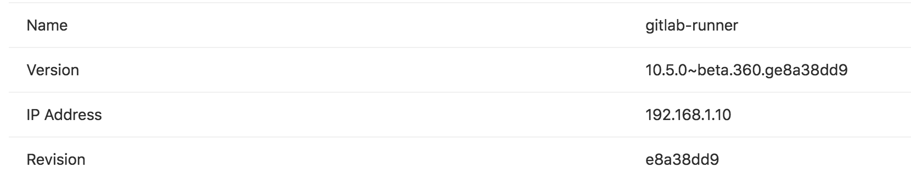

# Configuring runners **(FREE)**

If you have installed your own runners, you can configure and secure them in GitLab.

If you need to configure runners on the machine where you installed GitLab Runner, see
[the GitLab Runner documentation](https://docs.gitlab.com/runner/configuration/).

## Manually clear the runner cache

Read [clearing the cache](../caching/index.md#clearing-the-cache).

## Set maximum job timeout for a runner

For each runner, you can specify a *maximum job timeout*. This timeout,
if smaller than the [project defined timeout](../pipelines/settings.md#set-a-limit-for-how-long-jobs-can-run), takes precedence.

This feature can be used to prevent your shared runner from being overwhelmed
by a project that has jobs with a long timeout (for example, one week).

On GitLab.com, you cannot override the job timeout for shared runners and must use the [project defined timeout](../pipelines/settings.md#set-a-limit-for-how-long-jobs-can-run).

To set the maximum job timeout:

1. In a project, go to **Settings > CI/CD > Runners**.
1. Select your project runner to edit the settings.
1. Enter a value under **Maximum job timeout**. Must be 10 minutes or more. If not
   defined, the [project's job timeout setting](../pipelines/settings.md#set-a-limit-for-how-long-jobs-can-run)
   is used.
1. Select **Save changes**.

How this feature works:

**Example 1 - Runner timeout bigger than project timeout**

1. You set the _maximum job timeout_ for a runner to 24 hours
1. You set the _CI/CD Timeout_ for a project to **2 hours**
1. You start a job
1. The job, if running longer, times out after **2 hours**

**Example 2 - Runner timeout not configured**

1. You remove the _maximum job timeout_ configuration from a runner
1. You set the _CI/CD Timeout_ for a project to **2 hours**
1. You start a job
1. The job, if running longer, times out after **2 hours**

**Example 3 - Runner timeout smaller than project timeout**

1. You set the _maximum job timeout_ for a runner to **30 minutes**
1. You set the _CI/CD Timeout_ for a project to 2 hours
1. You start a job
1. The job, if running longer, times out after **30 minutes**

## Be careful with sensitive information

With some [runner executors](https://docs.gitlab.com/runner/executors/),
if you can run a job on the runner, you can get full access to the file system,
and thus any code it runs as well as the token of the runner. With shared runners, this means that anyone
that runs jobs on the runner, can access another user's code that runs on the
runner.

In addition, because you can get access to the runner token, it is possible
to create a clone of a runner and submit false jobs, for example.

The above is easily avoided by restricting the usage of shared runners
on large public GitLab instances, controlling access to your GitLab instance,
and using more secure [runner executors](https://docs.gitlab.com/runner/executors/).

### Prevent runners from revealing sensitive information

> [Introduced](https://gitlab.com/gitlab-org/gitlab-foss/-/merge_requests/13194) in GitLab 10.0.

You can protect runners so they don't reveal sensitive information.
When a runner is protected, the runner picks jobs created on
[protected branches](../../user/project/protected_branches.md) or [protected tags](../../user/project/protected_tags.md) only,
and ignores other jobs.

To protect or unprotect a runner:

1. Go to the project's **Settings > CI/CD** and expand the **Runners** section.
1. Find the runner you want to protect or unprotect. Make sure it's enabled.
1. Select the pencil button.
1. Check the **Protected** option.
1. Select **Save changes**.


### Forks

Whenever a project is forked, it copies the settings of the jobs that relate
to it. This means that if you have shared runners set up for a project and
someone forks that project, the shared runners serve jobs of this project.

Because of a [known issue](https://gitlab.com/gitlab-org/gitlab/-/issues/364303), you might encounter the message `An error occurred while forking the project. Please try again.` if the runner settings of the project you are forking does not match the new project namespace.

To work around this issue, you should make sure that the shared runner settings are consistent in the forked project and the new namespace.

- If shared runners are **enabled** on the forked project, then this should also be **enabled** on the new namespace.
- If shared runners are **disabled** on the forked project, then this should also be **disabled** on the new namespace.

### Attack vectors in runners

Mentioned briefly earlier, but the following things of runners can be exploited.
We're always looking for contributions that can mitigate these
[Security Considerations](https://docs.gitlab.com/runner/security/).

### Reset the runner registration token for a project

If you think that a registration token for a project was revealed, you should
reset it. A registration token can be used to register another runner for the project.
That new runner may then be used to obtain the values of secret variables or to clone project code.

To reset the registration token:

1. Go to the project's **Settings > CI/CD**.
1. Expand the **General pipelines settings** section.
1. Find the **Runner token** form field and select **Reveal value**.
1. Delete the value and save the form.
1. After the page is refreshed, expand the **Runners settings** section
   and check the registration token - it should be changed.

From now on the old token is no longer valid and does not register
any new runners to the project. If you are using any tools to provision and
register new runners, the tokens used in those tools should be updated to reflect the
value of the new token.

### Reset the runner authentication token

If you think that an authentication token for a runner was revealed, you should
reset it. An attacker could use the token to [clone a runner](https://docs.gitlab.com/runner/security/#cloning-a-runner).

To reset the authentication token, [unregister the runner](https://docs.gitlab.com/runner/commands/#gitlab-runner-unregister)
and then [register](https://docs.gitlab.com/runner/commands/#gitlab-runner-register) it again.

To verify that the previous authentication token has been revoked, use the [Runners API](../../api/runners.md#verify-authentication-for-a-registered-runner).

## Determine the IP address of a runner

> [Introduced](https://gitlab.com/gitlab-org/gitlab-foss/-/merge_requests/17286) in GitLab 10.6.

It may be useful to know the IP address of a runner so you can troubleshoot
issues with that runner. GitLab stores and displays the IP address by viewing
the source of the HTTP requests it makes to GitLab when polling for jobs. The
IP address is always kept up to date so if the runner IP changes it
automatically updates in GitLab.

The IP address for shared runners and project runners can be found in
different places.

### Determine the IP address of a shared runner

Prerequisite:

- You must have administrator access to the instance.

To determine the IP address of a shared runner:

1. On the top bar, select **Main menu > Admin**.
1. On the left sidebar, select **CI/CD > Runners**.
1. Find the runner in the table and view the **IP Address** column.


### Determine the IP address of a project runner

To can find the IP address of a runner for a project project,
you must have the Owner role for the
project.

1. Go to the project's **Settings > CI/CD** and expand the **Runners** section.
1. On the details page you should see a row for **IP Address**.



## Use tags to control which jobs a runner can run

You must set up a runner to be able to run all the different types of jobs
that it may encounter on the projects it's shared over. This would be
problematic for large amounts of projects, if it weren't for tags.

GitLab CI/CD tags are not the same as Git tags. GitLab CI/CD tags are associated with runners.
Git tags are associated with commits.

By tagging a runner for the types of jobs it can handle, you can make sure
shared runners will [only run the jobs they are equipped to run](../yaml/index.md#tags).

For instance, at GitLab we have runners tagged with `rails` if they contain
the appropriate dependencies to run Rails test suites.

### Set a runner to run untagged jobs

When you [register a runner](https://docs.gitlab.com/runner/register/), its default behavior is to **only pick**
[tagged jobs](../yaml/index.md#tags).
To change this, you must have the Owner role for the project.

To make a runner pick untagged jobs:

1. Go to the project's **Settings > CI/CD** and expand the **Runners** section.
1. Find the runner you want to pick untagged jobs and make sure it's enabled.
1. Select the pencil button.
1. Check the **Run untagged jobs** option.
1. Select **Save changes** for the changes to take effect.

NOTE:
The runner tags list cannot be empty when it's not allowed to pick untagged jobs.

Below are some example scenarios of different variations.

### Runner runs only tagged jobs

The following examples illustrate the potential impact of the runner being set
to run only tagged jobs.

Example 1:

1. The runner is configured to run only tagged jobs and has the `docker` tag.
1. A job that has a `hello` tag is executed and stuck.

Example 2:

1. The runner is configured to run only tagged jobs and has the `docker` tag.
1. A job that has a `docker` tag is executed and run.

Example 3:

1. The runner is configured to run only tagged jobs and has the `docker` tag.
1. A job that has no tags defined is executed and stuck.

### Runner is allowed to run untagged jobs

The following examples illustrate the potential impact of the runner being set
to run tagged and untagged jobs.

Example 1:

1. The runner is configured to run untagged jobs and has the `docker` tag.
1. A job that has no tags defined is executed and run.
1. A second job that has a `docker` tag defined is executed and run.

Example 2:

1. The runner is configured to run untagged jobs and has no tags defined.
1. A job that has no tags defined is executed and run.
1. A second job that has a `docker` tag defined is stuck.

### A runner and a job have multiple tags

The selection logic that matches the job and runner is based on the list of `tags`
defined in the job.

The following examples illustrate the impact of a runner and a job having multiple tags. For a runner to be
selected to run a job, it must have all of the tags defined in the job script block.

Example 1:

1. The runner is configured with the tags `[docker, shell, gpu]`.
1. The job has the tags `[docker, shell, gpu]` and is executed and run.

Example 2:

1. The runner is configured with the tags `[docker, shell, gpu]`.
1. The job has the tags `[docker, shell,]` and is executed and run.

Example 3:

1. The runner is configured with the tags `[docker, shell]`.
1. The job has the tags `[docker, shell, gpu]` and is not executed.

### Use tags to run jobs on different platforms

You can use tags to run different jobs on different platforms. For
example, if you have an OS X runner with tag `osx` and a Windows runner with tag
`windows`, you can run a job on each platform:

```yaml
windows job:
  stage: build
  tags:
    - windows
  script:
    - echo Hello, %USERNAME%!

osx job:
  stage: build
  tags:
    - osx
  script:
    - echo "Hello, $USER!"
```

### Use CI/CD variables in tags

> Introduced in [GitLab 14.1](https://gitlab.com/gitlab-org/gitlab/-/issues/35742).

You can use [CI/CD variables](../variables/index.md) with `tags` for dynamic runner selection:

```yaml
variables:
  KUBERNETES_RUNNER: kubernetes

  job:
    tags:
      - docker
      - $KUBERNETES_RUNNER
    script:
      - echo "Hello runner selector feature"
```

## Runner statuses

A runner can have one of the following statuses.

| Status  | Description |
|---------|-------------|
| `online`  | The runner has contacted GitLab within the last 2 hours and is available to run jobs. |
| `offline` | The runner has not contacted GitLab in more than 2 hours and is not available to run jobs. Check the runner to see if you can bring it online. |
| `stale`   | The runner has not contacted GitLab in more than 3 months. If the runner was created more than 3 months ago, but it never contacted the instance, it is also considered **stale**. |
| `never_contacted` | The runner has never contacted GitLab. To make the runner contact GitLab, run `gitlab-runner run`. |

## Configure runner behavior with variables

You can use [CI/CD variables](../variables/index.md) to configure runner Git behavior
globally or for individual jobs:

- [`GIT_STRATEGY`](#git-strategy)
- [`GIT_SUBMODULE_STRATEGY`](#git-submodule-strategy)
- [`GIT_CHECKOUT`](#git-checkout)
- [`GIT_CLEAN_FLAGS`](#git-clean-flags)
- [`GIT_FETCH_EXTRA_FLAGS`](#git-fetch-extra-flags)
- [`GIT_SUBMODULE_UPDATE_FLAGS`](#git-submodule-update-flags)
- [`GIT_SUBMODULE_FORCE_HTTPS`](#rewrite-submodule-urls-to-https)
- [`GIT_DEPTH`](#shallow-cloning) (shallow cloning)
- [`GIT_SUBMODULE_DEPTH`](#git-submodule-depth)
- [`GIT_CLONE_PATH`](#custom-build-directories) (custom build directories)
- [`TRANSFER_METER_FREQUENCY`](#artifact-and-cache-settings) (artifact/cache meter update frequency)
- [`ARTIFACT_COMPRESSION_LEVEL`](#artifact-and-cache-settings) (artifact archiver compression level)
- [`CACHE_COMPRESSION_LEVEL`](#artifact-and-cache-settings) (cache archiver compression level)
- [`CACHE_REQUEST_TIMEOUT`](#artifact-and-cache-settings) (cache request timeout)

You can also use variables to configure how many times a runner
[attempts certain stages of job execution](#job-stages-attempts).

When using the Kubernetes executor, you can use variables to
[override Kubernetes CPU and memory allocations for requests and limits](https://docs.gitlab.com/runner/executors/kubernetes.html#overwriting-container-resources).

### Git strategy

> - Introduced in GitLab 8.9 as an experimental feature.
> - `GIT_STRATEGY=none` requires GitLab Runner v1.7+.

You can set the `GIT_STRATEGY` used to fetch the repository content, either
globally or per-job in the [`variables`](../yaml/index.md#variables) section:

```yaml
variables:
  GIT_STRATEGY: clone
```

There are three possible values: `clone`, `fetch`, and `none`. If left unspecified,
jobs use the [project's pipeline setting](../pipelines/settings.md#choose-the-default-git-strategy).

`clone` is the slowest option. It clones the repository from scratch for every
job, ensuring that the local working copy is always pristine.
If an existing worktree is found, it is removed before cloning.

`fetch` is faster as it re-uses the local working copy (falling back to `clone`
if it does not exist). `git clean` is used to undo any changes made by the last
job, and `git fetch` is used to retrieve commits made after the last job ran.

However, `fetch` does require access to the previous worktree. This works
well when using the `shell` or `docker` executor because these
try to preserve worktrees and try to re-use them by default.

This has limitations when using the [Docker Machine executor](https://docs.gitlab.com/runner/executors/docker_machine.html).

A Git strategy of `none` also re-uses the local working copy, but skips all Git
operations usually done by GitLab. GitLab Runner pre-clone scripts are also skipped,
if present. This strategy could mean you need to add `fetch` and `checkout` commands
to [your `.gitlab-ci.yml` script](../yaml/index.md#script).

It can be used for jobs that operate exclusively on artifacts, like a deployment job.
Git repository data may be present, but it's likely out of date. You should only
rely on files brought into the local working copy from cache or artifacts.

### Git submodule strategy

> Requires GitLab Runner v1.10+.

The `GIT_SUBMODULE_STRATEGY` variable is used to control if / how Git
submodules are included when fetching the code before a build. You can set them
globally or per-job in the [`variables`](../yaml/index.md#variables) section.

There are three possible values: `none`, `normal`, and `recursive`:

- `none` means that submodules are not included when fetching the project
  code. This is the default, which matches the pre-v1.10 behavior.

- `normal` means that only the top-level submodules are included. It's
  equivalent to:

  ```shell
  git submodule sync
  git submodule update --init
  ```

- `recursive` means that all submodules (including submodules of submodules)
  are included. This feature needs Git v1.8.1 and later. When using a
  GitLab Runner with an executor not based on Docker, make sure the Git version
  meets that requirement. It's equivalent to:

  ```shell
  git submodule sync --recursive
  git submodule update --init --recursive
  ```

For this feature to work correctly, the submodules must be configured
(in `.gitmodules`) with either:

- the HTTP(S) URL of a publicly-accessible repository, or
- a relative path to another repository on the same GitLab server. See the
  [Git submodules](../git_submodules.md) documentation.

You can provide additional flags to control advanced behavior using [`GIT_SUBMODULE_UPDATE_FLAGS`](#git-submodule-update-flags).

### Git checkout

> Introduced in GitLab Runner 9.3.

The `GIT_CHECKOUT` variable can be used when the `GIT_STRATEGY` is set to either
`clone` or `fetch` to specify whether a `git checkout` should be run. If not
specified, it defaults to true. You can set them globally or per-job in the
[`variables`](../yaml/index.md#variables) section.

If set to `false`, the runner:

- when doing `fetch` - updates the repository and leaves the working copy on
  the current revision,
- when doing `clone` - clones the repository and leaves the working copy on the
  default branch.

If `GIT_CHECKOUT` is set to `true`, both `clone` and `fetch` work the same way.
The runner checks out the working copy of a revision related
to the CI pipeline:

```yaml
variables:
  GIT_STRATEGY: clone
  GIT_CHECKOUT: "false"
script:
  - git checkout -B master origin/master
  - git merge $CI_COMMIT_SHA
```

### Git clean flags

> Introduced in GitLab Runner 11.10

The `GIT_CLEAN_FLAGS` variable is used to control the default behavior of
`git clean` after checking out the sources. You can set it globally or per-job in the
[`variables`](../yaml/index.md#variables) section.

`GIT_CLEAN_FLAGS` accepts all possible options of the [`git clean`](https://git-scm.com/docs/git-clean)
command.

`git clean` is disabled if `GIT_CHECKOUT: "false"` is specified.

If `GIT_CLEAN_FLAGS` is:

- Not specified, `git clean` flags default to `-ffdx`.
- Given the value `none`, `git clean` is not executed.

For example:

```yaml
variables:
  GIT_CLEAN_FLAGS: -ffdx -e cache/
script:
  - ls -al cache/
```

### Git fetch extra flags

> [Introduced](https://gitlab.com/gitlab-org/gitlab-runner/-/issues/4142) in GitLab Runner 13.1.

Use the `GIT_FETCH_EXTRA_FLAGS` variable to control the behavior of
`git fetch`. You can set it globally or per-job in the [`variables`](../yaml/index.md#variables) section.

`GIT_FETCH_EXTRA_FLAGS` accepts all options of the [`git fetch`](https://git-scm.com/docs/git-fetch) command. However, `GIT_FETCH_EXTRA_FLAGS` flags are appended after the default flags that can't be modified.

The default flags are:

- [`GIT_DEPTH`](#shallow-cloning).
- The list of [refspecs](https://git-scm.com/book/en/v2/Git-Internals-The-Refspec).
- A remote called `origin`.

If `GIT_FETCH_EXTRA_FLAGS` is:

- Not specified, `git fetch` flags default to `--prune --quiet` along with the default flags.
- Given the value `none`, `git fetch` is executed only with the default flags.

For example, the default flags are `--prune --quiet`, so you can make `git fetch` more verbose by overriding this with just `--prune`:

```yaml
variables:
  GIT_FETCH_EXTRA_FLAGS: --prune
script:
  - ls -al cache/
```

The configuration above results in `git fetch` being called this way:

```shell
git fetch origin $REFSPECS --depth 50  --prune
```

Where `$REFSPECS` is a value provided to the runner internally by GitLab.

### Sync or exclude specific submodules from CI jobs

> [Introduced](https://gitlab.com/gitlab-org/gitlab-runner/-/merge_requests/2249) in GitLab Runner 14.0.

Use the `GIT_SUBMODULE_PATHS` variable to control which submodules have to be synced or updated.
You can set it globally or per-job in the [`variables`](../yaml/index.md#variables) section.

The path syntax is the same as [`git submodule`](https://git-scm.com/docs/git-submodule#Documentation/git-submodule.txt-ltpathgt82308203):

- To sync and update specific paths:

   ```yaml
   variables:
      GIT_SUBMODULE_PATHS: submoduleA submoduleB
   ```

- To exclude specific paths:

   ```yaml
   variables:
      GIT_SUBMODULE_PATHS: :(exclude)submoduleA :(exclude)submoduleB
   ```

WARNING:
Git ignores nested paths. To ignore a nested submodule, exclude
the parent submodule and then manually clone it in the job's scripts. For example,
 `git clone <repo> --recurse-submodules=':(exclude)nested-submodule'`. Make sure
to wrap the string in single quotes so the YAML can be parsed successfully.

### Git submodule update flags

> [Introduced](https://gitlab.com/gitlab-org/gitlab-runner/-/merge_requests/3192) in GitLab Runner 14.8.

Use the `GIT_SUBMODULE_UPDATE_FLAGS` variable to control the behavior of `git submodule update`
when [`GIT_SUBMODULE_STRATEGY`](#git-submodule-strategy) is set to either `normal` or `recursive`.
You can set it globally or per-job in the [`variables`](../yaml/index.md#variables) section.

`GIT_SUBMODULE_UPDATE_FLAGS` accepts all options of the
[`git submodule update`](https://git-scm.com/docs/git-submodule#Documentation/git-submodule.txt-update--init--remote-N--no-fetch--no-recommend-shallow-f--force--checkout--rebase--merge--referenceltrepositorygt--depthltdepthgt--recursive--jobsltngt--no-single-branch--ltpathgt82308203)
subcommand. However, `GIT_SUBMODULE_UPDATE_FLAGS` flags are appended after a few default flags:

- `--init`, if [`GIT_SUBMODULE_STRATEGY`](#git-submodule-strategy) was set to `normal` or `recursive`.
- `--recursive`, if [`GIT_SUBMODULE_STRATEGY`](#git-submodule-strategy) was set to `recursive`.
- [`GIT_DEPTH`](#shallow-cloning). See the default value below.

Git honors the last occurrence of a flag in the list of arguments, so manually
providing them in `GIT_SUBMODULE_UPDATE_FLAGS` overrides these default flags.

You can use this variable to fetch the latest remote `HEAD` instead of the commit tracked,
in the repository, or to speed up the checkout by fetching submodules in multiple parallel jobs:

```yaml
variables:
  GIT_SUBMODULE_STRATEGY: recursive
  GIT_SUBMODULE_UPDATE_FLAGS: --remote --jobs 4
script:
  - ls -al .git/modules/
```

The configuration above results in `git submodule update` being called this way:

```shell
git submodule update --init --depth 50 --recursive --remote --jobs 4
```

WARNING:
You should be aware of the implications for the security, stability, and reproducibility of
your builds when using the `--remote` flag. In most cases, it is better to explicitly track
submodule commits as designed, and update them using an auto-remediation/dependency bot.

### Rewrite submodule URLs to HTTPS

> [Introduced](https://gitlab.com/gitlab-org/gitlab-runner/-/merge_requests/3198) in GitLab Runner 15.11.

Use the `GIT_SUBMODULE_FORCE_HTTPS` variable to force a rewrite of all Git and SSH submodule URLs to HTTPS.
This allows you to clone submodules on the same GitLab instance that use absolute URLs, even if they were
configured with a Git or SSH protocol.

```yaml
variables:
  GIT_SUBMODULE_STRATEGY: recursive
  GIT_SUBMODULE_FORCE_HTTPS: "true"
```

When enabled, GitLab Runner uses a [CI/CD job token](../jobs/ci_job_token.md) to clone the submodules with
the permissions of the user executing the job, and does not require SSH credentials.

### Shallow cloning

> Introduced in GitLab 8.9 as an experimental feature.

You can specify the depth of fetching and cloning using `GIT_DEPTH`.
`GIT_DEPTH` does a shallow clone of the repository and can significantly speed up cloning.
It can be helpful for repositories with a large number of commits or old, large binaries. The value is
passed to `git fetch` and `git clone`.

In GitLab 12.0 and later, newly-created projects automatically have a
[default `git depth` value of `50`](../pipelines/settings.md#limit-the-number-of-changes-fetched-during-clone).

If you use a depth of `1` and have a queue of jobs or retry
jobs, jobs may fail.

Git fetching and cloning is based on a ref, such as a branch name, so runners
can't clone a specific commit SHA. If multiple jobs are in the queue, or
you're retrying an old job, the commit to be tested must be within the
Git history that is cloned. Setting too small a value for `GIT_DEPTH` can make
it impossible to run these old commits and `unresolved reference` is displayed in
job logs. You should then reconsider changing `GIT_DEPTH` to a higher value.

Jobs that rely on `git describe` may not work correctly when `GIT_DEPTH` is
set since only part of the Git history is present.

To fetch or clone only the last 3 commits:

```yaml
variables:
  GIT_DEPTH: "3"
```

You can set it globally or per-job in the [`variables`](../yaml/index.md#variables) section.

### Git submodule depth

> [Introduced](https://gitlab.com/gitlab-org/gitlab-runner/-/merge_requests/3651) in GitLab Runner 15.5.

Use the `GIT_SUBMODULE_DEPTH` variable to specify the depth of fetching and cloning submodules
when [`GIT_SUBMODULE_STRATEGY`](#git-submodule-strategy) is set to either `normal` or `recursive`.
You can set it globally or for a specific job in the [`variables`](../yaml/index.md#variables) section.

When you set the `GIT_SUBMODULE_DEPTH` variable, it overwrites the [`GIT_DEPTH`](#shallow-cloning) setting
for the submodules only.

To fetch or clone only the last 3 commits:

```yaml
variables:
  GIT_SUBMODULE_DEPTH: 3
```

### Custom build directories

> [Introduced](https://gitlab.com/gitlab-org/gitlab-runner/-/issues/2211) in GitLab Runner 11.10.

By default, GitLab Runner clones the repository in a unique subpath of the
`$CI_BUILDS_DIR` directory. However, your project might require the code in a
specific directory (Go projects, for example). In that case, you can specify
the `GIT_CLONE_PATH` variable to tell the runner the directory to clone the
repository in:

```yaml
variables:
  GIT_CLONE_PATH: $CI_BUILDS_DIR/project-name

test:
  script:
    - pwd
```

The `GIT_CLONE_PATH` must always be within `$CI_BUILDS_DIR`. The directory set in `$CI_BUILDS_DIR`
is dependent on executor and configuration of [runners.builds_dir](https://docs.gitlab.com/runner/configuration/advanced-configuration.html#the-runners-section)
setting.

This can only be used when `custom_build_dir` is enabled in the
[runner's configuration](https://docs.gitlab.com/runner/configuration/advanced-configuration.html#the-runnerscustom_build_dir-section).

#### Handling concurrency

An executor that uses a concurrency greater than `1` might lead
to failures. Multiple jobs might be working on the same directory if the `builds_dir`
is shared between jobs.

The runner does not try to prevent this situation. It's up to the administrator
and developers to comply with the requirements of runner configuration.

To avoid this scenario, you can use a unique path within `$CI_BUILDS_DIR`, because runner
exposes two additional variables that provide a unique `ID` of concurrency:

- `$CI_CONCURRENT_ID`: Unique ID for all jobs running within the given executor.
- `$CI_CONCURRENT_PROJECT_ID`: Unique ID for all jobs running within the given executor and project.

The most stable configuration that should work well in any scenario and on any executor
is to use `$CI_CONCURRENT_ID` in the `GIT_CLONE_PATH`. For example:

```yaml
variables:
  GIT_CLONE_PATH: $CI_BUILDS_DIR/$CI_CONCURRENT_ID/project-name

test:
  script:
    - pwd -P
```

The `$CI_CONCURRENT_PROJECT_ID` should be used in conjunction with `$CI_PROJECT_PATH`
as the `$CI_PROJECT_PATH` provides a path of a repository. That is, `group/subgroup/project`. For example:

```yaml
variables:
  GIT_CLONE_PATH: $CI_BUILDS_DIR/$CI_CONCURRENT_ID/$CI_PROJECT_PATH

test:
  script:
    - pwd -P
```

#### Nested paths

The value of `GIT_CLONE_PATH` is expanded once and nesting variables
within is not supported.

For example, you define both the variables below in your
`.gitlab-ci.yml` file:

```yaml
variables:
  GOPATH: $CI_BUILDS_DIR/go
  GIT_CLONE_PATH: $GOPATH/src/namespace/project
```

The value of `GIT_CLONE_PATH` is expanded once into
`$CI_BUILDS_DIR/go/src/namespace/project`, and results in failure
because `$CI_BUILDS_DIR` is not expanded.

### Job stages attempts

> Introduced in GitLab, it requires GitLab Runner v1.9+.

You can set the number of attempts that the running job tries to execute
the following stages:

| Variable                        | Description                                            |
|---------------------------------|--------------------------------------------------------|
| `ARTIFACT_DOWNLOAD_ATTEMPTS`    | Number of attempts to download artifacts running a job |
| `EXECUTOR_JOB_SECTION_ATTEMPTS` | In [GitLab 12.10 and later](https://gitlab.com/gitlab-org/gitlab-runner/-/issues/4450), the number of attempts to run a section in a job after a [`No Such Container`](https://gitlab.com/gitlab-org/gitlab-runner/-/issues/4450) error ([Docker executor](https://docs.gitlab.com/runner/executors/docker.html) only). |
| `GET_SOURCES_ATTEMPTS`          | Number of attempts to fetch sources running a job      |
| `RESTORE_CACHE_ATTEMPTS`        | Number of attempts to restore the cache running a job  |

The default is one single attempt.

Example:

```yaml
variables:
  GET_SOURCES_ATTEMPTS: 3
```

You can set them globally or per-job in the [`variables`](../yaml/index.md#variables) section.

## System calls not available on GitLab.com shared runners

GitLab.com shared runners run on CoreOS. This means that you cannot use some system calls, like `getlogin`, from the C standard library.

## Artifact and cache settings

> Introduced in GitLab Runner 13.9.

Artifact and cache settings control the compression ratio of artifacts and caches.
Use these settings to specify the size of the archive produced by a job.

- On a slow network, uploads might be faster for smaller archives.
- On a fast network where bandwidth and storage are not a concern, uploads might be faster using the fastest compression ratio, despite the archive produced being larger.

For [GitLab Pages](../../user/project/pages/index.md) to serve
[HTTP Range requests](https://developer.mozilla.org/en-US/docs/Web/HTTP/Range_requests), artifacts
should use the `ARTIFACT_COMPRESSION_LEVEL: fastest` setting, as only uncompressed zip archives
support this feature.

A meter can be enabled to provide the rate of transfer for uploads and downloads.

You can set a maximum time for cache upload and download with the `CACHE_REQUEST_TIMEOUT` setting.
This setting can be useful when slow cache uploads substantially increase the duration of your job.

```yaml
variables:
  # output upload and download progress every 2 seconds
  TRANSFER_METER_FREQUENCY: "2s"

  # Use fast compression for artifacts, resulting in larger archives
  ARTIFACT_COMPRESSION_LEVEL: "fast"

  # Use no compression for caches
  CACHE_COMPRESSION_LEVEL: "fastest"

  # Set maximum duration of cache upload and download
  CACHE_REQUEST_TIMEOUT: 5
```

| Variable                        | Description                                            |
|---------------------------------|--------------------------------------------------------|
| `TRANSFER_METER_FREQUENCY`      | Specify how often to print the meter's transfer rate. It can be set to a duration (for example, `1s` or `1m30s`). A duration of `0` disables the meter (default). When a value is set, the pipeline shows a progress meter for artifact and cache uploads and downloads. |
| `ARTIFACT_COMPRESSION_LEVEL`    | To adjust compression ratio, set to `fastest`, `fast`, `default`, `slow`, or `slowest`. This setting works with the Fastzip archiver only, so the GitLab Runner feature flag [`FF_USE_FASTZIP`](https://docs.gitlab.com/runner/configuration/feature-flags.html#available-feature-flags) must also be enabled. |
| `CACHE_COMPRESSION_LEVEL`       | To adjust compression ratio, set to `fastest`, `fast`, `default`, `slow`, or `slowest`. This setting works with the Fastzip archiver only, so the GitLab Runner feature flag [`FF_USE_FASTZIP`](https://docs.gitlab.com/runner/configuration/feature-flags.html#available-feature-flags) must also be enabled. |
| `CACHE_REQUEST_TIMEOUT`         | Configure the maximum duration of cache upload and download operations for a single job in minutes. Default is `10` minutes. |

## Artifact attestation

> [Introduced](https://gitlab.com/gitlab-org/gitlab-runner/-/issues/28940) in GitLab Runner 15.1.

NOTE:
Zip archives are the only supported artifact type. Follow [the issue for details](https://gitlab.com/gitlab-org/gitlab/-/issues/367203).

GitLab Runner can generate and produce attestation metadata for all build artifacts. To enable this feature, you must set the `RUNNER_GENERATE_ARTIFACTS_METADATA` environment variable to `true`. This variable can either be set globally or it can be set for individual jobs. The metadata is in rendered in a plain text `.json` file that's stored with the artifact. The filename is as follows: `{ARTIFACT_NAME}-metadata.json` where `ARTIFACT_NAME` is what was defined as the [name for the artifact](../jobs/job_artifacts.md#with-a-dynamically-defined-name) in the CI file. The filename, however, defaults to `artifacts-metadata.json` if no name was given to the build artifacts.

### Attestation format

The attestation metadata is generated in the [in-toto attestation format](https://github.com/in-toto/attestation) for spec version [v0.1](https://github.com/in-toto/attestation/tree/v0.1.0/spec). The following fields are populated by default:

| Field  | Value  |
| ------ | ------ |
| `_type` | `https://in-toto.io/Statement/v0.1` |
| `subject.name` | The filename of the artifact. |
| `subject.digest.sha256` | The artifact's `sha256` checksum. |
| `predicateType` | `https://slsa.dev/provenance/v0.2` |
| `predicate.buildType` | `https://gitlab.com/gitlab-org/gitlab-runner/-/blob/{GITLAB_RUNNER_VERSION}/PROVENANCE.md`. For example v15.0.0 |
| `predicate.builder.id` | A URI pointing to the runner details page, for example `https://gitlab.com/gitlab-com/www-gitlab-com/-/runners/3785264`. |
| `predicate.invocation.configSource.uri` | ``https://gitlab.example.com/.../{PROJECT_NAME}`` |
| `predicate.invocation.configSource.digest.sha256` | The repository's `sha256` checksum. |
| `predicate.invocation.configSource.entryPoint` | The name of the CI job that triggered the build. |
| `predicate.invocation.environment.name` | The name of the runner. |
| `predicate.invocation.environment.executor` | The runner executor. |
| `predicate.invocation.environment.architecture` | The architecture on which the CI job is run. |
| `predicate.invocation.parameters` | The names of any CI/CD or environment variables that were present when the build command was run. The value is always represented as an empty string to avoid leaking any secrets. |
| `metadata.buildStartedOn` | The time when the build was started. `RFC3339` formatted. |
| `metadata.buildEndedOn` | The time when the build ended. Since metadata generation happens during the build this moment in time is slightly earlier than the one reported in GitLab. `RFC3339` formatted. |
| `metadata.reproducible` | Whether the build is reproducible by gathering all the generated metadata. Always `false`. |
| `metadata.completeness.parameters` | Whether the parameters are supplied. Always `true`. |
| `metadata.completeness.environment` | Whether the builder's environment is reported. Always `true`. |
| `metadata.completeness.materials` | Whether the build materials are reported. Always `false`. |

An example of an attestation that the GitLab Runner might generate is as follows:

```yaml
{
    "_type": "https://gitlab.com/gitlab-org/gitlab-runner/-/blob/v15.1.0/PROVENANCE.md",
    "subject": [
        {
            "name": "script.sh",
            "digest": {
                "sha256": "f5ae5ced234922eebe6461d32228ba8ab9c3d0c0f3983a3bef707e6e1a1ab52a"
            }
        }
    ],
    "predicateType": "https://slsa.dev/provenance/v0.2",
    "predicate": {
        "buildType": "https://gitlab.com/gitlab-org/gitlab-runner/-/blob/v15.1.0/PROVENANCE.md",
        "builder": {
            "id": "https://gitlab.com/ggeorgiev_gitlab/playground/-/runners/14811533"
        },
        "invocation": {
            "configSource": {
                "uri": "https://gitlab.com/ggeorgiev_gitlab/playground",
                "digest": {
                    "sha256": "f0582e2c9a16b5cc2cde90e8be8f1b50fd67c631"
                },
                "entryPoint": "whoami shell"
            },
            "environment": {
                "name": "local",
                "executor": "shell",
                "architecture": "amd64"
            },
            "parameters": {
                "CI_PIPELINE_ID": "",
                "CI_PIPELINE_URL": "",
                // All other CI variable names are listed here. Values are always represented as empty strings to avoid leaking secrets.
            }
        },
        "metadata": {
            "buildStartedOn": "2022-06-17T00:47:27+03:00",
            "buildFinishedOn": "2022-06-17T00:47:28+03:00",
            "completeness": {
                "parameters": true,
                "environment": true,
                "materials": false
            },
            "reproducible": false
        },
        "materials": []
    }
}
```

### Staging directory

> [Introduced](https://gitlab.com/gitlab-org/gitlab-runner/-/merge_requests/3403) in GitLab Runner 15.0.

If you do not want to archive cache and artifacts in the system's default temporary directory, you can specify a different directory.

You might need to change the directory if your system's default temporary path has constraints.
If you use a fast disk for the directory location, it can also improve performance.

To change the directory, set `ARCHIVER_STAGING_DIR` as a variable in your CI job, or use a runner variable when you register the runner (`gitlab register --env ARCHIVER_STAGING_DIR=<dir>`).

The directory you specify is used as the location for downloading artifacts prior to extraction. If the `fastzip` archiver is
used, this location is also used as scratch space when archiving.

### Configure `fastzip` to improve performance

> [Introduced](https://gitlab.com/gitlab-org/gitlab-runner/-/merge_requests/3130) in GitLab Runner 15.0.

To tune `fastzip`, ensure the [`FF_USE_FASTZIP`](https://docs.gitlab.com/runner/configuration/feature-flags.html#available-feature-flags) flag is enabled.
Then use any of the following environment variables.

| Variable                        | Description                                            |
|---------------------------------|--------------------------------------------------------|
| `FASTZIP_ARCHIVER_CONCURRENCY`  | The number of files to be concurrently compressed. Default is the number of CPUs available. |
| `FASTZIP_ARCHIVER_BUFFER_SIZE`  | The buffer size allocated per concurrency for each file. Data exceeding this number moves to scratch space. Default is 2 MiB.  |
| `FASTZIP_EXTRACTOR_CONCURRENCY` | The number of files to be concurrency decompressed. Default is the number of CPUs available. |

Files in a zip archive are appended sequentially. This makes concurrent compression challenging. `fastzip` works around
this limitation by compressing files concurrently to disk first, and then copying the result back to zip archive
sequentially.

To avoid writing to disk and reading the contents back for smaller files, a small buffer per concurrency is used. This setting
can be controlled with `FASTZIP_ARCHIVER_BUFFER_SIZE`. The default size for this buffer is 2 MiB, therefore, a
concurrency of 16 allocates 32 MiB. Data that exceeds the buffer size is written to and read back from disk.
Therefore, using no buffer, `FASTZIP_ARCHIVER_BUFFER_SIZE: 0`, and only scratch space is a valid option.

`FASTZIP_ARCHIVER_CONCURRENCY` controls how many files are compressed concurrency. As mentioned above, this setting
therefore can increase how much memory is being used, but also how much temporary data is written to the scratch space.
The default is the number of CPUs available, but given the memory ramifications, this may not always be the best
setting.

`FASTZIP_EXTRACTOR_CONCURRENCY` controls how many files are decompressed at once. Files from a zip archive can natively
be read from concurrency, so no additional memory is allocated in addition to what the decompressor requires. This
defaults to the number of CPUs available.

## Clean up stale runners **(ULTIMATE)**

> [Introduced](https://gitlab.com/gitlab-org/gitlab/-/issues/363012) in GitLab 15.1.

You can clean up group runners that have been inactive for more than three months.

Group runners are those that were created at the group level.

1. On the top bar, select **Main menu > Groups** and find your group.
1. On the left sidebar, select **Settings > CI/CD**.
1. Expand **Runners**.
1. Turn on the **Enable stale runner cleanup** toggle.

### View stale runner cleanup logs

You can check the [Sidekiq logs](../../administration/logs/index.md#sidekiq-logs) to see the cleanup result. In Kibana you can use the following query:

```json
{
  "query": {
    "match_phrase": {
      "json.class.keyword": "Ci::Runners::StaleGroupRunnersPruneCronWorker"
    }
  }
}
```

Filter entries where stale runners were removed:

```json
{
  "query": {
    "range": {
      "json.extra.ci_runners_stale_group_runners_prune_cron_worker.total_pruned": {
        "gte": 1,
        "lt": null
      }
    }
  }
}
```

## Determine which runners need to be upgraded **(ULTIMATE)**

> [Introduced](https://gitlab.com/gitlab-org/gitlab/-/issues/365078) in GitLab 15.3.

The version of GitLab Runner used by your runners should be
[kept up-to-date](https://docs.gitlab.com/runner/index.html#gitlab-runner-versions).

To determine which runners need to be upgraded:

1. View the list of runners:
   - For a group, on the top bar, select **Main menu > Groups**, find your group, and on the left sidebar select **CI/CD > Runners**.
   - For the instance, select **Main menu > Admin** and on the left sidebar, select **Runners**.

1. Above the list of runners, view the status:
   - **Outdated - recommended**: The runner does not have the latest `PATCH` version, which may make it vulnerable
     to security or high severity bugs. Or, the runner is one or more `MAJOR` versions behind your GitLab instance, so some features may not be available or work properly.
   - **Outdated - available**: Newer versions are available but upgrading is not critical.

1. Filter the list by status to view which individual runners need to be upgraded.

## View statistics for runner performance **(ULTIMATE)**

> [Introduced](https://gitlab.com/gitlab-org/gitlab/-/issues/377963) in GitLab 15.8.

As an administrator, you can view runner statistics to learn about the performance of your runner fleet.

1. Select **Main menu > Admin**.
1. On the left sidebar, select **CI/CD > Runners**.
1. Select **View metrics**.

The **Median job queued time** value is calculated by sampling the queue duration of the
most recent 100 jobs that were run by Instance runners. Jobs from only the latest 5000
runners are considered.

The median is a value that falls into the 50th percentile: half of the jobs
queued for longer than the median value, and half of the jobs queued for less than the
median value.

## Authentication token security

> - [Introduced](https://gitlab.com/gitlab-org/gitlab/-/issues/30942) in GitLab 15.3 [with a flag](../../administration/feature_flags.md) named `enforce_runner_token_expires_at`. Disabled by default.
> - [Generally available](https://gitlab.com/gitlab-org/gitlab/-/issues/377902) in GitLab 15.5. Feature flag `enforce_runner_token_expires_at` removed.

Each runner has an [authentication token](../../api/runners.md#registration-and-authentication-tokens)
to connect with the GitLab instance.

To help prevent the token from being compromised, you can have the
token rotate automatically at specified intervals. When the tokens are rotated,
they are updated for each runner, regardless of the runner's status (`online` or `offline`).

No manual intervention should be required, and no running jobs should be affected.

If you need to manually update the authentication token, you can run a
command to [reset the token](https://docs.gitlab.com/runner/commands/#gitlab-runner-reset-token).

### Automatically rotate authentication tokens

You can specify an interval for authentication tokens to rotate.
This rotation helps ensure the security of the tokens assigned to your runners.

Prerequisites:

- Ensure your runners are using [GitLab Runner 15.3 or later](https://docs.gitlab.com/runner/#gitlab-runner-versions).

To automatically rotate runner authentication tokens:

1. On the top bar, select **Main menu > Admin**.
1. On the left sidebar, select **Settings > CI/CD**.
1. Expand **Continuous Integration and Deployment**
1. Set a **Runners expiration** time for runners, leave empty for no expiration.
1. Select **Save**.

Before the interval expires, runners automatically request a new authentication token.
