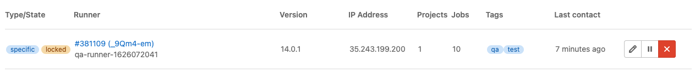

# Configuring runners

If you have installed your own runners, you can configure and secure them in GitLab.

If you need to configure runners on the machine where you installed GitLab Runner, see
[the GitLab Runner documentation](https://docs.gitlab.com/runner/configuration/).

## Manually clear the runner cache

Read [clearing the cache](../caching/index.md#clearing-the-cache).

## Set maximum job timeout for a runner

For each runner, you can specify a *maximum job timeout*. This timeout,
if smaller than the [project defined timeout](../pipelines/settings.md#set-a-limit-for-how-long-jobs-can-run), takes precedence.

This feature can be used to prevent your shared runner from being overwhelmed
by a project that has jobs with a long timeout (for example, one week).

When not configured, runners do not override the project timeout.

On GitLab.com, you cannot override the job timeout for shared runners and must use the [project defined timeout](../pipelines/settings.md#set-a-limit-for-how-long-jobs-can-run).

To set the maximum job timeout:

1. In a project, go to **Settings > CI/CD > Runners**.
1. Select your specific runner to edit the settings.
1. Enter a value under **Maximum job timeout**.
1. Select **Save changes**.

How this feature works:

**Example 1 - Runner timeout bigger than project timeout**

1. You set the _maximum job timeout_ for a runner to 24 hours
1. You set the _CI/CD Timeout_ for a project to **2 hours**
1. You start a job
1. The job, if running longer, times out after **2 hours**

**Example 2 - Runner timeout not configured**

1. You remove the _maximum job timeout_ configuration from a runner
1. You set the _CI/CD Timeout_ for a project to **2 hours**
1. You start a job
1. The job, if running longer, times out after **2 hours**

**Example 3 - Runner timeout smaller than project timeout**

1. You set the _maximum job timeout_ for a runner to **30 minutes**
1. You set the _CI/CD Timeout_ for a project to 2 hours
1. You start a job
1. The job, if running longer, times out after **30 minutes**

## Be careful with sensitive information

With some [runner executors](https://docs.gitlab.com/runner/executors/README.html),
if you can run a job on the runner, you can get full access to the file system,
and thus any code it runs as well as the token of the runner. With shared runners, this means that anyone
that runs jobs on the runner, can access anyone else's code that runs on the
runner.

In addition, because you can get access to the runner token, it is possible
to create a clone of a runner and submit false jobs, for example.

The above is easily avoided by restricting the usage of shared runners
on large public GitLab instances, controlling access to your GitLab instance,
and using more secure [runner executors](https://docs.gitlab.com/runner/executors/README.html).

### Prevent runners from revealing sensitive information

> [Introduced](https://gitlab.com/gitlab-org/gitlab-foss/-/merge_requests/13194) in GitLab 10.0.

You can protect runners so they don't reveal sensitive information.
When a runner is protected, the runner picks jobs created on
[protected branches](../../user/project/protected_branches.md) or [protected tags](../../user/project/protected_tags.md) only,
and ignores other jobs.

To protect or unprotect a runner:

1. Go to the project's **Settings > CI/CD** and expand the **Runners** section.
1. Find the runner you want to protect or unprotect. Make sure it's enabled.
1. Click the pencil button.
1. Check the **Protected** option.
1. Click **Save changes**.


### Forks

Whenever a project is forked, it copies the settings of the jobs that relate
to it. This means that if you have shared runners set up for a project and
someone forks that project, the shared runners serve jobs of this project.

### Attack vectors in runners

Mentioned briefly earlier, but the following things of runners can be exploited.
We're always looking for contributions that can mitigate these
[Security Considerations](https://docs.gitlab.com/runner/security/).

### Reset the runner registration token for a project

If you think that a registration token for a project was revealed, you should
reset it. A token can be used to register another runner for the project. That new runner
may then be used to obtain the values of secret variables or to clone project code.

To reset the token:

1. Go to the project's **Settings > CI/CD**.
1. Expand the **General pipelines settings** section.
1. Find the **Runner token** form field and click the **Reveal value** button.
1. Delete the value and save the form.
1. After the page is refreshed, expand the **Runners settings** section
   and check the registration token - it should be changed.

From now on the old token is no longer valid and does not register
any new runners to the project. If you are using any tools to provision and
register new runners, the tokens used in those tools should be updated to reflect the
value of the new token.

## Determine the IP address of a runner

> [Introduced](https://gitlab.com/gitlab-org/gitlab-foss/-/merge_requests/17286) in GitLab 10.6.

It may be useful to know the IP address of a runner so you can troubleshoot
issues with that runner. GitLab stores and displays the IP address by viewing
the source of the HTTP requests it makes to GitLab when polling for jobs. The
IP address is always kept up to date so if the runner IP changes it
automatically updates in GitLab.

The IP address for shared runners and specific runners can be found in
different places.

### Determine the IP address of a shared runner

To view the IP address of a shared runner you must have admin access to
the GitLab instance. To determine this:

1. On the top bar, select **Menu >** **{admin}** **Admin**.
1. On the left sidebar, select **Overview > Runners**.
1. Find the runner in the table and view the **IP Address** column.



### Determine the IP address of a specific runner

To can find the IP address of a runner for a specific project,
you must have the [Owner role](../../user/permissions.md#project-members-permissions) for the
project.

1. Go to the project's **Settings > CI/CD** and expand the **Runners** section.
1. On the details page you should see a row for **IP Address**.


## Use tags to limit the number of jobs using the runner

You must set up a runner to be able to run all the different types of jobs
that it may encounter on the projects it's shared over. This would be
problematic for large amounts of projects, if it weren't for tags.

GitLab CI tags are not the same as Git tags. GitLab CI tags are associated with runners.
Git tags are associated with commits.

By tagging a runner for the types of jobs it can handle, you can make sure
shared runners will [only run the jobs they are equipped to run](../yaml/index.md#tags).

For instance, at GitLab we have runners tagged with `rails` if they contain
the appropriate dependencies to run Rails test suites.

When you [register a runner](https://docs.gitlab.com/runner/register/), its default behavior is to **only pick**
[tagged jobs](../yaml/index.md#tags).
To change this, you must have the [Owner role](../../user/permissions.md#project-members-permissions) for the project.

To make a runner pick untagged jobs:

1. Go to the project's **Settings > CI/CD** and expand the **Runners** section.
1. Find the runner you want to pick untagged jobs and make sure it's enabled.
1. Click the pencil button.
1. Check the **Run untagged jobs** option.
1. Click the **Save changes** button for the changes to take effect.

NOTE:
The runner tags list can not be empty when it's not allowed to pick untagged jobs.

Below are some example scenarios of different variations.

### runner runs only tagged jobs

The following examples illustrate the potential impact of the runner being set
to run only tagged jobs.

Example 1:

1. The runner is configured to run only tagged jobs and has the `docker` tag.
1. A job that has a `hello` tag is executed and stuck.

Example 2:

1. The runner is configured to run only tagged jobs and has the `docker` tag.
1. A job that has a `docker` tag is executed and run.

Example 3:

1. The runner is configured to run only tagged jobs and has the `docker` tag.
1. A job that has no tags defined is executed and stuck.

### runner is allowed to run untagged jobs

The following examples illustrate the potential impact of the runner being set
to run tagged and untagged jobs.

Example 1:

1. The runner is configured to run untagged jobs and has the `docker` tag.
1. A job that has no tags defined is executed and run.
1. A second job that has a `docker` tag defined is executed and run.

Example 2:

1. The runner is configured to run untagged jobs and has no tags defined.
1. A job that has no tags defined is executed and run.
1. A second job that has a `docker` tag defined is stuck.

## Configure runner behavior with variables

You can use [CI/CD variables](../variables/index.md) to configure runner Git behavior
globally or for individual jobs:

- [`GIT_STRATEGY`](#git-strategy)
- [`GIT_SUBMODULE_STRATEGY`](#git-submodule-strategy)
- [`GIT_CHECKOUT`](#git-checkout)
- [`GIT_CLEAN_FLAGS`](#git-clean-flags)
- [`GIT_FETCH_EXTRA_FLAGS`](#git-fetch-extra-flags)
- [`GIT_DEPTH`](#shallow-cloning) (shallow cloning)
- [`GIT_CLONE_PATH`](#custom-build-directories) (custom build directories)

You can also use variables to configure how many times a runner
[attempts certain stages of job execution](#job-stages-attempts).

### Git strategy

> - Introduced in GitLab 8.9 as an experimental feature.
> - `GIT_STRATEGY=none` requires GitLab Runner v1.7+.

You can set the `GIT_STRATEGY` used to fetch the repository content, either
globally or per-job in the [`variables`](../yaml/index.md#variables) section:

```yaml
variables:
  GIT_STRATEGY: clone
```

There are three possible values: `clone`, `fetch`, and `none`. If left unspecified,
jobs use the [project's pipeline setting](../pipelines/settings.md#choose-the-default-git-strategy).

`clone` is the slowest option. It clones the repository from scratch for every
job, ensuring that the local working copy is always pristine.
If an existing worktree is found, it is removed before cloning.

`fetch` is faster as it re-uses the local working copy (falling back to `clone`
if it does not exist). `git clean` is used to undo any changes made by the last
job, and `git fetch` is used to retrieve commits made after the last job ran.

However, `fetch` does require access to the previous worktree. This works
well when using the `shell` or `docker` executor because these
try to preserve worktrees and try to re-use them by default.

This has limitations when using the [Docker Machine executor](https://docs.gitlab.com/runner/executors/docker_machine.html).

It does not work for [the `kubernetes` executor](https://docs.gitlab.com/runner/executors/kubernetes.html),
but a [feature proposal](https://gitlab.com/gitlab-org/gitlab-runner/-/issues/3847) exists.
The `kubernetes` executor always clones into an temporary directory.

A Git strategy of `none` also re-uses the local working copy, but skips all Git
operations normally done by GitLab. GitLab Runner pre-clone scripts are also skipped,
if present. This strategy could mean you need to add `fetch` and `checkout` commands
to [your `.gitlab-ci.yml` script](../yaml/index.md#script).

It can be used for jobs that operate exclusively on artifacts, like a deployment job.
Git repository data may be present, but it's likely out of date. You should only
rely on files brought into the local working copy from cache or artifacts.

### Git submodule strategy

> Requires GitLab Runner v1.10+.

The `GIT_SUBMODULE_STRATEGY` variable is used to control if / how Git
submodules are included when fetching the code before a build. You can set them
globally or per-job in the [`variables`](../yaml/index.md#variables) section.

There are three possible values: `none`, `normal`, and `recursive`:

- `none` means that submodules are not included when fetching the project
  code. This is the default, which matches the pre-v1.10 behavior.

- `normal` means that only the top-level submodules are included. It's
  equivalent to:

  ```shell
  git submodule sync
  git submodule update --init
  ```

- `recursive` means that all submodules (including submodules of submodules)
  are included. This feature needs Git v1.8.1 and later. When using a
  GitLab Runner with an executor not based on Docker, make sure the Git version
  meets that requirement. It's equivalent to:

  ```shell
  git submodule sync --recursive
  git submodule update --init --recursive
  ```

For this feature to work correctly, the submodules must be configured
(in `.gitmodules`) with either:

- the HTTP(S) URL of a publicly-accessible repository, or
- a relative path to another repository on the same GitLab server. See the
  [Git submodules](../git_submodules.md) documentation.

### Git checkout

> Introduced in GitLab Runner 9.3.

The `GIT_CHECKOUT` variable can be used when the `GIT_STRATEGY` is set to either
`clone` or `fetch` to specify whether a `git checkout` should be run. If not
specified, it defaults to true. You can set them globally or per-job in the
[`variables`](../yaml/index.md#variables) section.

If set to `false`, the runner:

- when doing `fetch` - updates the repository and leaves the working copy on
  the current revision,
- when doing `clone` - clones the repository and leaves the working copy on the
  default branch.

If `GIT_CHECKOUT` is set to `true`, both `clone` and `fetch` work the same way.
The runner checks out the working copy of a revision related
to the CI pipeline:

```yaml
variables:
  GIT_STRATEGY: clone
  GIT_CHECKOUT: "false"
script:
  - git checkout -B master origin/master
  - git merge $CI_COMMIT_SHA
```

### Git clean flags

> Introduced in GitLab Runner 11.10

The `GIT_CLEAN_FLAGS` variable is used to control the default behavior of
`git clean` after checking out the sources. You can set it globally or per-job in the
[`variables`](../yaml/index.md#variables) section.

`GIT_CLEAN_FLAGS` accepts all possible options of the [`git clean`](https://git-scm.com/docs/git-clean)
command.

`git clean` is disabled if `GIT_CHECKOUT: "false"` is specified.

If `GIT_CLEAN_FLAGS` is:

- Not specified, `git clean` flags default to `-ffdx`.
- Given the value `none`, `git clean` is not executed.

For example:

```yaml
variables:
  GIT_CLEAN_FLAGS: -ffdx -e cache/
script:
  - ls -al cache/
```

### Git fetch extra flags

> [Introduced](https://gitlab.com/gitlab-org/gitlab-runner/-/issues/4142) in GitLab Runner 13.1.

The `GIT_FETCH_EXTRA_FLAGS` variable is used to control the behavior of
`git fetch`. You can set it globally or per-job in the [`variables`](../yaml/index.md#variables) section.

`GIT_FETCH_EXTRA_FLAGS` accepts all options of the [`git fetch`](https://git-scm.com/docs/git-fetch) command. However, `GIT_FETCH_EXTRA_FLAGS` flags are appended after the default flags that can't be modified.

The default flags are:

- [GIT_DEPTH](#shallow-cloning).
- The list of [refspecs](https://git-scm.com/book/en/v2/Git-Internals-The-Refspec).
- A remote called `origin`.

If `GIT_FETCH_EXTRA_FLAGS` is:

- Not specified, `git fetch` flags default to `--prune --quiet` along with the default flags.
- Given the value `none`, `git fetch` is executed only with the default flags.

For example, the default flags are `--prune --quiet`, so you can make `git fetch` more verbose by overriding this with just `--prune`:

```yaml
variables:
  GIT_FETCH_EXTRA_FLAGS: --prune
script:
  - ls -al cache/
```

The configuration above results in `git fetch` being called this way:

```shell
git fetch origin $REFSPECS --depth 50  --prune
```

Where `$REFSPECS` is a value provided to the runner internally by GitLab.

### Shallow cloning

> Introduced in GitLab 8.9 as an experimental feature.

You can specify the depth of fetching and cloning using `GIT_DEPTH`.
`GIT_DEPTH` does a shallow clone of the repository and can significantly speed up cloning.
It can be helpful for repositories with a large number of commits or old, large binaries. The value is
passed to `git fetch` and `git clone`.

In GitLab 12.0 and later, newly-created projects automatically have a
[default `git depth` value of `50`](../pipelines/settings.md#limit-the-number-of-changes-fetched-during-clone).

If you use a depth of `1` and have a queue of jobs or retry
jobs, jobs may fail.

Git fetching and cloning is based on a ref, such as a branch name, so runners
can't clone a specific commit SHA. If multiple jobs are in the queue, or
you're retrying an old job, the commit to be tested must be within the
Git history that is cloned. Setting too small a value for `GIT_DEPTH` can make
it impossible to run these old commits and `unresolved reference` is displayed in
job logs. You should then reconsider changing `GIT_DEPTH` to a higher value.

Jobs that rely on `git describe` may not work correctly when `GIT_DEPTH` is
set since only part of the Git history is present.

To fetch or clone only the last 3 commits:

```yaml
variables:
  GIT_DEPTH: "3"
```

You can set it globally or per-job in the [`variables`](../yaml/index.md#variables) section.

### Custom build directories

> [Introduced](https://gitlab.com/gitlab-org/gitlab-runner/-/issues/2211) in GitLab Runner 11.10.

By default, GitLab Runner clones the repository in a unique subpath of the
`$CI_BUILDS_DIR` directory. However, your project might require the code in a
specific directory (Go projects, for example). In that case, you can specify
the `GIT_CLONE_PATH` variable to tell the runner the directory to clone the
repository in:

```yaml
variables:
  GIT_CLONE_PATH: $CI_BUILDS_DIR/project-name

test:
  script:
    - pwd
```

The `GIT_CLONE_PATH` has to always be within `$CI_BUILDS_DIR`. The directory set in `$CI_BUILDS_DIR`
is dependent on executor and configuration of [runners.builds_dir](https://docs.gitlab.com/runner/configuration/advanced-configuration.html#the-runners-section)
setting.

This can only be used when `custom_build_dir` is enabled in the
[runner's configuration](https://docs.gitlab.com/runner/configuration/advanced-configuration.html#the-runnerscustom_build_dir-section).
This is the default configuration for the `docker` and `kubernetes` executors.

#### Handling concurrency

An executor that uses a concurrency greater than `1` might lead
to failures. Multiple jobs might be working on the same directory if the `builds_dir`
is shared between jobs.

The runner does not try to prevent this situation. It's up to the administrator
and developers to comply with the requirements of runner configuration.

To avoid this scenario, you can use a unique path within `$CI_BUILDS_DIR`, because runner
exposes two additional variables that provide a unique `ID` of concurrency:

- `$CI_CONCURRENT_ID`: Unique ID for all jobs running within the given executor.
- `$CI_CONCURRENT_PROJECT_ID`: Unique ID for all jobs running within the given executor and project.

The most stable configuration that should work well in any scenario and on any executor
is to use `$CI_CONCURRENT_ID` in the `GIT_CLONE_PATH`. For example:

```yaml
variables:
  GIT_CLONE_PATH: $CI_BUILDS_DIR/$CI_CONCURRENT_ID/project-name

test:
  script:
    - pwd
```

The `$CI_CONCURRENT_PROJECT_ID` should be used in conjunction with `$CI_PROJECT_PATH`
as the `$CI_PROJECT_PATH` provides a path of a repository. That is, `group/subgroup/project`. For example:

```yaml
variables:
  GIT_CLONE_PATH: $CI_BUILDS_DIR/$CI_CONCURRENT_ID/$CI_PROJECT_PATH

test:
  script:
    - pwd
```

#### Nested paths

The value of `GIT_CLONE_PATH` is expanded once and nesting variables
within is not supported.

For example, you define both the variables below in your
`.gitlab-ci.yml` file:

```yaml
variables:
  GOPATH: $CI_BUILDS_DIR/go
  GIT_CLONE_PATH: $GOPATH/src/namespace/project
```

The value of `GIT_CLONE_PATH` is expanded once into
`$CI_BUILDS_DIR/go/src/namespace/project`, and results in failure
because `$CI_BUILDS_DIR` is not expanded.

### Job stages attempts

> Introduced in GitLab, it requires GitLab Runner v1.9+.

You can set the number of attempts that the running job tries to execute
the following stages:

| Variable                        | Description                                            |
|---------------------------------|--------------------------------------------------------|
| `ARTIFACT_DOWNLOAD_ATTEMPTS`    | Number of attempts to download artifacts running a job |
| `EXECUTOR_JOB_SECTION_ATTEMPTS` | [In GitLab 12.10](https://gitlab.com/gitlab-org/gitlab-runner/-/issues/4450) and later, the number of attempts to run a section in a job after a [`No Such Container`](https://gitlab.com/gitlab-org/gitlab-runner/-/issues/4450) error ([Docker executor](https://docs.gitlab.com/runner/executors/docker.html) only). |
| `GET_SOURCES_ATTEMPTS`          | Number of attempts to fetch sources running a job      |
| `RESTORE_CACHE_ATTEMPTS`        | Number of attempts to restore the cache running a job  |

The default is one single attempt.

Example:

```yaml
variables:
  GET_SOURCES_ATTEMPTS: 3
```

You can set them globally or per-job in the [`variables`](../yaml/index.md#variables) section.

## System calls not available on GitLab.com shared runners

GitLab.com shared runners run on CoreOS. This means that you cannot use some system calls, like `getlogin`, from the C standard library.

## Artifact and cache settings

> Introduced in GitLab Runner 13.9.

Artifact and cache settings control the compression ratio of artifacts and caches.
Use these settings to specify the size of the archive produced by a job.

- On a slow network, uploads might be faster for smaller archives.
- On a fast network where bandwidth and storage are not a concern, uploads might be faster using the fastest compression ratio, despite the archive produced being larger.

For [GitLab Pages](../../user/project/pages/index.md) to serve
[HTTP Range requests](https://developer.mozilla.org/en-US/docs/Web/HTTP/Range_requests), artifacts
should use the `ARTIFACT_COMPRESSION_LEVEL: fastest` setting, as only uncompressed zip archives
support this feature.

A meter can also be enabled to provide the rate of transfer for uploads and downloads.

```yaml
variables:
  # output upload and download progress every 2 seconds
  TRANSFER_METER_FREQUENCY: "2s"

  # Use fast compression for artifacts, resulting in larger archives
  ARTIFACT_COMPRESSION_LEVEL: "fast"

  # Use no compression for caches
  CACHE_COMPRESSION_LEVEL: "fastest"
```

| Variable                        | Description                                            |
|---------------------------------|--------------------------------------------------------|
| `TRANSFER_METER_FREQUENCY`      | Specify how often to print the meter's transfer rate. It can be set to a duration (for example, `1s` or `1m30s`). A duration of `0` disables the meter (default). When a value is set, the pipeline shows a progress meter for artifact and cache uploads and downloads. |
| `ARTIFACT_COMPRESSION_LEVEL`    | To adjust compression ratio, set to `fastest`, `fast`, `default`, `slow`, or `slowest`. This setting works with the Fastzip archiver only, so the GitLab Runner feature flag [`FF_USE_FASTZIP`](https://docs.gitlab.com/runner/configuration/feature-flags.html#available-feature-flags) must also be enabled. |
| `CACHE_COMPRESSION_LEVEL`       | To adjust compression ratio, set to `fastest`, `fast`, `default`, `slow`, or `slowest`. This setting works with the Fastzip archiver only, so the GitLab Runner feature flag [`FF_USE_FASTZIP`](https://docs.gitlab.com/runner/configuration/feature-flags.html#available-feature-flags) must also be enabled. |
