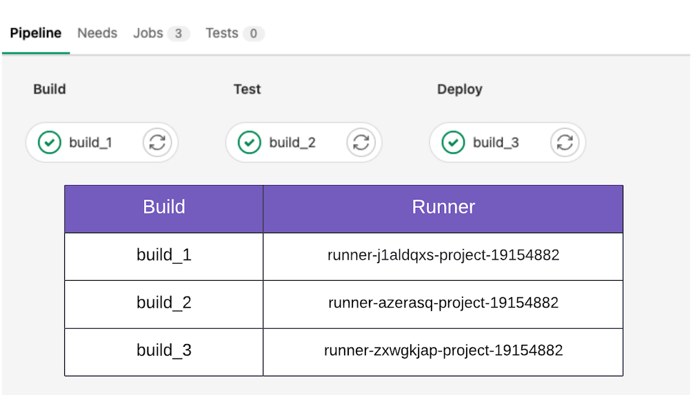

# Runner SaaS **(FREE SAAS)**

If you use GitLab SaaS (GitLab.com), your [untagged](../../ci/runners/configure_runners.md#use-tags-to-control-which-jobs-a-runner-can-run) CI jobs automatically run in containers on the Linux Runners.
As long as shared runners are enabled for your project, no configuration is required. Your jobs can run on:

- [Linux runners](saas/linux_saas_runner.md).
- [Windows runners](saas/windows_saas_runner.md) ([Beta](../../policy/alpha-beta-support.md#beta)).
- [macOS runners](saas/macos_saas_runner.md) ([Beta](../../policy/alpha-beta-support.md#beta)).

The number of minutes you can use on these runners depends on the
[maximum number of CI/CD minutes](../pipelines/cicd_minutes.md)
in your [subscription plan](https://about.gitlab.com/pricing/).

## Security for GitLab SaaS runners

GitLab SaaS runners on Linux and Windows run on Google Compute Platform. The [Google Infrastructure Security Design Overview whitepaper](https://cloud.google.com/docs/security/infrastructure/design/resources/google_infrastructure_whitepaper_fa.pdf) provides an overview of how Google designs security into its technical infrastructure. The GitLab [Trust Center](https://about.gitlab.com/security/) and [GitLab Security Compliance Controls](https://about.staging.gitlab.com/handbook/engineering/security/security-assurance/security-compliance/sec-controls.html) pages provide an overview of the security and compliance controls that govern the GitLab SaaS runners.

The runner that serves as a runner manager automatically initiates the creation and deletion of the virtual machines (VMs) used for CI jobs. When the runner manager picks up a GitLab SaaS CI job, it automatically executes that job on a new VM. There is no human or manual intervention in this process. The following section provides an overview of the additional built-in layers that harden the security of the GitLab Runner SaaS CI build environment.

### Security of CI job execution on GitLab Runner SaaS (Linux, Windows)

A dedicated temporary runner VM hosts and runs each CI job. On GitLab SaaS, two CI jobs never run on the same VM.

In this example, there are three jobs in the project's pipeline. Therefore, there are three temporary VMs used to run that pipeline, or one VM per job.

GitLab sends the command to remove the temporary runner VM to the Google Compute API immediately after the CI job completes. The [Google Compute Engine hypervisor](https://cloud.google.com/blog/products/gcp/7-ways-we-harden-our-kvm-hypervisor-at-google-cloud-security-in-plaintext) takes over the task of securely deleting the virtual machine and associated data.

### Network security of CI job virtual machines on GitLab Runner SaaS (Linux, Windows)

- Firewall rules only allow outbound communication from the temporary VM to the public internet.
- Inbound communication from the public internet to the temporary VM is not allowed.
- Firewall rules do not permit communication between VMs.
- The only internal communication allowed to the temporary VMs is from the runner manager.
