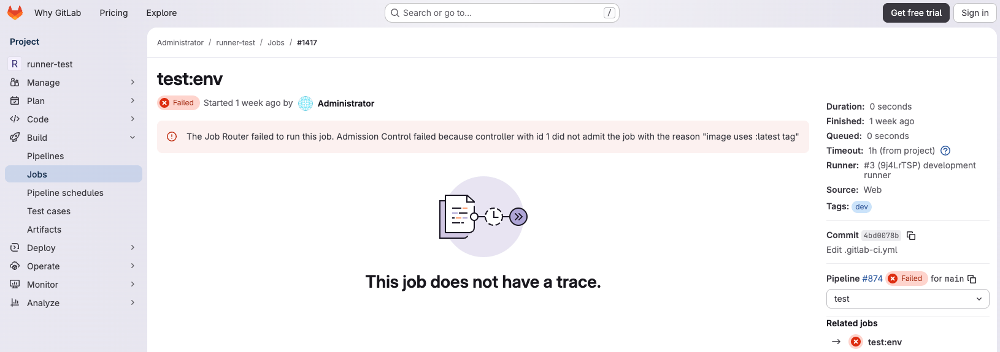



- Tier: Ultimate
- Offering: GitLab Self-Managed, GitLab Dedicated
- Status: Experiment



> [!flag]
> The availability of this feature is controlled by a feature flag.
> For more information, see the history.
> This feature is available for testing, but not ready for production use.



- [Introduced](https://gitlab.com/gitlab-org/gitlab/-/merge_requests/218229) in GitLab 18.9 [with a flag](../../../administration/feature_flags/_index.md) named `job_router_admission_control`. Disabled by default. This feature is an [experiment](../../../policy/development_stages_support.md) and subject to the [GitLab Testing Agreement](https://handbook.gitlab.com/handbook/legal/testing-agreement/).



Runner controllers enable admission control for CI/CD jobs routed through the
[job router](_index.md). When a job is about to be executed, the job router sends
an admission request to connected runner controllers, which can admit or reject
the job based on custom policies.

Runner controllers are on the instance-level and are applicable to jobs depending
on their [scoping](#scoping).

Use runner controllers to:

- Enforce custom admission policies like image allowlists, resource quotas, or security requirements.
- Control job queuing and resource allocation for capacity management.
- Ensure jobs meet organizational policies before execution for compliance enforcement.
- Limit job execution based on budget or resource constraints for cost control.

## Admission control workflow

When you configure runner controllers with the job router, the admission control workflow operates as follows:

1. A runner controller connects to the job router.
1. The controller registers itself and starts handling admission requests.
1. When a job needs admission, the job router sends job details to connected controllers.
1. The controller evaluates the job against custom policies.
1. The controller sends an admission decision (admit or reject with reason).
1. The job router proceeds with job execution or reports the rejection.

## View rejection reasons

When a runner controller rejects a job, the job fails with the `job_router_failure` failure reason.
The job details page displays a message that includes:

- Job router information
- Runner controller information
- The rejection reason provided by the runner controller

### Dry run mode logging

When a runner controller is in `dry_run` state, rejection decisions are not enforced but are
logged as informational messages in the job router (KAS) backend logs. Use these logs to
validate your controller's behavior before you enable enforcement.

## Runner controller states

Runner controllers can be in one of three states:

| State | Description |
|-------|-------------|
| `disabled` | The runner controller does not receive admission requests. This is the default state. |
| `enabled` | The runner controller receives admission requests and its decisions affect job execution. |
| `dry_run` | The runner controller receives admission requests. Job router logs the decisions, but decisions are not enforced. Use this state for strategic rollouts to validate controller behavior and de-risk deployments before you enable enforcement. |

## Scoping

Runner controllers must be scoped to be active. A runner controller without any scope
does not receive admission requests, even when its state is `enabled` or `dry_run`.

Runner controllers support two mutually exclusive scoping types:

| Scope | Description |
|-------|-------------|
| Instance-level | The runner controller evaluates jobs for all runners in the GitLab instance. This scope cannot be combined with runner-level scoping. |
| Runner-level | The runner controller evaluates jobs only for specific runners. You can scope a controller to one or more runners. The runner must be an instance-level runner. |

Additional scoping types are planned. For more information, see [issue 586419](https://gitlab.com/gitlab-org/gitlab/-/issues/586419).

To manage runner controller scoping, see the [runner controllers API](../../../api/runner_controllers.md).

## Manage runner controllers

Runner controllers are managed through the REST API. There is no UI for managing
runner controllers yet.

- To create, list, update, or delete runner controllers, see the [runner controllers API](../../../api/runner_controllers.md).
- To manage authentication tokens for runner controllers, see the [runner controller tokens API](../../../api/runner_controller_tokens.md).

Prerequisites:

- You must have administrator access to the GitLab instance.

## Implement a runner controller

To implement your own runner controller, you need to:

1. Create a runner controller in GitLab and obtain a token.
1. Connect to the job router with the token.
1. Register your controller with the job router.
1. Handle admission requests and send decisions.

For technical specifications and protobuf definitions, see the
[runner controller documentation](https://gitlab.com/gitlab-org/cluster-integration/gitlab-agent/-/blob/master/doc/runner_controller.md)
in the GitLab Agent for Kubernetes repository.

For a step-by-step guide, see [Tutorial: Build a runner admission controller](../../../tutorials/build_runner_admission_controller/_index.md).

## Related topics

- [Job Router](_index.md)
- [Runner controllers API](../../../api/runner_controllers.md)
- [Runner controller tokens API](../../../api/runner_controller_tokens.md)
- [Tutorial: Build a runner admission controller](../../../tutorials/build_runner_admission_controller/_index.md)
- [Runner controller example](https://gitlab.com/gitlab-org/cluster-integration/runner-controller-example) - Reference implementation
