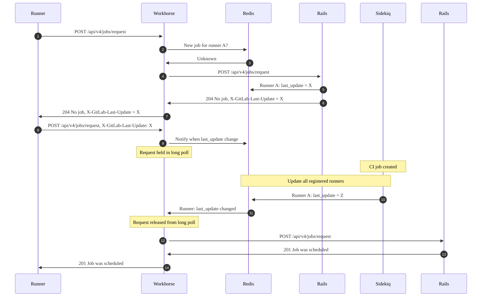

DETAILS:
**Tier:** Free, Premium, Ultimate
**Offering:** GitLab.com, GitLab Self-Managed, GitLab Dedicated

By default, a GitLab Runner polls a GitLab instance for new CI/CD
jobs periodically. The actual polling interval [depends on the `check_interval` and number of runners configured in the runner configuration file](https://docs.gitlab.com/runner/configuration/advanced-configuration.html#how-check_interval-works).

On a server that handles many runners, this polling can lead to a number of performance issues:

- Longer queuing times.
- Higher CPU usage on the GitLab instance.

To mitigate these issues, you should enable long polling.

Prerequisites:

- You must be an administrator.

## Enable long polling

You can configure a GitLab instance to hold job requests from runners in a long
poll until a new job is ready.

To do this, enable long polling by configuring the GitLab Workhorse long
polling duration (`apiCiLongPollingDuration`):

::Tabs

:::TabTitle Linux package (Omnibus)

1. Edit `/etc/gitlab/gitlab.rb`:

   ```ruby
   gitlab_workhorse['api_ci_long_polling_duration'] = "50s"
   ```

1. Save the file and reconfigure GitLab:

   ```shell
   sudo gitlab-ctl reconfigure
   ```

:::TabTitle Helm chart (Kubernetes)

Enable long polling with the `gitlab.webservice.workhorse.extraArgs` setting.

1. Export the Helm values:

   ```shell
   helm get values gitlab > gitlab_values.yaml
   ```

1. Edit `gitlab_values.yaml`:

   ```yaml
   gitlab:
     webservice:
       workhorse:
         extraArgs: "-apiCiLongPollingDuration 50s"
   ```

1. Save the file and apply the new values:

   ```shell
   helm upgrade -f gitlab_values.yaml gitlab gitlab/gitlab
   ```

:::TabTitle Docker

1. Edit `docker-compose.yml`:

   ```yaml
   version: "3.6"
   services:
     gitlab:
       image: 'gitlab/gitlab-ee:latest'
       restart: always
       hostname: 'gitlab.example.com'
       environment:
         GITLAB_OMNIBUS_CONFIG: |
           gitlab_workhorse['api_ci_long_polling_duration'] = "50s"
   ```

1. Save the file and restart GitLab:

   ```shell
   docker compose up -d
   ```

::EndTabs

## Metrics

When long polling is enabled, GitLab Workhorse subscribes to Redis
PubSub channels and awaits notifications. A job request is released
from a long poll when its runner key is changed, or when
`apiCiLongPollingDuration` has been reached. There are a number of
Prometheus metrics that you can monitor:

| Metric | Type | Description | Labels |
| -----  | ---- | ----------- | ------ |
| `gitlab_workhorse_keywatcher_keywatchers` | Gauge | The number of keys that is being watched by GitLab Workhorse | |
| `gitlab_workhorse_keywatcher_redis_subscriptions` | Gauge | The number of Redis PubSub subscriptions | |
| `gitlab_workhorse_keywatcher_total_messages` | Counter | Total number of messages GitLab Workhorse has received on the PubSub channels | |
| `gitlab_workhorse_keywatcher_actions_total` | Counter | Counts of various key watcher actions | `action` |
| `gitlab_workhorse_keywatcher_received_bytes_total` | Counter | Total bytes received on PubSub channels | |

You can see an [example of how one user discovered an issue with long polling with these metrics](https://gitlab.com/gitlab-org/omnibus-gitlab/-/issues/8329).

## Long polling workflow

The diagram shows how a single runner gets a job with long polling enabled:



In step 1, when a runner requests a new job, it issues a `POST` request
(`/api/v4/jobs/request`) to the GitLab server, where it is first handled
by Workhorse.

Workhorse reads the runner token and value from the
`X-GitLab-Last-Update` HTTP header, constructs a key, and subscribes to
a Redis PubSub channel with that key. If no value exists for the key,
then Workhorse immediately forwards the request on to Rails (steps 3 and
4).

Rails checks the job queue. If there are no jobs available for the
runner, Rails returns a `204 No job` with a `last_update` token to the
runner (steps 5 to 7).

The runner uses that `last_update` token and issues another request for
a job, populating the `X-GitLab-Last-Update` HTTP header with this
token. This time, Workhorse checks if the runner's `last_update` token
has changed. If it has not, Workhorse holds onto the request for up to
the duration specified by `apiCiLongPollingDuration`.

If a user triggers a new pipeline or job to run, a background task in
Sidekiq will update the `last_update` value for all runners available to
the job. Runners can be registered for the project, group, and/or
instance.

This "tick" in steps 10 and 11 releases the job request from the
Workhorse long poll queue, and the request gets sent to Rails (step
12). Rails looks for an available job, and assigns the runner to that
job (steps 13 and 14).

With long polling, the runner gets notified immediately after a new job
is available. This not only helps improve reduce job queueing time, but
it also reduces server overhead because the job requests reach
Rails only when there is new work.

## Troubleshooting

When working with long polling, you might encounter the following issues.

### Slow job pickup

Long polling is not enabled by default because in some runner
configurations, the runner doesn't pick up jobs in a timely manner.
See [issue 27709](https://gitlab.com/gitlab-org/gitlab-runner/-/issues/27709).

This can happen if the `concurrent` setting in the runner `config.toml`
is set to a value _lower_ than the number of runners defined. To resolve
this issue, ensure the value of `concurrent` is at equal or greater than the
number of runners.

For example, if you have three `[[runners]]` entries in `config.toml`, make
sure that `concurrent` is set to at least 3.

When long polling is enabled, the runner:

1. Launches `concurrent` number of Goroutines.
1. Waits for the Goroutines to return after long polling.
1. Runs another batch of requests.

For example, consider the case where a single `config.toml` has configured:

- 3 runners for project A.
- 1 runner for project B.
- `concurrent` set to 3.

In this example, a runner launches Goroutines for the first 3 projects.
In the worst case, the runner waits the full long poll interval for project
A before proceeding with requesting a job for project B.
