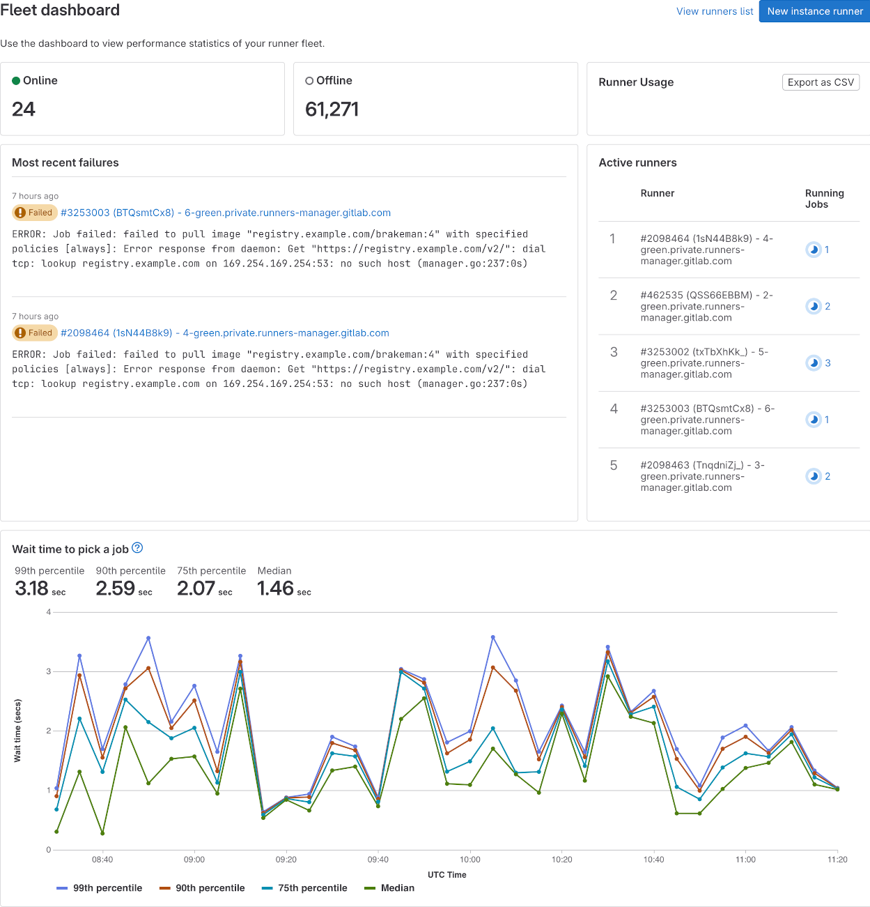

# Runner fleet dashboard

DETAILS:
**Tier:** Ultimate
**Offering:** Self-managed

> - [Introduced](https://gitlab.com/gitlab-org/gitlab/-/issues/424495) in GitLab 16.6

GitLab administrators can use the runner fleet dashboard to assess the health of your instance runners.
The runner fleet dashboard shows:

- Recent CI errors caused by runner infrastructure
- Number of concurrent jobs executed on most busy runners
- Compute minutes used by instance runners
- Job queue times (available only with [ClickHouse](#enable-more-ci-analytics-features-with-clickhouse))

## View the runner fleet dashboard

Prerequisites:

- You must be an administrator.

To view the runner fleet dashboard:

1. On the left sidebar, at the bottom, select **Admin**.
1. Select **Runners**.
1. Select **Fleet dashboard**.

Most of the dashboard works without any additional actions, with the
exception of **Wait time to pick a job** chart and features proposed in [epic 11183](https://gitlab.com/groups/gitlab-org/-/epics/11183).
These features require [setting up an additional infrastructure](#enable-more-ci-analytics-features-with-clickhouse).

## Export compute minutes used by instance runners

Prerequisites:

- You must have administrator access to the instance.
- You must enable the [ClickHouse integration](../../integration/clickhouse.md).

To analyze runner usage, you can export a CSV file that contains the number of jobs and executed runner minutes. The
CSV file shows the runner type and job status for each project. The CSV is sent to your email when the export is completed.

To export compute minutes used by instance runners:

1. On the left sidebar, at the bottom, select **Admin**.
1. Select **Runners**.
1. Select **Fleet dashboard**.
1. Select **Export CSV**.

## Enable more CI analytics features with ClickHouse

DETAILS:
**Tier:** Ultimate
**Offering:** GitLab.com, Self-managed, GitLab Dedicated
**Status:** Beta

> - [Introduced](https://gitlab.com/groups/gitlab-org/-/epics/11180) as an [experiment](../../policy/experiment-beta-support.md#experiment) in GitLab 16.7 with [flags](../../administration/feature_flags.md) named `ci_data_ingestion_to_click_house` and `clickhouse_ci_analytics`. Disabled by default.
> - [Enabled on GitLab.com, self-managed, and GitLab Dedicated](https://gitlab.com/gitlab-org/gitlab/-/issues/424866) in GitLab 16.10. Feature flags `ci_data_ingestion_to_click_house` and `clickhouse_ci_analytics` removed.
> - [Changed](https://gitlab.com/gitlab-org/gitlab/-/issues/424789) to [beta](../../policy/experiment-beta-support.md#beta) in GitLab 17.1.

WARNING:
This feature is in [beta](../../policy/experiment-beta-support.md#beta) and subject to change without notice.
For more information, see [epic 11180](https://gitlab.com/groups/gitlab-org/-/epics/11180).

To enable additional CI analytics features, [configure the ClickHouse integration](../../integration/clickhouse.md).

<i class="fa fa-youtube-play youtube" aria-hidden="true"></i>
For an overview, see [Setting up runner fleet dashboard with ClickHouse](https://www.youtube.com/watch?v=YpGV95Ctbpk).
<!-- Video published on 2023-12-19 -->

## Feedback

To help us improve the runner fleet dashboard, you can provide feedback in
[issue 421737](https://gitlab.com/gitlab-org/gitlab/-/issues/421737).
In particular:

- How easy or difficult it was to set up GitLab to make the dashboard work.
- How useful you found the dashboard.
- What other information you would like to see on that dashboard.
- Any other related thoughts and ideas.
