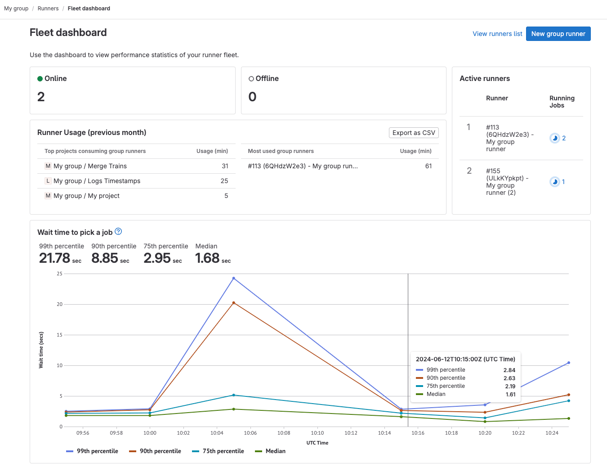

DETAILS:
**Tier:** Ultimate
**Offering:** GitLab.com, GitLab Self-Managed
**Status:** Beta

> - [Introduced](https://gitlab.com/gitlab-org/gitlab/-/merge_requests/151640) as a [beta](../../policy/development_stages_support.md#beta) in GitLab 17.0 [with a flag](../../administration/feature_flags.md) named `runners_dashboard_for_groups`. Disabled by default.
> - Feature flag `runners_dashboard_for_groups` [removed](https://gitlab.com/gitlab-org/gitlab/-/issues/459052) in GitLab 17.2.

Users with at least the Maintainer role for a group can use the runner fleet dashboard to assess the health of group runners.

## Dashboard metrics

The following metrics are available in the runner fleet dashboard:

| Metric                        | Description |
|-------------------------------|-------------|
| Online                        | Number of online runners. In the **Admin** area, this metric displays the number of runners for the entire instance. In a group, this metric displays the number of runners for the group and its subgroups. |
| Offline                       | Number of offline runners. |
| Active runners                | Number of active runners. |
| Runner usage (previous month) | Number of compute minutes used by each project on group runners. Includes the option to export as CSV for cost analysis. |
| Wait time to pick a job       | Displays the mean wait time for runners. This metric provides insights into whether the runners are capable of servicing the CI/CD job queue in your organization's target service-level objectives. The data that creates this metric widget is updated every 24 hours. |

## View the runner fleet dashboard for groups

Prerequisites:

- You must have the Maintainer role for the group.

To view the runner fleet dashboard for groups:

1. On the left sidebar, select **Search or go to** and find your group.
1. Select **Build > Runners**.
1. Select **Fleet dashboard**.

For GitLab Self-Managed, most of the dashboard metrics work without any additional configuration.
To use the **Runner usage** and **Wait time to pick a job** metrics,
you must [configure the ClickHouse analytics database](runner_fleet_dashboard.md#enable-more-ci-analytics-features-with-clickhouse).
