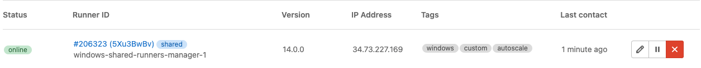

DETAILS:
**Tier:** Free, Premium, Ultimate
**Offering:** GitLab.com, GitLab Self-Managed, GitLab Dedicated

GitLab Runner has the following types of runners, which are available based on who you want to have access:

- [Instance runners](#instance-runners) are available to all groups and projects in a GitLab instance.
- [Group runners](#group-runners) are available to all projects and subgroups in a group.
- [Project runners](#project-runners) are associated with specific projects.
  Typically, project runners are used by one project at a time.

## Instance runners

*Instance runners* are available to every project in a GitLab instance.

Use instance runners when you have multiple jobs with similar requirements. Rather than
having multiple runners idling for many projects, you can have a few runners that handle
multiple projects.

If you are using GitLab Self-Managed, administrators can:

- [Install GitLab Runner](https://docs.gitlab.com/runner/install/index.html) and register an instance runner.
- Configure a maximum number of instance runner [compute minutes for each group](../../administration/cicd/compute_minutes.md#set-the-compute-quota-for-a-group).

If you are using GitLab.com:

- You can select from a list of [instance runners that GitLab maintains](_index.md).
- The instance runners consume the [compute minutes](../pipelines/compute_minutes.md)
  included with your account.

### Create an instance runner with a runner authentication token

> - [Introduced](https://gitlab.com/gitlab-org/gitlab/-/issues/383139) in GitLab 15.10. Deployed behind the `create_runner_workflow_for_admin` [flag](../../administration/feature_flags.md)
> - [Enabled by default](https://gitlab.com/gitlab-org/gitlab/-/issues/389269) in GitLab 16.0.
> - [Generally available](https://gitlab.com/gitlab-org/gitlab/-/issues/415447) in GitLab 16.2. Feature flag `create_runner_workflow_for_admin` removed.

Prerequisites:

- You must be an administrator.

When you create a runner, it is assigned a runner authentication token that you use to register it. The runner uses the token to authenticate with GitLab when picking up jobs from the job queue.

To create an instance runner:

1. On the left sidebar, at the bottom, select **Admin**.
1. Select **CI/CD > Runners**.
1. Select **New instance runner**.
1. Select the operating system where GitLab Runner is installed.
1. In the **Tags** section, in the **Tags** field, enter the job tags to specify jobs the runner can run.
   If there are no job tags for this runner, select **Run untagged**.
1. Optional. In the **Runner description** field, to add a runner description
   that displays in GitLab, enter a runner description.
1. Optional. In the **Configuration** section, add additional configurations.
1. Select **Create runner**.
1. Follow the on-screen instructions to register the runner from the command line. When prompted by the command line:
   - For the `GitLab instance URL`, use the URL for your GitLab instance. For example, if your project
     is hosted on `gitlab.example.com/yourname/yourproject`, your GitLab instance URL is `https://gitlab.example.com`.
   - For the `executor`, enter the type of [executor](https://docs.gitlab.com/runner/executors/). The executor is the
     environment where the runner executes the job.

You can also [use the API](../../api/users.md#create-a-runner-linked-to-a-user) to create a runner.

NOTE:
The runner authentication token displays in the UI for a limited period of time during registration. After you register the runner,
the authentication token is stored in the `config.toml`.

### Create an instance runner with a registration token (deprecated)

WARNING:
The option to pass a runner registration token and support for certain configuration arguments was
[deprecated](https://gitlab.com/gitlab-org/gitlab/-/issues/380872) in GitLab 15.6. They are scheduled for removal
in GitLab 18.0. Use runner authentication tokens instead. For more information, see
[Migrating to the new runner registration workflow](new_creation_workflow.md).

Prerequisites:

- Runner registration tokens must be [enabled](../../administration/settings/continuous_integration.md#allow-runner-registrations-tokens) in the **Admin** area.
- You must be an administrator.

To create an instance runner:

1. On the left sidebar, at the bottom, select **Admin**.
1. Select **CI/CD > Runners**.
1. Select **Register an instance runner**.
1. Copy the registration token.
1. [Register the runner](https://docs.gitlab.com/runner/register/#register-with-a-runner-registration-token-deprecated).

### Pause or resume an instance runner

Prerequisites:

- You must be an administrator.

You can pause a runner so that it does not accept jobs from groups and projects in the GitLab instance.

1. On the left sidebar, at the bottom, select **Admin**.
1. Select **CI/CD > Runners**.
1. In the search box, enter the runner description or filter the runner list.
1. In the runner list, to the right of the runner:
   - To pause the runner, select **Pause** (**{pause}**).
   - To resume the runner, select **Resume** (**{play}**).

### Delete instance runners

Prerequisites:

- You must be an administrator.

When you delete an instance runner, it is permanently deleted from the GitLab instance and can
no longer be used by groups and projects. If you want to temporarily stop the runner from accepting
jobs, you can [pause](#pause-or-resume-an-instance-runner) the runner instead.

To delete a single or multiple instance runners:

1. On the left sidebar, at the bottom, select **Admin**.
1. Select **CI/CD > Runners**.
1. In the search box, enter the runner description or filter the list of runners.
1. Delete the instance runner:
   - To delete a single runner, next to the runner, select **Delete runner** (**{remove}**).
   - To delete multiple instance runners, select the checkbox for each runner and select **Delete selected**.
   - To delete all runners, select the checkbox at the top of the runner list and select **Delete selected**.
1. Select **Permanently delete runner**.

### Enable instance runners for a project

On GitLab.com, [instance runners](_index.md) are enabled in all projects by
default.

On GitLab Self-Managed, an administrator can
[enable them for all new projects](../../administration/settings/continuous_integration.md#enable-instance-runners-for-new-projects).

For existing projects, an administrator must
[install](https://docs.gitlab.com/runner/install/index.html) and
[register](https://docs.gitlab.com/runner/register/index.html) them.

To enable instance runners for a project:

1. On the left sidebar, select **Search or go to** and find your project.
1. Select **Settings > CI/CD**.
1. Expand **Runners**.
1. Turn on the **Enable instance runners for this project** toggle.

### Enable instance runners for a group

To enable instance runners for a group:

1. On the left sidebar, select **Search or go to** and find your group.
1. Select **Settings > CI/CD**.
1. Expand **Runners**.
1. Turn on the **Enable instance runners for this group** toggle.

### Disable instance runners for a project

You can disable instance runners for individual projects or for groups.
You must have the Owner role for the project
or group.

To disable instance runners for a project:

1. On the left sidebar, select **Search or go to** and find your project.
1. Select **Settings > CI/CD**.
1. Expand **Runners**.
1. In the **Instance runners** area, turn off the **Enable instance runners for this project** toggle.

Instance runners are automatically disabled for a project:

- If the instance runners setting for the parent group is disabled, and
- If overriding this setting is not permitted for projects.

### Disable instance runners for a group

To disable instance runners for a group:

1. On the left sidebar, select **Search or go to** and find your group.
1. Select **Settings > CI/CD**.
1. Expand **Runners**.
1. Turn off the **Enable instance runners for this group** toggle.
1. Optional. To allow instance runners to be enabled for individual projects or subgroups,
   select **Allow projects and subgroups to override the group setting**.

### How instance runners pick jobs

Instance runners process jobs by using a fair usage queue. This queue prevents
projects from creating hundreds of jobs and using all available
instance runner resources.

The fair usage queue algorithm assigns jobs based on the projects that have the
fewest number of jobs already running on instance runners.

For example, if these jobs are in the queue:

- Job 1 for Project 1
- Job 2 for Project 1
- Job 3 for Project 1
- Job 4 for Project 2
- Job 5 for Project 2
- Job 6 for Project 3

When several CI/CD jobs run concurrently, the fair usage algorithm assigns jobs in this order:

1. Job 1 is first, because it has the lowest job number from projects with no running jobs (that is, all projects).
1. Job 4 is next, because 4 is now the lowest job number from projects with no running jobs (Project 1 has a job running).
1. Job 6 is next, because 6 is now the lowest job number from projects with no running jobs (Projects 1 and 2 have jobs running).
1. Job 2 is next, because, of projects with the lowest number of jobs running (each has 1), it is the lowest job number.
1. Job 5 is next, because Project 1 now has 2 jobs running and Job 5 is the lowest remaining job number between Projects 2 and 3.
1. Finally is Job 3... because it's the only job left.

When only one job runs at a time, the fair usage algorithm assigns jobs in this order:

1. Job 1 is chosen first, because it has the lowest job number from projects with no running jobs (that is, all projects).
1. We finish Job 1.
1. Job 2 is next, because, having finished Job 1, all projects have 0 jobs running again, and 2 is the lowest available job number.
1. Job 4 is next, because with Project 1 running a Job, 4 is the lowest number from projects running no jobs (Projects 2 and 3).
1. We finish Job 4.
1. Job 5 is next, because having finished Job 4, Project 2 has no jobs running again.
1. Job 6 is next, because Project 3 is the only project left with no running jobs.
1. Lastly we choose Job 3... because, again, it's the only job left.

## Group runners

Use _group runners_ when you want all projects in a group
to have access to a set of runners.

Group runners process jobs by using a first in, first out queue.

### Create a group runner with a runner authentication token

> - [Introduced](https://gitlab.com/gitlab-org/gitlab/-/issues/383143) in GitLab 15.10. Deployed behind the `create_runner_workflow_for_namespace` [flag](../../administration/feature_flags.md). Disabled by default.
> - [Enabled by default](https://gitlab.com/gitlab-org/gitlab/-/issues/393919) in GitLab 16.0.
> - [Generally available](https://gitlab.com/gitlab-org/gitlab/-/issues/415447) in GitLab 16.2. Feature flag `create_runner_workflow_for_admin` removed.

Prerequisites:

- You must have the Owner role for the group.

You can create a group runner for GitLab Self-Managed or for GitLab.com.
When you create a runner, it is assigned a runner authentication token that you use to register it.
The runner uses the token to authenticate with GitLab when it picks up jobs from the job queue.

To create a group runner:

1. On the left sidebar, select **Search or go to** and find your group.
1. Select **Build > Runners**.
1. Select **New group runner**.
1. In the **Tags** section, in the **Tags** field, enter the job tags to specify jobs the runner can run.
   If there are no job tags for this runner, select **Run untagged**.
1. Optional. In the **Runner description** field, add a runner description
   that displays in GitLab.
1. Optional. In the **Configuration** section, add additional configurations.
1. Select **Create runner**.
1. Select the platform where GitLab Runner is installed.
1. Complete the onscreen instructions:
   - For Linux, macOS, and Windows, when prompted by the command line:
     - For the `GitLab instance URL`, use the URL for your GitLab instance. For example, if your project
     is hosted on `gitlab.example.com/yourname/yourproject`, your GitLab instance URL is `https://gitlab.example.com`.
     - For the `executor`, enter the type of [executor](https://docs.gitlab.com/runner/executors/). The executor is the
     environment where the runner executes the job.
   - For Google Cloud, see [Provisioning runners in Google Cloud](provision_runners_google_cloud.md).

You can also [use the API](../../api/users.md#create-a-runner-linked-to-a-user) to create a runner.

NOTE:
The runner authentication token displays in the UI for only a short period of time during registration.

### Create a group runner with a registration token (deprecated)

> - Path changed from **Settings > CI/CD > Runners**.

WARNING:
The option to pass a runner registration token and support for certain configuration arguments was
[deprecated](https://gitlab.com/gitlab-org/gitlab/-/issues/380872) in GitLab 15.6. They are scheduled for removal
in GitLab 18.0. Use runner authentication tokens instead. For more information, see
[Migrating to the new runner registration workflow](new_creation_workflow.md).

Prerequisites:

- Runner registration tokens must be [enabled](#enable-use-of-runner-registration-tokens-in-projects-and-groups) in the top-level group.
- You must have the Owner role for the group.

To create a group runner:

1. [Install GitLab Runner](https://docs.gitlab.com/runner/install/).
1. On the left sidebar, select **Search or go to** and find your group.
1. Select **Build > Runners**.
1. In the upper-right corner, select **Register a group runner**.
1. Select **Show runner installation and registration instructions**.
   These instructions include the token, URL, and a command to register a runner.

Alternately, you can copy the registration token and follow the documentation for
how to [register a runner](https://docs.gitlab.com/runner/register/#register-with-a-runner-registration-token-deprecated).

### View group runners

> - Ability for users with the Maintainer role to view group runners [introduced](https://gitlab.com/gitlab-org/gitlab/-/issues/384179) in GitLab 16.4.

Prerequisites:

- You must have the Maintainer or Owner role for the group.

You can view all runners for a group and its subgroups and projects.
You can do this for GitLab Self-Managed or for GitLab.com.

1. On the left sidebar, select **Search or go to** and find your group.
1. Select **Build > Runners**.

#### Filter group runners to show only inherited

> - [Introduced](https://gitlab.com/gitlab-org/gitlab/-/issues/337838/) in GitLab 15.5.
> - [Generally available](https://gitlab.com/gitlab-org/gitlab/-/merge_requests/101099) in GitLab 15.5. Feature flag `runners_finder_all_available` removed.

You can choose to show all runners in the list, or show only
those that are inherited from the instance or other groups.

By default, only those that are inherited are shown.

To show all runners available in the instance, including instance runners and
those in other groups:

1. On the left sidebar, select **Search or go to** and find your group.
1. Select **Build > Runners**.
1. Above the list, turn off the **Show only inherited** toggle.

### Pause or resume a group runner

Prerequisites:

- You must be an administrator or have the Owner role for the group.

You can pause a runner so that it does not accept jobs from subgroups and projects in the GitLab
instance. If you pause a group runner that is used by multiple projects, the runner pauses for all projects.

1. On the left sidebar, select **Search or go to** and find your group.
1. Select **Build > Runners**.
1. In the search box, enter the runner description or filter the runner list.
1. In the runner list, to the right of the runner:
   - To pause the runner, select **Pause** (**{pause}**).
   - To resume the runner, select **Resume** (**{play}**).

### Delete a group runner

> - Multiple runner deletion [introduced](https://gitlab.com/gitlab-org/gitlab/-/issues/361721/) in GitLab 15.6.

Prerequisites:

- You must be an administrator or have the Owner role for the group.

When you delete a group runner, it is permanently deleted from the GitLab instance and can
no longer be used by subgroups and projects. If you want to temporarily stop the runner from accepting
jobs, you can [pause](#pause-or-resume-a-group-runner) the runner instead.

To delete a single or multiple group runners:

1. On the left sidebar, select **Search or go to** and find your group.
1. Select **Build > Runners**.
1. In the search box, enter the runner description or filter the list of runners.
1. Delete the group runner:
   - To delete a single runner, next to the runner, select **Delete runner** (**{remove}**).
   - To delete multiple instance runners, select the checkbox for each runner and select **Delete selected**.
   - To delete all runners, select the checkbox at the top of the runner list and select **Delete selected**.
1. Select **Permanently delete runner**.

### Clean up stale group runners

DETAILS:
**Tier:** Ultimate
**Offering:** GitLab.com, GitLab Self-Managed, GitLab Dedicated

> - [Introduced](https://gitlab.com/gitlab-org/gitlab/-/issues/363012) in GitLab 15.1.

Prerequisites:

- You must have the Owner role for the group.

You can clean up group runners that have been inactive for more than three months.

Group runners are those that were created in a specific group.

1. On the left sidebar, select **Search or go to** and find your group.
1. Select **Settings > CI/CD**.
1. Expand **Runners**.
1. Turn on the **Enable stale runner cleanup** toggle.

#### View stale runner cleanup logs

You can check the [Sidekiq logs](../../administration/logs/_index.md#sidekiq-logs) to see the cleanup result. In Kibana you can use the following query:

```json
{
  "query": {
    "match_phrase": {
      "json.class.keyword": "Ci::Runners::StaleGroupRunnersPruneCronWorker"
    }
  }
}
```

Filter entries where stale runners were removed:

```json
{
  "query": {
    "range": {
      "json.extra.ci_runners_stale_group_runners_prune_cron_worker.total_pruned": {
        "gte": 1,
        "lt": null
      }
    }
  }
}
```

## Project runners

Use _project runners_ when you want to use runners for specific projects. For example,
when you have:

- Jobs with specific requirements, like a deploy job that requires credentials.
- Projects with a lot of CI activity that can benefit from being separate from other runners.

You can set up a project runner to be used by multiple projects. Project runners
must be enabled for each project explicitly.

Project runners process jobs by using a first in, first out ([FIFO](https://en.wikipedia.org/wiki/FIFO_(computing_and_electronics))) queue.

NOTE:
Project runners do not get instance with forked projects automatically.
A fork *does* copy the CI/CD settings of the cloned repository.

### Project runner ownership

When a runner first connects to a project, that project becomes the runner's owner.

If you delete the owner project:

1. GitLab finds all other projects that share the runner.
1. GitLab assigns ownership to the project with the oldest association.
1. If no other projects share the runner, GitLab deletes the runner automatically.

You cannot unassign a runner from the owner project. Delete the runner instead.

### Create a project runner with a runner authentication token

> - [Introduced](https://gitlab.com/gitlab-org/gitlab/-/issues/383143) in GitLab 15.10. Deployed behind the `create_runner_workflow_for_namespace` [flag](../../administration/feature_flags.md). Disabled by default.
> - [Enabled by default](https://gitlab.com/gitlab-org/gitlab/-/issues/393919) in GitLab 16.0.
> - [Generally available](https://gitlab.com/gitlab-org/gitlab/-/issues/415447) in GitLab 16.2. Feature flag `create_runner_workflow_for_admin` removed.

Prerequisites:

- You must have the Maintainer role for the project.

You can create a project runner for GitLab Self-Managed or for GitLab.com. When you create a runner,
it is assigned a runner authentication token that you use to register to the runner. The runner uses the token to
authenticate with GitLab when it picks up jobs from the job queue.

To create a project runner:

1. On the left sidebar, select **Search or go to** and find your project.
1. Select **Settings > CI/CD**.
1. Expand the **Runners** section.
1. Select **New project runner**.
1. Select the operating system where GitLab Runner is installed.
1. In the **Tags** section, in the **Tags** field, enter the job tags to specify jobs the runner can run.
   If there are no job tags for this runner, select **Run untagged**.
1. Optional. In the **Runner description** field, add a description for the runner
   that displays in GitLab.
1. Optional. In the **Configuration** section, add additional configurations.
1. Select **Create runner**.
1. Select the platform where GitLab Runner is installed.
1. Complete the onscreen instructions:
   - For Linux, macOS, and Windows, when prompted by the command line:
     - For the `GitLab instance URL`, use the URL for your GitLab instance. For example, if your project
     is hosted on `gitlab.example.com/yourname/yourproject`, your GitLab instance URL is `https://gitlab.example.com`.
     - For the `executor`, enter the type of [executor](https://docs.gitlab.com/runner/executors/). The executor is the
     environment where the runner executes the job.
   - For Google Cloud, see [Provisioning runners in Google Cloud](provision_runners_google_cloud.md).

You can also [use the API](../../api/users.md#create-a-runner-linked-to-a-user) to create a runner.

NOTE:
The runner authentication token displays in the UI for only a short period of time during registration.

### Create a project runner with a registration token (deprecated)

WARNING:
The option to pass a runner registration token and support for certain configuration arguments was
[deprecated](https://gitlab.com/gitlab-org/gitlab/-/issues/380872) in GitLab 15.6. They are scheduled for removal
in GitLab 18.0. Use runner authentication tokens instead. For more information, see
[Migrating to the new runner registration workflow](new_creation_workflow.md).

Prerequisites:

- Runner registration tokens must be [enabled](#enable-use-of-runner-registration-tokens-in-projects-and-groups) in the top-level group.
- You must have at least the Maintainer role for the project.

To create a project runner:

1. [Install GitLab Runner](https://docs.gitlab.com/runner/install/).
1. On the left sidebar, select **Search or go to** and
   find the project where you want to use the runner.
1. Select **Settings > CI/CD**.
1. Expand **Runners**.
1. In the **Project runners** section, note the URL and token.
1. [Register the runner](https://docs.gitlab.com/runner/register/#register-with-a-runner-registration-token-deprecated).

The runner is now enabled for the project.

### Pause or resume a project runner

Prerequisites:

- You must be an administrator, or have the Maintainer role for the project.

You can pause a project runner so that it does not accept jobs from projects it's assigned to
in the GitLab instance.

1. On the left sidebar, select **Search or go to** and
   find the project where you want to enable the runner.
1. Select **Settings > CI/CD**.
1. Expand **Runners**.
1. In the **Assigned project runners** section, find the runner.
1. To the right of the runner:
   - To pause the runner, select **Pause** (**{pause}**), then select **Pause**.
   - To resume the runner, select **Resume** (**{play}**).

### Delete a project runner

Prerequisites:

- You must be an administrator, or have the Maintainer role for the project.
- You cannot delete a project runner that is assigned to more than one project. Before you can delete the runner, you must [disable](#enable-a-project-runner-for-a-different-project) it in all projects where it is enabled.

When you delete a project runner, it is permanently deleted from the GitLab instance and can
no longer be used by projects. If you want to temporarily stop the runner from accepting
jobs, you can [pause](#pause-or-resume-a-project-runner) the runner instead.

When you delete a runner, its configuration still exists in the runner host's `config.toml` file.
If the deleted runner's configuration is still present in this file, the runner host continues to contact GitLab.
To prevent unnecessary API traffic, you must also
[unregister the deleted runner](https://docs.gitlab.com/runner/commands/#gitlab-runner-unregister).

1. On the left sidebar, select **Search or go to** and
   find the project where you want to enable the runner.
1. Select **Settings > CI/CD**.
1. Expand **Runners**.
1. In the **Assigned project runners** section, find the runner.
1. To the right of the runner, select **Remove runner**.
1. To delete the runner, select **Remove**.

### Enable a project runner for a different project

After a project runner is created, you can enable it for other projects.

Prerequisites:
You must have at least the Maintainer role for:

- The project where the runner is already enabled.
- The project where you want to enable the runner.
- The project runner must not be [locked](#prevent-a-project-runner-from-being-enabled-for-other-projects).

To enable a project runner for a project:

1. On the left sidebar, select **Search or go to** and
   find the project where you want to enable the runner.
1. Select **Settings > CI/CD**.
1. Expand **Runners**.
1. In the **Project runners** area, by the runner you want, select **Enable for this project**.

You can edit a project runner from any of the projects it's enabled for.
The modifications, which include unlocking and editing tags and the description,
affect all projects that use the runner.

An administrator can [enable the runner for multiple projects](../../administration/settings/continuous_integration.md#enable-a-project-runner-for-multiple-projects).

### Prevent a project runner from being enabled for other projects

You can configure a project runner so it is "locked" and cannot be enabled for other projects.
This setting can be enabled when you first [register a runner](https://docs.gitlab.com/runner/register/),
but can also be changed later.

To lock or unlock a project runner:

1. On the left sidebar, select **Search or go to** and
   find the project where you want to enable the runner.
1. Select **Settings > CI/CD**.
1. Expand **Runners**.
1. Find the project runner you want to lock or unlock. Make sure it's enabled. You cannot lock instance or group runners.
1. Select **Edit** (**{pencil}**).
1. Select the **Lock to current projects** checkbox.
1. Select **Save changes**.

## Runner statuses

A runner can have one of the following statuses.

| Status  | Description |
|---------|-------------|
| `online`  | The runner has contacted GitLab in the last 2 hours and is available to run jobs. |
| `offline` | The runner has not contacted GitLab in more than 2 hours and is not available to run jobs. Check the runner to see if you can bring it online. |
| `stale`   | The runner has not contacted GitLab in more than 7 days. If the runner was created more than 7 days ago, but it never contacted the instance, it is also considered **stale**. |
| `never_contacted` | The runner has never contacted GitLab. To make the runner contact GitLab, run `gitlab-runner run`. |

## Stale runner manager cleanup

GitLab periodically deletes stale runner managers to maintain a lean database.
If a runner contacts the GitLab instance, the connection is recreated.

## View statistics for runner performance

DETAILS:
**Tier:** Ultimate
**Offering:** GitLab.com, GitLab Self-Managed, GitLab Dedicated

> - [Introduced](https://gitlab.com/gitlab-org/gitlab/-/issues/377963) in GitLab 15.8.

As an administrator, you can view runner statistics to learn about the performance of your runner fleet.

The **Median job queued time** value is calculated by sampling the queue duration of the
most recent 100 jobs that were run by Instance runners. Jobs from only the latest 5000
runners are considered.

The median is a value that falls into the 50th percentile. Half of the jobs
queue longer than the median value, and half queue for less time than the
median value.

To view runner statistics:

1. On the left sidebar, at the bottom, select **Admin**.
1. Select **CI/CD > Runners**.
1. Select **View metrics**.

## Determine which runners need to be upgraded

DETAILS:
**Tier:** Ultimate
**Offering:** GitLab.com, GitLab Self-Managed, GitLab Dedicated

> - [Introduced](https://gitlab.com/gitlab-org/gitlab/-/issues/365078) in GitLab 15.3.

The version of GitLab Runner used by your runners should be
[kept up-to-date](https://docs.gitlab.com/runner/index.html#gitlab-runner-versions).

To determine which runners need to be upgraded:

1. View the list of runners:
   - For a group:
     1. On the left sidebar, select **Search or go to** and find your group.
     1. Select **Build > Runners**.
   - For the instance:
     1. On the left sidebar, at the bottom, select **Admin**.
     1. Select **CI/CD > Runners**.

1. Above the list of runners, view the status:
   - **Outdated - recommended**: The runner does not have the latest `PATCH` version, which may make it vulnerable
     to security or high severity bugs. Or, the runner is one or more `MAJOR` versions behind your GitLab instance, so some features may not be available or work properly.
   - **Outdated - available**: Newer versions are available but upgrading is not critical.

1. Filter the list by status to view which individual runners need to be upgraded.

## Determine the IP address of a runner

To troubleshoot runner issues, you might need to know the runner's IP address.
GitLab stores and displays the IP address by viewing the source of the
HTTP requests when the runner polls for jobs.
GitLab automatically updates the runner's IP address whenever it is updated.

The IP address for instance runners and project runners can be found in
different places.

### Determine the IP address of an instance runner

Prerequisites:

- You must have administrator access to the instance.

To determine the IP address of an instance runner:

1. On the left sidebar, at the bottom, select **Admin**.
1. Select **CI/CD > Runners**.
1. Find the runner in the table and view the **IP Address** column.



### Determine the IP address of a project runner

To can find the IP address of a runner for a project,
you must have the Owner role for the
project.

1. Go to the project's **Settings > CI/CD** and expand the **Runners** section.
1. Select the runner name and find the **IP Address** row.


## Enable use of runner registration tokens in projects and groups

> - [Introduced](https://gitlab.com/gitlab-org/gitlab/-/merge_requests/148557) in GitLab 16.11

WARNING:
The option to pass a runner registration token and support for certain configuration arguments was
[deprecated](https://gitlab.com/gitlab-org/gitlab/-/issues/380872) in GitLab 15.6. They are scheduled for removal
in GitLab 18.0. Use runner authentication tokens instead. For more information, see
[Migrating to the new runner registration workflow](new_creation_workflow.md).

In GitLab 17.0, the use of runner registration tokens is disabled in all GitLab instances.

Prerequisites:

- Runner registration tokens must be [enabled](../../administration/settings/continuous_integration.md#allow-runner-registrations-tokens) in the **Admin** area.

To enable the use of runner registration token in project and groups:

1. On the left sidebar, select **Search or go to** and find your group.
1. Select **Settings > CI/CD**.
1. Expand **Runners**.
1. Turn on the **Allow members of projects and groups to create runners with runner registration tokens** toggle.
