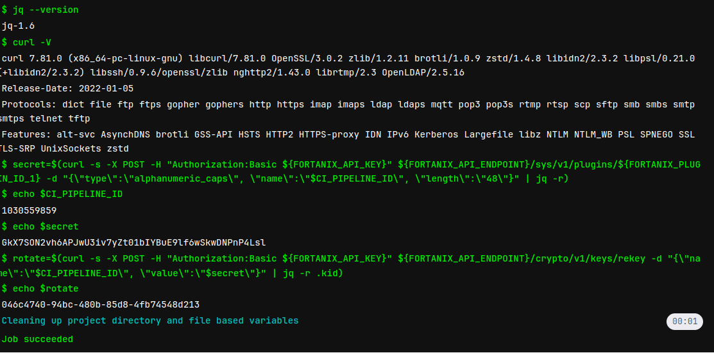
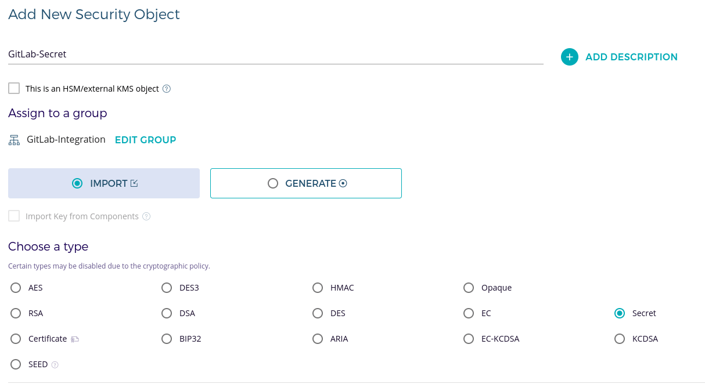
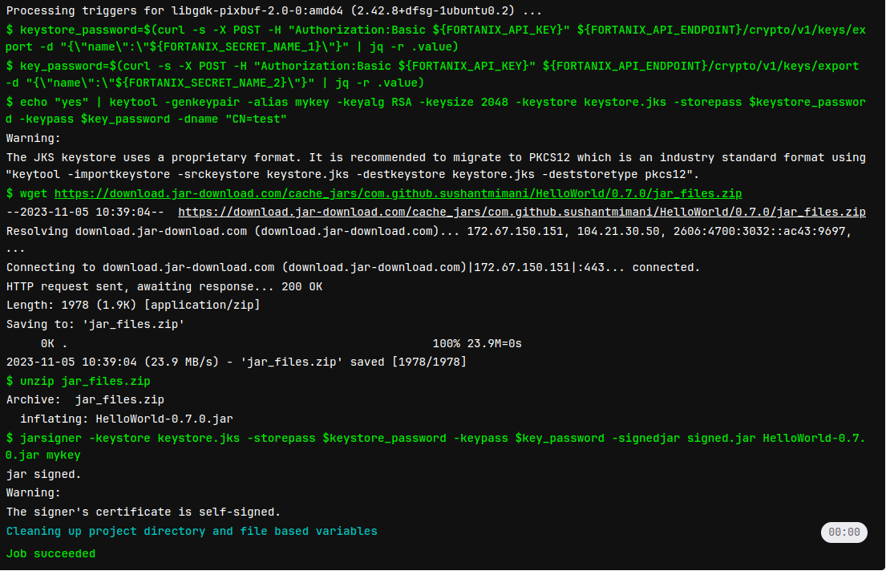

DETAILS:
**Tier:** Free, Premium, Ultimate
**Offering:** GitLab.com, GitLab Self-Managed, GitLab Dedicated

You can use Fortanix Data Security Manager (DSM) as your secrets manager for GitLab CI/CD pipelines.

This tutorial explains the steps required to generate new secrets in Fortanix DSM, or use existing secrets,
and use them in GitLab CI/CD jobs. Follow the instructions carefully, to implement this integration,
enhancing data security and optimizing your CI/CD pipelines.

## Before you begin

Ensure that you have:

- Access to a Fortanix DSM account with appropriate administrative privileges. For more information, refer to [Getting Started with Fortanix Data Security Manager](https://www.fortanix.com/start-your-free-trial).
- A [GitLab account](https://gitlab.com/users/sign_up) with access to the project where you intend to set up the integration.
- Knowledge about the process of saving secrets in Fortanix DSM, including generating and importing secrets.
- Access to necessary permissions in Fortanix DSM and GitLab for group, application, plugin, variable, and secret management.

## Generate and import a new secret

To generate a new secret in Fortanix DSM and use it with GitLab:

1. Sign in to your Fortanix DSM account.
1. In Fortanix DSM, [create a new group and an application](https://support.fortanix.com/hc/en-us/articles/360015809372-User-s-Guide-Getting-Started-with-Fortanix-Data-Security-Manager-UI).
1. Configure the [API Key as the authentication method for the application](https://support.fortanix.com/hc/en-us/articles/360033272171-User-s-Guide-Authentication).
1. Use the following code to generate a new plugin in Fortanix DSM:

   ```lua
   numericAlphabet = "0123456789"
   alphanumericAlphabet = numericAlphabet .. "abcdefghijklmnopqrstuvwxyz"
   alphanumericCapsAlphabet = alphanumericAlphabet .. "ABCDEFGHIJKLMNOPQRSTUVWXYZ"
   alphanumericCapsSymbolsAlphabets = alphanumericCapsAlphabet .. "!@#$&*_%="

   function genPass(alphabet, len, name, import)
       local alphabetSize = #alphabet
       local password = ''

       for i = 1, len, 1 do
           local random_char = math.random(alphabetSize)
           password = password .. string.sub(alphabet, random_char, random_char)
       end

       local pass = Blob.from_bytes(password)

       if import == "yes" then
           local sobject = assert(Sobject.import { name = name, obj_type = "SECRET", value = pass, key_ops = {'APPMANAGEABLE', 'EXPORT'} })
           return password
       end

       return password;
   end

   function run(input)
       if input.type == "numeric" then
           return genPass(numericAlphabet, input.length, input.name, input.import)
       end

       if input.type == "alphanumeric" then
           return genPass(alphanumericAlphabet, input.length, input.name, input.import)
       end

       if input.type == "alphanumeric_caps" then
           return genPass(alphanumericCapsAlphabet, input.length, input.name, input.import)
       end

       if input.type == "alphanumeric_caps_symbols" then
           return genPass(alphanumericCapsSymbolsAlphabets, input.length, input.name, input.import)
       end
   end
   ```

   For more information, see the [Fortanix user's Guide: Plugin Library](https://support.fortanix.com/hc/en-us/articles/360041950371-User-s-Guide-Plugin-Library).

   - Set the import option to `yes` if you want to store the secret in Fortanix DSM:

     ```json
     {
         "type": "alphanumeric_caps",
         "length": 64,
         "name": "GitLab-Secret",
         "import": "yes"
     }
     ```

   - Set the import option to `no` if you only want a new value generated for rotation:

     ```json
     {
         "type": "numeric",
         "length": 64,
         "name": "GitLab-Secret",
         "import": "no"
     }
     ```

1. In GitLab, on the left sidebar, select **Search or go to** and find your project.
1. Select **Settings > CI/CD**.
1. Expand **Variables** and add these variables:
   - `FORTANIX_API_ENDPOINT`
   - `FORTANIX_API_KEY`
   - `FORTANIX_PLUGIN_ID`

1. Create or edit the `.gitlab-ci.yml` configuration file in your project to use the integration:

   ```yaml
   stages:
     - build

   build:
     stage: build
     image: ubuntu
     script:
       - apt-get update
       - apt install --assume-yes jq
       - apt install --assume-yes curl
       - jq --version
       - curl --version
       - secret=$(curl --silent --request POST --header "Authorization:Basic ${FORTANIX_API_KEY}" ${FORTANIX_API_ENDPOINT}/sys/v1/plugins/${FORTANIX_PLUGIN_ID} --data "{\"type\":\"alphanumeric_caps\", \"name\":\"$CI_PIPELINE_ID\",\"import\":\"yes\", \"length\":\"48\"}" | jq --raw-output)
       - nsecret=$(curl --silent --request POST --header "Authorization:Basic ${FORTANIX_API_KEY}" ${FORTANIX_API_ENDPOINT}/sys/v1/plugins/${FORTANIX_PLUGIN_ID} --data "{\"type\":\"alphanumeric_caps\", \"import\":\"no\", \"length\":\"48\"}" | jq --raw-output)
       - encodesecret=$(echo $nsecret | base64)
       - rotate=$(curl --silent --request POST --header "Authorization:Basic ${FORTANIX_API_KEY}" ${FORTANIX_API_ENDPOINT}/crypto/v1/keys/rekey --data "{\"name\":\"$CI_PIPELINE_ID\", \"value\":\"$encodesecret\"}" | jq --raw-output .kid)
   ```

1. The pipeline should run automatically after saving the `.gitlab-ci.yml` file.
   If not, select **Build > Pipelines > Run pipeline**.
1. Go to **Build > Jobs** and check the `build` job's log:

   


## Use an existing secret from Fortanix DSM

To use a secret that already exists in Fortanix DSM with GitLab:

1. The secret must be marked as exportable in Fortanix:

   

1. In GitLab, on the left sidebar, select **Search or go to** and find your project.
1. Select **Settings > CI/CD**.
1. Expand **Variables** and add these variables:
   - `FORTANIX_API_ENDPOINT`
   - `FORTANIX_API_KEY`
   - `FORTANIX_PLUGIN_ID`

1. Create or edit the `.gitlab-ci.yml` configuration file in your project to use the integration:

   ```yaml
   stages:
     - build

   build:
     stage: build
     image: ubuntu
     script:
     - apt-get update
     - apt install --assume-yes jq
     - apt install --assume-yes curl
     - jq --version
     - curl --version
     - secret=$(curl --silent --request POST --header "Authorization:Basic ${FORTANIX_API_KEY}" ${FORTANIX_API_ENDPOINT}/crypto/v1/keys/export --data "{\"name\":\"${FORTANIX_SECRET_NAME}\"}" | jq --raw-output .value)
   ```

1. The pipeline should run automatically after saving the `.gitlab-ci.yml` file.
   If not, select **Build > Pipelines > Run pipeline**.
1. Go to **Build > Jobs** and check the `build` job's log:

   - 

## Code Signing

To set up code signing securely in your GitLab environment:

1. Sign in to your Fortanix DSM account.
1. Import `keystore_password` and `key_password` as secrets in Fortanix DSM. Ensure that they are marked as exportable.

   

1. In GitLab, on the left sidebar, select **Search or go to** and find your project.
1. Select **Settings > CI/CD**.
1. Expand **Variables** and add these variables:
   - `FORTANIX_API_ENDPOINT`
   - `FORTANIX_API_KEY`
   - `FORTANIX_SECRET_NAME_1` (for `keystore_password`)
   - `FORTANIX_SECRET_NAME_2` (for `key_password`)

1. Create or edit the `.gitlab-ci.yml` configuration file in your project to use the integration:

   ```yaml
   stages:
     - build

   build:
     stage: build
     image: ubuntu
     script:
     - apt-get update -qy
     - apt install --assume-yes jq
     - apt install --assume-yes curl
     - apt-get install wget
     - apt-get install unzip
     - apt-get install --assume-yes openjdk-8-jre-headless openjdk-8-jdk   # Install Java
     - keystore_password=$(curl --silent --request POST --header "Authorization:Basic ${FORTANIX_API_KEY}" ${FORTANIX_API_ENDPOINT}/crypto/v1/keys/export --data "{\"name\":\"${FORTANIX_SECRET_NAME_1}\"}" | jq --raw-output .value)
     - key_password=$(curl --silent --request POST --header "Authorization:Basic ${FORTANIX_API_KEY}" ${FORTANIX_API_ENDPOINT}/crypto/v1/keys/export --data "{\"name\":\"${FORTANIX_SECRET_NAME_2}\"}" | jq --raw-output .value)
     - echo "yes" | keytool -genkeypair -alias mykey -keyalg RSA -keysize 2048 -keystore keystore.jks -storepass $keystore_password -keypass $key_password -dname "CN=test"
     - mkdir -p src/main/java
     - echo 'public class HelloWorld { public static void main(String[] args) { System.out.println("Hello, World!"); } }' > src/main/java/HelloWorld.java
     - javac src/main/java/HelloWorld.java
     - mkdir -p target
     - jar cfe target/HelloWorld.jar HelloWorld -C src/main/java HelloWorld.class
     - jarsigner -keystore keystore.jks -storepass $keystore_password -keypass $key_password -signedjar signed.jar target/HelloWorld.jar mykey
   ```

1. The pipeline should run automatically after saving the `.gitlab-ci.yml` file.
   If not, select **Build > Pipelines > Run pipeline**.
1. Go to **Build > Jobs** and check the `build` job's log:

   - 
