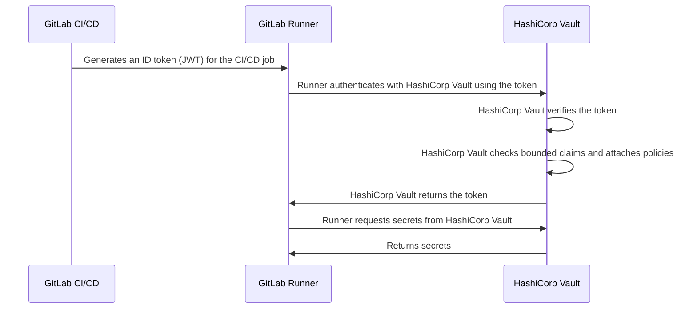



- Tier: Free, Premium, Ultimate
- Offering: GitLab.com, GitLab Self-Managed, GitLab Dedicated





- [Introduced](https://gitlab.com/gitlab-org/gitlab/-/issues/356986) in GitLab 15.7.



ID tokens are [JSON web tokens (JWT)](https://www.rfc-editor.org/rfc/rfc7519) generated by GitLab CI/CD.
CI/CD jobs can use ID tokens for OIDC authentication with third-party services, including:

- [Secrets providers](_index.md)
- [Cloud services](../cloud_services/_index.md)

For example, the flow for using ID tokens to authenticate with HashiCorp Vault is summarized
by this diagram:



ID tokens are also used by the [`secrets`](../yaml/_index.md#secrets) keyword.

## Configure ID tokens in a CI/CD job

To use ID tokens, configure a CI/CD job with the [`id_tokens`](../yaml/_index.md#id_tokens) keyword.

For example:

```yaml
job_with_id_tokens:
  id_tokens:
    FIRST_ID_TOKEN:
      aud: https://first.service.com
    SECOND_ID_TOKEN:
      aud: https://second.service.com
  script:
    - first-service-authentication-script.sh $FIRST_ID_TOKEN
    - second-service-authentication-script.sh $SECOND_ID_TOKEN
```

In this example, the two tokens have different `aud` claims. Third party services can be configured to reject tokens
that do not have an `aud` claim matching their bound audience. Use this functionality to reduce the number of
services with which a token can authenticate. This reduces the severity of having a token compromised.

## Token payload

The following standard claims are included in each ID token:

| Field                                                              | Description |
|--------------------------------------------------------------------|-------------|
| [`iss`](https://www.rfc-editor.org/rfc/rfc7519.html#section-4.1.1) | Issuer of the token, which is the domain of the GitLab instance ("issuer" claim). |
| [`sub`](https://www.rfc-editor.org/rfc/rfc7519.html#section-4.1.2) | Subject of the token ("subject" claim). Defaults to `project_path:{group}/{project}:ref_type:{type}:ref:{branch_name}`. Can be configured for the project with the [projects API](../../api/projects.md#edit-a-project). |
| [`aud`](https://www.rfc-editor.org/rfc/rfc7519.html#section-4.1.3) | Intended audience for the token ("audience" claim). Specified in the [ID tokens](#configure-id-tokens-in-a-cicd-job) configuration. The domain of the GitLab instance by default. |
| [`exp`](https://www.rfc-editor.org/rfc/rfc7519.html#section-4.1.4) | The expiration time ("expiration time" claim). |
| [`nbf`](https://www.rfc-editor.org/rfc/rfc7519.html#section-4.1.5) | The time after which the token becomes valid ("not before" claim). |
| [`iat`](https://www.rfc-editor.org/rfc/rfc7519.html#section-4.1.6) | The time the JWT was issued ("issued at" claim). |
| [`jti`](https://www.rfc-editor.org/rfc/rfc7519.html#section-4.1.7) | Unique identifier for the token ("JWT ID" claim). |

The token also includes custom claims provided by GitLab:

| Field                   | When                                       | Description |
|-------------------------|--------------------------------------------|-------------|
| `project_id`            | Always                                     | ID of the project running the job. In a merge request pipeline, this is the ID of the source project. |
| `project_path`          | Always                                     | Path of the project running the job. In a merge request pipeline, this is the path of the source project. |
| `namespace_id`          | Always                                     | Namespace ID of the project running the job. In a merge request pipeline, this is the namespace ID of the source project. |
| `namespace_path`        | Always                                     | Namespace path of the project running the job. In a merge request pipeline, this is the namespace path of the source project. |
| `user_id`               | Always                                     | ID of the user executing the job. |
| `user_login`            | Always                                     | Username of the user executing the job. |
| `user_email`            | Always                                     | Email of the user executing the job. |
| `user_access_level`     | Always                                     | Access level of the user executing the job. [Introduced](https://gitlab.com/gitlab-org/gitlab/-/issues/432052) in GitLab 16.9. |
| `job_project_id`        | Always                                     | ID of the project running the job. Use this to scope to the project by ID. [Introduced](https://gitlab.com/gitlab-org/gitlab/-/issues/563038) in GitLab 18.4. |
| `job_project_path`      | Always                                     | Path of the project running the job. Use this to scope to the project by path. [Introduced](https://gitlab.com/gitlab-org/gitlab/-/issues/563038) in GitLab 18.4. |
| `job_namespace_id`      | Always                                     | Namespace ID of the project running the job. Use this to scope to group or user level namespace by ID. [Introduced](https://gitlab.com/gitlab-org/gitlab/-/issues/563038) in GitLab 18.4. |
| `job_namespace_path`    | Always                                     | Namespace path of the project running the job. Use this to scope to group or user level namespace by path. [Introduced](https://gitlab.com/gitlab-org/gitlab/-/issues/563038) in GitLab 18.4. |
| `user_identities`       | User Preference setting                    | List of the user's external identities ([introduced](https://gitlab.com/gitlab-org/gitlab/-/issues/387537) in GitLab 16.0). |
| `pipeline_id`           | Always                                     | ID of the pipeline. |
| `pipeline_source`       | Always                                     | [Pipeline source](../jobs/job_rules.md#common-if-clauses-with-predefined-variables). |
| `job_id`                | Always                                     | ID of the job. |
| `ref`                   | Always                                     | Git ref for the job. In a merge request pipeline, this is the source branch ref. |
| `ref_type`              | Always                                     | Git ref type, either `branch` or `tag`. |
| `ref_path`              | Always                                     | Fully qualified ref for the job. For example, `refs/heads/main`. In a merge request pipeline, this is the source branch ref path. [Introduced](https://gitlab.com/gitlab-org/gitlab/-/merge_requests/119075) in GitLab 16.0. |
| `ref_protected`         | Always                                     | `true` if the Git ref is protected, `false` otherwise. |
| `groups_direct`         | User is a direct member of 0 to 200 groups | The paths of the user's direct membership groups. Omitted if the user is a direct member of more than 200 groups. ([Introduced](https://gitlab.com/gitlab-org/gitlab/-/issues/435848) in GitLab 16.11 and put behind the `ci_jwt_groups_direct` [feature flag](../../administration/feature_flags/_index.md) in GitLab 17.3. |
| `environment`           | Job specifies an environment               | Environment this job deploys to. |
| `environment_protected` | Job specifies an environment               | `true` if deployed environment is protected, `false` otherwise. |
| `deployment_tier`       | Job specifies an environment               | [Deployment tier](../environments/_index.md#deployment-tier-of-environments) of the environment the job specifies. [Introduced](https://gitlab.com/gitlab-org/gitlab/-/issues/363590) in GitLab 15.2. |
| `environment_action`    | Job specifies an environment               | [Environment action (`environment:action`)](../environments/_index.md) specified in the job. ([Introduced](https://gitlab.com/gitlab-org/gitlab/-/) in GitLab 16.5) |
| `runner_id`             | Always                                     | ID of the runner executing the job. [Introduced](https://gitlab.com/gitlab-org/gitlab/-/issues/404722) in GitLab 16.0. |
| `runner_environment`    | Always                                     | The type of runner used by the job. Can be either `gitlab-hosted` or `self-hosted`. [Introduced](https://gitlab.com/gitlab-org/gitlab/-/issues/404722) in GitLab 16.0. |
| `sha`                   | Always                                     | The commit SHA for the job. [Introduced](https://gitlab.com/gitlab-org/gitlab/-/issues/404722) in GitLab 16.0. |
| `ci_config_ref_uri`     | Always                                     | The ref path to the top-level pipeline definition, for example, `gitlab.example.com/my-group/my-project//.gitlab-ci.yml@refs/heads/main`. [Introduced](https://gitlab.com/gitlab-org/gitlab/-/issues/404722) in GitLab 16.2. This claim is `null` unless the pipeline definition is located in the same project. |
| `ci_config_sha`         | Always                                     | Git commit SHA for the `ci_config_ref_uri`. [Introduced](https://gitlab.com/gitlab-org/gitlab/-/issues/404722) in GitLab 16.2. This claim is `null` unless the pipeline definition is located in the same project. |
| `project_visibility`    | Always                                     | The [visibility](../../user/public_access.md) of the project where the pipeline is running. Can be `internal`, `private`, or `public`. [Introduced](https://gitlab.com/gitlab-org/gitlab/-/issues/418810) in GitLab 16.3. |

```json
{
  "namespace_id": "72",
  "namespace_path": "my-group",
  "project_id": "20",
  "project_path": "my-group/my-project",
  "user_id": "1",
  "user_login": "sample-user",
  "user_email": "sample-user@example.com",
  "user_identities": [
      {"provider": "github", "extern_uid": "2435223452345"},
      {"provider": "bitbucket", "extern_uid": "john.smith"}
  ],
  "pipeline_id": "574",
  "pipeline_source": "push",
  "job_id": "302",
  "ref": "feature-branch-1",
  "ref_type": "branch",
  "ref_path": "refs/heads/feature-branch-1",
  "ref_protected": "false",
  "groups_direct": ["mygroup/mysubgroup", "myothergroup/myothersubgroup"],
  "environment": "test-environment2",
  "environment_protected": "false",
  "deployment_tier": "testing",
  "environment_action": "start",
  "runner_id": 1,
  "runner_environment": "self-hosted",
  "sha": "714a629c0b401fdce83e847fc9589983fc6f46bc",
  "project_visibility": "public",
  "ci_config_ref_uri": "gitlab.example.com/my-group/my-project//.gitlab-ci.yml@refs/heads/main",
  "ci_config_sha": "714a629c0b401fdce83e847fc9589983fc6f46bc",
  "jti": "235b3a54-b797-45c7-ae9a-f72d7bc6ef5b",
  "iss": "https://gitlab.example.com",
  "iat": 1681395193,
  "nbf": 1681395188,
  "exp": 1681398793,
  "sub": "project_path:my-group/my-project:ref_type:branch:ref:feature-branch-1",
  "aud": "https://vault.example.com"
}
```

The ID token is encoded by using RS256 and signed with a dedicated private key.
The expiry time for the token is set to the job's timeout if specified, or 5 minutes if no timeout is specified.

## Troubleshooting

### `400: missing token` status code

This error indicates that one or more basic components necessary for ID tokens are
either missing or not configured as expected.

To find the problem, an administrator can look for more details in the instance's
`exceptions_json.log` for the specific method that failed.

### `GitLab::Ci::Jwt::NoSigningKeyError`

This error in the `exceptions_json.log` file is likely because the signing key is
missing from the database and the token could not be generated. To verify this is the issue,
run the following query on the instance's PostgreSQL terminal:

```sql
SELECT encrypted_ci_jwt_signing_key FROM application_settings;
```

If the returned value is empty, use the following Rails snippet to generate a new key
and replace it internally:

```ruby
  key = OpenSSL::PKey::RSA.new(2048).to_pem

  ApplicationSetting.find_each do |application_setting|
    application_setting.update(ci_jwt_signing_key: key)
  end
```

### `401: unauthorized` status code

This error indicates that the authentication request failed. When using OpenID Connect (OIDC) authentication from GitLab pipelines to external services, `401 Unauthorized` errors can occur due to several common reasons:

- You used a deprecated token, such as `$CI_JOB_JWT_V2`, instead of an [ID token](#configure-id-tokens-in-a-cicd-job). For more information, see [old versions of JSON Web Tokens are deprecated](../../update/deprecations.md#old-versions-of-json-web-tokens-are-deprecated).
- You mismatched `provider_name` values between your `.gitlab-ci.yml` file and the OIDC Identity Provider configuration on the external service.
- You missed or mismatched the `aud` (audience) claim between the ID token issued by GitLab and what the external service expects.
- You did not enable or configure the `id_tokens:` block in the GitLab CI/CD job.

To resolve the error, decode the token inside your job:

```shell
echo $OIDC_TOKEN | cut -d '.' -f2 | base64 -d | jq .
```

Make sure that:

- `aud` (audience) matches the expected audience (for example, the external service's URL).
- `sub` (subject) is mapped in the service's Identity Provider settings.
- `preferred_username` is not present by default in GitLab ID tokens.
