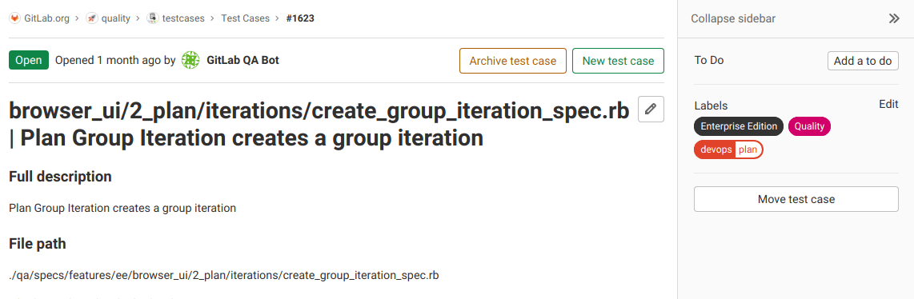

DETAILS:
**Tier:** Ultimate
**Offering:** GitLab.com, GitLab Self-Managed, GitLab Dedicated

Test cases in GitLab can help your teams create testing scenarios in their existing development platform.

Now your Implementation and Testing teams can collaborate better, as they no longer have to
use external test planning tools, which require additional overhead, context switching, and expense.

<i class="fa fa-youtube-play youtube" aria-hidden="true"></i>
To learn how to use issues and epics to manage your requirements and testing needs
while integrating with your development workflows, see
[Streamline Software Development: Integrating Requirements, Testing, and Development Workflows](https://www.youtube.com/watch?v=wbfWM4y2VmM).
<!-- Video published on 2024-02-21 -->

NOTE:
[Requirements](../../user/project/requirements/_index.md) and test cases are being
[migrated to work items](https://gitlab.com/groups/gitlab-org/-/epics/5171).
[Issue 323790](https://gitlab.com/gitlab-org/gitlab/-/issues/323790) proposes to link requirements to test cases.
For more information, see [Product Stage Direction - Plan](https://about.gitlab.com/direction/plan/).

## Create a test case

> - [Changed](https://gitlab.com/gitlab-org/gitlab/-/merge_requests/169256) the minimum user role from Reporter to Planner in GitLab 17.7.

Prerequisites:

- You must have at least the Planner role.

To create a test case in a GitLab project:

1. On the left sidebar, select **Search or go to** and find your project.
1. Select **Build > Test cases**.
1. Select **New test case**. You are taken to the new test case form. Here you can enter
   the new case's title, [description](../../user/markdown.md), attach a file, and assign [labels](../../user/project/labels.md).
1. Select **Submit test case**. You are taken to view the new test case.

## View a test case

You can view all test cases in the project in the test cases list. Filter the
issue list with a search query, including labels or the test case's title.

Prerequisites:

- Non-confidential test case in a public project: You don't have to be a member of the project.
- Non-confidential test case in a private project: You must have at least the Guest role for the project.
- Confidential test case (regardless of project visibility): You must have at least the Planner role for the project.

To view a test case:

1. On the left sidebar, select **Search or go to** and find your project.
1. Select **Build > Test cases**.
1. Select the title of the test case you want to view. You are taken to the test case page.

## Edit a test case

> - [Changed](https://gitlab.com/gitlab-org/gitlab/-/merge_requests/169256) the minimum user role from Reporter to Planner in GitLab 17.7.

You can edit a test case's title and description.

Prerequisites:

- You must have at least the Planner role.
- Users demoted to the Guest role can continue to edit the test cases they created
  when they were in the higher role.

To edit a test case:

1. [View a test case](#view-a-test-case).
1. Select **Edit title and description** (**{pencil}**).
1. Edit the test case's title or description.
1. Select **Save changes**.

## Make a test case confidential

> - Introduced for [new](https://gitlab.com/gitlab-org/gitlab/-/issues/422121) and [existing](https://gitlab.com/gitlab-org/gitlab/-/issues/422120) test cases in GitLab 16.5.
> - [Changed](https://gitlab.com/gitlab-org/gitlab/-/merge_requests/169256) the minimum user role from Reporter to Planner in GitLab 17.7.

If you're working on a test case that contains private information, you can make it confidential.

Prerequisites:

- You must have at least the Planner role.

To make a test case confidential:

- When you [create a test case](#create-a-test-case): under **Confidentiality**, select the **This test case is confidential** checkbox.
- When you [edit a test case](#edit-a-test-case): on the right sidebar, next to **Confidentiality**, select **Edit**, then select **Turn on**.

You can also use the `/confidential` [quick action](../../user/project/quick_actions.md) when both creating a new test case
or editing an existing one.

## Archive a test case

> - [Changed](https://gitlab.com/gitlab-org/gitlab/-/merge_requests/169256) the minimum user role from Reporter to Planner in GitLab 17.7.

When you want to stop using a test case, you can archive it. You can [reopen an archived test case](#reopen-an-archived-test-case) later.

Prerequisites:

- You must have at least the Planner role.

To archive a test case, on the test case's page, select **Archive test case**.

To view archived test cases:

1. On the left sidebar, select **Search or go to** and find your project.
1. Select **Build > Test cases**.
1. Select **Archived**.

## Reopen an archived test case

> - [Changed](https://gitlab.com/gitlab-org/gitlab/-/merge_requests/169256) the minimum user role from Reporter to Planner in GitLab 17.7.

If you decide to start using an archived test case again, you can reopen it.

Prerequisites:

- You must have at least the Planner role.

To reopen an archived test case:

1. [View a test case](#view-a-test-case).
1. Select **Reopen test case**.
