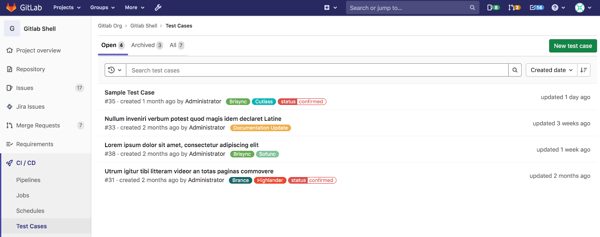
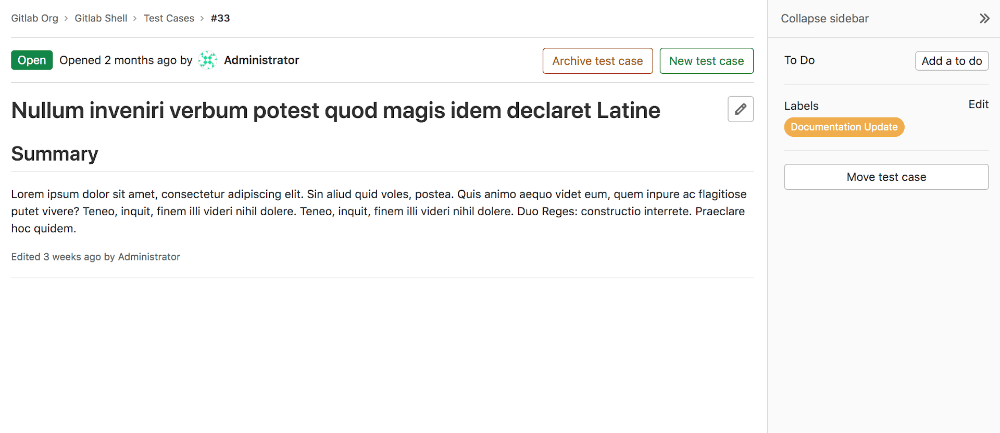

# Test Cases **(ULTIMATE)**

> - [Introduced](https://gitlab.com/gitlab-org/gitlab/-/issues/233479) in [GitLab Ultimate](https://about.gitlab.com/pricing/) 13.6.
> - It's [deployed behind a feature flag](../../user/feature_flags.md), enabled by default.
> - [Became enabled by default](https://gitlab.com/gitlab-org/gitlab/-/issues/241983) on GitLab 13.6.
> - It's enabled on GitLab.com.
> - It's recommended for production use.
> - For GitLab self-managed instances, GitLab administrators can opt to [disable it](#enable-or-disable-test-cases). **(ULTIMATE ONLY)**

Test cases in GitLab can help your teams create testing scenarios in their existing development platform.

This can help the Implementation and Testing teams collaborate, because they no longer have to
use external test planning tools, which require additional overhead, context switching, and expense.

## Create a test case

To create a test case in a GitLab project:

1. Navigate to **CI/CD > Test Cases**.
1. Select the **New test case** button. You are taken to the new test case form. Here you can enter
   the new case's title, [description](../../user/markdown.md), attach a file, and assign [labels](../../user/project/labels.md).
1. Select the **Submit test case** button. You are taken to view the new test case.

## View a test case

You can view all test cases in the project in the Test Cases list. Filter the
issue list with a search query, including labels or the test case's title.



To view a test case:

1. In a project, navigate to **CI/CD > Test Cases**.
1. Select the title of the test case you want to view. You are taken to the test case page.



## Archive a test case

When you want to stop using a test case, you can archive it. You can [reopen an archived test case](#reopen-an-archived-test-case) later.

To archive a test case, on the test case's page, select the **Archive test case** button.

To view archived test cases:

1. Navigate to **CI/CD > Test Cases**.
1. Select **Archived**.

## Reopen an archived test case

If you decide to start using an archived test case again, you can reopen it.

To reopen an archived test case, on the test case's page, select the **Reopen test case** button.

### Enable or disable Test Cases **(ULTIMATE ONLY)**

The GitLab Test Cases feature is under development but ready for production use.
It is deployed behind a feature flag that is **enabled by default**.
[GitLab administrators with access to the GitLab Rails console](../../administration/feature_flags.md)
can opt to disable it.

To enable it:

```ruby
Feature.enable(:quality_test_cases, Project.find_by_full_path('<project_path>'))
```

To disable it:

```ruby
Feature.disable(:quality_test_cases, Project.find_by_full_path('<project_path>'))
```
