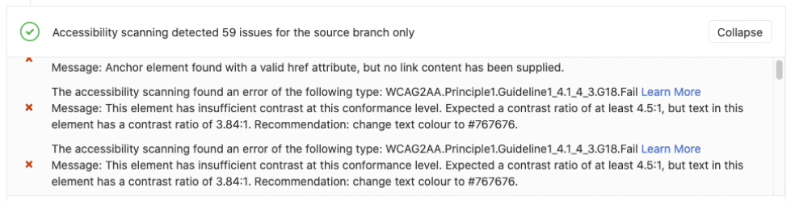

DETAILS:
**Tier:** Free, Premium, Ultimate
**Offering:** GitLab.com, GitLab Self-Managed, GitLab Dedicated

If your application offers a web interface, you can use
[GitLab CI/CD](../_index.md) to determine the accessibility
impact of pending code changes.

[Pa11y](https://pa11y.org/) is a free and open source tool for
measuring the accessibility of web sites. GitLab integrates Pa11y into a
[CI/CD job template](https://gitlab.com/gitlab-org/gitlab/-/blob/master/lib/gitlab/ci/templates/Verify/Accessibility.gitlab-ci.yml).
The `a11y` job analyzes a defined set of web pages and reports
accessibility violations, warnings, and notices in a file named
`accessibility`.

Pa11y uses [WCAG 2.1 rules](https://www.w3.org/TR/WCAG21/#new-features-in-wcag-2-1).

## Accessibility merge request widget

GitLab displays an **Accessibility Report** in the merge request widget area:



## Configure accessibility testing

You can run Pa11y with GitLab CI/CD using the
[GitLab Accessibility Docker image](https://gitlab.com/gitlab-org/ci-cd/accessibility).

To define the `a11y` job:

1. [Include](../yaml/_index.md#includetemplate) the
   [`Accessibility.gitlab-ci.yml` template](https://gitlab.com/gitlab-org/gitlab/-/blob/master/lib/gitlab/ci/templates/Verify/Accessibility.gitlab-ci.yml)
   from your GitLab installation.
1. Add the following configuration to your `.gitlab-ci.yml` file.

   ```yaml
   stages:
     - accessibility

   variables:
     a11y_urls: "https://about.gitlab.com https://gitlab.com/users/sign_in"

   include:
     - template: "Verify/Accessibility.gitlab-ci.yml"
   ```

1. Customize the `a11y_urls` variable to list the URLs of the web pages to test with Pa11y.

The `a11y` job in your CI/CD pipeline generates these files:

- One HTML report per URL listed in the `a11y_urls` variable.
- One file containing the collected report data. This
  file is named `gl-accessibility.json`.

You can [view job artifacts in your browser](../jobs/job_artifacts.md#download-job-artifacts).

NOTE:
The job definition provided by the template does not support Kubernetes.

You cannot pass configurations into Pa11y via CI configuration.
To change the configuration, edit a copy of the template in your CI file.
