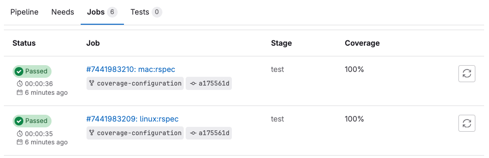
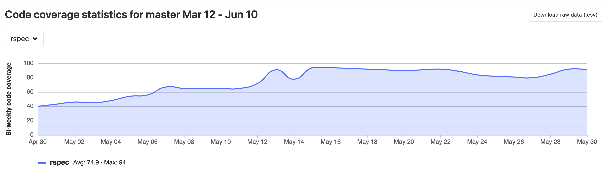

# Code coverage

DETAILS:
**Tier:** Free, Premium, Ultimate
**Offering:** GitLab.com, GitLab Self-Managed, GitLab Dedicated

Use code coverage to provide insights on what source code is being validated by a test suite. Code coverage is one of many test metrics that can determine software performance and quality.

## Code coverage results

Code coverage results are shown in:

- Merge request widget
- Project repository analytics
- Group repository analytics
- Repository badge

For more information on test coverage visualization in the file diff of the merge request, see [Test coverage visualization](test_coverage_visualization/index.md).

### Code coverage results in merge requests

If you use test coverage in your code, you can use a regular expression to
find coverage results in the job log. You can then include these results
in the merge request.

If the pipeline succeeds, the coverage is shown in the merge request widget and
in the jobs table. If multiple jobs in the pipeline have coverage reports, they are
averaged.




#### Add code coverage results to merge requests

You can display test coverage results in merge requests by adding the
[`coverage`](../yaml/_index.md#coverage) keyword to your project's `.gitlab-ci.yml` file.

To aggregate multiple test coverage values:

- For each job you want to include in the aggregate value,
  add the `coverage` keyword followed by a regular expression.

#### Test coverage examples

The following table lists sample regex patterns for many common test coverage tools.
If the tooling has changed after these samples were created, or if the tooling was customized,
the regex might not work. Test the regex carefully to make sure it correctly finds the
coverage in the tool's output:

<!-- vale gitlab_base.Spelling = NO -->
<!-- markdownlint-disable MD056 -->
<!-- Verify regex patterns on docs.gitlab.com as escape characters render differently than in `.md` files rendered via GitLab code browser -->

| Name         | Language     | Command      | Example      |
|--------------|--------------|--------------|--------------|
| Simplecov | Ruby | None | `/\(\d+.\d+\%\) covered/` |
| pytest-cov | Python | None | `/TOTAL.*? (100(?:\.0+)?\%|[1-9]?\d(?:\.\d+)?\%)$/` |
| Scoverage | Scala | None | `/(?i)total.*? (100(?:\.0+)?\%\|[1-9]?\d(?:\.\d+)?\%)$/` |
| pest | PHP | `pest --coverage --colors=never` | `/Statement coverage[A-Za-z\.*]\s*:\s*([^%]+)/` |
| phpunit | PHP | `phpunit --coverage-text --colors=never` | `/^\s*Lines:\s*\d+.\d+\%/` |
| gcovr | C/C++ | None | `/^TOTAL.*\s+(\d+\%)$/` |
| tap | NodeJs | `tap --coverage-report=text-summary` | `/^Statements\s*:\s*([^%]+)/` |
| nyc | NodeJs | `nyc npm test` | `/All files[^\|]*\|[^\|]*\s+([\d\.]+)/` |
| jest | NodeJs | `jest --ci --coverage` | `/All files[^\|]*\|[^\|]*\s+([\d\.]+)/` |
| excoveralls | Elixir | None | `/\[TOTAL\]\s+(\d+\.\d+)%/` |
| mix | Elixir | `mix test --cover` | `/\d+.\d+\%\s+\|\s+Total/` |
| JaCoCo | Java/Kotlin | None | `/Total.*?([0-9]{1,3})%/` |
| go test (single package) | Go | `go test -cover` | `/coverage: \d+.\d+% of statements/` |
| go test (whole project) | Go | `go test -coverprofile=cover.profile && go tool cover -func cover.profile` | `/total:\s+\(statements\)\s+\d+.\d+%/` |
| OpenCover | .NET | None | `/(Visited Points).*\((.*)\)/` |
| dotnet test ([MSBuild](https://github.com/coverlet-coverage/coverlet/blob/master/Documentation/MSBuildIntegration.md)) | .NET | `dotnet test` | `/Total\s*\|\s*(\d+(?:\.\d+)?)/` |
| tarpaulin | Rust | None | `/^\d+.\d+% coverage/` |
| Pester | PowerShell | None | `/Covered (\d+\.\d+%)/` |

<!-- vale gitlab_base.Spelling = YES -->
<!-- markdownlint-enable MD056 -->

### View code coverage history

You can track the evolution of code coverage for your project or group over time.

#### For a project

To view the code coverage history for a project:

1. On the left sidebar, select **Search or go to** and find your project.
1. Select **Analyze > Repository analytics**.
1. From the dropdown list, select the job you want to view historical data for.
1. Optional. To view a CSV file of the data, select **Download raw data (.csv)**.



#### For a group

DETAILS:
**Tier:** Premium, Ultimate
**Offering:** GitLab.com, GitLab Self-Managed, GitLab Dedicated

To view the code coverage history for all projects in a group:

1. On the left sidebar, select **Search or go to** and find your group.
1. Select **Analyze > Repository analytics**.
1. Optional. To view a CSV file of the data, select **Download historic test coverage data (.csv)**.


### Pipeline badges

You can use [pipeline badges](../../user/project/badges.md#test-coverage-report-badges) to indicate the pipeline status and
test coverage of your projects. These badges are determined by the latest successful pipeline.

## Add a coverage check approval rule

DETAILS:
**Tier:** Premium, Ultimate
**Offering:** GitLab.com, GitLab Self-Managed, GitLab Dedicated

You can require specific users or a group to approve merge requests that reduce the project's test coverage.

Prerequisites:

- Ensure you've [added code coverage results to your merge requests](#add-code-coverage-results-to-merge-requests).

To add a `Coverage-Check` approval rule:

1. Go to your project and select **Settings > Merge requests**.
1. Under **Merge request approvals**, do one of the following:
   - Next to the `Coverage-Check` approval rule, select **Enable**.
   - For manual setup, select **Add approval rule**, then enter the **Rule name**. For example: `Coverage Check`.
1. Select a **Target branch**.
1. Set the number of **Required number of approvals**.
1. Select the **Users** or **Groups** to provide approval.
1. Select **Save changes**.

## Troubleshooting

### Remove color codes from code coverage

Some test coverage tools output with ANSI color codes that aren't
parsed correctly by the regular expression. This causes coverage
parsing to fail.

Some coverage tools do not provide an option to disable color
codes in the output. If so, pipe the output of the coverage tool through a one-line script that strips the color codes.

For example:

```shell
lein cloverage | perl -pe 's/\e\[?.*?[\@-~]//g'
```
