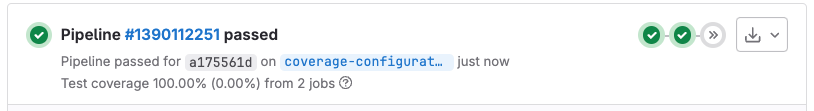

DETAILS:
**Tier:** Free, Premium, Ultimate
**Offering:** GitLab.com, GitLab Self-Managed, GitLab Dedicated

Configure code coverage to track and visualize how much of your source code is covered by tests. You can:

- Track overall coverage metrics and trends using the `coverage` keyword.
- Visualize line-by-line coverage using the `artifacts:reports:coverage_report` keyword.

## Configure coverage reporting

Use the [`coverage`](../../yaml/_index.md#coverage) keyword to monitor your test coverage and enforce coverage requirements in merge requests.

With coverage reporting, you can:

- Display the overall coverage percentage in merge requests.
- Aggregate coverage from multiple test jobs.
- Add coverage check approval rules.
- Track coverage trends over time.

To configure coverage reporting:

1. Add the `coverage` keyword to your pipeline configuration:

   ```yaml
   test-unit:
     script:
       - coverage run unit/
     coverage: '/TOTAL.+ ([0-9]{1,3}%)/'

   test-integration:
     script:
       - coverage run integration/
     coverage: '/TOTAL.+ ([0-9]{1,3}%)/'
   ```

1. Configure the regular expression (regex) to match your test output format.
   See [coverage regex patterns](#coverage-regex-patterns) for common patterns.
1. To aggregate coverage from multiple jobs, add the `coverage` keyword to each job you want to include.
1. Optional. [Add a coverage check approval rule](#add-a-coverage-check-approval-rule).

### Coverage regex patterns

The following sample regex patterns were designed to parse coverage output from common test coverage tools.

Test the regex patterns carefully. Tool output formats can change over time, and these patterns might no longer work as expected.

<!-- vale gitlab_base.Spelling = NO -->
<!-- markdownlint-disable MD056 -->
<!-- Verify regex patterns on docs.gitlab.com as escape characters render differently than in `.md` files rendered via GitLab code browser -->

::Tabs

:::TabTitle Python and Ruby

| Tool       | Language | Command        | Regex pattern |
|------------|----------|----------------|---------------|
| pytest-cov | Python   | `pytest --cov` | `/TOTAL.*? (100(?:\.0+)?\%|[1-9]?\d(?:\.\d+)?\%)$/` |
| Simplecov  | Ruby     | `rspec spec`   | `/\(\d+.\d+\%\) covered/` |

:::TabTitle C/C++ and Rust

| Tool      | Language | Command           | Regex pattern |
|-----------|----------|-------------------|---------------|
| gcovr     | C/C++    | `gcovr`           | `/^TOTAL.*\s+(\d+\%)$/` |
| tarpaulin | Rust     | `cargo tarpaulin` | `/^\d+.\d+% coverage/` |

:::TabTitle Java and JVM

| Tool      | Language    | Command                            | Regex pattern |
|-----------|-------------|------------------------------------|---------------|
| JaCoCo    | Java/Kotlin | `./gradlew test jacocoTestReport`  | `/Total.*?([0-9]{1,3})%/` |
| Scoverage | Scala       | `sbt coverage test coverageReport` | `/(?i)total.*? (100(?:\.0+)?\%\|[1-9]?\d(?:\.\d+)?\%)$/` |

:::TabTitle Node.js

| Tool | Command                              | Regex pattern |
|------|--------------------------------------|---------------|
| tap  | `tap --coverage-report=text-summary` | `/^Statements\s*:\s*([^%]+)/` |
| nyc  | `nyc npm test`                       | `/All files[^\|]*\|[^\|]*\s+([\d\.]+)/` |
| jest | `jest --ci --coverage`               | `/All files[^\|]*\|[^\|]*\s+([\d\.]+)/` |

:::TabTitle PHP

| Tool    | Command                                  | Regex pattern |
|---------|------------------------------------------|---------------|
| pest    | `pest --coverage --colors=never`         | `/Statement coverage[A-Za-z\.*]\s*:\s*([^%]+)/` |
| phpunit | `phpunit --coverage-text --colors=never` | `/^\s*Lines:\s*\d+.\d+\%/` |

:::TabTitle Go

| Tool              | Command          | Regex pattern |
|-------------------|------------------|---------------|
| go test (single)  | `go test -cover` | `/coverage: \d+.\d+% of statements/` |
| go test (project) | `go test -coverprofile=cover.profile && go tool cover -func cover.profile` | `/total:\s+\(statements\)\s+\d+.\d+%/` |

:::TabTitle .NET and PowerShell

| Tool      | Language   | Command | Regex pattern |
|-----------|------------|---------|---------------|
| OpenCover | .NET       | None    | `/(Visited Points).*\((.*)\)/` |
| dotnet test ([MSBuild](https://github.com/coverlet-coverage/coverlet/blob/master/Documentation/MSBuildIntegration.md)) | .NET | `dotnet test` | `/Total\s*\|*\s(\d+(?:\.\d+)?)/` |
| Pester    | PowerShell | None    | `/Covered (\d+\.\d+%)/` |

:::TabTitle Elixir

| Tool        | Command            | Regex pattern |
|-------------|--------------------|---------------|
| excoveralls | None               | `/\[TOTAL\]\s+(\d+\.\d+)%/` |
| mix         | `mix test --cover` | `/\d+.\d+\%\s+\|\s+Total/` |

::EndTabs

<!-- vale gitlab_base.Spelling = YES -->
<!-- markdownlint-enable MD056 -->

## Coverage visualization

Use the [`artifacts:reports:coverage_report`](../../yaml/artifacts_reports.md#artifactsreportscoverage_report)
keyword to view which specific lines of code are covered by tests in merge requests.

You can generate coverage reports in these formats:

- Cobertura: For multiple languages including Java, JavaScript, Python, and Ruby.
- JaCoCo: For Java projects only.

Coverage visualization uses [artifacts reports](../../yaml/_index.md#artifactsreports) to:

1. Collect one or more coverage reports, including from wildcard paths.
1. Combine the coverage information from all reports.
1. Display the combined results in merge request diffs.

Coverage files are parsed in a background job, so there might be a delay between
pipeline completion and the visualization appearing in the merge request.

By default, coverage visualization data expires one week after creation.

### Configure coverage visualization

To configure coverage visualization:

1. Configure your test tool to generate a coverage report.
1. Add the `artifacts:reports:coverage_report` configuration to your pipeline:

   ```yaml
   test:
     script:
       - run tests with coverage
     artifacts:
       reports:
         coverage_report:
           coverage_format: cobertura  # or jacoco
           path: coverage/coverage.xml
   ```

For language-specific configuration details see:

- [Cobertura coverage report](../code_coverage/cobertura.md)
- [JaCoCo coverage report](../code_coverage/jacoco.md)

### Coverage reports from child pipelines

> - [Introduced](https://gitlab.com/gitlab-org/gitlab/-/issues/363301) in GitLab 15.1 [with a flag](../../../administration/feature_flags.md) named `ci_child_pipeline_coverage_reports`. Disabled by default.
> - [Enabled on GitLab.com and GitLab Self-Managed](https://gitlab.com/gitlab-org/gitlab/-/issues/363557) and feature flag `ci_child_pipeline_coverage_reports` removed in GitLab 15.2.

Coverage reports generated in child pipelines are included in the parent pipeline's coverage report. For example:

```yaml
child_test_pipeline:
  trigger:
    include:
      - local: path/to/child_pipeline_with_coverage.yml
```

## Add a coverage check approval rule

DETAILS:
**Tier:** Premium, Ultimate

You can require specific users or a group to approve merge requests that reduce the project's test coverage.

Prerequisites:

- [Configure coverage reporting](#configure-coverage-reporting).

To add a `Coverage-Check` approval rule:

1. Go to your project and select **Settings > Merge requests**.
1. Under **Merge request approvals**, do one of the following:
   - Next to the `Coverage-Check` approval rule, select **Enable**.
   - For manual setup, select **Add approval rule**, then enter the **Rule name**. For example: `Coverage Check`.
1. Select a **Target branch**.
1. Set the number of **Required number of approvals**.
1. Select the **Users** or **Groups** to provide approval.
1. Select **Save changes**.

## View coverage results

After a pipeline runs successfully, you can view code coverage results in:

- Merge request widget: See the coverage percentage and changes compared to the target branch.

  

- Merge request diff: Review which lines are covered by tests. Available with Cobertura and JaCoCo reports.
- Pipeline jobs: Monitor coverage results for individual jobs.

## View coverage history

You can track the evolution of code coverage for your project or group over time.

### For a project

To view the code coverage history for a project:

1. On the left sidebar, select **Search or go to** and find your project.
1. Select **Analyze > Repository analytics**.
1. From the dropdown list, select the job you want to view historical data for.
1. Optional. To view a CSV file of the data, select **Download raw data (.csv)**.

### For a group

DETAILS:
**Tier:** Premium, Ultimate

To view the code coverage history for all projects in a group:

1. On the left sidebar, select **Search or go to** and find your group.
1. Select **Analyze > Repository analytics**.
1. Optional. To view a CSV file of the data, select **Download historic test coverage data (.csv)**.

## Display coverage badges

Share your project's code coverage status using pipeline badges.

To add a coverage badge to your project, see [test coverage report badges](../../../user/project/badges.md#test-coverage-report-badges).

## Troubleshooting

### Remove color codes from code coverage

Some test coverage tools output with ANSI color codes that aren't
parsed correctly by the regular expression. This causes coverage
parsing to fail.

Some coverage tools do not provide an option to disable color
codes in the output. If so, pipe the output of the coverage tool through a one-line script that strips the color codes.

For example:

```shell
lein cloverage | perl -pe 's/\e\[?.*?[\@-~]//g'
```
