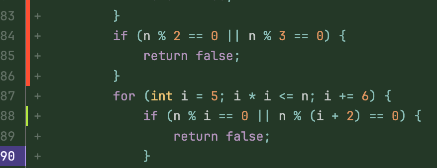



- Tier: Free, Premium, Ultimate
- Offering: GitLab.com, GitLab Self-Managed, GitLab Dedicated





- [Introduced](https://gitlab.com/gitlab-org/gitlab/-/issues/227345) in GitLab 17.3 [with a flag](../../../administration/feature_flags/_index.md) named `jacoco_coverage_reports`. Disabled by default.
- [Generally available](https://gitlab.com/gitlab-org/gitlab/-/merge_requests/170513) in GitLab 17.6. Feature flag `jacoco_coverage_reports` removed.



[Leave your feedback](https://gitlab.com/gitlab-org/gitlab/-/issues/479804)

For JaCoCo coverage reports to work, you must generate a properly formatted [JaCoCo XML file](https://www.jacoco.org/jacoco/trunk/coverage/jacoco.xml)
that provides [line coverage](https://www.eclemma.org/jacoco/trunk/doc/counters.html).



Aggregated reports from multi-module projects are not supported. To contribute to aggregated report support, see [issue 491015](https://gitlab.com/gitlab-org/gitlab/-/issues/491015).



The JaCoCo coverage reports visualization supports:

- [Instructions (C0 Coverage)](https://www.eclemma.org/jacoco/trunk/doc/counters.html),
  `ci` (covered instructions) in reports.

Coverage information displays in the merge request diff view with these indicators:

- Instructions covered (green): Lines with at least one covered instruction (`ci > 0`)
- No instructions covered (red): Lines without any covered instructions (`ci = 0`)
- No coverage information: Lines not included in the coverage report

For example, with this report output:

```xml
<line nr="83" mi="2" ci="0" mb="0" cb="0"/>
<line nr="84" mi="2" ci="0" mb="0" cb="0"/>
<line nr="85" mi="2" ci="0" mb="0" cb="0"/>
<line nr="86" mi="2" ci="0" mb="0" cb="0"/>
<line nr="88" mi="0" ci="7" mb="0" cb="1"/>
```

The merge request diff view displays coverage as follows:



In this example, lines 83-86 show red bars for uncovered code, line 88 shows a green bar for covered code, and lines 87, 89-90 have no coverage data.

## Add JaCoCo coverage job

To configure your pipeline to generate the coverage reports, add a job to your
`.gitlab-ci.yml` file. For example:

```yaml
test-jdk11:
  stage: test
  image: maven:3.6.3-jdk-11
  script:
    - mvn $MAVEN_CLI_OPTS clean org.jacoco:jacoco-maven-plugin:prepare-agent test jacoco:report
  artifacts:
    reports:
      coverage_report:
        coverage_format: jacoco
        path: target/site/jacoco/jacoco.xml
```

In this example, the `mvn` command generates the JaCoCo coverage report. The `path`
points to the generated report.

If the job generates multiple reports, [use a wildcard in the artifact path](_index.md#configure-coverage-visualization).

## Relative File Paths Correction

## File path conversion

JaCoCo reports provide relative file paths but coverage report visualizations require
absolute paths. GitLab attempts to convert the relative paths to absolute paths, using
data from the related merge requests.

The path matching process is:

1. Find all the merge requests for the same pipeline ref.
1. For all the files that changed, find all the absolute paths.
1. For each relative path in the report, use the first matching absolute path.

This process might not always be able to find a suitable matching absolute path.

### Multiple modules or source directories

With identical file names for multiple modules or source directories, it might not be
possible to find the absolute path by default.

For example, GitLab cannot find the absolute paths if these files are changed in a merge request:

- `src/main/java/org/acme/DemoExample.java`
- `src/main/other-module/org/acme/DemoExample.java`

For path conversion to succeed, you must have some unique difference in the relative paths.
For example, you can change one of the file or directory names:

- Change the filename:

  ```diff
  src/main/java/org/acme/DemoExample.java
  - src/main/other-module/org/acme/DemoExample.java
  + src/main/other-module/org/acme/OtherDemoExample.java
  ```

- Change the path:

  ```diff
  src/main/java/org/acme/DemoExample.java
  - src/main/other-module/org/acme/DemoExample.java
  + src/main/other-module/org/other-acme/DemoExample.java
  ```

You can also add a new directory, as long as the complete relative path is unique.

## Troubleshooting

### Metrics do not display for all changed files

Metrics might not display correctly if you create a new merge request from the same source branch,
but with a different target branch.

The job doesn't consider the diffs from the new merge request and doesn't
display any metrics for files not contained in the diff of the other merge request.
This happens even when the generated coverage report contain metrics for the specified file.

To fix this issue, wait until the new merge request is created, then rerun your pipeline
or start a new one. Then the new merge request is taken into account.
