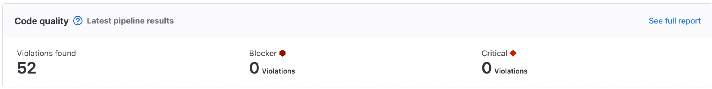

# Code Quality

DETAILS:
**Tier:** Free, Premium, Ultimate
**Offering:** GitLab.com, Self-managed, GitLab Dedicated

Use Code Quality to analyze your source code's quality and complexity. This helps keep your
project's code simple, readable, and easier to maintain. Code Quality should supplement your
other review processes, not replace them.

Code Quality runs in CI/CD pipelines, and helps you avoid merging changes that would degrade your code's quality.

Code Quality uses the open source Code Climate tool, and selected
[plugins](https://docs.codeclimate.com/docs/list-of-engines), to analyze your source code.
To confirm if your code's languages are covered, see the Code Climate list of
[Supported Languages for Maintainability](https://docs.codeclimate.com/docs/supported-languages-for-maintainability).
You can extend the code coverage either by using Code Climate
[Analysis Plugins](https://docs.codeclimate.com/docs/list-of-engines) or a
[custom tool](#implement-a-custom-tool).

## Features per tier

Different features are available in different [GitLab tiers](https://about.gitlab.com/pricing/),
as shown in the following table:

| Feature                                                               | In Free                | In Premium             | In Ultimate            |
|:----------------------------------------------------------------------|:-----------------------|:-----------------------|:-----------------------|
| [Configure scanners](#customizing-scan-settings)                      | **{check-circle}** Yes | **{check-circle}** Yes | **{check-circle}** Yes |
| [Integrate custom scanners](#implement-a-custom-tool)                 | **{check-circle}** Yes | **{check-circle}** Yes | **{check-circle}** Yes |
| [Generate JSON or HTML report artifacts](#output)                     | **{check-circle}** Yes | **{check-circle}** Yes | **{check-circle}** Yes |
| [Findings in merge request widget](#merge-request-widget)             | **{check-circle}** Yes | **{check-circle}** Yes | **{check-circle}** Yes |
| [Findings in pipelines](#pipeline-details-view)                       | **{dotted-circle}** No | **{check-circle}** Yes | **{check-circle}** Yes |
| [Findings in merge request changes view](#merge-request-changes-view) | **{dotted-circle}** No | **{dotted-circle}** No | **{check-circle}** Yes |
| [Summary in project quality view](#project-quality-view)              | **{dotted-circle}** No | **{dotted-circle}** No | **{check-circle}** Yes |

## View Code Quality results

Code Quality results are shown in the:

- Merge request widget
- Merge request changes view
- Pipeline details view
- Project quality view

### Merge request widget

Code Quality analysis results display in the merge request widget area if a report from the target
branch is available for comparison. The merge request widget displays Code Quality findings and resolutions that
were introduced by the changes made in the merge request. Multiple Code Quality findings with identical
fingerprints display as a single entry in the merge request widget. Each individual finding is available in the
full report available in the **Pipeline** details view.


### Merge request changes view

DETAILS:
**Tier:** Ultimate
**Offering:** GitLab.com, Self-managed, GitLab Dedicated

Code Quality results display in the merge request **Changes** view. Lines containing Code Quality
issues are marked by a symbol beside the gutter. Select the symbol to see the list of issues, then select an issue to see its details.


### Pipeline details view

DETAILS:
**Tier:** Premium, Ultimate
**Offering:** GitLab.com, Self-managed, GitLab Dedicated

The full list of Code Quality violations generated by a pipeline is shown in the **Code Quality**
tab of the pipeline's details page. The pipeline details view displays all Code Quality findings
that were found on the branch it was run on.


### Project quality view

DETAILS:
**Tier:** Ultimate
**Offering:** GitLab.com, Self-managed
**Status:** Beta

> - [Introduced](https://gitlab.com/gitlab-org/gitlab/-/merge_requests/72724) in GitLab 14.5 [with a flag](../../administration/feature_flags.md) named `project_quality_summary_page`. This feature is in [beta](../../policy/experiment-beta-support.md). Disabled by default.

The project quality view displays an overview of the code quality findings. The view can be found under **Analyze > CI/CD analytics**, and requires [`project_quality_summary_page`](../../user/feature_flags.md) feature flag to be enabled for this particular project.



## Enable Code Quality

Prerequisites:

- GitLab CI/CD configuration (`.gitlab-ci.yml`) must include the `test` stage.
- If you're using instance runners, the Code Quality job must be configured for the
  [Docker-in-Docker workflow](../docker/using_docker_build.md#use-docker-in-docker).
  When using this workflow, the `/builds` volume must be mapped to allow reports to be saved.
- If you're using private runners, you should use an
  [alternative configuration](#improve-code-quality-performance-with-private-runners)
  recommended for running Code Quality analysis more efficiently.
- The runner must have enough disk space to store the generated Code Quality files. For example, on
  the [GitLab project](https://gitlab.com/gitlab-org/gitlab) the files are approximately 7 GB.

To enable Code Quality, either:

- Enable [Auto DevOps](../../topics/autodevops/index.md), which includes
  [Auto Code Quality](../../topics/autodevops/stages.md#auto-code-quality).

- Include the [Code Quality template](https://gitlab.com/gitlab-org/gitlab/-/blob/master/lib/gitlab/ci/templates/Jobs/Code-Quality.gitlab-ci.yml) in your
  `.gitlab-ci.yml` file.

  Example:

  ```yaml
     include:
     - template: Jobs/Code-Quality.gitlab-ci.yml
  ```

  Code Quality now runs in pipelines.

WARNING:
On self-managed instances, if a malicious actor compromises the Code Quality job definition they
could execute privileged Docker commands on the runner host. Having proper access control policies
mitigates this attack vector by allowing access only to trusted actors.

### Improve Code Quality performance with private runners

If you have private runners, you should use this configuration for improved performance of Code
Quality because:

- Privileged mode is not used.
- Docker-in-Docker is not used.
- Docker images, including all CodeClimate images, are cached, and not re-fetched for subsequent jobs.

This alternative configuration uses socket binding to share the Runner's Docker daemon
with the job environment. Before implementing this configuration, consider its
[limitations](../docker/using_docker_build.md#use-the-docker-executor-with-docker-socket-binding).

To use private runners:

1. Register a new runner:

   ```shell
   $ gitlab-runner register --executor "docker" \
     --docker-image="docker:latest" \
     --url "https://gitlab.com/" \
     --description "cq-sans-dind" \
     --docker-volumes "/cache"\
     --docker-volumes "/builds:/builds"\
     --docker-volumes "/var/run/docker.sock:/var/run/docker.sock" \
     --registration-token="<project_token>" \
     --non-interactive
   ```

1. **Optional, but recommended:** Set the builds directory to `/tmp/builds`,
   so job artifacts are periodically purged from the runner host. If you skip
   this step, you must clean up the default builds directory (`/builds`) yourself.
   You can do this by adding the following two flags to `gitlab-runner register`
   in the previous step.

   ```shell
   --builds-dir "/tmp/builds"
   --docker-volumes "/tmp/builds:/tmp/builds" # Use this instead of --docker-volumes "/builds:/builds"
   ```

   The resulting configuration:

   ```toml
   [[runners]]
     name = "cq-sans-dind"
     url = "https://gitlab.com/"
     token = "<project_token>"
     executor = "docker"
     builds_dir = "/tmp/builds"
     [runners.docker]
       tls_verify = false
       image = "docker:latest"
       privileged = false
       disable_entrypoint_overwrite = false
       oom_kill_disable = false
       disable_cache = false
       volumes = ["/cache", "/var/run/docker.sock:/var/run/docker.sock", "/tmp/builds:/tmp/builds"]
       shm_size = 0
     [runners.cache]
       [runners.cache.s3]
       [runners.cache.gcs]
   ```

1. Apply two overrides to the `code_quality` job created by the template:

   ```yaml
   include:
     - template: Jobs/Code-Quality.gitlab-ci.yml

   code_quality:
     services:            # Shut off Docker-in-Docker
     tags:
       - cq-sans-dind     # Set this job to only run on our new specialized runner
   ```

Code Quality now runs in standard Docker mode.

### Run Code Quality rootless with private runners

If you are using private runners and would like to run the Code Quality scans [in rootless Docker mode](https://docs.docker.com/engine/security/rootless/) code quality requires some special changes to allow it to run properly. This may require having a runner dedicated to running only code quality jobs because changes in socket binding may cause problems in other jobs.

To use a rootless private runner:

1. Register a new runner:

   Replace `/run/user/<gitlab-runner-user>/docker.sock` with the path to the local `docker.sock` for the `gitlab-runner` user.

   ```shell
   $ gitlab-runner register --executor "docker" \
     --docker-image="docker:latest" \
     --url "https://gitlab.com/" \
     --description "cq-rootless" \
     --tag-list "cq-rootless" \
     --locked="false" \
     --access-level="not_protected" \
     --docker-volumes "/cache" \
     --docker-volumes "/tmp/builds:/tmp/builds" \
     --docker-volumes "/run/user/<gitlab-runner-user>/docker.sock:/run/user/<gitlab-runner-user>/docker.sock" \
     --token "<project_token>" \
     --non-interactive \
     --builds-dir "/tmp/builds" \
     --env "DOCKER_HOST=unix:///run/user/<gitlab-runner-user>/docker.sock" \
     --docker-host "unix:///run/user/<gitlab-runner-user>/docker.sock"
   ```

   The resulting configuration:

   ```toml
   [[runners]]
     name = "cq-rootless"
     url = "https://gitlab.com/"
     token = "<project_token>"
     executor = "docker"
     builds_dir = "/tmp/builds"
     environment = ["DOCKER_HOST=unix:///run/user/<gitlab-runner-user>/docker.sock"]
     [runners.docker]
       tls_verify = false
       image = "docker:latest"
       privileged = false
       disable_entrypoint_overwrite = false
       oom_kill_disable = false
       disable_cache = false
       volumes = ["/cache", "/run/user/<gitlab-runner-user>/docker.sock:/run/user/<gitlab-runner-user>/docker.sock", "/tmp/builds:/tmp/builds"]
       shm_size = 0
       host = "unix:///run/user/<gitlab-runner-user>/docker.sock"
     [runners.cache]
       [runners.cache.s3]
       [runners.cache.gcs]
   ```

1. Apply the following overrides to the `code_quality` job created by the template:

   ```yaml
   code_quality:
     services:
     variables:
       DOCKER_SOCKET_PATH: /run/user/997/docker.sock
     tags:
       - cq-rootless
   ```

Code Quality now runs in standard Docker mode and rootless.

The same configuration is required if your goal is to [use rootless Podman to run Docker](https://docs.gitlab.com/runner/executors/docker.html#use-podman-to-run-docker-commands) with code quality. Make sure to replace `/run/user/<gitlab-runner-user>/docker.sock` with the correct `podman.sock` path in your system, for example: `/run/user/<gitlab-runner-user>/podman/podman.sock`.

## Disable Code Quality

The `code_quality` job doesn't run if the `$CODE_QUALITY_DISABLED` CI/CD variable
is present. For more information about how to define a variable, see
[GitLab CI/CD variables](../variables/index.md).

To disable Code Quality, create a custom CI/CD variable named `CODE_QUALITY_DISABLED`, for either:

- [The whole project](../variables/index.md#for-a-project).
- [A single pipeline](../pipelines/index.md#run-a-pipeline-manually).

## Customizing scan settings

The Code Quality scan settings can be changed using [CI/CD variables](#available-cicd-variables)
in `.gitlab-ci.yml`.

To configure the Code Quality job:

1. Declare a job with the same name as the Code Quality job, after the template's inclusion.
1. Specify additional keys in the job's stanza.

For an example, see [Download output in HTML format](#output-in-only-html-format).

## Available CI/CD variables

Code Quality can be customized by defining available CI/CD variables:

| CI/CD variable                  | Description |
|---------------------------------|-------------|
| `CODECLIMATE_DEBUG`             | Set to enable [Code Climate debug mode](https://github.com/codeclimate/codeclimate#environment-variables). |
| `CODECLIMATE_DEV`               | Set to enable `--dev` mode which lets you run engines not known to the CLI. |
| `CODECLIMATE_PREFIX`            | Set a prefix to use with all `docker pull` commands in CodeClimate engines. Useful for [offline scanning](https://github.com/codeclimate/codeclimate/pull/948). For more information, see [Use a private container registry](#use-a-private-container-image-registry). |
| `CODECLIMATE_REGISTRY_USERNAME` | Set to specify the username for the registry domain parsed from `CODECLIMATE_PREFIX`. |
| `CODECLIMATE_REGISTRY_PASSWORD` | Set to specify the password for the registry domain parsed from `CODECLIMATE_PREFIX`. |
| `CODE_QUALITY_DISABLED`         | Prevents the Code Quality job from running. |
| `CODE_QUALITY_IMAGE`            | Set to a fully prefixed image name. Image must be accessible from your job environment. |
| `ENGINE_MEMORY_LIMIT_BYTES`     | Set the memory limit for engines. Default: 1,024,000,000 bytes. |
| `REPORT_STDOUT`                 | Set to print the report to `STDOUT` instead of generating the usual report file. |
| `REPORT_FORMAT`                 | Set to control the format of the generated report file. Either `json` or `html`. |
| `SOURCE_CODE`                   | Path to the source code to scan. Must be the absolute path to a directory where cloned sources are stored. |
| `TIMEOUT_SECONDS`               | Custom timeout per engine container for the `codeclimate analyze` command. Default: 900 seconds (15 minutes) |

## Output

Code Quality outputs a report containing details of issues found. The content of this report is
processed internally and the results shown in the UI. The report is also output as a job artifact of
the `code_quality` job, named `gl-code-quality-report.json`. You can optionally output the report in
HTML format. For example, you could publish the HTML format file on GitLab Pages for even easier
reviewing.

### Output in JSON and HTML format

To output the Code Quality report in JSON and HTML format, you create an additional job. This requires
Code Quality to be run twice, once each for file format.

To output the Code Quality report in HTML format, add another job to your template by using
`extends: code_quality`:

```yaml
include:
  - template: Jobs/Code-Quality.gitlab-ci.yml

code_quality_html:
  extends: code_quality
  variables:
    REPORT_FORMAT: html
  artifacts:
    paths: [gl-code-quality-report.html]
```

Both the JSON and HTML files are output as job artifacts. The HTML file is contained in the
`artifacts.zip` job artifact.

### Output in only HTML format

To download the Code Quality report in _only_ HTML format, set `REPORT_FORMAT` to `html`, overriding
the default definition of the `code_quality` job.

NOTE:
This does not create a JSON format file, so Code Quality results are not shown in the merge request
widget, pipeline report, or changes view.

```yaml
include:
  - template: Jobs/Code-Quality.gitlab-ci.yml

code_quality:
  variables:
    REPORT_FORMAT: html
  artifacts:
    paths: [gl-code-quality-report.html]
```

The HTML file is output as a job artifact.

## Use Code Quality with merge request pipelines

The default Code Quality configuration does not allow the `code_quality` job to run on
[merge request pipelines](../pipelines/merge_request_pipelines.md).

To enable Code Quality to run on merge request pipelines, overwrite the code quality `rules`,
or [`workflow: rules`](../yaml/index.md#workflow), so that they match your current `rules`.

For example:

```yaml
include:
  - template: Jobs/Code-Quality.gitlab-ci.yml

code_quality:
  rules:
    - if: $CODE_QUALITY_DISABLED
      when: never
    - if: $CI_PIPELINE_SOURCE == "merge_request_event" # Run code quality job in merge request pipelines
    - if: $CI_COMMIT_BRANCH == $CI_DEFAULT_BRANCH      # Run code quality job in pipelines on the default branch (but not in other branch pipelines)
    - if: $CI_COMMIT_TAG                               # Run code quality job in pipelines for tags
```

## Use a private container image registry

Using a private container image registry can reduce the time taken to download images, and also
reduce external dependencies. You must configure the registry prefix to be passed down
to CodeClimate's subsequent `docker pull` commands for individual engines, because of
the nested method of container execution.

The following variables can address all of the required image pulls:

- `CODE_QUALITY_IMAGE`: A fully prefixed image name that can be located anywhere
  accessible from your job environment. GitLab container registry can be used here
  to host your own copy.
- `CODECLIMATE_PREFIX`: The domain of your intended container image registry. This
  is a configuration option supported by [CodeClimate CLI](https://github.com/codeclimate/codeclimate/pull/948).
  You must:
  - Include a trailing slash (`/`).
  - Not include a protocol prefix, such as `https://`.
- `CODECLIMATE_REGISTRY_USERNAME`: An optional variable to specify the username for the registry domain parsed from `CODECLIMATE_PREFIX`.
- `CODECLIMATE_REGISTRY_PASSWORD`: An optional variable to specify the password for the registry domain parsed from `CODECLIMATE_PREFIX`.

```yaml
include:
  - template: Jobs/Code-Quality.gitlab-ci.yml

code_quality:
  variables:
    CODE_QUALITY_IMAGE: "my-private-registry.local:12345/codequality:0.85.24"
    CODECLIMATE_PREFIX: "my-private-registry.local:12345/"
```

This example is specific to GitLab Code Quality. For more general instructions on how to configure
DinD with a registry mirror, see
[Enable registry mirror for Docker-in-Docker service](../docker/using_docker_build.md#enable-registry-mirror-for-dockerdind-service).

### Required images

The following images are required for the [default `.codeclimate.yml`](https://gitlab.com/gitlab-org/ci-cd/codequality/-/blob/master/codeclimate_defaults/.codeclimate.yml.template):

- `codeclimate/codeclimate-structure:latest`
- `codeclimate/codeclimate-csslint:latest`
- `codeclimate/codeclimate-coffeelint:latest`
- `codeclimate/codeclimate-duplication:latest`
- `codeclimate/codeclimate-eslint:latest`
- `codeclimate/codeclimate-fixme:latest`
- `codeclimate/codeclimate-rubocop:rubocop-0-92`

If you are using a custom `.codeclimate.yml` configuration file, you must add the specified plugins in your private container registry.

## Use DockerHub with authentication

You can use DockerHub as an alternate source of the Code Quality images.

Prerequisites:

- Add the username and password as [protected CI/CD variables](../variables/index.md#for-a-project)
  in the project.

To use DockerHub, configure the following variables in the `.gitlab-ci.yml` file:

- `CODECLIMATE_PREFIX`
- `CODECLIMATE_REGISTRY_USERNAME`
- `CODECLIMATE_REGISTRY_PASSWORD`

Example:

```yaml
include:
  - template: Jobs/Code-Quality.gitlab-ci.yml

code_quality:
  variables:
    CODECLIMATE_PREFIX: "registry-1.docker.io/"
    CODECLIMATE_REGISTRY_USERNAME: $DOCKERHUB_USERNAME
    CODECLIMATE_REGISTRY_PASSWORD: $DOCKERHUB_PASSWORD
```

## Use the Dependency Proxy

You can use a Dependency Proxy to reduce the time taken to download dependencies.

Prerequisites:

- [Dependency Proxy](../../user/packages/dependency_proxy/index.md) enabled in the project's
  group.

To reference the Dependency Proxy, configure the following variables in the `.gitlab-ci.yml` file:

- `CODE_QUALITY_IMAGE`
- `CODECLIMATE_PREFIX`
- `CODECLIMATE_REGISTRY_USERNAME`
- `CODECLIMATE_REGISTRY_PASSWORD`

For example:

```yaml
include:
  - template: Jobs/Code-Quality.gitlab-ci.yml

code_quality:
  variables:
    ## You must add a trailing slash to `$CI_DEPENDENCY_PROXY_GROUP_IMAGE_PREFIX`.
    CODECLIMATE_PREFIX: $CI_DEPENDENCY_PROXY_GROUP_IMAGE_PREFIX/
    CODECLIMATE_REGISTRY_USERNAME: $CI_DEPENDENCY_PROXY_USER
    CODECLIMATE_REGISTRY_PASSWORD: $CI_DEPENDENCY_PROXY_PASSWORD
```

## Implement a custom tool

You can integrate a custom tool into GitLab to provide Code Quality reports.

The Code Quality report artifact JSON file must contain an array of objects with the following
properties:

| Name                                                      | Description |
|-----------------------------------------------------------|-------------|
| `description`                                             | A description of the code quality violation. |
| `check_name`                                              | A unique name representing the static analysis check that emitted this issue. |
| `fingerprint`                                             | A unique fingerprint to identify the code quality violation. For example, an MD5 hash. |
| `severity`                                                | A severity string (can be `info`, `minor`, `major`, `critical`, or `blocker`). |
| `location.path`                                           | The relative path to the file containing the code quality violation. |
| `location.lines.begin` or `location.positions.begin.line` | The line on which the code quality violation occurred. |

NOTE:
Although the Code Climate specification supports more properties, those are ignored by GitLab.
The GitLab parser does not allow a [byte order mark](https://en.wikipedia.org/wiki/Byte_order_mark)
at the beginning of the file.

To implement a custom Code Quality tool:

1. Define a job in your `.gitlab-ci.yml` file that generates the
   [Code Quality report artifact](../yaml/artifacts_reports.md#artifactsreportscodequality).
1. Configure the tool to generate the Code Quality report artifact as a JSON
   file that implements a subset of the [Code Climate spec](https://github.com/codeclimate/platform/blob/master/spec/analyzers/SPEC.md#data-types).

Example:

```json
[
  {
    "description": "'unused' is assigned a value but never used.",
    "check_name": "no-unused-vars",
    "fingerprint": "7815696ecbf1c96e6894b779456d330e",
    "severity": "minor",
    "location": {
      "path": "lib/index.js",
      "lines": {
        "begin": 42
      }
    }
  }
]
```

## Integrate multiple tools

Code Quality combines the results from all jobs in a pipeline into a single `gl-code-quality-report.json` file. As a result, multiple individual tools can be used in a pipeline, either alongside, or in place of, the supported `Code-Quality.gitlab-ci.yml` template.

Here is an example that returns ESLint output in the necessary format:

```yaml
eslint:
  image: node:18-alpine
  script:
    - npm ci
    - npx eslint --format gitlab .
  artifacts:
    reports:
      codequality: gl-code-quality-report.json
```

## Using Analysis Plugins

Code Quality functionality can be extended by using Code Climate
[Analysis Plugins](https://docs.codeclimate.com/docs/list-of-engines).

For example, to use the [SonarJava analyzer](https://docs.codeclimate.com/docs/sonar-java):

1. Add a file named `.codeclimate.yml` to the root of your repository
1. Add the [enablement code](https://docs.codeclimate.com/docs/sonar-java#enable-the-plugin)
   for the plugin to the root of your repository to the `.codeclimate.yml` file:

   ```yaml
   version: "2"
   plugins:
     sonar-java:
       enabled: true
   ```

This adds SonarJava to the `plugins:` section of the
[default `.codeclimate.yml`](https://gitlab.com/gitlab-org/ci-cd/codequality/-/blob/master/codeclimate_defaults/.codeclimate.yml.template)
included in your project.

Changes to the `plugins:` section do not affect the `exclude_patterns` section of the default
`.codeclimate.yml`. See the Code Climate documentation on
[excluding files and folders](https://docs.codeclimate.com/docs/excluding-files-and-folders)
for more details.

## Using Code Quality in Kubernetes and OpenShift

You must set up Docker in a Docker container (Docker-in-Docker) to use Code Quality. The Kubernetes executor [supports Docker-in-Docker](https://docs.gitlab.com/runner/executors/kubernetes/index.html#using-dockerdind).

To ensure Code Quality jobs can run on a Kubernetes executor:

- If you're using TLS to communicate with the Docker daemon, the executor [must be running in privileged mode](https://docs.gitlab.com/runner/executors/kubernetes/index.html#other-configtoml-settings). Additionally, the certificate directory must be [specified as a volume mount](../docker/using_docker_build.md#docker-in-docker-with-tls-enabled-in-kubernetes).
- It is possible that the DinD service doesn't start up fully before the Code Quality job starts. This is a limitation documented in
  [Troubleshooting the Kubernetes executor](https://docs.gitlab.com/runner/executors/kubernetes/troubleshooting.html#docker-cannot-connect-to-the-docker-daemon-at-tcpdocker2375-is-the-docker-daemon-running). To resolve the issue, use `before_script` to wait for the Docker daemon to fully boot up. For an example, see the configuration in the `.gitlab-ci.yml` file below.

### Kubernetes

To run Code Quality in Kubernetes:

- The Docker in Docker service must be added as a service container in the `config.toml` file.
- The Docker daemon in the service container must listen on a TCP and UNIX socket, as both sockets are required by Code Quality.
- The Docker socket must be shared with a volume.

Due to a [Docker requirement](https://docs.docker.com/reference/cli/docker/container/run/#privileged), the privileged flag
must be enabled for the service container.

```toml
[runners.kubernetes]

[runners.kubernetes.service_container_security_context]
privileged = true
allow_privilege_escalation = true

[runners.kubernetes.volumes]

[[runners.kubernetes.volumes.empty_dir]]
mount_path = "/var/run/"
name = "docker-sock"

[[runners.kubernetes.services]]
alias = "dind"
command = [
    "--host=tcp://0.0.0.0:2375",
    "--host=unix://var/run/docker.sock",
    "--storage-driver=overlay2"
]
entrypoint = ["dockerd"]
name = "docker:20.10.12-dind"
```

NOTE:
If you use the [GitLab Runner Helm Chart](https://docs.gitlab.com/runner/install/kubernetes.html), you can use
the above Kubernetes configuration in the [`config` field](https://docs.gitlab.com/runner/install/kubernetes.html#additional-configuration)
in the `values.yaml` file.

To ensure that you use the `overlay2` [storage driver](https://docs.docker.com/storage/storagedriver/select-storage-driver/), which offers the best overall performance:

- Specify the `DOCKER_HOST` that the Docker CLI communicates with.
- Set the `DOCKER_DRIVER` variable to empty.

Use the `before_script` section to wait for the Docker daemon to fully boot up. Since GitLab Runner v16.9, this can also be done [by just setting the `HEALTHCHECK_TCP_PORT` variable](https://docs.gitlab.com/runner/executors/kubernetes/index.html#define-a-list-of-services).

```yaml
include:
  - template: Code-Quality.gitlab-ci.yml

code_quality:
  services: []
  variables:
    DOCKER_HOST: tcp://dind:2375
    DOCKER_DRIVER: ""
  before_script:
    - while ! docker info > /dev/null 2>&1; do sleep 1; done
```

### OpenShift

For OpenShift, you should use the [GitLab Runner Operator](https://docs.gitlab.com/runner/install/operator.html).
To give the Docker daemon in the service container permissions to initialize its storage,
you must mount the `/var/lib` directory as a volume mount.

NOTE:
If you cannot to mount the `/var/lib` directory as a volume mount, you can set `--storage-driver` to `vfs` instead.
If you opt for the `vfs` value, it might have a negative
impact on [performance](https://docs.docker.com/storage/storagedriver/select-storage-driver/).

To configure permissions for the Docker daemon,

1. Create a file called `config.toml` with the configuration provided below. This configuration will be used to customized GitLab Runner generated `config.toml`:

```toml
[[runners]]

[runners.kubernetes]

[runners.kubernetes.service_container_security_context]
privileged = true
allow_privilege_escalation = true

[runners.kubernetes.volumes]

[[runners.kubernetes.volumes.empty_dir]]
mount_path = "/var/run/"
name = "docker-sock"

[[runners.kubernetes.volumes.empty_dir]]
mount_path = "/var/lib/"
name = "docker-data"

[[runners.kubernetes.services]]
alias = "dind"
command = [
    "--host=tcp://0.0.0.0:2375",
    "--host=unix://var/run/docker.sock",
    "--storage-driver=overlay2"
]
entrypoint = ["dockerd"]
name = "docker:20.10.12-dind"
```

1. [Set the custom configuration to your runner](https://docs.gitlab.com/runner/configuration/configuring_runner_operator.html#customize-configtoml-with-a-configuration-template).

1. Optional. Attach a [`privileged` service account](https://docs.openshift.com/container-platform/3.11/admin_guide/manage_scc.html)
   to the build Pod. This depends on your OpenShift cluster setup:

   ```shell
   oc create sa dind-sa
   oc adm policy add-scc-to-user anyuid -z dind-sa
   oc adm policy add-scc-to-user -z dind-sa privileged
   ```

1. Set the permissions in the [`[runners.kubernetes]` section](https://docs.gitlab.com/runner/executors/kubernetes/index.html#other-configtoml-settings).
1. Set the job definition stays the same as in Kubernetes case:

   ```yaml
   include:
   - template: Code-Quality.gitlab-ci.yml

   code_quality:
   services: []
   variables:
     DOCKER_HOST: tcp://dind:2375
     DOCKER_DRIVER: ""
   before_script:
     - while ! docker info > /dev/null 2>&1; do sleep 1; done
   ```

#### Volumes and Docker storage

Docker stores all of its data in the `/var/lib` volume, which could result in a large volume. To reuse Docker-in-Docker storage across the cluster,
you can use [Persistent Volumes](https://kubernetes.io/docs/concepts/storage/persistent-volumes/) as an alternative.
