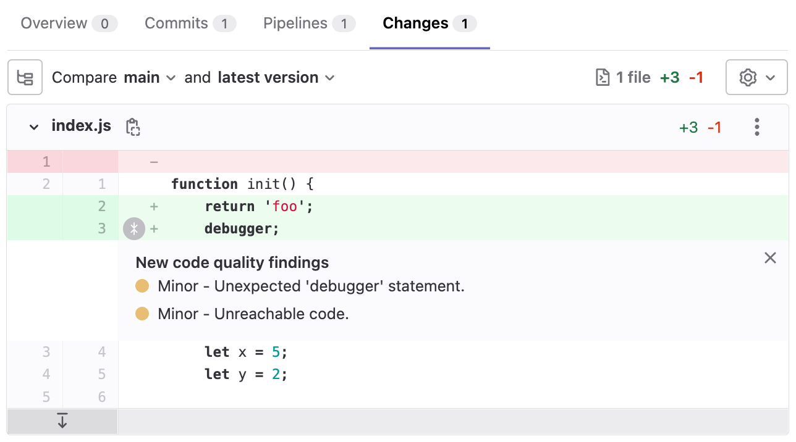

# Code Quality **(FREE)**

> [Moved](https://gitlab.com/gitlab-org/gitlab/-/issues/212499) to GitLab Free in 13.2.

Use Code Quality to analyze your source code's quality and complexity. This helps keep your
project's code simple, readable, and easier to maintain. Code Quality should supplement your
other review processes, not replace them.

Code Quality uses the open source Code Climate tool, and selected
[plugins](https://docs.codeclimate.com/docs/list-of-engines), to analyze your source code.
To confirm if your code's languages are covered, see the Code Climate list of
[Supported Languages for Maintainability](https://docs.codeclimate.com/docs/supported-languages-for-maintainability).
You can extend the code coverage either by using Code Climate
[Analysis Plugins](https://docs.codeclimate.com/docs/list-of-engines) or a
[custom tool](#implement-a-custom-tool).

Run Code Quality reports in your CI/CD pipeline to verify changes don't degrade your code's quality,
_before_ committing them to the default branch.

## Features per tier

Different features are available in different [GitLab tiers](https://about.gitlab.com/pricing/),
as shown in the following table:

| Capability                                                             | In Free             | In Premium          | In Ultimate        |
|:-----------------------------------------------------------------------|:--------------------|:--------------------|:-------------------|
| [Configure scanners](#customizing-scan-settings)                       | **{check-circle}**  | **{check-circle}**  | **{check-circle}** |
| [Integrate custom scanners](#implement-a-custom-tool)                  | **{check-circle}**  | **{check-circle}**  | **{check-circle}** |
| [See findings in merge request widget](#merge-request-widget)          | **{check-circle}**  | **{check-circle}**  | **{check-circle}** |
| [Generate JSON or HTML report artifacts](#output)                      | **{check-circle}**  | **{check-circle}**  | **{check-circle}** |
| [See reports in CI pipelines](#pipeline-details-view)                  | **{dotted-circle}** | **{check-circle}**  | **{check-circle}** |
| [See findings in merge request diff view](#merge-request-changes-view) | **{dotted-circle}** | **{dotted-circle}** | **{check-circle}** |

## View Code Quality results

Code Quality results are shown in the:

- Merge request widget
- Merge request changes view
- Pipeline details view
- Project quality view

### Merge request widget

> [Moved](https://gitlab.com/gitlab-org/gitlab/-/issues/212499) to GitLab Free in 13.2.

Code Quality analysis results display in the merge request widget area if a report from the target
branch is available for comparison.


### Merge request changes view **(ULTIMATE)**

> - [Introduced](https://gitlab.com/gitlab-org/gitlab/-/issues/267612) in GitLab 13.11, disabled by default behind the `codequality_mr_diff` [feature flag](../../administration/feature_flags.md).
> - [Enabled by default](https://gitlab.com/gitlab-org/gitlab/-/issues/284140) in GitLab 13.12.
> - [Disabled by default](https://gitlab.com/gitlab-org/gitlab/-/issues/2526) in GitLab 14.0 due to [this issue](https://gitlab.com/gitlab-org/gitlab/-/issues/334116).
> - [Inline annotation added](https://gitlab.com/gitlab-org/gitlab/-/issues/2526) and [feature flag removed](https://gitlab.com/gitlab-org/gitlab/-/issues/284140) in GitLab 14.1.

Code Quality results display in the merge request **Changes** view. Lines containing Code Quality
issues are marked by an indicator beside the gutter. Hover over the marker for details of the issue.



### Pipeline details view **(PREMIUM)**

The full list of Code Quality violations generated by a pipeline is shown in the **Code Quality**
tab of the pipeline's details page.


### Project quality view **(ULTIMATE)**

The project quality view displays an overview of the code quality findings. The view can be found under **Analytics > CI/CD**, and requires [`project_quality_summary_page`](../../user/feature_flags.md) feature flag to be enabled for this particular project.


## Enable Code Quality

Prerequisites:

- GitLab CI/CD configuration (`.gitlab-ci.yml`) must include the `test` stage.
- If you're using shared runners, the Code Quality job must be configured for the
  [Docker-in-Docker workflow](../docker/using_docker_build.md#use-docker-in-docker).
- If you're using private runners, you should use an
  [alternative configuration](#improve-code-quality-performance-with-private-runners)
  recommended for running Code Quality analysis more efficiently.
- The runner must have enough disk space to store the generated Code Quality files. For example, on
  the [GitLab project](https://gitlab.com/gitlab-org/gitlab) the files are approximately 7 GB.

To enable Code Quality, either:

- Enable [Auto DevOps](../../topics/autodevops/index.md), which includes
  [Auto Code Quality](../../topics/autodevops/stages.md#auto-secret-detection).

- Include the Code Quality template in your
  `.gitlab-ci.yml` file.

  Example:

  ```yaml
     include:
     - template: Code-Quality.gitlab-ci.yml
  ```

  Code Quality now runs in pipelines.

WARNING:
On self-managed instances, if a malicious actor compromises the Code Quality job definition they
could execute privileged Docker commands on the runner host. Having proper access control policies
mitigates this attack vector by allowing access only to trusted actors.

### Improve Code Quality performance with private runners

If you have private runners, you should use this configuration for improved performance of Code
Quality because:

- Privileged mode is not used.
- Docker-in-Docker is not used.
- Docker images, including all CodeClimate images, are cached, and not re-fetched for subsequent jobs.

This alternative configuration uses socket binding to share the Runner's Docker daemon
with the job environment. Before implementing this configuration, consider its
[limitations](../docker/using_docker_build.md#use-docker-socket-binding).

To use private runners:

1. Register a new runner:

   ```shell
   $ gitlab-runner register --executor "docker" \
     --docker-image="docker:stable" \
     --url "https://gitlab.com/" \
     --description "cq-sans-dind" \
     --tag-list "cq-sans-dind" \
     --locked="false" \
     --access-level="not_protected" \
     --docker-volumes "/cache"\
     --docker-volumes "/builds:/builds"\
     --docker-volumes "/var/run/docker.sock:/var/run/docker.sock" \
     --registration-token="<project_token>" \
     --non-interactive
   ```

1. **Optional, but recommended:** Set the builds directory to `/tmp/builds`,
  so job artifacts are periodically purged from the runner host. If you skip
  this step, you must clean up the default builds directory (`/builds`) yourself.
  You can do this by adding the following two flags to `gitlab-runner register`
  in the previous step.

   ```shell
   --builds-dir "/tmp/builds"
   --docker-volumes "/tmp/builds:/tmp/builds" # Use this instead of --docker-volumes "/builds:/builds"
   ```

   The resulting configuration:

   ```toml
   [[runners]]
     name = "cq-sans-dind"
     url = "https://gitlab.com/"
     token = "<project_token>"
     executor = "docker"
     builds_dir = "/tmp/builds"
     [runners.docker]
       tls_verify = false
       image = "docker:stable"
       privileged = false
       disable_entrypoint_overwrite = false
       oom_kill_disable = false
       disable_cache = false
       volumes = ["/cache", "/var/run/docker.sock:/var/run/docker.sock", "/tmp/builds:/tmp/builds"]
       shm_size = 0
     [runners.cache]
       [runners.cache.s3]
       [runners.cache.gcs]
   ```

1. Apply two overrides to the `code_quality` job created by the template:

   ```yaml
   include:
     - template: Code-Quality.gitlab-ci.yml

   code_quality:
     services:            # Shut off Docker-in-Docker
     tags:
       - cq-sans-dind     # Set this job to only run on our new specialized runner
   ```

Code Quality now runs in standard Docker mode.

## Disable Code Quality

The `code_quality` job doesn't run if the `$CODE_QUALITY_DISABLED` CI/CD variable
is present. For more information about how to define a variable, see
[GitLab CI/CD variables](../variables/index.md).

To disable Code Quality, create a custom CI/CD variable named `CODE_QUALITY_DISABLED`, for either:

- [The whole project](../variables/index.md#for-a-project).
- [A single pipeline](../pipelines/index.md#run-a-pipeline-manually).

## Customizing scan settings

The Code Quality scan settings can be changed using [CI/CD variables](#available-cicd-variables)
in `.gitlab-ci.yml`.

To configure the Code Quality job:

1. Declare a job with the same name as the Code Quality job, after the template's inclusion.
1. Specify additional keys in the job's stanza.

For an example, see [Download output in JSON format](#download-output-in-json-format).

### Available CI/CD variables

> In [GitLab 13.4 and later](https://gitlab.com/gitlab-org/gitlab/-/issues/11100), the option to override the Code Quality environment variables was added.

Code Quality can be customized by defining available CI/CD variables:

| CI/CD variable              | Description |
| --------------------------- | ----------- |
| `SOURCE_CODE`               | Path to the source code to scan. |
| `TIMEOUT_SECONDS`           | Custom timeout for the `codeclimate analyze` command. |
| `CODECLIMATE_DEBUG`         | Set to enable [Code Climate debug mode](https://github.com/codeclimate/codeclimate#environment-variables) |
| `CODECLIMATE_DEV`           | Set to enable `--dev` mode which lets you run engines not known to the CLI. |
| `REPORT_STDOUT`             | Set to print the report to `STDOUT` instead of generating the usual report file. |
| `REPORT_FORMAT`             | Set to control the format of the generated report file. One of: `json\|html`. |
| `ENGINE_MEMORY_LIMIT_BYTES` | Set the memory limit for engines, default is 1,024,000,000 bytes. |
| `CODE_QUALITY_DISABLED`     | Prevents the Code Quality job from running. |
| `CODECLIMATE_PREFIX`        | Set a prefix to use with all `docker pull` commands in CodeClimate engines. Useful for [offline scanning](https://github.com/codeclimate/codeclimate/pull/948). |

## Output

Code Quality creates a file named `gl-code-quality-report.json`. The content of this file is
processed internally and the results shown in the UI. To see the raw results, you can
configure the Code Quality job to allow download of this file. Format options are JSON format, HTML
format, or both. Use the HTML format to view the report in a more human-readable
format. For example, you could publish the HTML format file on GitLab Pages for even easier
reviewing.

### Download output in JSON format

To be able to download the Code Quality report in JSON format, declare the
`gl-code-quality-report.json` file as an artifact of the `code_quality` job:

```yaml
include:
  - template: Code-Quality.gitlab-ci.yml

code_quality:
  artifacts:
    paths: [gl-code-quality-report.json]
```

The full JSON file is available as a
[downloadable artifact](../jobs/job_artifacts.md#download-job-artifacts) of the `code_quality`
job.

### Download output in JSON and HTML format

> HTML report format [introduced](https://gitlab.com/gitlab-org/ci-cd/codequality/-/issues/10) in GitLab 13.6.

NOTE:
To create the HTML format file, the Code Quality job must be run twice, once for each format.
In this configuration, the JSON format file is created but it is only processed internally.

To be able to download the Code Quality report in both JSON and HTML format, add another job to your
template by using `extends: code_quality`:

```yaml
include:
  - template: Code-Quality.gitlab-ci.yml

code_quality_html:
  extends: code_quality
  variables:
    REPORT_FORMAT: html
  artifacts:
    paths: [gl-code-quality-report.html]
```

Both the JSON and HTML files are available as
[downloadable artifacts](../jobs/job_artifacts.md#download-job-artifacts) of the `code_quality`
job.

### Download output in only HTML format

To download the Code Quality report in _only_ an HTML format file, set `REPORT_FORMAT` to `html` in
the existing job.

NOTE:
This does not create a JSON format file, so Code Quality results are not shown in the
merge request widget, pipeline report, or changes view.

```yaml
include:
  - template: Code-Quality.gitlab-ci.yml

code_quality:
  variables:
    REPORT_FORMAT: html
  artifacts:
    paths: [gl-code-quality-report.html]
```

The HTML file is available as a
[downloadable artifact](../jobs/job_artifacts.md#download-job-artifacts) of the `code_quality`
job.

## Use Code Quality with merge request pipelines

The default Code Quality configuration does not allow the `code_quality` job to run on
[merge request pipelines](../pipelines/merge_request_pipelines.md).

To enable Code Quality to run on merge request pipelines, overwrite the code quality `rules`,
or [`workflow: rules`](../yaml/index.md#workflow), so that they match your current `rules`.

For example:

```yaml
include:
  - template: Code-Quality.gitlab-ci.yml

code_quality:
  rules:
    - if: $CODE_QUALITY_DISABLED
      when: never
    - if: $CI_PIPELINE_SOURCE == "merge_request_event" # Run code quality job in merge request pipelines
    - if: $CI_COMMIT_BRANCH == $CI_DEFAULT_BRANCH      # Run code quality job in pipelines on the default branch (but not in other branch pipelines)
    - if: $CI_COMMIT_TAG                               # Run code quality job in pipelines for tags
```

## Use a private container image registry

> [Introduced](https://gitlab.com/gitlab-org/ci-cd/codequality/-/merge_requests/30) in GitLab 13.7.

Using a private container image registry can reduce the time taken to download images, and also
reduce external dependencies. Because of the nested architecture of container execution, the
registry prefix must be specifically configured to be passed down into CodeClimate's subsequent
`docker pull` commands for individual engines.

The following variables can address all of the required image pulls:

- `CODE_QUALITY_IMAGE`: A fully prefixed image name that can be located anywhere
  accessible from your job environment. GitLab Container Registry can be used here
  to host your own copy.
- `CODECLIMATE_PREFIX`: The domain of your intended container image registry. This
  is a configuration option supported by [CodeClimate CLI](https://github.com/codeclimate/codeclimate/pull/948).
  You must:
  - Include a trailing slash (`/`).
  - Not include a protocol prefix, such as `https://`.
- `CODECLIMATE_REGISTRY_USERNAME`: An optional variable to specify the username for the registry domain parsed from `CODECLIMATE_PREFIX`.
- `CODECLIMATE_REGISTRY_PASSWORD`: An optional variable to specify the password for the registry domain parsed from `CODECLIMATE_PREFIX`.

```yaml
include:
  - template: Code-Quality.gitlab-ci.yml

code_quality:
  variables:
    CODE_QUALITY_IMAGE: "my-private-registry.local:12345/codequality:0.85.24"
    CODECLIMATE_PREFIX: "my-private-registry.local:12345/"
```

This example is specific to GitLab Code Quality. For more general instructions on how to configure
DinD with a registry mirror, see
[Enable registry mirror for Docker-in-Docker service](../docker/using_docker_build.md#enable-registry-mirror-for-dockerdind-service).

### Required images

The following images are required for the [default `.codeclimate.yml`](https://gitlab.com/gitlab-org/ci-cd/codequality/-/blob/master/codeclimate_defaults/.codeclimate.yml.template):

- `codeclimate/codeclimate-structure:latest`
- `codeclimate/codeclimate-csslint:latest`
- `codeclimate/codeclimate-coffeelint:latest`
- `codeclimate/codeclimate-duplication:latest`
- `codeclimate/codeclimate-eslint:latest`
- `codeclimate/codeclimate-fixme:latest`
- `codeclimate/codeclimate-rubocop:rubocop-0-92`

If you are using a custom `.codeclimate.yml` configuration file, you must add the specified plugins in your private container registry.

## Use DockerHub with authentication

You can use DockerHub as an alternate source of the Code Quality images.

Prerequisites:

- Add the username and password as [protected CI/CD variables](../variables/index.md#for-a-project)
  in the project.

To use DockerHub, configure the following variables in the `.gitlab-ci.yml` file:

- `CODECLIMATE_PREFIX`
- `CODECLIMATE_REGISTRY_USERNAME`
- `CODECLIMATE_REGISTRY_PASSWORD`

Example:

```yaml
include:
  - template: Jobs/Code-Quality.gitlab-ci.yml

code_quality:
  variables:
    CODECLIMATE_PREFIX: "registry-1.docker.io/"
    CODECLIMATE_REGISTRY_USERNAME: $DOCKERHUB_USERNAME
    CODECLIMATE_REGISTRY_PASSWORD: $DOCKERHUB_PASSWORD
```

## Use the Dependency Proxy

You can use a Dependency Proxy to reduce the time taken to download dependencies.

Prerequisite:

- [Dependency Proxy](../../user/packages/dependency_proxy/index.md) enabled in the project's
  group.

To reference the Dependency Proxy, configure the following variables in the `.gitlab-ci.yml` file:

- `CODE_QUALITY_IMAGE`
- `CODECLIMATE_PREFIX`
- `CODECLIMATE_REGISTRY_USERNAME`
- `CODECLIMATE_REGISTRY_PASSWORD`

For example:

```yaml
include:
  - template: Code-Quality.gitlab-ci.yml

code_quality:
  variables:
    ## You must add a trailing slash to `$CI_DEPENDENCY_PROXY_GROUP_IMAGE_PREFIX`.
    CODECLIMATE_PREFIX: $CI_DEPENDENCY_PROXY_GROUP_IMAGE_PREFIX/
    CODECLIMATE_REGISTRY_USERNAME: $CI_DEPENDENCY_PROXY_USER
    CODECLIMATE_REGISTRY_PASSWORD: $CI_DEPENDENCY_PROXY_PASSWORD
```

## Implement a custom tool

You can integrate a custom tool into GitLab to provide Code Quality reports.

The Code Quality report artifact JSON file must contain an array of objects with the following
properties:

| Name                   | Description                                                                               |
| ---------------------- | ----------------------------------------------------------------------------------------- |
| `description`          | A description of the code quality violation.                                              |
| `check_name`           | A unique name representing the static analysis check that emitted this issue.             |
| `fingerprint`          | A unique fingerprint to identify the code quality violation. For example, an MD5 hash.    |
| `severity`             | A severity string (can be `info`, `minor`, `major`, `critical`, or `blocker`).            |
| `location.path`        | The relative path to the file containing the code quality violation.                      |
| `location.lines.begin` or `location.positions.begin.line` | The line on which the code quality violation occurred. |

NOTE:
Although the Code Climate specification supports more properties, those are ignored by GitLab.
The GitLab parser does not allow a [byte order mark](https://en.wikipedia.org/wiki/Byte_order_mark)
at the beginning of the file.

To implement a custom Code Quality tool:

1. Define a job in your `.gitlab-ci.yml` file that generates the
   [Code Quality report artifact](../yaml/artifacts_reports.md#artifactsreportscodequality).
1. Configure the tool to generate the Code Quality report artifact as a JSON
   file that implements a subset of the [Code Climate spec](https://github.com/codeclimate/platform/blob/master/spec/analyzers/SPEC.md#data-types).

Example:

```json
[
  {
    "description": "'unused' is assigned a value but never used.",
    "check_name": "no-unused-vars",
    "fingerprint": "7815696ecbf1c96e6894b779456d330e",
    "severity": "minor",
    "location": {
      "path": "lib/index.js",
      "lines": {
        "begin": 42
      }
    }
  }
]
```

## Using Analysis Plugins

Code Quality functionality can be extended by using Code Climate
[Analysis Plugins](https://docs.codeclimate.com/docs/list-of-engines).

For example, to use the [SonarJava analyzer](https://docs.codeclimate.com/docs/sonar-java):

1. Add a file named `.codeclimate.yml` to the root of your repository
1. Add to the `.codeclimate.yml` the [enablement code](https://docs.codeclimate.com/docs/sonar-java#enable-the-plugin)
  for the plugin to the root of your repository:

  ```yaml
  version: "2"
  plugins:
    sonar-java:
      enabled: true
  ```

This adds SonarJava to the `plugins:` section of the
[default `.codeclimate.yml`](https://gitlab.com/gitlab-org/ci-cd/codequality/-/blob/master/codeclimate_defaults/.codeclimate.yml.template)
included in your project.

Changes to the `plugins:` section do not affect the `exclude_patterns` section of the default
`.codeclimate.yml`. See the Code Climate documentation on
[excluding files and folders](https://docs.codeclimate.com/docs/excluding-files-and-folders)
for more details.

## Troubleshooting

### Changing the default configuration has no effect

A common issue is that the terms `Code Quality` (GitLab specific) and `Code Climate`
(Engine used by GitLab) are very similar. You must add a **`.codeclimate.yml`** file
to change the default configuration, **not** a `.codequality.yml` file. If you use
the wrong filename, the [default `.codeclimate.yml`](https://gitlab.com/gitlab-org/ci-cd/codequality/-/blob/master/codeclimate_defaults/.codeclimate.yml.template)
is still used.

### No Code Quality report is displayed in a merge request

This can be due to multiple reasons:

- You just added the Code Quality job in your `.gitlab-ci.yml`. The report does not have anything to
  compare to yet, so no information can be displayed. It only displays after future merge requests
  have something to compare to.
- Your pipeline is not set to run the code quality job on your target branch. If there is no report
  generated from the target branch, your merge request branch reports have nothing to compare to. In this
  situation you get an error stating `Base pipeline codequality artifact not found`.
- The [`artifacts:expire_in`](../yaml/index.md#artifactsexpire_in) CI/CD setting can cause the Code
  Quality artifacts to expire faster than desired.
- The widgets use the pipeline of the latest commit to the target branch. If commits are made to the
  default branch that do not run the code quality job, this may cause the merge request widget to
  have no base report for comparison.
- If you use the [`REPORT_STDOUT` environment variable](https://gitlab.com/gitlab-org/ci-cd/codequality#environment-variables),
  no report file is generated and nothing displays in the merge request.

### Only a single Code Quality report is displayed, but more are defined

Starting [in GitLab 15.7](https://gitlab.com/gitlab-org/gitlab/-/issues/340525), Code Quality combines the results from all jobs in a pipeline.

In previous versions, GitLab only uses the Code Quality artifact from the latest created job (with the largest job ID).
If multiple jobs in a pipeline generate a code quality artifact, those of earlier jobs are ignored.

To avoid confusion, configure only one job to generate a `gl-code-quality-report.json` file.

### RuboCop errors

When using Code Quality jobs on a Ruby project, you can encounter problems running RuboCop.
For example, the following error can appear when using either a very recent or very old version
of Ruby:

```plaintext
/usr/local/bundle/gems/rubocop-0.52.1/lib/rubocop/config.rb:510:in `check_target_ruby':
Unknown Ruby version 2.7 found in `.ruby-version`. (RuboCop::ValidationError)
Supported versions: 2.1, 2.2, 2.3, 2.4, 2.5
```

This is caused by the default version of RuboCop used by the check engine not covering
support for the Ruby version in use.

To use a custom version of RuboCop that
[supports the version of Ruby used by the project](https://docs.rubocop.org/rubocop/compatibility.html#support-matrix),
you can [override the configuration through a `.codeclimate.yml` file](https://docs.codeclimate.com/docs/rubocop#using-rubocops-newer-versions)
created in the project repository.

For example, to specify using RuboCop release **0.67**:

```yaml
version: "2"
plugins:
  rubocop:
    enabled: true
    channel: rubocop-0-67
```

### No Code Quality appears on merge requests when using custom tool

If your merge requests do not show any Code Quality changes when using a custom tool, ensure that
the line property is an `integer`.

### Error: `Could not analyze code quality`

You might get the error:

```shell
error: (CC::CLI::Analyze::EngineFailure) engine pmd ran for 900 seconds and was killed
Could not analyze code quality for the repository at /code
```

If you enabled any of the Code Climate plugins, and the Code Quality CI/CD job fails with this
error message, it's likely the job takes longer than the default timeout of 900 seconds:

To work around this problem, set `TIMEOUT_SECONDS` to a higher value in your `.gitlab.-ci.yml` file.

For example:

```yaml
variables:
  TIMEOUT_SECONDS: 3600
```

### Using Code Quality with Kubernetes CI executor

Code Quality requires a Docker in Docker setup to work. The Kubernetes executor already [has support for this](https://docs.gitlab.com/runner/executors/kubernetes.html#using-dockerdind).

To ensure Code Quality jobs can run on a Kubernetes executor:

- If you're using TLS to communicate with the Docker daemon, the executor [must be running in privileged mode](https://docs.gitlab.com/runner/executors/kubernetes.html#other-configtoml-settings). Additionally, the certificate directory must be [specified as a volume mount](../docker/using_docker_build.md#docker-in-docker-with-tls-enabled-in-kubernetes).
- It is possible that the DinD service doesn't start up fully before the Code Quality job starts. This is a limitation documented in
the [Kubernetes executor for GitLab Runner](https://docs.gitlab.com/runner/executors/kubernetes.html#docker-cannot-connect-to-the-docker-daemon-at-tcpdocker2375-is-the-docker-daemon-running) troubleshooting section.

### Error: `x509: certificate signed by unknown authority`

If you set the `CODE_QUALITY_IMAGE` to an image that is hosted in a Docker registry which uses a TLS
certificate that is not trusted, such as a self-signed certificate, you can see errors like the one
below:

```shell
$ docker pull --quiet "$CODE_QUALITY_IMAGE"
Error response from daemon: Get https://gitlab.example.com/v2/: x509: certificate signed by unknown authority
```

To fix this, configure the Docker daemon to [trust certificates](https://docs.docker.com/registry/insecure/#use-self-signed-certificates)
by putting the certificate inside of the `/etc/docker/certs.d` directory.

This Docker daemon is exposed to the subsequent Code Quality Docker container in the
[GitLab Code Quality template](https://gitlab.com/gitlab-org/gitlab/-/blob/v13.8.3-ee/lib/gitlab/ci/templates/Jobs/Code-Quality.gitlab-ci.yml#L41)
and should be to exposed any other containers in which you want to have your certificate
configuration apply.

#### Docker

If you have access to GitLab Runner configuration, add the directory as a
[volume mount](https://docs.gitlab.com/runner/configuration/advanced-configuration.html#volumes-in-the-runnersdocker-section).

Replace `gitlab.example.com` with the actual domain of the registry.

Example:

```toml
[[runners]]
  ...
  executor = "docker"
  [runners.docker]
    ...
    privileged = true
    volumes = ["/cache", "/etc/gitlab-runner/certs/gitlab.example.com.crt:/etc/docker/certs.d/gitlab.example.com/ca.crt:ro"]
```

#### Kubernetes

If you have access to GitLab Runner configuration and the Kubernetes cluster,
you can [mount a ConfigMap](https://docs.gitlab.com/runner/executors/kubernetes.html#configmap-volumes).

Replace `gitlab.example.com` with the actual domain of the registry.

1. Create a ConfigMap with the certificate:

   ```shell
   kubectl create configmap registry-crt --namespace gitlab-runner --from-file /etc/gitlab-runner/certs/gitlab.example.com.crt
   ```

1. Update GitLab Runner `config.toml` to specify the ConfigMap:

   ```toml
   [[runners]]
     ...
     executor = "kubernetes"
     [runners.kubernetes]
       image = "alpine:3.12"
       privileged = true
       [[runners.kubernetes.volumes.config_map]]
         name = "registry-crt"
         mount_path = "/etc/docker/certs.d/gitlab.example.com/ca.crt"
         sub_path = "gitlab.example.com.crt"
   ```
