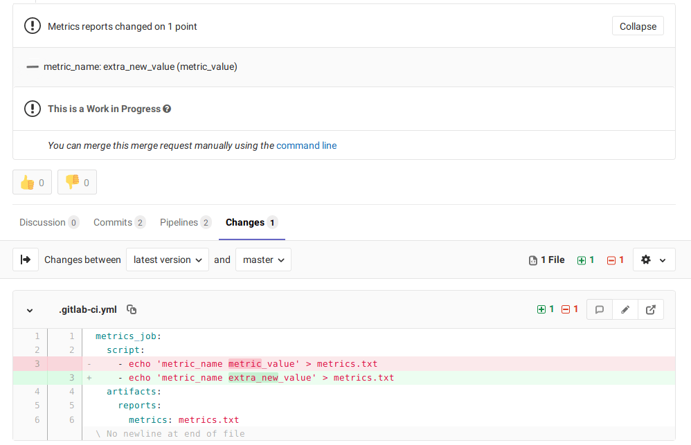

DETAILS:
**Tier:** Premium, Ultimate
**Offering:** GitLab.com, GitLab Self-Managed, GitLab Dedicated

GitLab provides a lot of great reporting tools for things like [merge requests](../../user/project/merge_requests/_index.md) - [Unit test reports](unit_test_reports.md), [code quality](code_quality.md), and performance tests. While JUnit is a great open framework for tests that "pass" or "fail", it is also important to see other types of metrics from a given change.

You can configure your job to use custom Metrics Reports, and GitLab displays a report on the merge request so that it's easier and faster to identify changes without having to check the entire log.



## Use cases

Consider the following examples of data that can use Metrics Reports:

1. Memory usage
1. Load testing results
1. Code complexity
1. Code coverage stats

## How it works

Metrics for a branch are read from the latest metrics report artifact (default filename: `metrics.txt`) as string values.

For an MR, the values of these metrics from the feature branch are compared to the values from the target branch. Then they are displayed in the MR widget in this order:

- Existing metrics with changed values.
- Metrics that have been added by the MR. Marked with a **New** badge.
- Metrics that have been removed by the MR. Marked with a **Removed** badge.
- Existing metrics with unchanged values.

## How to set it up

Add a job that creates a [metrics report](../yaml/artifacts_reports.md#artifactsreportsmetrics) (default filename: `metrics.txt`). The file should conform to the [OpenMetrics](https://openmetrics.io/) format.

For example:

```yaml
metrics:
  script:
    - echo 'metric_name metric_value' > metrics.txt
  artifacts:
    reports:
      metrics: metrics.txt
```

## Advanced Example

An advanced example of an OpenMetrics text file (from the [Prometheus documentation](https://github.com/prometheus/docs/blob/master/content/docs/instrumenting/exposition_formats.md#text-format-example))
renders in the merge request widget as:


## Troubleshooting

### Metrics reports did not change

You can see `Metrics reports did not change` when trying to view metrics reports in merge requests. Reasons for this are:

- The target branch for the merge request doesn't have a baseline metrics report for comparison.
- You don't have a paid subscription.

There is [an issue open](https://gitlab.com/gitlab-org/gitlab/-/issues/343065) to improve this message.
