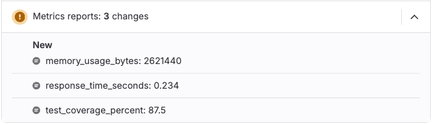



- Tier: Premium, Ultimate
- Offering: GitLab.com, GitLab Self-Managed, GitLab Dedicated



Metrics reports display custom metrics in merge requests to track performance,
memory usage, and other measurements between branches.

Use metrics reports to:

- Monitor memory usage changes.
- Track load testing results.
- Measure code complexity.
- Compare code coverage statistics.

## Metrics processing workflow

When a pipeline runs, GitLab reads metrics from the report artifact and stores them as string values
for comparison. The default filename is `metrics.txt`.

For a merge request, GitLab compares the metrics from the feature branch to the values from the target
branch and displays them in the merge request widget in this order:

- Existing metrics with changed values.
- Metrics added by the merge request (marked with a **New** badge).
- Metrics removed by the merge request (marked with a **Removed** badge).
- Existing metrics with unchanged values.

## Configure metrics reports

Add metrics reports to your CI/CD pipeline to track custom metrics in merge requests.

Prerequisites:

- The metrics file must use the [OpenMetrics](https://prometheus.io/docs/instrumenting/exposition_formats/#openmetrics-text-format) text format.

To configure metrics reports:

1. In your `.gitlab-ci.yml` file, add a job that generates a metrics report.
1. Add a script to the job that generates metrics in OpenMetrics format.
1. Configure the job to upload the metrics file with [`artifacts:reports:metrics`](../yaml/artifacts_reports.md#artifactsreportsmetrics).

For example:

```yaml
metrics:
  stage: test
  script:
    - echo 'memory_usage_bytes 2621440' > metrics.txt
    - echo 'response_time_seconds 0.234' >> metrics.txt
    - echo 'test_coverage_percent 87.5' >> metrics.txt
    - echo '# EOF' >> metrics.txt
  artifacts:
    reports:
      metrics: metrics.txt
```

After the pipeline runs, the metrics reports display in the merge request widget.



For additional format specifications and examples, see
[Prometheus text format details](https://prometheus.io/docs/instrumenting/exposition_formats/#text-format-details).

## Troubleshooting

When working with metrics reports, you might encounter the following issues.

### Metrics reports did not change

You might see **Metrics report scanning detected no new changes** when viewing metrics reports in merge requests.

This issue occurs when:

- The target branch doesn't have a baseline metrics report for comparison.
- Your GitLab subscription doesn't include metrics reports (Premium or Ultimate required).

To resolve this issue:

1. Verify your GitLab subscription tier includes metrics reports.
1. Ensure the target branch has a pipeline with metrics reports configured.
1. Verify that your metrics file uses valid OpenMetrics format.
