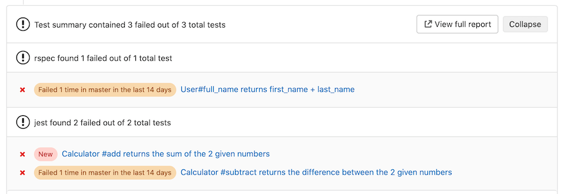

# Unit test reports **(FREE ALL)**

> - [Introduced](https://gitlab.com/gitlab-org/gitlab-foss/-/issues/45318) in GitLab 11.2. Requires GitLab Runner 11.2 and above.
> - [Renamed](https://gitlab.com/gitlab-org/gitlab/-/merge_requests/39737) from JUnit test reports to Unit test reports in GitLab 13.4.

It is very common that a [CI/CD pipeline](../pipelines/index.md) contains a
test job that verifies your code.
If the tests fail, the pipeline fails and users get notified. The person that
works on the merge request has to check the job logs and see where the
tests failed so that they can fix them.

You can configure your job to use Unit test reports, and GitLab displays a
report on the merge request so that it's easier and faster to identify the
failure without having to check the entire log. Unit test reports currently
only support test reports in the JUnit report format.

If you don't use merge requests but still want to see the unit test report
output without searching through job logs, the full
[Unit test reports](#view-unit-test-reports-on-gitlab) are available
in the pipeline detail view.

Consider the following workflow:

1. Your default branch is rock solid, your project is using GitLab CI/CD and
   your pipelines indicate that there isn't anything broken.
1. Someone from your team submits a merge request, a test fails and the pipeline
   gets the known red icon. To investigate more, you have to go through the job
   logs to figure out the cause of the failed test, which usually contain
   thousands of lines.
1. You configure the Unit test reports and immediately GitLab collects and
   exposes them in the merge request. No more searching in the job logs.
1. Your development and debugging workflow becomes easier, faster and efficient.

## How it works

First, GitLab Runner uploads all [JUnit report format XML files](https://www.ibm.com/docs/en/adfz/developer-for-zos/14.1.0?topic=formats-junit-xml-format)
as [artifacts](../yaml/artifacts_reports.md#artifactsreportsjunit) to GitLab. Then, when you visit a merge request, GitLab starts
comparing the head and base branch's JUnit report format XML files, where:

- The base branch is the target branch (usually the default branch).
- The head branch is the source branch (the latest pipeline in each merge request).

The **Test summary** panel shows how many tests failed, how many had errors,
and how many were fixed. If no comparison can be done because data for the base branch
is not available, the panel shows only the list of failed tests for the source branch.

The types of results are:

- **Newly failed tests:** Test cases which passed on the base branch and failed on the head branch.
- **Newly encountered errors:** Test cases which passed on the base branch and failed due to a
  test error on the head branch.
- **Existing failures:** Test cases which failed on the base branch and failed on the head branch.
- **Resolved failures:** Test cases which failed on the base branch and passed on the head branch.

### View failed tests

Each entry in the **Test summary** panel shows the test name and result type.
Select the test name to open a modal window with details of its execution time and
the error output.



#### Copy failed test names

> [Introduced](https://gitlab.com/gitlab-org/gitlab/-/merge_requests/91552) in GitLab 15.2.

You can copy the name and path of failed tests when there are failed tests listed
in the **Test summary** panel. Use name and path to find and rerun the
test locally for verification.

To copy the name of all failed tests, at the top of the **Test summary** panel,
select **Copy failed tests**. The failed tests are listed as a string with the tests
separated by spaces. This option is only available if the JUnit report populates
the `<file>` attributes for failed tests.

To copy the name of a single failed test:

1. Expand the **Test summary** panel by selecting **Show test summary details** (**{chevron-lg-down}**).
1. Select the test you want to review.
1. Select **Copy test name to rerun locally** (**{copy-to-clipboard}**).

### Number of recent failures

> - [Introduced](https://gitlab.com/gitlab-org/gitlab/-/issues/241759) in merge requests in GitLab 13.7.
> - [Feature flag removed](https://gitlab.com/gitlab-org/gitlab/-/issues/268249) in GitLab 13.8.
> - [Introduced](https://gitlab.com/gitlab-org/gitlab/-/issues/235525) in Test Reports in GitLab 13.9.

If a test failed in the project's default branch in the last 14 days, a message like
`Failed {n} time(s) in {default_branch} in the last 14 days` is displayed for that test.

The calculation includes failed tests in completed pipelines, but not [blocked pipelines](../jobs/job_control.md#types-of-manual-jobs).
[Issue 431265](https://gitlab.com/gitlab-org/gitlab/-/issues/431265) proposes to
also include blocked pipelines in the calculation.

## How to set it up

To enable the Unit test reports in merge requests, you must add
[`artifacts:reports:junit`](../yaml/artifacts_reports.md#artifactsreportsjunit)
in `.gitlab-ci.yml`, and specify the paths of the generated test reports.
The reports must be `.xml` files, otherwise [GitLab returns an Error 500](https://gitlab.com/gitlab-org/gitlab/-/issues/216575).

In the following example for Ruby, the job in the `test` stage runs and GitLab
collects the unit test report from the job. After the job is executed, the
XML report is stored in GitLab as an artifact, and the results are shown in the
merge request widget.

```yaml
## Use https://github.com/sj26/rspec_junit_formatter to generate a JUnit report format XML file with rspec
ruby:
  stage: test
  script:
    - bundle install
    - bundle exec rspec --format progress --format RspecJunitFormatter --out rspec.xml
  artifacts:
    when: always
    paths:
      - rspec.xml
    reports:
      junit: rspec.xml
```

To make the Unit test report output files browsable, include them with the
[`artifacts:paths`](../yaml/index.md#artifactspaths) keyword as well, as shown in the example.
To upload the report even if the job fails (for example if the tests do not pass),
use the [`artifacts:when:always`](../yaml/index.md#artifactswhen) keyword.

You cannot have multiple tests with the same name and class in your JUnit report format XML file.

In GitLab 15.0 and earlier, test reports from [parallel:matrix](../yaml/index.md#parallel:matrix)
jobs are aggregated together, which can cause some report information to not be displayed.
In GitLab 15.1 and later, [this bug is fixed](https://gitlab.com/gitlab-org/gitlab/-/issues/296814),
and all report information is displayed.

## View Unit test reports on GitLab

> - [Introduced](https://gitlab.com/gitlab-org/gitlab/-/issues/24792) in GitLab 12.5 behind a feature flag (`junit_pipeline_view`), disabled by default.
> - [Feature flag removed](https://gitlab.com/gitlab-org/gitlab/-/issues/216478) in GitLab 13.3.

If JUnit report format XML files are generated and uploaded as part of a pipeline, these reports
can be viewed inside the pipelines details page. The **Tests** tab on this page
displays a list of test suites and cases reported from the XML file.


You can view all the known test suites and select each of these to see further
details, including the cases that make up the suite.

You can also retrieve the reports via the [GitLab API](../../api/pipelines.md#get-a-pipelines-test-report).

### Unit test reports parsing errors

> [Introduced](https://gitlab.com/gitlab-org/gitlab/-/issues/263457) in GitLab 13.10.

If parsing JUnit report XML results in an error, an indicator is shown next to the job name. Hovering over the icon shows the parser error in a tooltip. If multiple parsing errors come from [grouped jobs](../jobs/index.md#group-jobs-in-a-pipeline), GitLab shows only the first error from the group.


For test case parsing limits, see [Max test cases per unit test report](../../user/gitlab_com/index.md#gitlab-cicd).

GitLab does not parse very [large nodes](https://nokogiri.org/tutorials/parsing_an_html_xml_document.html#parse-options) of JUnit reports. There is [an issue](https://gitlab.com/gitlab-org/gitlab/-/issues/268035) open to make this optional.

## View JUnit screenshots on GitLab

> - [Introduced](https://gitlab.com/gitlab-org/gitlab/-/issues/202114) in GitLab 13.0 behind the `:junit_pipeline_screenshots_view` feature flag, disabled by default.
> - [Feature flag removed](https://gitlab.com/gitlab-org/gitlab/-/issues/216979) in GitLab 13.12.

You can upload your screenshots as [artifacts](../yaml/artifacts_reports.md#artifactsreportsjunit) to GitLab.
If JUnit report format XML files contain an `attachment` tag, GitLab parses the attachment.
When uploading screenshot artifacts:

- The `attachment` tag **must** contain the relative path to `$CI_PROJECT_DIR` of the screenshots you uploaded. For
  example:

  ```xml
  <testcase time="1.00" name="Test">
    <system-out>[[ATTACHMENT|/path/to/some/file]]</system-out>
  </testcase>
  ```

- You should set the job that uploads the screenshot to
  [`artifacts:when: always`](../yaml/index.md#artifactswhen) so that it still uploads a screenshot
  when a test fails.

After the attachment is uploaded, [the pipeline test report](#view-unit-test-reports-on-gitlab)
contains a link to the screenshot, for example:


## Troubleshooting

### Test report appears empty

A unit test report can appear to be empty when [viewed in a merge request](#view-unit-test-reports-on-gitlab)
if the artifact that contained the report [expires](../yaml/index.md#artifactsexpire_in).
If the artifact frequently expires too early, set a longer `expire_in` value for
the report artifact.

Alternatively, you can run a new pipeline to generate a new report.
