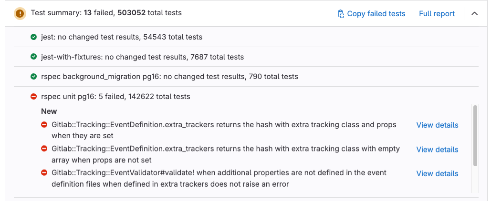
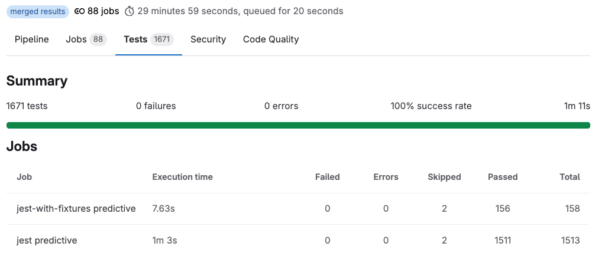
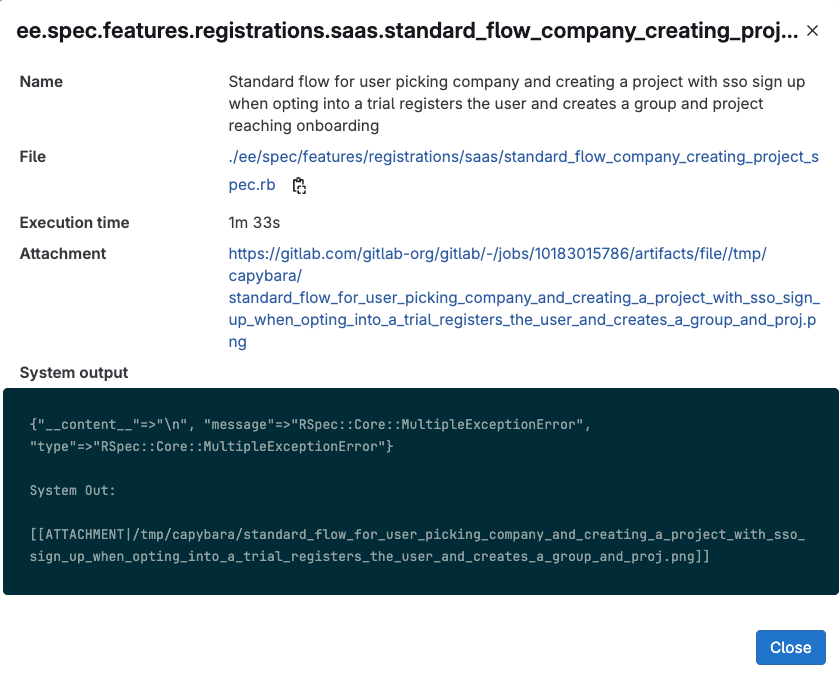



- Tier: Free, Premium, Ultimate
- Offering: GitLab.com, GitLab Self-Managed, GitLab Dedicated



Unit test reports display test results directly in merge requests and pipeline details,
so you can identify failures without searching through job logs.

Use unit test reports when you want to:

- See test failures immediately in merge requests.
- Compare test results between branches.
- Debug failing tests with error details and screenshots.
- Track test failure patterns over time.

Unit test reports require the JUnit XML format and do not affect job status.
To make a job fail when tests fail, your job's [script](../yaml/_index.md#script) must exit with a non-zero status.

GitLab Runner uploads your test results in JUnit XML format as [artifacts](../yaml/artifacts_reports.md#artifactsreportsjunit).
When you go to a merge request, your test results are compared between the source branch (head) and target branch (base) to show what changed.

## File format and size limits

Unit test reports must use JUnit XML format with specific requirements to ensure proper parsing and display.

### File requirements

Your test report files must:

- Use JUnit XML format with `.xml` file extension.
- Be smaller than 30 MB per individual file.
- Have a total size under 100 MB for all JUnit files in a job.

If you have duplicate test names, only the first test is used and others with the same name are ignored.

For test case limits, see [Maximum test cases per unit test report](../../user/gitlab_com/_index.md#cicd).

### JUnit XML format specification

GitLab parses the following elements and attributes from your JUnit XML files:

| XML Element  | XML Attribute   | Description |
| ------------ | --------------- | ----------- |
| `testsuite`  | `name`          | Test suite name (parsed but not displayed in UI) |
| `testcase`   | `classname`     | Test class or category name (used as the suite name) |
| `testcase`   | `name`          | Individual test name |
| `testcase`   | `file`          | File path where the test is defined |
| `testcase`   | `time`          | Test execution time in seconds |
| `failure`    | Element content | Failure message and stack trace |
| `error`      | Element content | Error message and stack trace |
| `skipped`    | Element content | Reason for skipping the test |
| `system-out` | Element content | System output and attachment tags (only parsed from `testcase` elements) |
| `system-err` | Element content | System error output (only parsed from `testcase` elements) |



The `testcase classname` attribute is used as the suite name, not the `testsuite name` attribute.



#### XML structure example

```xml
<testsuites>
  <testsuite name="Authentication Tests" tests="1" failures="1">
    <testcase classname="LoginTest" name="test_invalid_password" file="spec/auth_spec.rb" time="0.23">
      <failure>Expected authentication to fail</failure>
      <system-out>[[ATTACHMENT|screenshots/failure.png]]</system-out>
    </testcase>
  </testsuite>
</testsuites>
```

This XML displays in GitLab as:

- Suite: `LoginTest` (from `testcase classname`)
- Name: `test_invalid_password` (from `testcase name`)
- File: `spec/auth_spec.rb` (from `testcase file`)
- Time: `0.23s` (from `testcase time`)
- Screenshot: Available in test details dialog (from `testcase system-out`)
- Not displayed: "Authentication Tests" (from `testsuite name`)

## Test result types

Test results are compared between the merge request's source and target branches to show what changed:

- Newly failed tests: Tests that passed on the target branch but failed on your branch.
- Newly encountered errors: Tests that passed on the target branch but had errors on your branch.
- Existing failures: Tests that failed on both branches.
- Resolved failures: Tests that failed on the target branch but passed on your branch.

If branches cannot be compared, for example when there is no target branch data yet, only the failed tests from your branch are shown.

For tests that failed in the default branch in the last 14 days,
you see a message like `Failed {n} time(s) in {default_branch} in the last 14 days`.
This count includes failed tests from completed pipelines, but not [blocked pipelines](../jobs/job_control.md#types-of-manual-jobs).
Support for blocked pipelines is proposed in [issue 431265](https://gitlab.com/gitlab-org/gitlab/-/issues/431265).

## Configure unit test reports

Configure unit test reports to display test results in merge requests and pipelines.

To configure unit test reports:

1. Configure your test job to output JUnit XML format test reports.
   For configuration details, review your testing framework's documentation.
1. In your `.gitlab-ci.yml` file, add
   [`artifacts:reports:junit`](../yaml/artifacts_reports.md#artifactsreportsjunit) to your test job.
1. Specify the path to your XML test report files.
1. Optional. To make report files browsable, include them with [`artifacts:paths`](../yaml/_index.md#artifactspaths).
1. Optional. To upload reports even when jobs fail, use [`artifacts:when:always`](../yaml/_index.md#artifactswhen).

Example configuration for Ruby with RSpec:

```yaml
ruby:
  stage: test
  script:
    - bundle install
    - bundle exec rspec --format progress --format RspecJunitFormatter --out rspec.xml
  artifacts:
    when: always
    paths:
      - rspec.xml
    reports:
      junit: rspec.xml
```

You can view test results:

- In the **Tests** tab of pipeline details after your test job completes.
- In the **Test summary** panel of merge requests after your pipeline completes.

## View test results in merge requests

View detailed information about test failures in merge requests.

The **Test summary** panel shows an overview of your test results,
including how many tests failed and passed.



To view test failure details:

1. In a merge request, go to the **Test summary** panel.
1. To expand the **Test summary** panel, select **Show details** ().
1. Select **View details** next to a failed test.

The dialog displays the test name, file path, execution time, screenshot attachment (if configured),
and error output.

To view all test results:

- From the **Test summary** panel, select **Full report**
  to go to the **Tests** tab in the pipeline details.

### Copy failed test names

Copy test names to rerun them locally for debugging.

Prerequisites:

- Your JUnit report must include `<file>` attributes for failed tests.

To copy all failed test names:

- From the **Test summary** panel, select **Copy failed tests** ().

The failed tests are copied as a space-separated string.

To copy a single failed test name:

1. To expand the **Test summary** panel, select **Show details** ().
1. Select **View details** next to the test you want to copy.
1. In the dialog, select **Copy test name to rerun locally** ().

The test name is copied to your clipboard.

## View test results in pipelines

View all test suites and cases in pipeline details, including results from child pipelines.

To view pipeline test results:

1. Go to your pipeline details page.
1. Select the **Tests** tab.
1. Select any test suite to see individual test cases.



You can also retrieve test reports with the [Pipelines API](../../api/pipelines.md#get-a-test-report-for-a-pipeline).

### Test timing metrics

Test results display different timing metrics:

Pipeline duration
: Elapsed time from when the pipeline starts until it completes.

Test execution time
: Total time spent running all tests across all jobs, added together.

Queue time
: Time jobs spent waiting for available runners.

When jobs run in parallel, cumulative test execution time can exceed pipeline duration.

Pipeline duration shows how long you wait for results, while test execution time shows compute resources used.

For example, a pipeline that completes in 81 minutes might show 9 hours 10 minutes of test execution time if many test jobs run in parallel across multiple runners.

## Add screenshots to test reports

Add screenshots to test reports to help debug test failures.

To add screenshots to test reports:

1. In your JUnit XML file, add attachment tags with screenshot paths relative to `$CI_PROJECT_DIR`:

   ```xml
   <testcase time="1.00" name="Test">
     <system-out>[[ATTACHMENT|/path/to/some/file]]</system-out>
   </testcase>
   ```

1. In your `.gitlab-ci.yml` file, configure your job to upload screenshots as artifacts:

   - Specify the path to your screenshot files.
   - Optional. Use [`artifacts:when: always`](../yaml/_index.md#artifactswhen) to upload screenshots when tests fail.

   For example:

   ```yaml
   ruby:
     stage: test
     script:
       - bundle install
       - bundle exec rspec --format progress --format RspecJunitFormatter --out rspec.xml
       - # Your test framework should save screenshots to a directory
     artifacts:
       when: always
       paths:
         - rspec.xml
         - screenshots/
       reports:
         junit: rspec.xml
   ```

1. Run your pipeline.

You can access the screenshot link in the test details dialog
when you select **View details** for a failed test in the **Test summary** panel.



## Troubleshooting

### Test report appears empty

You might see an empty **Test summary** panel in merge requests.

This issue occurs when:

- Report artifacts have expired.
- JUnit files exceed size limits.

To resolve this issue, set a longer [`expire_in`](../yaml/_index.md#artifactsexpire_in) value for the report artifact,
or run a new pipeline to generate a new report.

If JUnit files exceed size limits, ensure:

- Individual JUnit files are less than 30 MB.
- The total size of all JUnit files for the job is less than 100 MB.

Support for custom limits is proposed in [epic 16374](https://gitlab.com/groups/gitlab-org/-/epics/16374).

### Test results are missing

You might see fewer test results than expected in your reports.

This can happen when you have duplicate test names in your JUnit XML file.
Only the first test for each name is used and duplicates are ignored.

To resolve this issue, ensure all test names and classes are unique.

### No test reports appear in merge requests

You might not see the **Test summary** panel at all in merge requests.

This issue can happen when the target branch has no test data for comparison.

To resolve this issue, run a pipeline on your target branch to generate baseline test data.

### JUnit XML parsing errors

You might see parsing error indicators next to job names in your pipeline.

This can happen when JUnit XML files contain formatting errors or invalid elements.

To resolve this issue:

- Verify your JUnit XML files follow the standard format.
- Check that all XML elements are properly closed.
- Ensure attribute names and values are correctly formatted.

For [grouped jobs](../jobs/_index.md#group-similar-jobs-together-in-pipeline-views),
only the first parsing error from the group is displayed.
