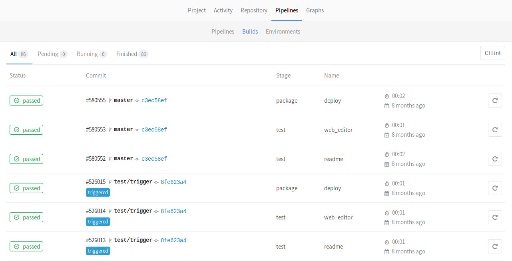
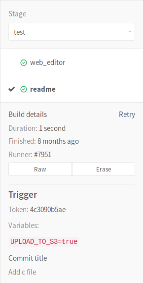

# Triggering pipelines through the API

> **Notes**:
- [Introduced][ci-229] in GitLab CE 7.14.
- GitLab 8.12 has a completely redesigned job permissions system. Read all
  about the [new model and its implications](../../user/project/new_ci_build_permissions_model.md#job-triggers).

Triggers can be used to force a pipeline rerun of a specific `ref` (branch or
tag) with an API call.

## Authentication tokens

The following methods of authentication are supported.

### Trigger token

A unique trigger token can be obtained when [adding a new trigger](#adding-a-new-trigger).

### CI job token

You can use the `CI_JOB_TOKEN` [variable][predef] (used to authenticate
with the [GitLab Container Registry][registry]) in the following cases.

#### When used with multi-project pipelines **[PREMIUM]**

> **Note**:
The use of `CI_JOB_TOKEN` for multi-project pipelines was [introduced][ee-2017]
in [GitLab Premium][ee] 9.3.

This way of triggering can only be used when invoked inside `.gitlab-ci.yml`,
and it creates a dependent pipeline relation visible on the
[pipeline graph](../pipelines.md#multi-project-pipelines-graphs). For example:

```yaml
build_docs:
  stage: deploy
  script:
  - curl --request POST --form "token=$CI_JOB_TOKEN" --form ref=master https://gitlab.example.com/api/v4/projects/9/trigger/pipeline
  only:
  - tags
```

Pipelines triggered that way also expose a special variable:
`CI_PIPELINE_SOURCE=pipeline`.

Read more about the [pipelines trigger API][trigapi].

#### When a pipeline depends on the artifacts of another pipeline **[PREMIUM]**

> **Note**:
The use of `CI_JOB_TOKEN` in the artifacts download API was [introduced][ee-2346]
in [GitLab Premium][ee] 9.5.

With the introduction of dependencies between different projects, one of
them may need to access artifacts created by a previous one. This process
must be granted for authorized accesses, and it can be done using the
`CI_JOB_TOKEN` variable that identifies a specific job. For example:

```yaml
build_submodule:
  stage: test
  script:
  - curl --header "JOB-TOKEN: $CI_JOB_TOKEN" "https://gitlab.example.com/api/v4/projects/1/jobs/artifacts/master/download?job=test"
  - unzip artifacts.zip
  only:
  - tags
```

This allows you to use that for multi-project pipelines and download artifacts
from any project to which you have access as this follows the same principles
with the [permission model][permissions].

Read more about the [jobs API].

## Adding a new trigger

You can add a new trigger by going to your project's
**Settings ➔ CI/CD** under **Triggers**. The **Add trigger** button will
create a new token which you can then use to trigger a rerun of this
particular project's pipeline.

Every new trigger you create, gets assigned a different token which you can
then use inside your scripts or `.gitlab-ci.yml`. You also have a nice
overview of the time the triggers were last used.


## Taking ownership of a trigger

> **Note**:
GitLab 9.0 introduced a trigger ownership to solve permission problems.

Each created trigger when run will impersonate their associated user including
their access to projects and their project permissions.

You can take ownership of existing triggers by clicking *Take ownership*.
From now on the trigger will be run as you.

## Revoking a trigger

You can revoke a trigger any time by going at your project's
**Settings ➔ CI/CD** under **Triggers** and hitting the **Revoke** button.
The action is irreversible.

## Triggering a pipeline

> **Notes**:
- Valid refs are only the branches and tags. If you pass a commit SHA as a ref,
  it will not trigger a job.
- If your project is public, passing the token in plain text is probably not the
  wisest idea, so you might want to use a
  [secret variable](../variables/README.md#secret-variables) for that purpose.

To trigger a job you need to send a `POST` request to GitLab's API endpoint:

```
POST /projects/:id/trigger/pipeline
```

The required parameters are the [trigger's `token`](#authentication-tokens)
and the Git `ref` on which the trigger will be performed. Valid refs are the
branch and the tag. The `:id` of a project can be found by
[querying the API](../../api/projects.md) or by visiting the **CI/CD**
settings page which provides self-explanatory examples.

When a rerun of a pipeline is triggered, the information is exposed in GitLab's
UI under the **Jobs** page and the jobs are marked as triggered 'by API'.



---

You can see which trigger caused the rebuild by visiting the single job page.
A part of the trigger's token is exposed in the UI as you can see from the image
below.



---

By using cURL you can trigger a pipeline rerun with minimal effort, for example:

```bash
curl --request POST \
     --form token=TOKEN \
     --form ref=master \
     https://gitlab.example.com/api/v4/projects/9/trigger/pipeline
```

In this case, the project with ID `9` will get rebuilt on `master` branch.

Alternatively, you can pass the `token` and `ref` arguments in the query string:

```bash
curl --request POST \
    "https://gitlab.example.com/api/v4/projects/9/trigger/pipeline?token=TOKEN&ref=master"
```

You can also benefit by using triggers in your `.gitlab-ci.yml`. Let's say that
you have two projects, A and B, and you want to trigger a rebuild on the `master`
branch of project B whenever a tag on project A is created. This is the job you
need to add in project's A `.gitlab-ci.yml`:

```yaml
build_docs:
  stage: deploy
  script:
  - "curl --request POST --form token=TOKEN --form ref=master https://gitlab.example.com/api/v4/projects/9/trigger/pipeline"
  only:
  - tags
```

Now, whenever a new tag is pushed on project A, the job will run and the
`build_docs` job will be executed, triggering a rebuild of project B. The
`stage: deploy` ensures that this job will run only after all jobs with
`stage: test` complete successfully.

## Triggering a pipeline from a webhook

> **Notes**:
- Introduced in GitLab 8.14.
- `ref` should be passed as part of the URL in order to take precedence over
  `ref` from the webhook body that designates the branch ref that fired the
  trigger in the source repository.
- `ref` should be URL-encoded if it contains slashes.

To trigger a job from a webhook of another project you need to add the following
webhook URL for Push and Tag events (change the project ID, ref and token):

```
https://gitlab.example.com/api/v4/projects/9/ref/master/trigger/pipeline?token=TOKEN
```

## Making use of trigger variables

You can pass any number of arbitrary variables in the trigger API call and they
will be available in GitLab CI so that they can be used in your `.gitlab-ci.yml`
file. The parameter is of the form:

```
variables[key]=value
```

This information is also exposed in the UI.


Using trigger variables can be proven useful for a variety of reasons:

* Identifiable jobs. Since the variable is exposed in the UI you can know
  why the rebuild was triggered if you pass a variable that explains the
  purpose.
* Conditional job processing. You can have conditional jobs that run whenever
  a certain variable is present.

Consider the following `.gitlab-ci.yml` where we set three
[stages](../yaml/README.md#stages) and the `upload_package` job is run only
when all jobs from the test and build stages pass. When the `UPLOAD_TO_S3`
variable is non-zero, `make upload` is run.

```yaml
stages:
- test
- build
- package

run_tests:
  script:
  - make test

build_package:
  stage: build
  script:
  - make build

upload_package:
  stage: package
  script:
  - if [ -n "${UPLOAD_TO_S3}" ]; then make upload; fi
```

You can then trigger a rebuild while you pass the `UPLOAD_TO_S3` variable
and the script of the `upload_package` job will run:

```bash
curl --request POST \
  --form token=TOKEN \
  --form ref=master \
  --form "variables[UPLOAD_TO_S3]=true" \
  https://gitlab.example.com/api/v4/projects/9/trigger/pipeline
```

## Using cron to trigger nightly pipelines

>**Note:**
The following behavior can also be achieved through GitLab's UI with
[pipeline schedules](../../user/project/pipelines/schedules.md).

Whether you craft a script or just run cURL directly, you can trigger jobs
in conjunction with cron. The example below triggers a job on the `master`
branch of project with ID `9` every night at `00:30`:

```bash
30 0 * * * curl --request POST --form token=TOKEN --form ref=master https://gitlab.example.com/api/v4/projects/9/trigger/pipeline
```

## Legacy triggers

Old triggers, created before GitLab 9.0 will be marked as legacy.

Triggers with the legacy label do not have an associated user and only have
access to the current project. They are considered deprecated and will be
removed with one of the future versions of GitLab. You are advised to
[take ownership](#taking-ownership) of any legacy triggers.

[ee-2017]: https://gitlab.com/gitlab-org/gitlab-ee/merge_requests/2017
[ee-2346]: https://gitlab.com/gitlab-org/gitlab-ee/merge_requests/2346
[ci-229]: https://gitlab.com/gitlab-org/gitlab-ci/merge_requests/229
[ee]: https://about.gitlab.com/products/
[variables]: ../variables/README.md
[predef]: ../variables/README.md#predefined-variables-environment-variables
[registry]: ../../user/project/container_registry.md
[permissions]: ../../user/permissions.md#jobs-permissions
[trigapi]: ../../api/pipeline_triggers.md
[jobs api]: ../../api/jobs.md
