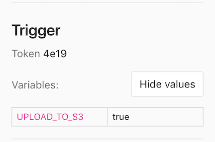

DETAILS:
**Tier:** Free, Premium, Ultimate
**Offering:** GitLab.com, GitLab Self-Managed, GitLab Dedicated

To trigger a pipeline for a specific branch or tag, you can use an API call
to the [pipeline triggers API endpoint](../../api/pipeline_triggers.md).

If you are [migrating to GitLab CI/CD](../migration/plan_a_migration.md), you can
trigger GitLab CI/CD pipelines by calling the API endpoint from the other provider's jobs.
For example, as part of a migration from [Jenkins](../migration/jenkins.md) or [CircleCI](../migration/circleci.md).

When authenticating with the API, you can use:

- A [pipeline trigger token](#create-a-pipeline-trigger-token) to trigger a branch or tag pipeline
  with the [pipeline triggers API endpoint](../../api/pipeline_triggers.md).
- A [CI/CD job token](../jobs/ci_job_token.md) to [trigger a multi-project pipeline](../pipelines/downstream_pipelines.md#trigger-a-multi-project-pipeline-by-using-the-api).
- Another [token with API access](../../security/tokens/_index.md) to create a new pipeline
  with the [project pipeline API endpoint](../../api/pipelines.md#create-a-new-pipeline).

## Create a pipeline trigger token

You can trigger a pipeline for a branch or tag by generating a pipeline trigger token and using it
to authenticate an API call. The token impersonates a user's project access and permissions.

Prerequisites:

- You must have at least the Maintainer role for the project.

To create a trigger token:

1. On the left sidebar, select **Search or go to** and find your project.
1. Select **Settings > CI/CD**.
1. Expand **Pipeline trigger tokens**.
1. Select **Add new token**
1. Enter a description and select **Create pipeline trigger token**.
   - You can view and copy the full token for all triggers you have created.
   - You can only see the first 4 characters for tokens created by other project members.

WARNING:
It is a security risk to save tokens in plain text in public projects, or store them
in a way that malicious users could access them. A leaked trigger token could be
used to force an unscheduled deployment, attempt to access CI/CD variables,
or other malicious uses. [Masked CI/CD variables](../variables/_index.md#mask-a-cicd-variable)
help improve the security of trigger tokens. For more information about keeping tokens secure,
see the [security considerations](../../security/tokens/_index.md#security-considerations).

## Trigger a pipeline

After you [create a pipeline trigger token](#create-a-pipeline-trigger-token), you can use it to trigger
pipelines with a tool that can access the API, or a webhook.

### Use cURL

You can use cURL to trigger pipelines with the [pipeline triggers API endpoint](../../api/pipeline_triggers.md).
For example:

- Use a multiline cURL command:

  ```shell
  curl --request POST \
       --form token=<token> \
       --form ref=<ref_name> \
       "https://gitlab.example.com/api/v4/projects/<project_id>/trigger/pipeline"
  ```

- Use cURL and pass the `<token>` and `<ref_name>` in the query string:

  ```shell
  curl --request POST \
       "https://gitlab.example.com/api/v4/projects/<project_id>/trigger/pipeline?token=<token>&ref=<ref_name>"
  ```

In each example, replace:

- The URL with `https://gitlab.com` or the URL of your instance.
- `<token>` with your trigger token.
- `<ref_name>` with a branch or tag name, like `main`.
- `<project_id>` with your project ID, like `123456`. The project ID is displayed
  on the [project overview page](../../user/project/working_with_projects.md#access-a-project-by-using-the-project-id).

### Use a CI/CD job

You can use a CI/CD job with a pipeline trigger token to trigger pipelines when another pipeline
runs.

For example, to trigger a pipeline on the `main` branch of `project-B` when a tag
is created in `project-A`, add the following job to project A's `.gitlab-ci.yml` file:

```yaml
trigger_pipeline:
  stage: deploy
  script:
    - 'curl --fail --request POST --form token=$MY_TRIGGER_TOKEN --form ref=main "${CI_API_V4_URL}/projects/123456/trigger/pipeline"'
  rules:
    - if: $CI_COMMIT_TAG
  environment: production
```

In this example:

- `1234` is the project ID for `project-B`. The project ID is displayed on the
  [project overview page](../../user/project/working_with_projects.md#access-a-project-by-using-the-project-id).
- The [`rules`](../yaml/_index.md#rules) cause the job to run every time a tag is added to `project-A`.
- `MY_TRIGGER_TOKEN` is a [masked CI/CD variable](../variables/_index.md#mask-a-cicd-variable)
  that contains the trigger token.

### Use a webhook

To trigger a pipeline from another project's webhook, use a webhook URL like the following
for push and tag events:

```plaintext
https://gitlab.example.com/api/v4/projects/<project_id>/ref/<ref_name>/trigger/pipeline?token=<token>
```

Replace:

- The URL with `https://gitlab.com` or the URL of your instance.
- `<project_id>` with your project ID, like `123456`. The project ID is displayed
  on the [project overview page](../../user/project/working_with_projects.md#access-a-project-by-using-the-project-id).
- `<ref_name>` with a branch or tag name, like `main`. This value takes precedence over the `ref_name` in the webhook payload.
  The payload's `ref` is the branch that fired the trigger in the source repository.
  You must URL-encode the `ref_name` if it contains slashes.
- `<token>` with your pipeline trigger token.

#### Access webhook payload

If you trigger a pipeline by using a webhook, you can access the webhook payload with
the `TRIGGER_PAYLOAD` [predefined CI/CD variable](../variables/predefined_variables.md).
The payload is exposed as a [file-type variable](../variables/_index.md#use-file-type-cicd-variables),
so you can access the data with `cat $TRIGGER_PAYLOAD` or a similar command.

### Pass CI/CD variables in the API call

You can pass any number of [CI/CD variables](../variables/_index.md) in the trigger API call.
These variables have the [highest precedence](../variables/_index.md#cicd-variable-precedence),
and override all variables with the same name.

The parameter is of the form `variables[key]=value`, for example:

```shell
curl --request POST \
     --form token=TOKEN \
     --form ref=main \
     --form "variables[UPLOAD_TO_S3]=true" \
     "https://gitlab.example.com/api/v4/projects/123456/trigger/pipeline"
```

CI/CD variables in triggered pipelines display on each job's page, but only
users with the Owner and Maintainer role can view the values.



## Revoke a pipeline trigger token

To revoke a pipeline trigger token:

1. On the left sidebar, select **Search or go to** and find your project.
1. Select **Settings > CI/CD**.
1. Expand **Pipeline triggers**.
1. To the left of the trigger token you want to revoke, select **Revoke** (**{remove}**).

A revoked trigger token cannot be added back.

## Configure CI/CD jobs to run in triggered pipelines

To [configure when to run jobs](../jobs/job_control.md) in triggered pipelines, you can:

- Use [`rules`](../yaml/_index.md#rules) with the `$CI_PIPELINE_SOURCE` [predefined CI/CD variable](../variables/predefined_variables.md).
- Use [`only`/`except`](../yaml/_index.md#onlyrefs--exceptrefs) keywords, though `rules`
  is the preferred keyword.

| `$CI_PIPELINE_SOURCE` value | `only`/`except` keywords | Trigger method      |
|-----------------------------|--------------------------|---------------------|
| `trigger`                   | `triggers`               | In pipelines triggered with the [pipeline triggers API](../../api/pipeline_triggers.md) by using a [trigger token](#create-a-pipeline-trigger-token). |
| `pipeline`                  | `pipelines`              | In [multi-project pipelines](../pipelines/downstream_pipelines.md#trigger-a-multi-project-pipeline-by-using-the-api) triggered with the [pipeline triggers API](../../api/pipeline_triggers.md) by using the [`$CI_JOB_TOKEN`](../jobs/ci_job_token.md), or by using the [`trigger`](../yaml/_index.md#trigger) keyword in the CI/CD configuration file. |

Additionally, the `$CI_PIPELINE_TRIGGERED` predefined CI/CD variable is set to `true`
in pipelines triggered with a pipeline trigger token.

## See which pipeline trigger token was used

You can see which pipeline trigger token caused a job to run by visiting the single job page.
A part of the trigger token displays on the right of the page, under the job details:


In pipelines triggered with a trigger token, jobs are labeled as `triggered` in
**Build > Jobs**.

## Troubleshooting

### `403 Forbidden` when you trigger a pipeline with a webhook

When you trigger a pipeline with a webhook, the API might return a `{"message":"403 Forbidden"}` response.
To avoid trigger loops, do not use [pipeline events](../../user/project/integrations/webhook_events.md#pipeline-events) to trigger pipelines.

### `404 Not Found` when triggering a pipeline

A response of `{"message":"404 Not Found"}` when triggering a pipeline might be caused
by using a [personal access token](../../user/profile/personal_access_tokens.md)
instead of a pipeline trigger token. [Create a new trigger token](#create-a-pipeline-trigger-token)
and use it instead of the personal access token.

### `The requested URL returned error: 400` when triggering a pipeline

If you attempt to trigger a pipeline by using a `ref` that is a branch name that
doesn't exist, GitLab returns `The requested URL returned error: 400`.

For example, you might accidentally use `main` for the branch name in a project that
uses a different branch name for its default branch.

Another possible cause for this error is a rule that prevents creation of the pipelines when `CI_PIPELINE_SOURCE` value is `trigger`, such as:

```yaml
rules:
  - if: $CI_PIPELINE_SOURCE == "trigger"
    when: never
```

Review your [`workflow:rules`](../yaml/_index.md#workflowrules) to ensure a pipeline can be created when `CI_PIPELINE_SOURCE` value is `trigger`.
