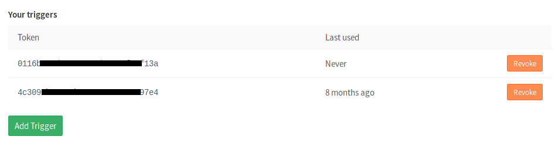
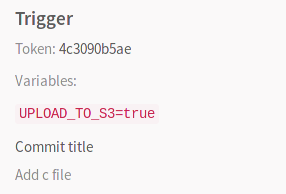

# Triggering pipelines through the API **(FREE)**

Triggers can be used to force a pipeline rerun of a specific `ref` (branch or
tag) with an API call.

## Authentication tokens

The following methods of authentication are supported:

- [Trigger token](#trigger-token)
- [CI job token](#ci-job-token)

If using the `$CI_PIPELINE_SOURCE` [predefined CI/CD variable](../variables/predefined_variables.md)
to limit which jobs run in a pipeline, the value could be either `pipeline` or `trigger`,
depending on which trigger method is used.

| `$CI_PIPELINE_SOURCE` value | Trigger method |
|-----------------------------|----------------|
| `pipeline`                  | Using the `trigger:` keyword in the CI/CD configuration file, or using the trigger API with `$CI_JOB_TOKEN`. |
| `trigger`                   | Using the trigger API using a generated trigger token |

This also applies when using the `pipelines` or `triggers` keywords with the legacy [`only/except` basic syntax](../yaml/index.md#only--except).

### Trigger token

A unique trigger token can be obtained when [adding a new trigger](#adding-a-new-trigger).

WARNING:
Passing plain text tokens in public projects is a security issue. Potential
attackers can impersonate the user that exposed their trigger token publicly in
their `.gitlab-ci.yml` file. Use [CI/CD variables](../variables/index.md)
to protect trigger tokens.

### CI job token

You can use the `CI_JOB_TOKEN` [CI/CD variable](../variables/index.md#predefined-cicd-variables) (used to authenticate
with the [GitLab Container Registry](../../user/packages/container_registry/index.md)) in the following cases.

#### When used with multi-project pipelines

> - Use of `CI_JOB_TOKEN` for multi-project pipelines was [introduced](https://gitlab.com/gitlab-org/gitlab/-/merge_requests/2017) in [GitLab Premium](https://about.gitlab.com/pricing/) 9.3.
> - Use of `CI_JOB_TOKEN` for multi-project pipelines was [made available](https://gitlab.com/gitlab-org/gitlab/-/issues/31573) in all tiers in GitLab 12.4.

This way of triggering can only be used when invoked inside `.gitlab-ci.yml`,
and it creates a dependent pipeline relation visible on the
[pipeline graph](../pipelines/multi_project_pipelines.md). For example:

```yaml
trigger_pipeline:
  stage: deploy
  script:
    - curl --request POST --form "token=$CI_JOB_TOKEN" --form ref=main "https://gitlab.example.com/api/v4/projects/9/trigger/pipeline"
  rules:
    - if: $CI_COMMIT_TAG
```

Pipelines triggered that way also expose a special variable:
`CI_PIPELINE_SOURCE=pipeline`.

Read more about the [pipelines trigger API](../../api/pipeline_triggers.md).

#### When a pipeline depends on the artifacts of another pipeline **(PREMIUM)**

> The use of `CI_JOB_TOKEN` in the artifacts download API was [introduced](https://gitlab.com/gitlab-org/gitlab/-/merge_requests/2346) in [GitLab Premium](https://about.gitlab.com/pricing/) 9.5.

With the introduction of dependencies between different projects, one of
them may need to access artifacts created by a previous one. This process
must be granted for authorized accesses, and it can be done using the
`CI_JOB_TOKEN` variable that identifies a specific job. For example:

```yaml
build_submodule:
  image: debian
  stage: test
  script:
    - apt update && apt install -y unzip
    - curl --location --output artifacts.zip "https://gitlab.example.com/api/v4/projects/1/jobs/artifacts/main/download?job=test&job_token=$CI_JOB_TOKEN"
    - unzip artifacts.zip
  rules:
    - if: $CI_COMMIT_TAG
```

This allows you to use that for multi-project pipelines and download artifacts
from any project to which you have access as this follows the same principles
with the [permission model](../../user/permissions.md#job-permissions).

Read more about the [jobs API](../../api/job_artifacts.md#download-the-artifacts-archive).

## Adding a new trigger

Go to your
**Settings > CI/CD** under **Triggers** to add a new trigger. The **Add trigger** button creates
a new token which you can then use to trigger a rerun of this
particular project's pipeline.

Every new trigger you create, gets assigned a different token which you can
then use inside your scripts or `.gitlab-ci.yml`. You also have a nice
overview of the time the triggers were last used.



## Revoking a trigger

You can revoke a trigger any time by going at your project's
**Settings > CI/CD** under **Triggers** and hitting the **Revoke** button.
The action is irreversible.

## Triggering a pipeline

To trigger a job you need to send a `POST` request to the GitLab API endpoint:

```plaintext
POST /projects/:id/trigger/pipeline
```

The required parameters are the [trigger's `token`](#authentication-tokens)
and the Git `ref` on which the trigger is performed. Valid refs are
branches or tags. The `:id` of a project can be found by
[querying the API](../../api/projects.md) or by visiting the **CI/CD**
settings page which provides self-explanatory examples.

When a rerun of a pipeline is triggered, jobs are marked as triggered `by API` in
**CI/CD > Jobs**.

You can see which trigger caused a job to run by visiting the single job page.
A part of the trigger's token is exposed in the UI as you can see from the image
below.


By using cURL you can trigger a pipeline rerun with minimal effort, for example:

```shell
curl --request POST \
     --form token=TOKEN \
     --form ref=main \
     "https://gitlab.example.com/api/v4/projects/9/trigger/pipeline"
```

In this case, the pipeline for the project with ID `9` runs on the `main` branch.

Alternatively, you can pass the `token` and `ref` arguments in the query string:

```shell
curl --request POST \
    "https://gitlab.example.com/api/v4/projects/9/trigger/pipeline?token=TOKEN&ref=main"
```

You can also benefit by using triggers in your `.gitlab-ci.yml`. Let's say that
you have two projects, A and B, and you want to trigger a pipeline on the `main`
branch of project B whenever a tag on project A is created. This is the job you
need to add in project A's `.gitlab-ci.yml`:

```yaml
trigger_pipeline:
  stage: deploy
  script:
    - 'curl --request POST --form token=TOKEN --form ref=main "https://gitlab.example.com/api/v4/projects/9/trigger/pipeline"'
  rules:
    - if: $CI_COMMIT_TAG
```

This means that whenever a new tag is pushed on project A, the job runs and the
`trigger_pipeline` job is executed, triggering the pipeline for project B. The
`stage: deploy` ensures that this job runs only after all jobs with
`stage: test` complete successfully.

## Triggering a pipeline from a webhook

To trigger a job from a webhook of another project you need to add the following
webhook URL for Push and Tag events (change the project ID, ref and token):

```plaintext
https://gitlab.example.com/api/v4/projects/9/ref/main/trigger/pipeline?token=TOKEN
```

You should pass `ref` as part of the URL, to take precedence over `ref` from
the webhook body that designates the branch ref that fired the trigger in the
source repository. Be sure to URL-encode `ref` if it contains slashes.

### Using webhook payload in the triggered pipeline

> - [Introduced](https://gitlab.com/gitlab-org/gitlab/-/issues/31197) in GitLab 13.9.
> - [Feature flag removed](https://gitlab.com/gitlab-org/gitlab/-/issues/321027) in GitLab 13.11.

If you trigger a pipeline by using a webhook, you can access the webhook payload with
the `TRIGGER_PAYLOAD` [predefined CI/CD variable](../variables/predefined_variables.md).
The payload is exposed as a [file-type variable](../variables/index.md#cicd-variable-types),
so you can access the data with `cat $TRIGGER_PAYLOAD` or a similar command.

## Making use of trigger variables

You can pass any number of arbitrary variables in the trigger API call and they
are available in GitLab CI/CD so that they can be used in your `.gitlab-ci.yml`
file. The parameter is of the form:

```plaintext
variables[key]=value
```

This information is also exposed in the UI. Please note that _values_ are only viewable by Owners and Maintainers.



Using trigger variables can be proven useful for a variety of reasons:

- Identifiable jobs. Since the variable is exposed in the UI you can know
  why the pipeline was triggered if you pass a variable that explains the
  purpose.
- Conditional job processing. You can have conditional jobs that run whenever
  a certain variable is present.

Consider the following `.gitlab-ci.yml` where we set three
[stages](../yaml/index.md#stages) and the `upload_package` job is run only
when all jobs from the test and build stages pass. When the `UPLOAD_TO_S3`
variable is non-zero, `make upload` is run.

```yaml
stages:
  - test
  - build
  - package

run_tests:
  stage: test
  script:
    - make test

build_package:
  stage: build
  script:
    - make build

upload_package:
  stage: package
  script:
    - if [ -n "${UPLOAD_TO_S3}" ]; then make upload; fi
```

You can then trigger a pipeline while you pass the `UPLOAD_TO_S3` variable
and the script of the `upload_package` job is run:

```shell
curl --request POST \
  --form token=TOKEN \
  --form ref=main \
  --form "variables[UPLOAD_TO_S3]=true" \
  "https://gitlab.example.com/api/v4/projects/9/trigger/pipeline"
```

Trigger variables have the [highest priority](../variables/index.md#cicd-variable-precedence)
of all types of variables.

## Using cron to trigger nightly pipelines

Whether you craft a script or just run cURL directly, you can trigger jobs
in conjunction with cron. The example below triggers a job on the `main` branch
of project with ID `9` every night at `00:30`:

```shell
30 0 * * * curl --request POST --form token=TOKEN --form ref=main "https://gitlab.example.com/api/v4/projects/9/trigger/pipeline"
```

This behavior can also be achieved through the GitLab UI with
[pipeline schedules](../pipelines/schedules.md).

## Legacy triggers

Old triggers, created before GitLab 9.0 are marked as legacy.

Triggers with the legacy label do not have an associated user and only have
access to the current project. They are considered deprecated and might be
removed with one of the future versions of GitLab.

## Troubleshooting

### '404 not found' when triggering a pipeline

A response of `{"message":"404 Not Found"}` when triggering a pipeline might be caused
by using a Personal Access Token instead of a trigger token. [Add a new trigger](#adding-a-new-trigger)
and use that token to authenticate when triggering a pipeline.
