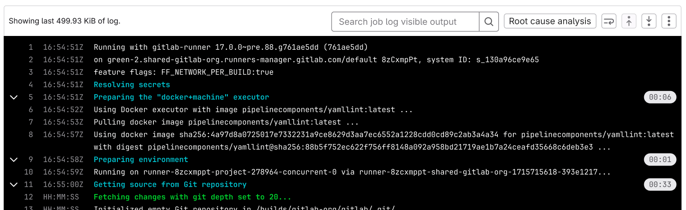

# CI log timestamps

DETAILS:
**Tier:** Free, Premium, Ultimate
**Offering:** GitLab.com, Self-managed, GitLab Dedicated

> - [Introduced](https://gitlab.com/gitlab-org/gitlab/-/issues/455582) in GitLab 17.1 [with flags](../../administration/feature_flags.md) named `FF_TIMESTAMPS` and `parse_ci_job_timestamps`. Disabled by default.
> - Feature flag `parse_ci_job_timestamps` [enabled on GitLab.com](https://gitlab.com/gitlab-org/gitlab/-/issues/455581) in GitLab 17.1.
> - Feature flag `parse_ci_job_timestamps` [removed](https://gitlab.com/gitlab-org/gitlab/-/issues/464785) in GitLab 17.2.

FLAG:
The availability of this feature is controlled by a feature flag.
For more information, see the history.

Prerequisites:

- You must be on GitLab Runner 17.0 and later.
- An administrator must enable the `FF_TIMESTAMPS`
  [feature flag](../../administration/feature_flags.md) in `.gitlab-ci.yml`.

This feature generates a timestamp in the
[ISO 8601 format](https://www.iso.org/iso-8601-date-and-time-format.html) for each line in the CI log.
With CI log timestamps, you can identify the duration of a specific section in the CI job.

For CI jobs where `FF_TIMESTAMPS` is enabled,
the size of generated artifacts is bigger by approximately 10 percent.

NOTE:
If `FF_TIMESTMPS` is disabled or not included in `.gitlab-ci.yml`,
the CI log output does not include the timestamp for each log line.

## Example configuration and output

**Example pipeline configuration with `FF_TIMESTAMPS` enabled:**

```yaml
variables:
  FF_TIMESTAMPS: true

stages:
  - build
  - test
  - deploy
```

**Example log output with `FF_TIMESTAMPS` enabled:**



## Feedback

To provide feedback on this feature prior to GitLab 17.2,
leave a comment on [issue 463391](https://gitlab.com/gitlab-org/gitlab/-/issues/463391).
