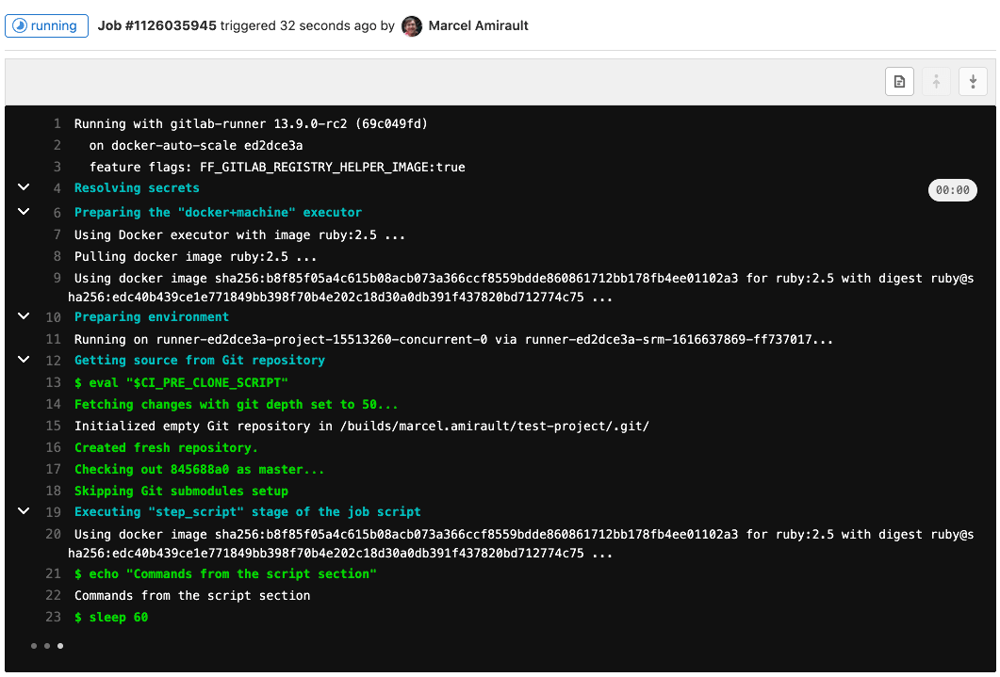

<!-- markdownlint-disable MD044 -->
<!-- vale gitlab.Spelling = NO -->
# The .gitlab-ci.yml file **(FREE)**
<!-- vale gitlab.Spelling = YES -->
<!-- markdownlint-enable MD044 -->

To use GitLab CI/CD, you need:

- Application code hosted in a Git repository.
- A file called [`.gitlab-ci.yml`](index.md) in the root of your repository, which
  contains the CI/CD configuration.

In the `.gitlab-ci.yml` file, you can define:

- The scripts you want to run.
- Other configuration files and templates you want to include.
- Dependencies and caches.
- The commands you want to run in sequence and those you want to run in parallel.
- The location to deploy your application to.
- Whether you want to run the scripts automatically or trigger any of them manually.

The scripts are grouped into **jobs**, and jobs run as part of a larger
**pipeline**. You can group multiple independent jobs into **stages** that run in a defined order.
The CI/CD configuration needs at least one job that is [not hidden](index.md#hide-jobs).

You should organize your jobs in a sequence that suits your application and is in accordance with
the tests you wish to perform. To [visualize](../pipeline_editor/index.md#visualize-ci-configuration) the process, imagine
the scripts you add to jobs are the same as CLI commands you run on your computer.

When you add a `.gitlab-ci.yml` file to your
repository, GitLab detects it and an application called [GitLab Runner](https://docs.gitlab.com/runner/)
runs the scripts defined in the jobs.

A `.gitlab-ci.yml` file might contain:

```yaml
stages:
  - build
  - test

build-code-job:
  stage: build
  script:
    - echo "Check the ruby version, then build some Ruby project files:"
    - ruby -v
    - rake

test-code-job1:
  stage: test
  script:
    - echo "If the files are built successfully, test some files with one command:"
    - rake test1

test-code-job2:
  stage: test
  script:
    - echo "If the files are built successfully, test other files with a different command:"
    - rake test2
```

In this example, the `build-code-job` job in the `build` stage runs first. It outputs
the Ruby version the job is using, then runs `rake` to build project files.
If this job completes successfully, the two `test-code-job` jobs in the `test` stage start
in parallel and run tests on the files.

The full pipeline in the example is composed of three jobs, grouped into two stages,
`build` and `test`. The pipeline runs every time changes are pushed to any
branch in the project.

GitLab CI/CD not only executes the jobs but also shows you what's happening during execution,
just as you would see in your terminal:



You create the strategy for your app and GitLab runs the pipeline
according to what you've defined. Your pipeline status is also
displayed by GitLab:


If anything goes wrong, you can
[roll back](../environments/index.md#retry-or-roll-back-a-deployment) the changes:


[View the full syntax for the `.gitlab-ci.yml` file](index.md).
