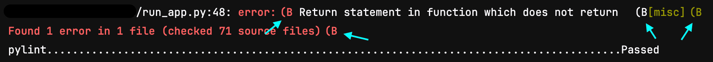

DETAILS:
**Tier:** Free, Premium, Ultimate
**Offering:** GitLab.com, GitLab Self-Managed, GitLab Dedicated

You can use special syntax in [`script`](_index.md#script) sections to:

- [Split long commands](#split-long-commands) into multiline commands.
- [Use color codes](#add-color-codes-to-script-output) to make job logs easier to review.
- [Create custom collapsible sections](../jobs/job_logs.md#custom-collapsible-sections)
  to simplify job log output.

## Use special characters with `script`

Sometimes, `script` commands must be wrapped in single or double quotes.
For example, commands that contain a colon (`:`) must be wrapped in single quotes (`'`).
The YAML parser needs to interpret the text as a string rather than
a "key: value" pair.

For example, this script uses a colon:

```yaml
job:
  script:
    - curl --request POST --header 'Content-Type: application/json' "https://gitlab/api/v4/projects"
```

To be considered valid YAML, you must wrap the entire command in single quotes. If
the command already uses single quotes, you should change them to double quotes (`"`)
if possible:

```yaml
job:
  script:
    - 'curl --request POST --header "Content-Type: application/json" "https://gitlab/api/v4/projects"'
```

You can verify the syntax is valid with the [CI Lint](../yaml/lint.md) tool.

Be careful when using these characters as well:

- `{`, `}`, `[`, `]`, `,`, `&`, `*`, `#`, `?`, `|`, `-`, `<`, `>`, `=`, `!`, `%`, `@`, `` ` ``.

## Ignore non-zero exit codes

When script commands return an exit code other than zero, the job fails and further
commands do not execute.

Store the exit code in a variable to avoid this behavior:

```yaml
job:
  script:
    - false || exit_code=$?
    - if [ $exit_code -ne 0 ]; then echo "Previous command failed"; fi;
```

## Set a default `before_script` or `after_script` for all jobs

You can use [`before_script`](_index.md#before_script) and [`after_script`](_index.md#after_script)
with [`default`](_index.md#default):

- Use `before_script` with `default` to define a default array of commands that
  should run before the `script` commands in all jobs.
- Use `after_script` with default to define a default array of commands
  that should run after any job completes or is canceled.

You can overwrite a default by defining a different one in a job. To ignore the default
use `before_script: []` or `after_script: []`:

```yaml
default:
  before_script:
    - echo "Execute this `before_script` in all jobs by default."
  after_script:
    - echo "Execute this `after_script` in all jobs by default."

job1:
  script:
    - echo "These script commands execute after the default `before_script`,"
    - echo "and before the default `after_script`."

job2:
  before_script:
    - echo "Execute this script instead of the default `before_script`."
  script:
    - echo "This script executes after the job's `before_script`,"
    - echo "but the job does not use the default `after_script`."
  after_script: []
```

## Skip `after_script` commands if a job is canceled

> - [Introduced](https://gitlab.com/groups/gitlab-org/-/epics/10158) in GitLab 17.0 [with a flag](../../administration/feature_flags.md) named `ci_canceling_status`. Enabled by default. Requires GitLab Runner version 16.11.1.
> - [Generally available](https://gitlab.com/gitlab-org/gitlab/-/issues/460285) in GitLab 17.3. Feature flag `ci_canceling_status` removed.

[`after_script`](_index.md) commands run if a job is canceled while the `before_script`
or `script` section of that job are running.

The job's status in the UI is `canceling` while the `after_script` are executing,
and changes to `canceled` after the `after_script` commands complete. The `$CI_JOB_STATUS`
predefined variable has a value of `canceled` while the `after_script` commands are running.

To prevent `after_script` commands running after canceling a job, configure the `after_script`
section to:

1. Check the `$CI_JOB_STATUS` predefined variable at the start of the `after_script` section.
1. End execution early if the value is `canceled`.

For example:

```yaml
job1:
  script:
    - my-script.sh
  after_script:
    - if [ "$CI_JOB_STATUS" == "canceled" ]; then exit 0; fi
    - my-after-script.sh
```

## Split long commands

You can split long commands into multiline commands to improve readability with
`|` (literal) and `>` (folded) [YAML multiline block scalar indicators](https://yaml-multiline.info/).

WARNING:
If multiple commands are combined into one command string, only the last command's
failure or success is reported.
[Failures from earlier commands are ignored due to a bug](https://gitlab.com/gitlab-org/gitlab-runner/-/issues/25394).
To work around this, run each command as a separate `script` item, or add an `exit 1`
command to each command string.

You can use the `|` (literal) YAML multiline block scalar indicator to write
commands over multiple lines in the `script` section of a job description.
Each line is treated as a separate command.
Only the first command is repeated in the job log, but additional
commands are still executed:

```yaml
job:
  script:
    - |
      echo "First command line."
      echo "Second command line."
      echo "Third command line."
```

The example above renders in the job log as:

```shell
$ echo First command line # collapsed multiline command
First command line
Second command line.
Third command line.
```

The `>` (folded) YAML multiline block scalar indicator treats empty lines between
sections as the start of a new command:

```yaml
job:
  script:
    - >
      echo "First command line
      is split over two lines."

      echo "Second command line."
```

This behaves similarly to multiline commands without the `>` or `|` block
scalar indicators:

```yaml
job:
  script:
    - echo "First command line
      is split over two lines."

      echo "Second command line."
```

Both examples above render in the job log as:

```shell
$ echo First command line is split over two lines. # collapsed multiline command
First command line is split over two lines.
Second command line.
```

When you omit the `>` or `|` block scalar indicators, GitLab concatenates non-empty
lines to form the command. Make sure the lines can run when concatenated.

<!-- vale gitlab_base.MeaningfulLinkWords = NO -->

[Shell here documents](https://en.wikipedia.org/wiki/Here_document) work with the
`|` and `>` operators as well. The example below transliterates lower case letters
to upper case:

<!-- vale gitlab_base.MeaningfulLinkWords = YES -->

```yaml
job:
  script:
    - |
      tr a-z A-Z << END_TEXT
        one two three
        four five six
      END_TEXT
```

Results in:

```shell
$ tr a-z A-Z << END_TEXT # collapsed multiline command
  ONE TWO THREE
  FOUR FIVE SIX
```

## Add color codes to script output

Script output can be colored using [ANSI escape codes](https://en.wikipedia.org/wiki/ANSI_escape_code#Colors),
or by running commands or programs that output ANSI escape codes.

For example, using [Bash with color codes](https://misc.flogisoft.com/bash/tip_colors_and_formatting):

```yaml
job:
  script:
    - echo -e "\e[31mThis text is red,\e[0m but this text isn't\e[31m however this text is red again."
```

You can define the color codes in Shell environment variables, or even [CI/CD variables](../variables/_index.md#define-a-cicd-variable-in-the-gitlab-ciyml-file),
which makes the commands easier to read and reusable.

For example, using the same example as above and environment variables defined in a `before_script`:

```yaml
job:
  before_script:
    - TXT_RED="\e[31m" && TXT_CLEAR="\e[0m"
  script:
    - echo -e "${TXT_RED}This text is red,${TXT_CLEAR} but this part isn't${TXT_RED} however this part is again."
    - echo "This text is not colored"
```

Or with [PowerShell color codes](https://superuser.com/a/1259916):

```yaml
job:
  before_script:
    - $esc="$([char]27)"; $TXT_RED="$esc[31m"; $TXT_CLEAR="$esc[0m"
  script:
    - Write-Host $TXT_RED"This text is red,"$TXT_CLEAR" but this text isn't"$TXT_RED" however this text is red again."
    - Write-Host "This text is not colored"
```

## Troubleshooting

### `Syntax is incorrect` in scripts that use `:`

If you use a colon (`:`) in a script, GitLab might output:

- `Syntax is incorrect`
- `script config should be a string or a nested array of strings up to 10 levels deep`

For example, if you use `"PRIVATE-TOKEN: ${PRIVATE_TOKEN}"` as part of a cURL command:

```yaml
pages-job:
  stage: deploy
  script:
    - curl --header 'PRIVATE-TOKEN: ${PRIVATE_TOKEN}' "https://gitlab.example.com/api/v4/projects"
  environment: production
```

The YAML parser thinks the `:` defines a YAML keyword, and outputs the
`Syntax is incorrect` error.

To use commands that contain a colon, you should wrap the whole command
in single quotes. You might need to change existing single quotes (`'`) into double quotes (`"`):

```yaml
pages-job:
  stage: deploy
  script:
    - 'curl --header "PRIVATE-TOKEN: ${PRIVATE_TOKEN}" "https://gitlab.example.com/api/v4/projects"'
  environment: production
```

### Job does not fail when using `&&` in a script

If you use `&&` to combine two commands together in a single script line, the job
might return as successful, even if one of the commands failed. For example:

```yaml
job-does-not-fail:
  script:
    - invalid-command xyz && invalid-command abc
    - echo $?
    - echo "The job should have failed already, but this is executed unexpectedly."
```

The `&&` operator returns an exit code of `0` even though the two commands failed,
and the job continues to run. To force the script to exit when either command fails,
enclose the entire line in parentheses:

```yaml
job-fails:
  script:
    - (invalid-command xyz && invalid-command abc)
    - echo "The job failed already, and this is not executed."
```

### Multiline commands not preserved by folded YAML multiline block scalar

If you use the `- >` folded YAML multiline block scalar to split long commands,
additional indentation causes the lines to be processed as individual commands.

For example:

```yaml
script:
  - >
    RESULT=$(curl --silent
      --header
        "Authorization: Bearer $CI_JOB_TOKEN"
      "${CI_API_V4_URL}/job"
    )
```

This fails as the indentation causes the line breaks to be preserved:

```plaintext
$ RESULT=$(curl --silent # collapsed multi-line command
curl: no URL specified!
curl: try 'curl --help' or 'curl --manual' for more information
/bin/bash: line 149: --header: command not found
/bin/bash: line 150: https://gitlab.example.com/api/v4/job: No such file or directory
```

Resolve this by either:

- Removing the extra indentation:

  ```yaml
  script:
    - >
      RESULT=$(curl --silent
      --header
      "Authorization: Bearer $CI_JOB_TOKEN"
      "${CI_API_V4_URL}/job"
      )
  ```

- Modifying the script so the extra line breaks are handled, for example using shell line continuation:

  ```yaml
  script:
    - >
      RESULT=$(curl --silent \
        --header \
          "Authorization: Bearer $CI_JOB_TOKEN" \
        "${CI_API_V4_URL}/job")
  ```

### Job log output is not formatted as expected or contains unexpected characters

Sometimes the formatting in the job log displays incorrectly with tools that rely
on the `TERM` environment variable for coloring or formatting. For example, with the `mypy` command:



GitLab Runner runs the container's shell in non-interactive mode, so the shell's `TERM`
environment variable is set to `dumb`. To fix the formatting for these tools, you can:

- Add an additional script line to set `TERM=ansi` in the shell's environment before running the command.
- Add a `TERM` [CI/CD variable](../variables/_index.md) with a value of `ansi`.

### `after_script` section execution stops early and incorrect `$CI_JOB_STATUS` values

In GitLab Runner 16.9.0 to 16.11.0:

- The `after_script` section execution sometimes stops too early.
- The status of the `$CI_JOB_STATUS` predefined variable is
  [incorrectly set as `failed` while the job is canceling](https://gitlab.com/gitlab-org/gitlab-runner/-/issues/37485).
