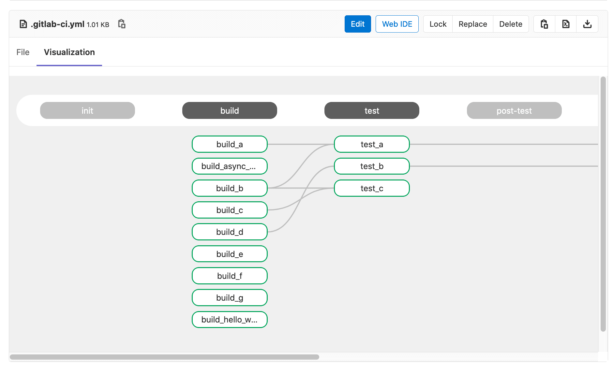
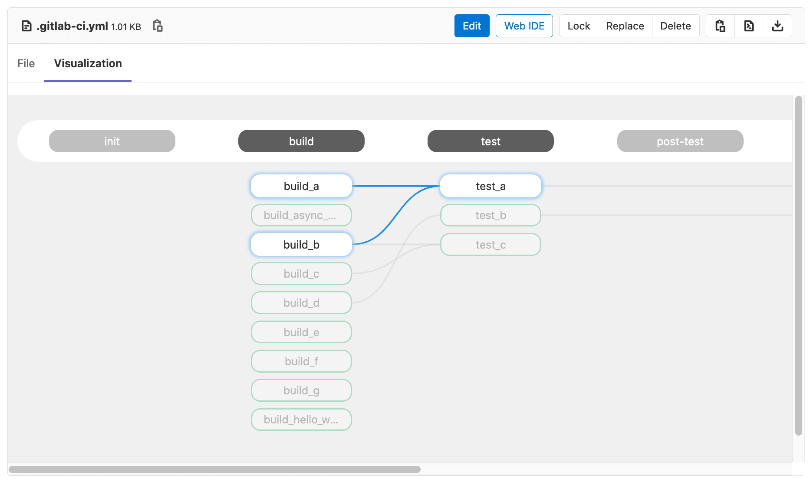

# Visualize your CI/CD configuration

> - [Introduced](https://gitlab.com/gitlab-org/gitlab/-/issues/241722) in GitLab 13.5.
> - It's [deployed behind a feature flag](../../user/feature_flags.md), disabled by default.
> - It's disabled on GitLab.com.
> - It's not recommended for production use.
> - To use it in GitLab self-managed instances, ask a GitLab administrator to [enable it](#enable-or-disable-cicd-configuration-visualization). **(CORE ONLY)**

CAUTION: **Warning:**
This feature might not be available to you. Check the **version history** note above for details.

To see a visualization of your `gitlab-ci.yml` configuration, navigate to any CI/CD
configuration file and click on the `Visualization` tab. The visualization shows
all stages and jobs. [`needs`](README.md#needs) relationships are displayed as lines
connecting jobs together, showing the hierarchy of execution:



Hovering on a job highlights its `needs` relationships:



If the configuration does not have any `needs` relationships, then no lines are drawn because
each job depends only on the previous stage being completed successfully.

You can only preview one `gitlab-ci.yml` file at a time. Configuration imported with
[`includes`](README.md#include) is ignored and not included in the visualization.

## Enable or disable CI/CD configuration visualization **(CORE ONLY)**

CI/CD configuration visualization is under development and not ready for production use. It is
deployed behind a feature flag that is **disabled by default**.
[GitLab administrators with access to the GitLab Rails console](../../administration/feature_flags.md)
can enable it.

To enable it:

```ruby
Feature.enable(:gitlab_ci_yml_preview)
```

To disable it:

```ruby
Feature.disable(:gitlab_ci_yml_preview)
```
