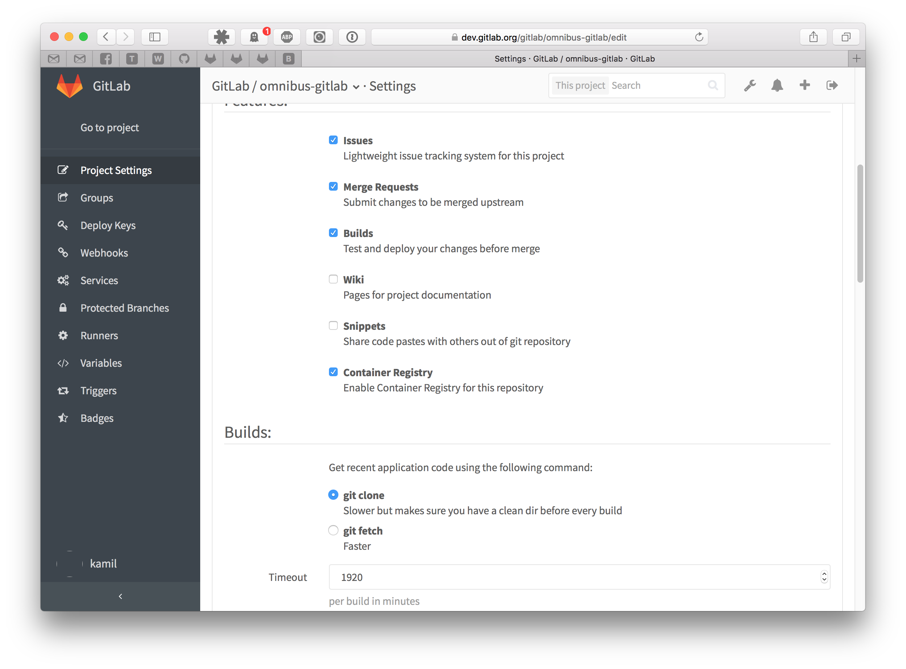
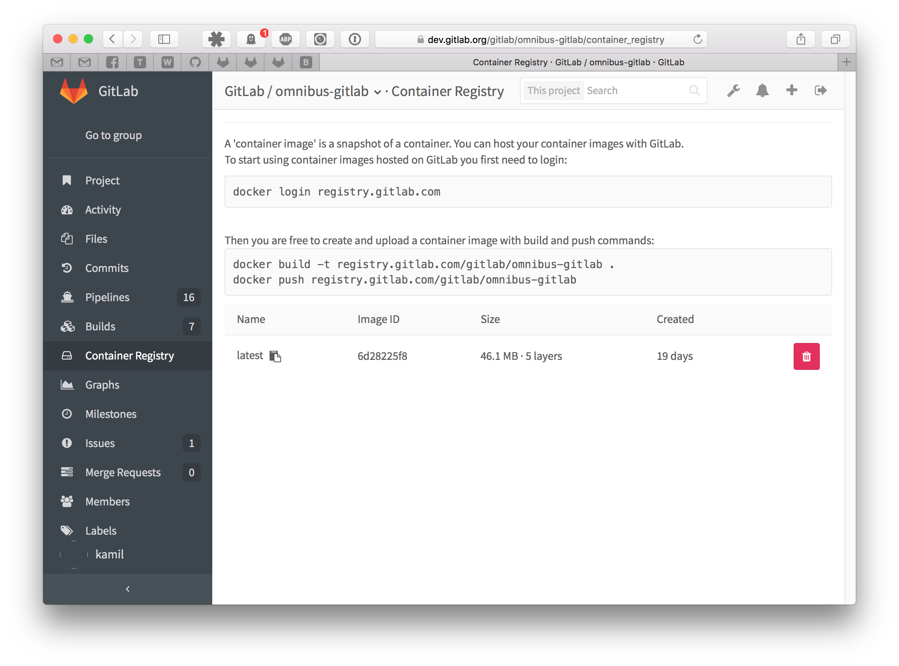

# GitLab Container Registry

> [Introduced][ce-4040] in GitLab 8.8. Docker Registry manifest
`v1` support was added in GitLab 8.9 to support Docker versions earlier than 1.10.

> **Note:**
This document is about the user guide. To learn how to enable GitLab Container
Registry across your GitLab instance, visit the
[administrator documentation](../administration/container_registry.md).

With the Docker Container Registry integrated into GitLab, every project can
have its own space to store its Docker images.

You can read more about Docker Registry at https://docs.docker.com/registry/introduction/.

---

## Enable the Container Registry for your project

1. First, ask your system administrator to enable GitLab Container Registry
   following the [administration documentation](../administration/container_registry.md).
   If you are using GitLab.com, this is enabled by default so you can start using
   the Registry immediately.

1. Go to your project's settings and enable the **Container Registry** feature
   on your project. For new projects this might be enabled by default. For
   existing projects you will have to explicitly enable it.

    

## Build and push images

After you save your project's settings, you should see a new link in the
sidebar called **Container Registry**. Following this link will get you to
your project's Registry panel where you can see how to login to the Container
Registry using your GitLab credentials.

For example if the Registry's URL is `registry.example.com`, the you should be
able to login with:

```
docker login registry.example.com
```

Building and publishing images should be a straightforward process. Just make
sure that you are using the Registry URL with the namespace and project name
that is hosted on GitLab:

```
docker build -t registry.example.com/group/project .
docker push registry.example.com/group/project
```

## Use images from GitLab Container Registry

To download and run a container from images hosted in GitLab Container Registry,
use `docker run`:

```
docker run [options] registry.example.com/group/project [arguments]
```

For more information on running Docker containers, visit the
[Docker documentation][docker-docs].

## Control Container Registry from within GitLab

GitLab offers a simple Container Registry management panel. Go to your project
and click **Container Registry** in the left sidebar.

This view will show you all tags in your project and will easily allow you to
delete them.



## Build and push images using GitLab CI

> **Note:**
This feature requires GitLab 8.8 and GitLab Runner 1.2.

Make sure that your GitLab Runner is configured to allow building Docker images by
following the [Using Docker Build](../ci/docker/using_docker_build.md)
and [Using the GitLab Container Registry documentation](../ci/docker/using_docker_build.md#using-the-gitlab-container-registry).

## Limitations

In order to use a container image from your private project as an `image:` in
your `.gitlab-ci.yml`, you have to follow the
[Using a private Docker Registry][private-docker]
documentation. This workflow will be simplified in the future.

## Troubleshooting

See [the GitLab Docker registry troubleshooting guide](troubleshooting.md).

[ce-4040]: https://gitlab.com/gitlab-org/gitlab-ce/merge_requests/4040
[docker-docs]: https://docs.docker.com/engine/userguide/intro/
[private-docker]: https://gitlab.com/gitlab-org/gitlab-ci-multi-runner/blob/master/docs/configuration/advanced-configuration.md#using-a-private-docker-registry
