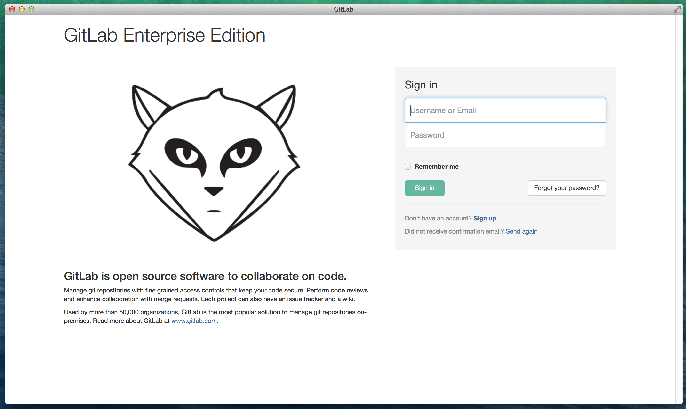
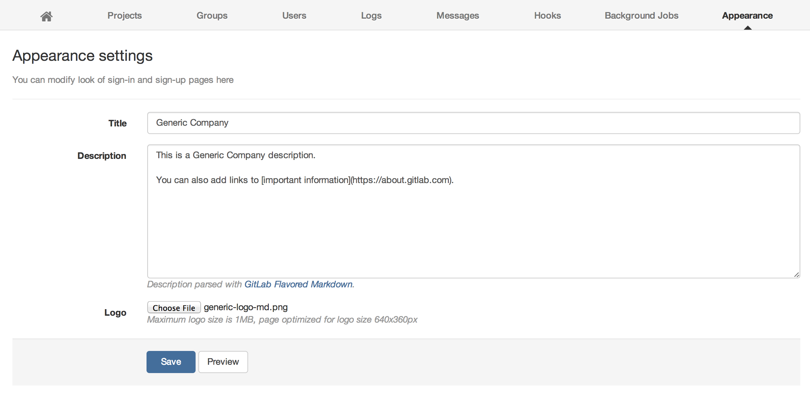
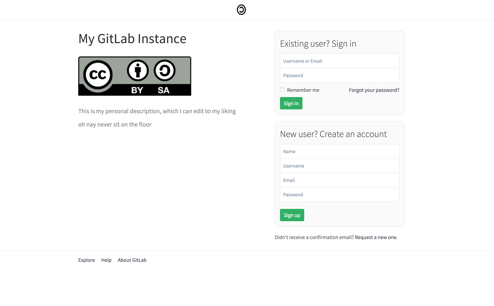

# Changing the logo and description on the login page

You can customize the login page of your GitLab server to show the logo and
description of your organization.

By default, the page shows the GitLab logo and description:

To customize the login page:

1. Navigate to the **Admin** area and go to the **Appearance** page.
1. Fill in your desired Title and Description. You can also choose an image file
   of the logo for your organization.

   

1. Save your changes.

Your GitLab login page will display the details you provided:

<!-- ## Troubleshooting

Include any troubleshooting steps that you can foresee. If you know beforehand what issues
one might have when setting this up, or when something is changed, or on upgrading, it's
important to describe those, too. Think of things that may go wrong and include them here.
This is important to minimize requests for support, and to avoid doc comments with
questions that you know someone might ask.

Each scenario can be a third-level heading, e.g. `### Getting error message X`.
If you have none to add when creating a doc, leave this section in place
but commented out to help encourage others to add to it in the future. -->
