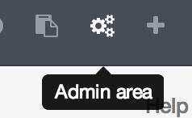
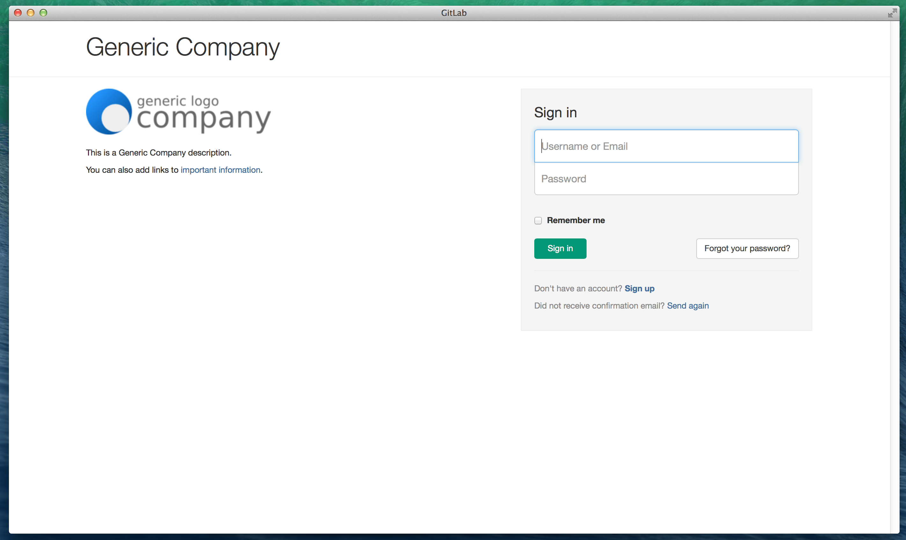

# Branded Login Page

GitLab Enterprise Edition offers a way to put your company recognizible identity on the login page of your GitLab server.

By default, Enterprise Edition page shows GitLab logo and description

## Changing the appearance of the login page

Navigate to the  and go to the Appearance page.

Fill in the required details like Title, Description and upload the company logo.

 

After saving the page, your GitLab login page will have the details you filled in:

