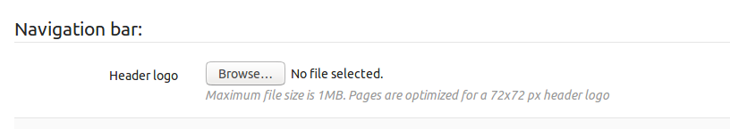
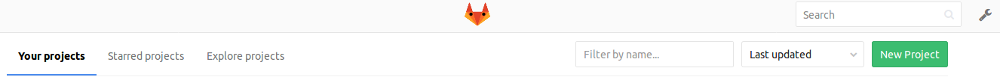
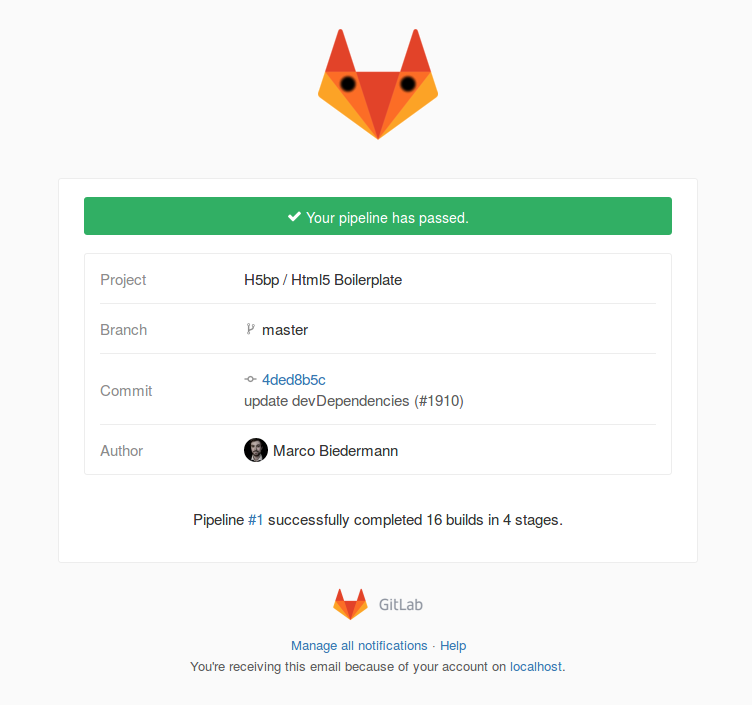

# Changing the navigation bar and email header logo

You can customize the logo that appears in email headers and in the navigation
bar on pages that are displayed by your GitLab server.

1. Navigate to the **Admin** area and go to the **Appearance** page, then locate
   the **Navigation bar** section.
1. For the **Header Logo**, choose an image file of the logo for your
   organization.

   

1. Save your changes.

Your GitLab navigation bar will display the custom logo:

The GitLab pipeline emails will also display the custom logo:

<!-- ## Troubleshooting

Include any troubleshooting steps that you can foresee. If you know beforehand what issues
one might have when setting this up, or when something is changed, or on upgrading, it's
important to describe those, too. Think of things that may go wrong and include them here.
This is important to minimize requests for support, and to avoid doc comments with
questions that you know someone might ask.

Each scenario can be a third-level heading, e.g. `### Getting error message X`.
If you have none to add when creating a doc, leave this section in place
but commented out to help encourage others to add to it in the future. -->
