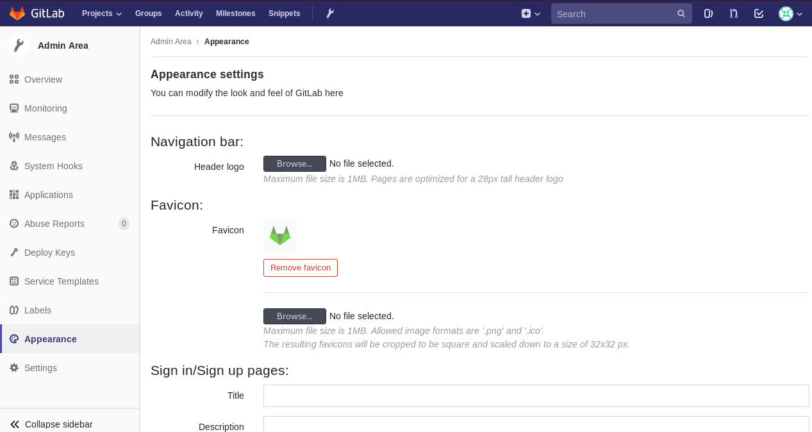
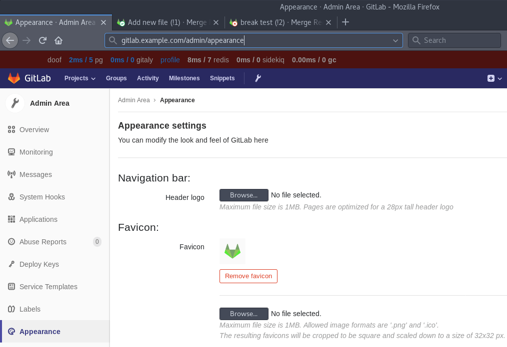

# Changing the favicon

> [Introduced][ce-14497] in GitLab 11.0.

[ce-14497]: https://gitlab.com/gitlab-org/gitlab-ce/merge_requests/14497

Navigate to the **Admin** area and go to the **Appearance** page.

Upload the custom favicon (**Favicon**) in the section **Favicon**.

After saving the page, the new favicon will be shown in the browser. The main
favicon as well as the CI status icons will show the custom icon:

