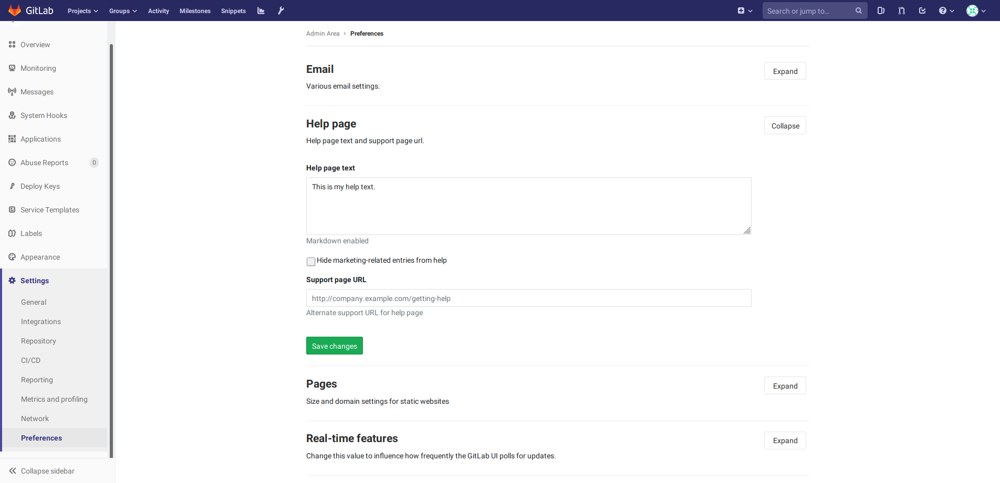
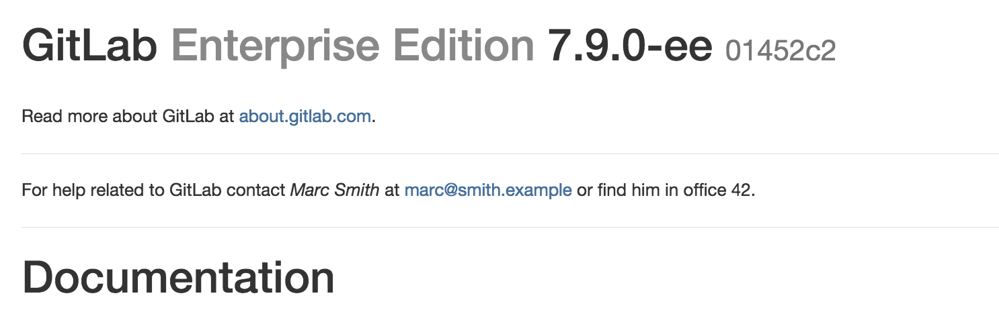

# GitLab server administrator information

In larger organizations it is useful to have information about who has the responsibility of maintaining the company GitLab server.

Navigate to the admin area and go to the Settings page.

Under `Help text` fill in the required information about the person(s) administering GitLab.

After saving the page this information will be shown on the GitLab login page and on the GitLab help page.

