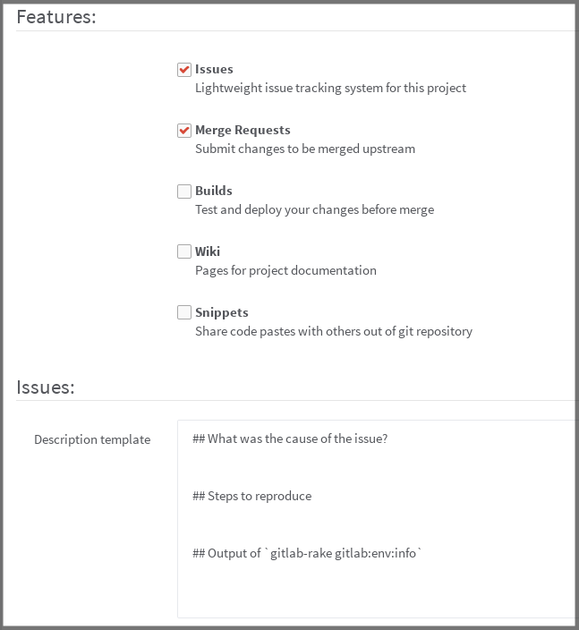
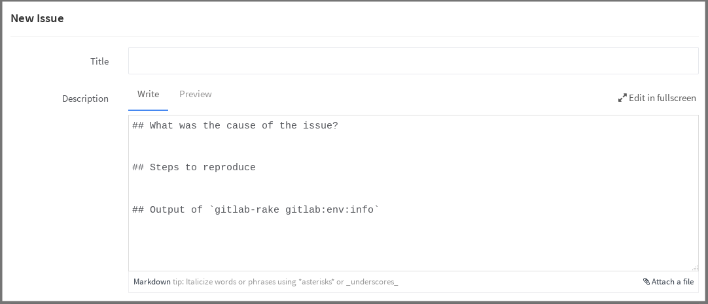
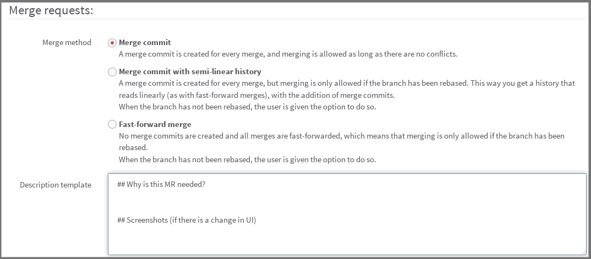
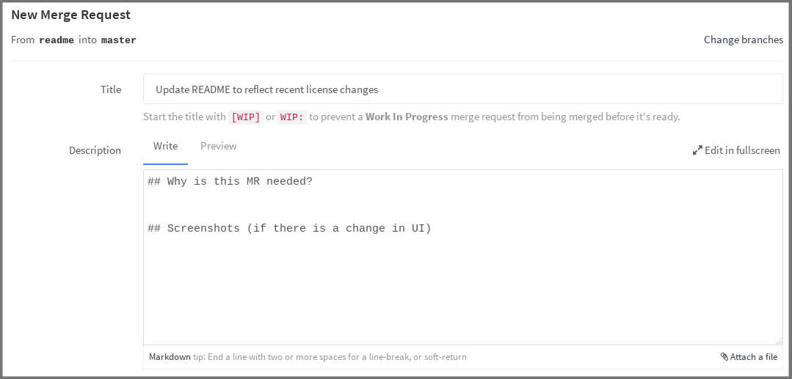

# Custom templates for issues and merge requests

_**Note:** Templates for merge requests were [introduced][ee-7478ece] in GitLab
EE 6.9. Templates for issues were [introduced][ee-28] in GitLab EE 8.1._

---

We all know that a properly submitted issue is more likely to be addressed in
a timely manner by the developers of a project.

Templates help filter out a lot of unnecessary noise from issues, and with
GitLab you can do that pretty easily.

## Issues template

_**Note:** Make sure that the issues feature is enabled in your project's
**Settings** otherwise the template won't show. This is the default behavior so
in most cases you should be fine._

To enable the template feature for your issues, go to your project's
**Settings** and fill in the _Description template_ text area under the
**Issues** feature.

Since GitLab issues support [Markdown](../markdown/markdown.md), you can use
special markup like headings.

---

After you add the description, hit **Save** for the settings to take effect.

Now, every time a new issue is created, it will be pre-filled with the text you
entered in the template.

---

## Merge requests template

_**Note:** Make sure that the merge requests feature is enabled in your project's
**Settings** otherwise the template won't show. This is the default behavior so
in most cases you should be fine._

As with [issues](#issues-template), you can create a template for your merge
requests as well. Remember that GitLab supports [Markdown](../markdown/markdown.md)
in merge requests.

---

From now on, any new merge request will be pre-filled with the template text.

[ee-28]: https://gitlab.com/gitlab-org/gitlab-ee/merge_requests/28 "Merge Request for adding issues template"
[ee-7478ece]: https://gitlab.com/gitlab-org/gitlab-ee/commit/7478ece8b48e80782b5465b96c79f85cc91d391b "Commit that introduced merge requests templates"
